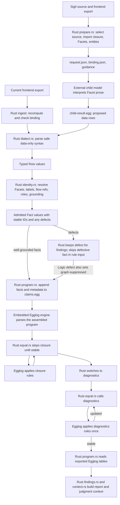
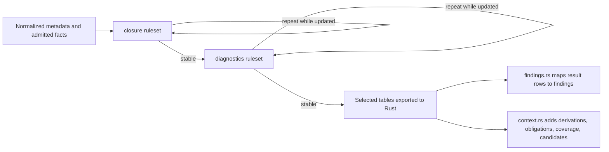
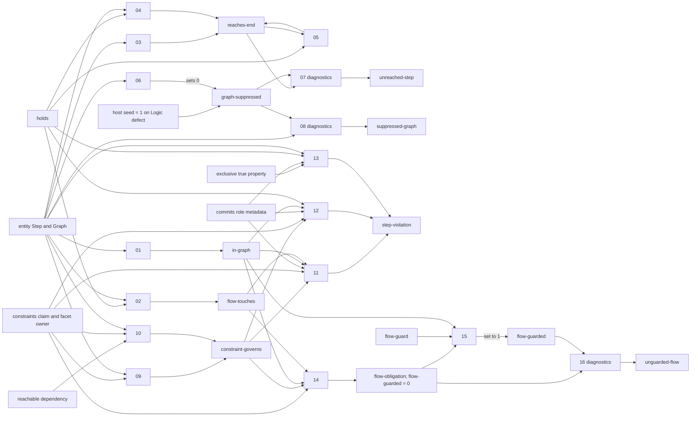
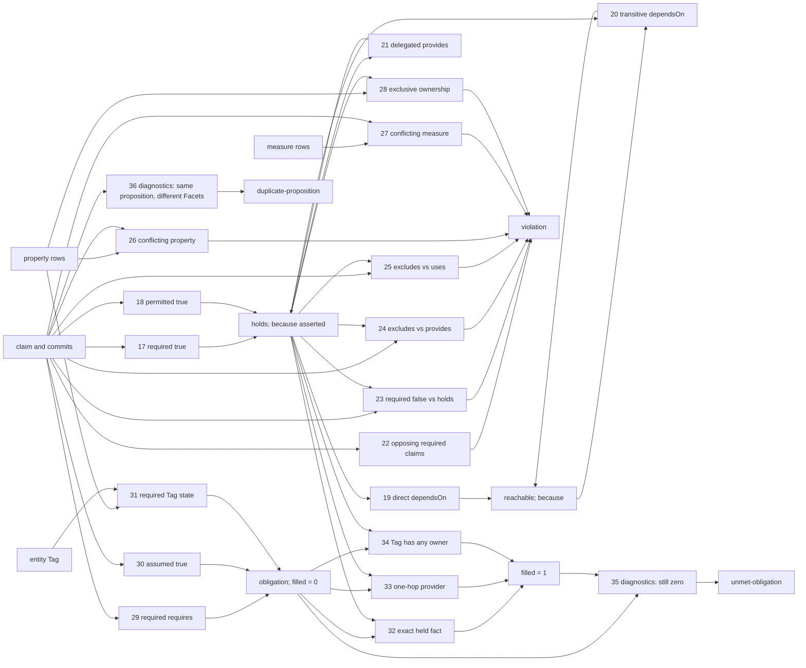
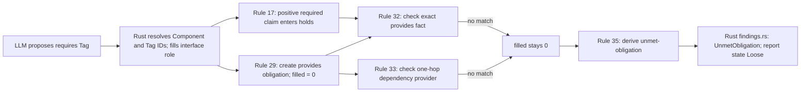

# How Interpretation Rows Become Egglog Results

This is a source-level guide to the boundary between the child model, the Rust `sigil-claims` host, and Egglog. It explains the preprocessing applied to returned interpretation rows and every rule in [`claims.egg`](../packages/sigilc/src/claims/claims.egg). The rule numbers below follow source order; the file itself does not attach numbers to the rules.

Related reports: [How SigilC Claims Computes Findings](sigilc-claims-explainer.md) and [From a Sigil Facet to a Computed Finding](sigil-line-to-compute.md).

The core distinction is:

- The **external child model** reads Facet prose and proposes data rows. It decides what the prose appears to assert.
- The **Rust host** validates the row format, resolves identity and grounding, emits facts, drives the Egglog engine, and builds the report.
- **`claims.egg`** contains the rule code. The embedded **Egglog engine** executes those rules over the facts supplied by Rust.

There is no rule that reads Sigil prose or asks the model a follow-up question. Egglog computes only from the admitted rows, tool supplied design metadata, and laws that are actually present in `claims.egg`. The command boundary is documented in [`cli.rs`](../packages/sigilc/src/claims/cli.rs#L21-L34); the rule program is assembled in [`program.rs`](../packages/sigilc/src/claims/program.rs#L85-L260).

## From the child result to Egglog input



The diagram separates the **iteration controller** from the **rule executor**. Rust calls `EGraph::step_rules("closure")` until Egglog reports no update, then does the same for `diagnostics`. Egglog performs each rule match and derives table rows. See [`program.rs`](../packages/sigilc/src/claims/program.rs#L265-L288), [`eqval.rs`](../packages/sigilc/src/eqval.rs#L181-L233), and the two ruleset declarations in [`claims.egg`](../packages/sigilc/src/claims/claims.egg#L92-L96).

### 1. Prepare the scope and binding

`sigil export design` supplies the frontend export; `prepare` does not reopen `.sigil` files. Rust builds a request for one selected source and its resolved import closure. It includes Facet prose and identities, admissible Components and Tags, Logic Facets in source order, and a binding to the export digest, source, closure, guidance fingerprint, vocabulary generation, and Facet scope. [Request construction](../packages/sigilc/src/claims/prepare.rs#L158-L240)

The binding is not a claim and Egglog does not read the JSON. At ingest, Rust recomputes the request from the supplied frontend export and rejects a binding mismatch before saturation. This prevents a result prepared for a different export, scope, guidance, or vocabulary from being silently applied. [Binding check](../packages/sigilc/src/claims/cli.rs#L127-L149)

### 2. The model proposes rows; it does not write rules

The caller runs the external child model using the prepared request and guidance. `sigil-claims` does not launch a model. The child returns only these six forms:

| Returned form | What the child supplies | What the Rust host supplies later |
| --- | --- | --- |
| `claim` | Facet, subject, relation, object, modality, expected value | Claim ID, Component, and contract role; entity IDs instead of labels |
| `property` | Facet, subject, property, boolean value | Claim ID, Component, and role; entity ID instead of label |
| `measure` | Facet, subject, measure name, numeric value | Claim ID, Component, and role; entity ID and parsed number |
| `reading` | Facet and `no-commitment` or `unresolved` | Component and role for host-side coverage and report context |
| `step` | Logic Facet and a positive ordinal | Step identity, owning Component, and Graph identity |
| `guard` | Facet, Step ordinal, operand kind, operand value | Guard identity, resolved Step/operand references, Component, and role |

#### What each returned row means

Every row starts with a Facet ID, which tells the host which prose the child interpreted. The child copies that ID from the prepared request; it does not choose the contract role. Rust looks up the Facet's Component and role in the frontend export.

| Row and shape | Meaning | How the host and current rules use it |
| --- | --- | --- |
| `claim(facet, subject, relation, object, modality, expected)` | A proposition about a relation between two entities. `modality` says whether it is `required`, `permitted`, or `assumed`; `expected` says `true` or `false`. For example, in a committing role, a required claim that a Component provides a Tag records a positive commitment. | Rust resolves the entity references and adds the Facet's role and a claim ID. For committing roles, rules 17–18 put positive required/permitted claims into `holds`; specific contradiction rules consume negative required claims and other selected committed claims; required `requires` claims and assumed-true claims can create obligations. |
| `property(facet, subject, property, value)` | A boolean property of one entity, such as whether a Tag is `exclusive` or `required`. It describes the entity directly, rather than a relation between two entities. | Rust resolves the subject and validates the property name and boolean value. Rule 26 detects conflicting values; `exclusive=true` feeds ownership checks in rules 13 and 28; `required=true` on a Tag creates an ownership obligation in rule 31. The accepted `assumed` and `expected` property names have no dedicated rule today. |
| `measure(facet, subject, property, number)` | A numeric measurement or estimate attached to one entity, such as `latencyMs`, `latencyBudgetMs`, `cost`, or `risk`. | Rust parses and bounds-checks the number. Rule 27 detects different values for the same entity and measure name. There is no current rule that compares a measurement with a budget or threshold. |
| `reading(facet, outcome)` | A coverage response for a Facet that yielded no claim: `no-commitment` means the Facet was read and asserts nothing; `unresolved` means a consequential choice remains open or needed information is unavailable. | The host uses it in coverage and report context. No Egglog rule reads `reading`, so it does not create a commitment, obligation, or finding by itself. |
| `step(facet, ordinal)` | Declares one node in a Logic flow. The positive ordinal identifies its position across the whole Logic section. This row declares the node; it does not say what the node does. | Rust mints the Step entity and its Component's Graph identity. Ordinary claims about `step:<ordinal>` describe its `reads`, `writes`, `invokes`, or `to` relations. Rules 1–8 use Step entities and explicit `to` claims to check whether each Step reaches a declared Graph end. |
| `guard(facet, step, operand, value)` | Records a condition to check for a Step. For `state`, `value` names a Tag the Step reads; for `input`, it is a literal string; for `constraint`, it names the Facet that authored the constraint, not a claim ID. | Rust resolves and validates the Step and operand reference. Rule 15 currently uses only a `constraint` guard whose Facet matches a governing Constraints claim in the same Graph. `state` and `input` guards are accepted data, but no current Egglog rule consumes them. |

Here is one example of each row shape:

```lisp
(claim "<facet-id>" "Booking" "requires" "RecurringBookingSeries" "required" "true")
(property "<facet-id>" "RecurringBookingSeries" "exclusive" "true")
(measure "<facet-id>" "Booking" "latencyMs" "250")
(reading "<facet-id>" "no-commitment")
(step "<logic-facet-id>" "1")
(guard "<logic-facet-id>" "1" "constraint" "<constraints-facet-id>")
```

These are shape examples, not a ready-to-ingest artifact: replace each Facet placeholder with an ID from the prepared request, and use entity labels that resolve and are grounded for that Facet. In the `guard`, the last value is a Constraints **Facet ID**. A `step` Facet must be in Logic, and its ordinal must be unique in that Logic section.

The model does the semantic extraction from prose. It may choose the wrong relation or entity, omit a statement, or return a different set of rows on a fresh call. The Rust host checks the returned structure and referents; it does not prove that the prose was interpreted faithfully. The package source does not select or identify the model/provider for a captured run. [CLI boundary](../packages/sigilc/src/claims/cli.rs#L21-L34) [Allowed row shapes](../packages/sigilc/src/claims/vocabulary.rs#L52-L160)

### 3. Parse the result as data, all or nothing

`dialect.rs` reads the artifact with Egglog's AST parser, but **does not evaluate it**. Rust then accepts only top-level calls whose arguments are quoted string literals, checks every row name and arity against the published vocabulary, and converts them into typed `Row` values. A rule, ruleset, schedule, arbitrary command, nested expression, numeric literal, unknown row name, or malformed row refuses the whole artifact; valid rows beside a bad row are not partly ingested. [Parser boundary](../packages/sigilc/src/claims/dialect.rs#L97-L202) [Row checks](../packages/sigilc/src/claims/dialect.rs#L206-L359)

The parser also applies size limits before admission: at most 1,000,000 document bytes, 100,000 row calls, and nesting depth 8. Claim modality must be `required`, `permitted`, or `assumed`; expected values must be `true` or `false`; relations and property names must belong to the explicit vocabulary. Boolean property names are `required`, `exclusive`, `assumed`, and `expected`; measure names are `cost`, `latencyBudgetMs`, `latencyMs`, and `risk`. Measures must be finite, non-negative, within the safe integer range, and `risk` cannot exceed 1. Step and Guard ordinals start at 1. A claim that mentions a `step:N` or `graph` reference must be `required true`, because flow edges are positive facts. [Limits and value checks](../packages/sigilc/src/claims/dialect.rs#L13-L25) [Nesting bound](../packages/sigilc/src/claims/dialect.rs#L122-L153) [Vocabulary](../packages/sigilc/src/claims/vocabulary.rs#L52-L160)

### 4. Resolve identity, role, flow references, and grounding

After parsing, `identity::admit` attaches each row to the Facet named by its ID. The Facet's Component and role come from the export, not from the child. Rust mints a deterministic fact ID from the Facet, Component, role, and normalized row body. [Admission and fact IDs](../packages/sigilc/src/claims/identity.rs#L68-L91) [Admission](../packages/sigilc/src/claims/identity.rs#L245-L418)

Entity labels resolve only when unique in the selected closure; an exact entity ID also resolves. An unknown label or a label shared by multiple entities refuses ingestion instead of guessing. Labels do not create entities. [Name resolver](../packages/sigilc/src/claims/identity.rs#L420-L459)

This is also why the earlier Auth `UserProfile` collision stopped before Egglog: that label named both a Component and a Tag in the request, so identity resolution refused it. A rule cannot disambiguate a label because the rules receive IDs, not unresolved names.

Grounding is narrower than “the entity exists somewhere.” An entity must be available to that Facet through its owning Component, a provider in its resolved imports, a resolved Tag reference on the Facet, or a Tag introduction there. An ambiguous Tag reference is not grounding evidence. A row can therefore name a real entity and still be ungrounded for that particular Facet. [Grounding construction](../packages/sigilc/src/claims/identity.rs#L95-L155)

Flow identities must be prepared before claims can refer to them. Rust scans all `step` rows first, requires them to be in Logic Facets, rejects duplicate ordinals within a Component's Logic section, and mints one Step ID per ordinal plus one Graph ID for that Component's Logic section. It then resolves `step:N` and `graph` references in other rows against those IDs. [Flow identity pass](../packages/sigilc/src/claims/identity.rs#L157-L243)

For a `guard`, the Step ordinal must resolve in that Component. A `state` operand resolves to an entity ID and must be grounded; an `input` operand remains a literal string; a `constraint` operand must name a Facet in the prepared request. The current admission path does not independently require the Guard row itself to come from a Logic Facet. Rule 15 later only treats a guard as satisfying an obligation when its `constraint` value equals the Facet ID of that obligation's actual Constraints claim. [Guard admission](../packages/sigilc/src/claims/identity.rs#L357-L399) [Rule 15](../packages/sigilc/src/claims/claims.egg#L178-L184)

### 5. Re-emit normalized facts; do not run the returned file

The raw artifact and admitted facts are different shapes. For example, this illustrative child row contains labels, no contract role, and no claim ID:

```lisp
(claim "facet:scheduling-and-recurrence.sigil:813"
       "SchedulingAndRecurrence" "requires" "regional time-zone rules"
       "required" "true")
```

After identity resolution, Rust emits the eight-column fact below. Placeholder IDs stand for actual stable IDs:

```lisp
(claim "<claim-id>" "facet:scheduling-and-recurrence.sigil:813" "interface"
       "<scheduling-component-id>" "requires" "<timezone-tag-id>" "required" "true")
```

The same adapter converts all row forms. This table shows the forms written into the Egglog program:

| Returned `Row` | Re-emitted Egglog facts |
| --- | --- |
| `Claim` | `(claim claim-id facet role subject-id relation object-id modality expected)` |
| `Property` | `(property claim-id facet role subject-id property value)` |
| `Measure` | `(measure claim-id facet role subject-id property parsed-f64)` |
| `Reading` | `(reading facet outcome)`; no rule currently reads this table |
| `Step` | An `entity` row with kind `Step`, plus `(flow-step step-id component-id facet)`; rules use the `entity` row, not `flow-step` |
| `Guard` | `(flow-guard guard-id step-ordinal operand value)` |

The request also contributes `(facet ...)`, `(section-declared ...)`, `(entity ...)`, and `(commits ...)` metadata. All contract roles except `decisions` receive `commits`; the child cannot choose this. Rust mints one Graph entity per Component with a valid Step, or with a defective Logic fact so the suppression diagnostic can be represented. The program starts with the fixed source text in `claims.egg`, then Rust appends metadata and admitted facts. [Program builder](../packages/sigilc/src/claims/program.rs#L85-L260)

### What the `commits` gate means

`commits` is a one-column Egglog relation over **contract roles**. Rust emits `(commits "goal")`, `(commits "interface")`, `(commits "state")`, `(commits "logic")`, `(commits "constraints")`, and `(commits "cases")`. It emits no `(commits "decisions")`. These rows are global role metadata; they do not come from the child, and they are not a per-claim judgment about importance or confidence. The role on each Facet and admitted claim comes from the frontend export.

A rule that includes `(commits role)` can match a claim only when its Facet's role is in that relation. This is separate from the claim's `modality`: role answers whether that contract section is eligible to make commitments; modality says whether this particular proposition is required, permitted, or assumed.

For example, the child returns a six-column row. Rust determines that its Facet is in `interface`, resolves the names, mints an ID, and includes both the role fact and the expanded claim in the program:

```lisp
; Child output
(claim "<facet-id>" "Booking" "provides" "RecurringBookingSeries" "required" "true")

; Rust-generated role metadata and admitted claim
(commits "interface")
(claim "<claim-id>" "<facet-id>" "interface" "<booking-id>" "provides" "<series-tag-id>" "required" "true")
```

Rule 17 joins the claim's `interface` role with `(commits "interface")`; because the modality is `required true`, it derives `(holds "<booking-id>" "provides" "<series-tag-id>")`. Rule 18 does the same for `permitted true`. A committed `assumed true` claim does **not** become `holds`; rule 30 makes it an obligation instead. A committed `required false` claim can participate in negative-claim contradiction checks. A `decisions` claim stays in the admitted claim table, but the commitment-gated laws do not match it. Rule 36 is an exception: it has no `commits` condition, so it can still identify the same proposition across different Facets as a review candidate. [Role facts in the builder](../packages/sigilc/src/claims/program.rs#L90-L108) [Commitment rules](../packages/sigilc/src/claims/claims.egg#L186-L192) [Decision and duplicate behavior](../packages/sigilc/src/claims/claims.egg#L257-L260)

Defects divide into two paths:

- **Refused before Egglog:** unknown Facet, unknown entity, ambiguous label, invalid Step/Graph reference, invalid row shape, and other transport/identity errors stop ingestion. No saturation occurs.
- **Accepted but withheld from rules:** a degenerate claim (same subject and object, except when both endpoints are tool-minted flow references) or an ungrounded entity reference is retained as a `Fact` with a defect. Rust reports it as an Interpretation finding, but `program.rs` does not emit the defective fact as an Egglog fact. If the defective fact belongs to Logic, Rust sets that Component's `graph-suppressed` function to 1 and emits the Graph entity; this prevents dropping a bad edge from inventing dead ends in the remaining graph. [Defect handling](../packages/sigilc/src/claims/identity.rs#L245-L418) [Fact emission and graph suppression](../packages/sigilc/src/claims/program.rs#L127-L258) [Interpretation findings](../packages/sigilc/src/claims/findings.rs#L253-L299)

When memoized interpretations are enabled, ingest may reuse stored rows by interpretation unit: each non-Logic Facet is one unit, while a whole Logic section is one unit. If the new artifact contains any row from a unit, ingest skips that unit's cached rows and uses the supplied rows for it; the two interpretations are not combined. This cache replacement is separate from row deduplication. Sorting and `dedup` remove only identical typed rows (for example, the same row present in both the supplied and reused data); distinct claims from the same Facet remain. Admission also removes identical `Fact` values, whose IDs are minted from the Facet and row content. Stored rows are re-admitted against the current export, so their old identities are not trusted. An optional `--claims-repeat` artifact is parsed and admitted separately for disagreement reporting; it is not merged into the fact set saturated by Egglog. [Ingest and reuse](../packages/sigilc/src/claims/cli.rs#L127-L195) [Fact identity and deduplication](../packages/sigilc/src/claims/identity.rs#L81-L87) [Admitted fact deduplication](../packages/sigilc/src/claims/identity.rs#L404-L417)

### 6. Egglog runs two fixed-point phases

`program.rs` creates an embedded `EGraph`, parses/runs the assembled program, calls the Rust `eqval::fixedpoint` loop, then exports selected tables. The loop runs exactly the named rulesets `closure` and `diagnostics`, in that order. Within each ruleset it calls `step_rules` until Egglog reports no update. [Saturation](../packages/sigilc/src/claims/program.rs#L265-L288) [Fixed-point loop](../packages/sigilc/src/eqval.rs#L181-L233)



The source uses `:merge (max old new)` for `reaches-end`, `graph-suppressed`, `flow-guarded`, and `filled`. These are monotone values: a rule may raise `0` to `1`, but a later `0` does not undo it. This makes “not reached,” “not guarded,” and “unfilled” checks safe to defer until the relevant closure has stabilized. The `because` rows retain witnesses for asserted and derived conclusions; `context.rs` uses them to explain which facts came from which rule.

## Rule graph: what feeds what

These maps show rule numbers in source order. Inputs such as `holds`, `claim`, `property`, `entity`, `facet`, `commits`, and `flow-guard` are admitted or host-generated rows. Other names are output relations or functions declared in `claims.egg`.

### Rules 1–16: flow shape and constraint checks



### Rules 17–36: commitments, consequences, contradictions, and obligations



Rule 36 produces a simplification candidate for judgment context. It is not a `violation` and does not directly make a report Disjoint or Loose. Conversely, rules 11–16 write flow rows rather than `violation`, because those findings are kept in the non-gating Flow class.

## Each rule, in detail

The source anchors below point to the actual rule bodies. Rule numbers are labels added by this guide.

### Flow shape: rules 1–8

Source: [`claims.egg`, rules 1–8](../packages/sigilc/src/claims/claims.egg#L98-L136).

| # / set | What must match | What the rule derives and what that means |
| --- | --- | --- |
| 1 / closure | A `Step` entity and a `Graph` entity have the same owning Component. | `(in-graph step graph)`. This assigns the Component's declared Logic steps to its Logic Graph. |
| 2 / closure | A tuple `(holds step relation object)` exists and `step` is an entity of kind `Step`. | `(flow-touches step object)`. The rule does **not** filter the relation name; it copies the object from any `holds` row whose subject is a Step. |
| 3 / closure | A `Step` entity exists. | Sets `(reaches-end step)` to `0`, establishing the starting value every Step needs for a later positive path check. |
| 4 / closure | `(holds step "to" graph)` and the target is an entity of kind `Graph`. | Sets `reaches-end(step)` to `1` and records a `because` witness named `flow-end-direct`. An explicit `to graph` edge declares an end; no end is inferred from prose or paragraph order. |
| 5 / closure | `(holds a "to" b)`, `b` is a `Step`, and `reaches-end(b)=1`. | Sets `reaches-end(a)` to `1` and records `flow-end-transitive`. Reachability propagates backward through explicit Step-to-Step edges. |
| 6 / closure | A `Graph` entity exists. | Sets `(graph-suppressed owner)` to `0`. A host-supplied `1` survives because the function merges with `max`. |
| 7 / diagnostics | A `Step` has `reaches-end=0` and its Component has `graph-suppressed=0`. | `(unreached-step step owner)`. This is reported only after closure stabilizes and only if the graph has no defective Logic fact. |
| 8 / diagnostics | A `Graph` exists and `graph-suppressed(owner)=1`. | `(suppressed-graph owner)`. This says the dead-end check was suppressed; it is not a claim that every Step is unreached. |

These rules check whether each Step reaches an explicitly declared end. They do not check whether another Step consumes the value it writes. `flow-step` is emitted as input metadata, but the current rules do not read it; the rules identify Steps through `entity` rows.

### Constraint reach and flow checks: rules 9–16

Source: [`claims.egg`, rules 9–16](../packages/sigilc/src/claims/claims.egg#L138-L184).

| # / set | What must match | What the rule derives and what that means |
| --- | --- | --- |
| 9 / closure | A claim authored in `constraints`, its `facet` row gives owning Component `own`, and a Graph belongs to `own`. | `(constraint-governs claim-id graph-id)`. A constraint governs its own Component's Logic Graph. |
| 10 / closure | The same Constraints claim and Facet owner, plus `(reachable own dep)` and a Graph owned by `dep`. | Adds `constraint-governs` for a dependency Graph. `reachable` here comes from interpreted `dependsOn` claims, not from an import alone. |
| 11 / closure | A committed Constraints claim says `excludes object`; that same claim governs Graph `g`; a Step is in `g` and `flow-touches` the object. | `(step-violation "step-excluded-action" step object claim-id)`. A governed flow touches something its constraint excludes. |
| 12 / closure | A committed Constraints claim says some relation/object must be `false`; it governs Graph `g`; a Step in `g` has that same relation/object in `holds`. | `step-violation` named `step-negated-action`. This catches a flow action that contradicts a negative constraint. |
| 13 / closure | A committed `exclusive=true` property marks Tag `obj`; a Step `writes obj`; the Tag has a nonempty owner different from the Step's Component. | `step-violation` named `exclusive-foreign-write`. This rule is not gated by constraint reach. The explicit exclusive property is required; the prose word “exclusive” is not read by Egglog. |
| 14 / closure | A Constraints claim says `requires object` with `required true`; it governs Graph `g`; a Step in `g` touches `object`. | Creates `(flow-obligation claim-id graph object)` and initializes its `flow-guarded` value to `0`. Only positive `requires` claims create this flow obligation. |
| 15 / closure | A flow obligation exists; the claim with that claim ID identifies the Constraint Facet; there is a Step in the same Graph; and a `flow-guard` in that Graph has operand kind `constraint` and value equal to that Facet ID. | Sets the obligation's `flow-guarded` value to `1`. It does not match the guard's ordinal to the Step that touched the object; a matching constraint guard anywhere in the Graph is enough. |
| 16 / diagnostics | A flow obligation remains at `flow-guarded=0` after closure. | `(unguarded-flow claim-id graph object)`. The report classifies this as a Flow finding, not a design contradiction. |

`flow-touches` is deliberately a shared intermediate relation: rule 2 derives it once, then rules 11 and 14 reuse it. A flow guard uses the Constraint **Facet ID** because the child cannot know the claim ID that Rust mints after interpretation.

### Commitments and consequences: rules 17–21

Source: [`claims.egg`, rules 17–21](../packages/sigilc/src/claims/claims.egg#L186-L200).

| # / set | What must match | What the rule derives and what that means |
| --- | --- | --- |
| 17 / closure | A claim has modality `required`, expected value `true`, and its role is in `commits`. | Adds `(holds subject relation object)` and `because(..., "asserted", claim-id)`. This is a positive commitment. |
| 18 / closure | A claim has modality `permitted`, expected value `true`, and its role is in `commits`. | Adds the same `holds` and asserted-witness shape. `required false` does not enter `holds`; `assumed true` becomes an obligation under rule 30 instead. |
| 19 / closure | `(holds a "dependsOn" b)`. | Adds `(reachable a b)` and a `because` witness `dependency-direct`. |
| 20 / closure | `(reachable a b)` and `(holds b "dependsOn" c)`. | Adds `(reachable a c)` and witness `dependency-transitive`. Repeated closure rounds compute transitive reachability. |
| 21 / closure | `(holds a "delegates" b)` and `(holds b "provides" c)`. | Adds `(holds a "provides" c)` with a `delegated-capability` witness. A delegate can therefore satisfy a provider check. |

Rules 19 and 20 form the interpreted dependency graph used by rule 10. The Sigil import graph still supplies visibility and grounding, but does not itself create an Egglog `reachable` fact.

### Contradictions and exclusive ownership: rules 22–28

Source: [`claims.egg`, rules 22–28](../packages/sigilc/src/claims/claims.egg#L202-L229).

| # / set | What must match | What the rule derives and what that means |
| --- | --- | --- |
| 22 / closure | Two committed claims name the same subject, relation, and object; both are `required`; one expects `true`, the other `false`. | Adds two `violation("contradictory-claims", subject, object, witness)` rows, one witnessed by each claim ID. The same Facet can contribute both; the rule does not require different Facets. |
| 23 / closure | A committed `required false` claim and a positive `holds` row have identical subject, relation, and object. | Adds `violation("negated-claim-holds", subject, object, claim-id)`. This can report a negative promise opposed by any asserted or derived positive fact. |
| 24 / closure | A committed `required true` `excludes` claim and a positive `provides` fact share subject and object. | Adds `violation("excluded-capability", subject, object, claim-id)`. |
| 25 / closure | A committed `required true` `excludes` claim and a positive `uses` fact share subject and object. | Adds `violation("excluded-use", subject, object, claim-id)`. |
| 26 / closure | Two committed property rows have the same entity and property name but different values. | Adds `violation("conflicting-property", entity, property, first-claim-id)`. This compares values; it does not interpret the property's name. |
| 27 / closure | Two committed measure rows have the same entity and measure name but different numeric values. | Adds `violation("conflicting-measure", entity, measure, first-claim-id)`. There is no budget or threshold comparison here. |
| 28 / closure | A committed property says `exclusive=true`; two `holds` rows say different subjects `owns` the same object. | Adds `violation("exclusive-ownership", owner-a, owner-b, property-claim-id)`. The finding is classified as OwnershipConflict. The rule does not explicitly check that the owned object is a Tag. |

The general rules map every `violation` except `exclusive-ownership` to a Contradiction finding. This is report classification in Rust `findings.rs`; Egglog supplies the law name, objects, and witness. [Mapping](../packages/sigilc/src/claims/findings.rs#L111-L153)

### Obligations and duplicates: rules 29–36

Source: [`claims.egg`, rules 29–36](../packages/sigilc/src/claims/claims.egg#L231-L260).

| # / set | What must match | What the rule derives and what that means |
| --- | --- | --- |
| 29 / closure | A committed `required true` claim says `subject requires object`. | Creates an obligation for `subject provides object` and initializes its `filled` value to `0`. “Requires” is lowered into a provider obligation. |
| 30 / closure | A committed claim has modality `assumed` and expected value `true`. | Creates an obligation for that exact subject/relation/object and initializes `filled=0`. An assumption is a dependency of the design, not a positive commitment in `holds`. |
| 31 / closure | A committed `required=true` property is attached to an entity that is a Tag. | Creates an obligation that the Tag be `owns`-ed and initializes its `filled=0`. |
| 32 / closure | An obligation `(id subject relation object)` and an identical positive `holds(subject, relation, object)` exist. | Sets that obligation's `filled` value to `1`. This is the general exact-match satisfaction path. |
| 33 / closure | An obligation asks for `subject provides Tag`; `subject dependsOn provider`; and that provider `provides Tag`. | Sets `filled=1`. It checks exactly one dependency hop; it does not use transitive `reachable`. |
| 34 / closure | An obligation asks for Tag `owns Tag` and any positive `(holds some-owner "owns" Tag)` exists. | Sets `filled=1`. The owner may be any entity; this rule only checks that at least one owner exists. |
| 35 / diagnostics | An obligation remains with `filled=0` after closure has stabilized. | Adds `(unmet-obligation claim-id subject relation object)`. Absence is tested here, after the positive closure work. |
| 36 / diagnostics | Two claim rows have the same subject, relation, and object but different Facet IDs. | Adds `(duplicate-proposition claim-id-1 claim-id-2)`, regardless of modality, expected value, or whether the roles commit. This is a review/simplification candidate, not a violation or direct state change. |

`filled` uses `max`, so once any satisfaction rule sets it to `1`, it remains filled. Rule 33's one-hop bound is why an indirect provider several dependencies away does not necessarily satisfy a `requires` obligation, even if rules 19–20 establish transitive `reachable` for other uses.

## A complete example: missing time-zone provider

The U5 child returned a `required true` `requires` claim for regional time-zone rules. The source row is in the copied [pass 1 result](slotted-u5-final.SARS1Y/pass-1/scheduling-and-recurrence.sigil/child-result.egg#L7); the same interpretation appears in [pass 2](slotted-u5-final.SARS1Y/pass-2/scheduling-and-recurrence.sigil/child-result.egg#L88).



The source sentence does not cause rules 32–33 to search the prose. They see only the claim fact, `holds` rows, and obligation generated by rule 29. With no exact or one-hop provider fact, `filled` remains zero; rule 35 creates the diagnostic row. Rust maps it to an UnmetObligation finding. A missing provider is a Loose result, not a contradiction. [Rules 17–18](../packages/sigilc/src/claims/claims.egg#L186-L200) [Rules 29–35](../packages/sigilc/src/claims/claims.egg#L231-L255) [Finding mapping](../packages/sigilc/src/claims/findings.rs#L237-L250)

## How the rules treat the four deliberate fixture problems

| Fixture problem | Facts/rules needed | What the captured interpretations make Egglog do |
| --- | --- | --- |
| Booking's interface and constraint disagree about the recurring series. | Rule 22 needs two committed `required` claims with the same subject, relation, and exact object ID, one expected `true`, one `false`. | Pass 1 returned opposing `requires` claims for the **SchedulingAndRecurrence Component**, so rule 22 found a real contradiction on the wrong object. Pass 2 omitted the opposing Booking claims, so rule 22 had no match. The same unchanged prose therefore produced different Egglog inputs and reports. [Run analysis](sigilc-claims-explainer.md#1-bookings-interfaceconstraint-contradiction) |
| Booking and Scheduling both claim exclusive ownership of the recurring series. | Rule 28 needs `exclusive=true` for the exact Tag and committed `owns` facts for two different owners of that same Tag. | Neither pass supplied that full fact combination. The English word “exclusively” does not satisfy rule 28 by itself; the rule did not fire. [Fixture analysis](sigilc-claims-explainer.md#2-conflicting-exclusive-ownership-of-the-recurring-series) |
| Regional time-zone rules have no provider. | Rule 29 creates a provider obligation; rules 32–33 try an exact or one-hop provider; rule 35 reports the remaining zero. | Both passes supplied the required claim and neither had a matching provider. Egglog emitted `unmet-obligation`; Rust reported Loose, not Disjoint. [Fixture analysis](sigilc-claims-explainer.md#3-required-regional-time-zone-rules-with-no-provider) |
| A series-date preview has no consumer. | Rules 1–8 check only explicit Step-to-Step/Graph end reachability. There is no unused-output rule. | Both passes ended Step 5 at the Graph. Pass 1 also had a defective Logic fact, so the host suppressed that graph's reachability check; pass 2 ran the check and Step 5 reached the Graph. Neither outcome checks whether another Step reads the preview, so neither detects the missing consumer. [Fixture analysis](sigilc-claims-explainer.md#4-series-date-preview-has-no-consumer) |

The two Booking reports diverged because the fresh child results differed, not because Egglog selected different rules for the same facts. Once identity admission has produced a particular admitted fact set and the rule source is fixed, the Egglog phase applies that computation. The model-to-fact boundary is where the two runs changed. [Two-run comparison](sigilc-claims-explainer.md#what-the-two-runs-establish)

## Tables that are not all used as rule inputs

| Table or value | Produced by | Consumed by current rules? | What happens after saturation |
| --- | --- | --- | --- |
| `facet`, `entity`, `commits` | Rust from the export and accepted role set | Yes | Retained in exported tables/context. |
| `section-declared` | Rust from the request | No | Exported, but no current rule reads it. |
| `claim`, `property`, `measure` | Rust re-emits admitted interpretation facts | Yes | Claims and witnesses are used in `judgmentContext`; selected rows yield Findings. |
| `reading` | Rust re-emits valid reading facts | No | Rust uses the fact for coverage; there is no Egglog reading law. |
| `flow-step` | Rust from admitted `step` rows | No | Exported; the rules use the `entity` kind `Step` row instead. |
| `flow-guard` | Rust from admitted `guard` rows | Rule 15 | Guard satisfaction affects `flow-guarded`, then rule 16 may report `unguarded-flow`. |
| `because` | Rules 4–5, 17–21 | No | Rust `context.rs` attaches law names and witnesses to derived conclusions. |
| `duplicate-proposition` | Rule 36 | No further Egglog rule | Rust `context.rs` converts it to a simplification candidate. |
| `violation`, `unmet-obligation`, flow diagnostic tables | Rules | No further Egglog rule | Rust `findings.rs` maps them to report classes. |
| `reaches-end`, `graph-suppressed`, `flow-guarded`, `filled` | Rules and, for graph suppression, Rust seed data | Used by closure/diagnostic rules | Internal merged functions; not exported as ordinary rows. |

Several possible output gaps are intentional: there is no rule that reads prose; no law compares measures with a threshold; no law checks whether a Step's output has a consumer; imports alone do not produce `reachable`; and no rule gives domain semantics to every accepted relation. If a needed law is absent from `claims.egg`, this computation cannot derive its finding.

## From Egglog tables to the final report

After saturation, Rust `findings.rs` maps `violation` rows to Contradiction or OwnershipConflict, `unmet-obligation` to UnmetObligation, flow outputs to Flow findings, and identity/coverage defects to Interpretation findings. It then filters the findings to the selected source and any findings that name that source. Flow and Interpretation findings do not by themselves make the state Disjoint. The state is `Disjoint` when a contradiction or ownership conflict exists, `Loose` when there are findings but no such conflict, and `Coherent` when there are no findings. `context.rs` separately packages each Facet's admitted facts, coverage, derived `because` witnesses, obligations, and duplicate-proposition candidates for the next judge. [Finding construction and source filter](../packages/sigilc/src/claims/findings.rs#L139-L357) [Judgment context](../packages/sigilc/src/claims/context.rs#L119-L320)

## Check yourself

1. If a child returns a `requires` claim, which stages decide whether its entity names are usable, and which rule creates the provider obligation?
2. A `requires` obligation has no exact provider, but a provider is two `dependsOn` hops away. Which rules can compute reachability, and why may the obligation still remain unmet?
3. A Logic row is ungrounded. Why can the Rust host suppress the graph's dead-end check instead of simply dropping the row and running rule 7?

### Answers

1. `dialect.rs` checks the row's syntax and vocabulary; `identity.rs` resolves labels and checks Facet grounding; rule 29 creates the `provides` obligation. Saying Egglog resolves names confuses admission with rule execution.
2. Rules 19–20 derive transitive `reachable`, but rule 33 checks only one direct dependency hop for provider fulfillment. Reusing `reachable` as though rule 33 consumed it would overstate the law.
3. Dropping an edge can sever a valid path and create a false `reaches-end=0` result. The host sets `graph-suppressed=1`, and diagnostics emits `suppressed-graph` rather than manufacturing `unreached-step` findings.
