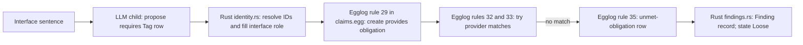

# From a Sigil Facet to a Computed Finding

This guide follows the source of the Slotted demo into the `sigil-claims` report. It covers the Sigil constructs, returned row types, and rule families present in the current implementation, then traces the recorded U5 child outputs. The four deliberate fixture problems remain part of the source evidence.

The observed traces come from the 14 copied U5 child-result files: seven selected Components in each of two passes. The workspace root in [_module.sigil](../examples/slotted/_module.sigil) contributes import and design context, but no separate U5 child-result file for its `Slotted` Component is copied here. The source directory has no `decisions` contract or local Tag group; those supported paths are described from the implementation and labeled where the captured runs do not exercise them.

SigilC uses **Facets as its interpretation units**. A Facet is an authored prose unit with a stable source identity, owning Component, and contract role; it can span multiple physical lines. The child may return zero, one, or several rows for a Facet. Those rows point back to that Facet and leave the exact sentence behind each claim unspecified. See the [request builder](../packages/sigilc/src/claims/prepare.rs#L255-L318).

## Who does exactly what

| Actor or code | Exact responsibility | Where to look |
| --- | --- | --- |
| Sigil frontend | Parses the `.sigil` files and exports Components, Tags, Facets, references, and imports. | The `sigil export design` step and its `frontend.json`; `sigil-claims` consumes that export. |
| External child model / LLM | Reads the prepared Facet prose and guidance, decides what the prose appears to assert, and proposes the six allowed data row forms. This is interpretation, so a fresh call can differ. It does not apply the formal laws or produce report findings. | Runs in the caller's workflow, outside the `sigil-claims` CLI. The CLI source calls it an “external interpreter” and explicitly says it never launches a model. The package code does not name the provider or model version. [cli.rs](../packages/sigilc/src/claims/cli.rs#L21-L34) |
| Rust `sigil-claims` host | `prepare.rs` makes request/binding/guidance; `dialect.rs` parses and validates rows; `identity.rs` resolves names/IDs, fills roles, and checks grounding; `program.rs` builds the program and starts Egglog; `eqval.rs` supplies fixed-point and table-reading helpers; `findings.rs` and `context.rs` create the report. | [prepare.rs](../packages/sigilc/src/claims/prepare.rs), [dialect.rs](../packages/sigilc/src/claims/dialect.rs), [identity.rs](../packages/sigilc/src/claims/identity.rs), [program.rs](../packages/sigilc/src/claims/program.rs), [eqval.rs](../packages/sigilc/src/eqval.rs), [findings.rs](../packages/sigilc/src/claims/findings.rs), [context.rs](../packages/sigilc/src/claims/context.rs), and [cli.rs](../packages/sigilc/src/claims/cli.rs). |
| Egglog rule source | Defines the relations, functions, and 36 formal rules. The rule bodies are written in Egglog's language, not Rust and not generated by the child. | [`claims.egg`](../packages/sigilc/src/claims/claims.egg). |
| Egglog engine | Parses the combined program and admitted facts, applies the Egglog rule bodies, and updates its tables. Rust calls the embedded engine; it is not a separate LLM or a separate CLI process. | Egglog `EGraph` calls in [program.rs](../packages/sigilc/src/claims/program.rs#L265-L288); the Rust loop calls `step_rules` in [eqval.rs](../packages/sigilc/src/eqval.rs#L181-L201). |

In short: **the LLM interprets prose into proposed rows; Rust checks and grounds those rows and assembles/drives the computation; `claims.egg` states the laws; Egglog executes those laws; Rust turns the resulting tables into the report.** A `claim` row is data. A rule in `claims.egg` is executable logic. The Rust fixed-point loop asks Egglog to run `closure` and then `diagnostics` until each is stable; Egglog performs the actual rule matches and derives rows during each run. **The LLM's part ends when it returns proposed rows.** Rust checks that they are well-shaped and grounded to known entities, but does not check whether the model captured every implication of the prose. Egglog only computes consequences covered by the admitted facts and laws in `claims.egg`.

## The path from source to report

```mermaid
flowchart LR
    S[Sigil source] --> E[Sigil frontend: export Components, Tags, Facets, imports]
    E --> P[Rust prepare.rs: build request and binding]
    P --> C[External caller runs child LLM/interpreter]
    C --> O[child-result.egg: proposed data rows]
    O --> V[Rust dialect.rs: validate row names and shapes]
    E --> A[Rust identity.rs: resolve Facets, IDs, roles, grounding]
    V --> A
    A --> G[Rust program.rs: combine rules and facts; submit to Egglog]
    G --> F[Rust eqval.rs: call step_rules closure]
    F --> H[Egglog engine: apply closure rules once]
    H --> I{Updated?}
    I -->|yes| F
    I -->|no| J[Rust eqval.rs: switch to diagnostics]
    J --> K[Rust eqval.rs: call step_rules diagnostics]
    K --> L[Egglog engine: apply diagnostics rules once]
    L --> M{Updated?}
    M -->|yes| K
    M -->|no| X[Rust program.rs: extract result tables]
    X --> R[Rust findings/context: findings, state, JSON report]
```



The frontend export preserves the structure and identity of the source. Rust `prepare.rs` sends selected Facets and the resolved import closure in a request for the external caller's child model. The child interprets prose and returns rows in a restricted data format. Rust validates those rows, fills in identity and contract role, and writes the admitted Egglog facts. The child artifact is data; it cannot contain rules. Rust combines the facts with the fixed Egglog source, then the Egglog engine executes that program. Rust controls when to repeat each ruleset and turns the final tables into report records. The [claims interpreter report](sigilc-claims-explainer.md#who-does-what) gives the same split in more detail.

`closure` and `diagnostics` each run until their tables stop changing. Diagnostics read settled values such as `filled=0` and `reaches-end=0`; they do not inspect prose or ask the child a follow-up question. The driver is in [eqval.rs](../packages/sigilc/src/eqval.rs#L181-L201).

## What Sigil contributes before interpretation

| Sigil construct | What the export/request records | Direct rule effect |
| --- | --- | --- |
| `component Name { ... }` | Component identity and ownership for its contracts and local Tags. | Supplies entity IDs and ownership metadata used by Rust `identity.rs` to ground rows and by Egglog rules to join entities. |
| `@path from Provider import { tags }` | Resolved provider and selected Tag identities; the selected component's request includes its resolved import closure. | Makes entities available for grounding. A returned `dependsOn` claim builds computed reachability; an import alone describes design context. |
| A contract header such as `interface {` or `constraints {` | A section role attached to every Facet inside it. Rust `identity.rs` fills the role from the export; the child never chooses it. | Rust emits `commits` metadata for every role except `decisions`. Egglog rules use that metadata; a Constraints claim can govern a flow graph and Logic has flow-specific checks. |
| A prose paragraph or group Facet | Facet ID, source path, owner Component, role, and the Facet's prose range. A group heading can introduce/reuse a Tag; the prose beneath it is still Facet content. | No rule reads the prose text. It is context for the child and grounding evidence for entities referenced by a returned row. |
| Inline or bare Tag references | Resolver-selected Tag identities and per-Facet references in the export. Ambiguous references do not provide grounding. | Rust `identity.rs` uses resolved identities for grounding. Merely mentioning a Tag does not create an `owns`, `requires`, `provides`, or flow fact. |
| Inline Markdown link or image | The syntax remains in the containing Facet's prose; the frontend can resolve its target for Sigil link diagnostics. The Slotted calendar interface includes an image link at [lines 42–43](../examples/slotted/booking-calendar-view.sigil#L42-L43). | The link target does not become a claim or Tag reference. It is context the child receives with the rest of that Facet. |
| Fenced literal inside a Facet | Literal content remains part of the Facet provided to the child; the frontend records it as payload rather than a new contract or rule. The Booking Calendar View interface has a `text` fence at [lines 31–40](../examples/slotted/booking-calendar-view.sigil#L31-L40). | The fence alone creates no Egglog row. A child may use its content while interpreting the containing Facet. |
| A Facet with no assertion to return | The Facet is still part of the request and needs an explicit child response if read. | The child can return a `reading`; no Egglog rule consumes that table. Rust report/context code uses it as coverage metadata. |

The selected source controls interpretation-coverage findings. Dependency Facets provide context for grounding and cross-component checks. The request carries resolved imports; returned `dependsOn` claims produce `reachable` rows. See [prepare.rs](../packages/sigilc/src/claims/prepare.rs#L158-L240) and the [grounding resolver](../packages/sigilc/src/claims/identity.rs#L95-L155).

Identity resolution is a real compute boundary. In the final Slotted design, `Profile` is the Component and `UserProfile` is a Tag imported by Auth. Pass 1's child used the Tag's exact ID in an Auth ownership claim at [child-result line 42](slotted-u5-final.SARS1Y/pass-1/auth.sigil/child-result.egg#L42); pass 2 used the labels `Profile` and `UserProfile` at [line 42](slotted-u5-final.SARS1Y/pass-2/auth.sigil/child-result.egg#L42), which the host resolves separately. When one label matches multiple entities in the request, the host rejects it as ambiguous instead of guessing. This is the boundary that fixed the earlier `UserProfile` component/Tag collision.

### Where a row stops before the rules

- A malformed row shape, unsupported vocabulary item, unknown Facet ID, unknown entity label, or ambiguous entity label refuses the artifact during validation/admission. No saturation follows that refusal.
- A row that reaches admission but fails grounding, or a degenerate same-entity claim, is retained as an Interpretation finding and skipped when the host builds rule input. Valid flow self-edges are exempt from the degenerate-claim check.
- If any admitted Logic fact has a grounding defect, the host marks that Component's Graph as suppressed and skips defective facts. The diagnostic reports `suppressed-graph`; dropping a single bad edge and diagnosing false dead ends would be misleading.

The parser's refusal and validation boundary is in [dialect.rs](../packages/sigilc/src/claims/dialect.rs#L97-L117); identity and grounding admission is in [identity.rs](../packages/sigilc/src/claims/identity.rs#L241-L321); host suppression and fact emission are in [program.rs](../packages/sigilc/src/claims/program.rs#L127-L175).

### Contract roles and commitment

`commits` is a one-column Egglog relation over contract roles. Rust emits one row for each role whose Facets count as commitments: `goal`, `interface`, `state`, `logic`, `constraints`, and `cases`. It emits no `(commits "decisions")`. These role rows are supplied by Rust from the fixed vocabulary; the child neither returns them nor chooses a Facet's role. Rust looks up each Facet's actual role in the frontend export and copies it onto the admitted claim.

The role gate and claim modality answer different questions. The role says whether a rule may treat the statement as a commitment. The modality says whether that row is `required`, `permitted`, or `assumed`. For a committed role, rules 17–18 turn `required true` and `permitted true` claims into `holds`; rule 30 turns `assumed true` into an obligation instead. A committed `required false` claim can participate in contradiction checks. These rules also require the right modality and value, so a `commits` row alone does not make every claim true or turn it into `holds`.

For example, the child supplies `(claim "<facet-id>" "Booking" "provides" "RecurringBookingSeries" "required" "true")`. If the export says that Facet is in `interface`, Rust adds `(commits "interface")` to the program and re-emits the claim with its actual role, stable claim ID, and resolved entity IDs. Rule 17 joins that admitted claim to the `commits` role row and derives a `holds` fact. If the role is `decisions`, no such role row exists, so the commitment-gated laws do not match; the claim remains admitted, and rule 36 can still produce a duplicate-proposition review candidate because it has no `commits` condition. [Role rows in program.rs](../packages/sigilc/src/claims/program.rs#L90-L108) [Commitment rules](../packages/sigilc/src/claims/claims.egg#L186-L192) [Duplicate rule](../packages/sigilc/src/claims/claims.egg#L257-L260)

The full walkthrough of the row expansion and role gate is in [How Interpretation Rows Become Egglog Results](claims-rules-and-interpretation-pipeline.md#what-the-commits-gate-means).

`constraints` has special meaning for Logic analysis: its claims can govern their own Component's graph and graphs of Components the interpreted design says it depends on. `logic` has special meaning for Steps and Guards. Other roles do not get separate rule sets just because of their names; their claims use the common commitment, contradiction, and obligation rules.

## The child-to-Rust-host row boundary

The child can return six row forms: `claim`, `property`, `measure`, `reading`, `step`, and `guard`. Claim modalities are `required`, `permitted`, or `assumed`; expected values are `true` or `false`. Accepted boolean properties are `required`, `exclusive`, `assumed`, and `expected`. Accepted numeric measures are `cost`, `latencyBudgetMs`, `latencyMs`, and `risk`; all numbers must be finite and non-negative, with `risk` at most `1`. The validator restricts names, arities, values, and numeric bounds in [vocabulary.rs](../packages/sigilc/src/claims/vocabulary.rs#L52-L116) and [dialect.rs](../packages/sigilc/src/claims/dialect.rs#L205-L359).

| Child row | What the Rust host adds or resolves | What the Egglog rules can do |
| --- | --- | --- |
| `(claim facet subject relation object modality expected)` | Mints a claim ID, fills the Facet's role, resolves Component/Tag labels to exact entity IDs, and records grounding defects. A relation involving `step:N` or `graph` resolves to tool-minted flow IDs. | Positive required/permitted claims become `holds`; required claims can create obligations or contradictions; selected relations have dependency, ownership, exclusion, and flow rules. |
| `(property facet subject property value)` | Mints the claim ID and resolves/grounds the subject. Boolean values and property names are checked. | `exclusive=true` participates in ownership laws; `required=true` on a Tag raises an ownership obligation; conflicting values can produce a property contradiction. `assumed` and `expected` have no dedicated property law. |
| `(measure facet subject property number)` | Parses a finite, non-negative number and resolves/grounds the subject. `risk` is bounded to `[0,1]`. | Conflicting values for the same subject/property can produce a measure contradiction. There is no current threshold rule for cost, latency, or risk. |
| `(reading facet outcome)` | Associates `no-commitment` or `unresolved` with the Facet. | No Egglog rule consumes `reading`. Rust report/context code distinguishes a Facet read without a commitment from one left uninterpreted. |
| `(step facet ordinal)` | Checks the Facet is in Logic, rejects duplicate ordinals in one Logic section, mints a Step identity, and mints one Graph identity for that Component's Logic section. | Flow rules associate Steps with the Graph, propagate explicit `to` edges, and diagnose an unreached Step or a suppressed graph. |
| `(guard facet step operand value)` | Resolves the ordinal to a minted Step and validates `operand` as `state`, `input`, or `constraint`. | The current guard law only matches a `constraint` operand, and only at the same graph level; `state` and `input` guards have no matching Egglog law today. |

The Rust-generated `claim` row has eight arguments: claim ID, Facet ID, section, subject ID, relation, object ID, modality, and expected value. A child `claim` row has six arguments. That difference prevents the child from selecting a contract role or forging a claim identity. The adapter is in [program.rs](../packages/sigilc/src/claims/program.rs#L165-L258).

### Relation names and their current laws

The validator accepts the following relation vocabulary. A relation without a dedicated rule can still enter `holds` when asserted required/permitted true, create an obligation when marked assumed true, participate in generic contradiction checks when its modality and expected value match a law, or appear as a duplicate-proposition candidate. Those generic paths do not give every relation a domain-specific meaning.

| Relation family | Accepted names | Specific current rules |
| --- | --- | --- |
| Ownership and capability | `owns`, `provides`, `requires`, `delegates`, `excludes` | Ownership and exclusivity rules; provider fulfillment; delegated capability; exclusions. |
| Dependency | `dependsOn` | Direct and transitive `reachable`; a one-hop provider check for a `requires` obligation. |
| Flow | `reads`, `writes`, `invokes`, `to` | Step touch detection, foreign exclusive writes, and explicit flow-end reachability. |
| Other accepted relations | `routesThrough`, `persistsAt`, `authorityFor`, `trusts`, `uses`, `hasContract`, `from`, `target`, `initialState`, `transitionsTo` | No dedicated domain rule in `claims.egg`; they remain ordinary claim tuples subject to the generic paths above. |

The full accepted vocabulary is defined in [vocabulary.rs](../packages/sigilc/src/claims/vocabulary.rs#L117-L160). The child returns each relation name as data; Rust admits and grounds that value before the Egglog engine can use it.

The laws named in the traces below are Egglog rules in `claims.egg`. Rust supplies their input rows and runs the engine; it does not contain a second implementation of those laws.

## Worked traces from the Slotted output

### 1. A positive interface promise becomes a missing-provider finding

The Scheduling and Recurrence interface says expanding a local-time pattern across clock changes requires regional time-zone rules. The Facet was sent to the child, which returned this row in both U5 runs:

```lisp
(claim "facet:scheduling-and-recurrence.sigil:813"
       "SchedulingAndRecurrence" "requires" "regional time-zone rules"
       "required" "true")
```

The raw row appears at [pass 1 line 7](slotted-u5-final.SARS1Y/pass-1/scheduling-and-recurrence.sigil/child-result.egg#L7) and [pass 2 line 88](slotted-u5-final.SARS1Y/pass-2/scheduling-and-recurrence.sigil/child-result.egg#L88). The source is [scheduling-and-recurrence.sigil](../examples/slotted/scheduling-and-recurrence.sigil#L11-L23).

Rust `identity.rs` resolves both labels to their declared entity IDs, fills the `interface` role, and mints a claim ID. Egglog rules 17–18 in `claims.egg` place positive claims in `holds`; rule 29 turns a committed `requires` claim into an obligation that this Component `provides` the Tag. Egglog rules 32–33 look for an exact provider or a provider from one directly depended-on Component. Neither matches, so `filled` remains zero. After the Rust driver has run `closure` to stability, Egglog rule 35 emits `unmet-obligation`. Rust `findings.rs` formats it as an UnmetObligation finding; with no contradiction, the source report is `Loose`.



The next block shows the fact shapes after admission and the two derived rows. IDs are abbreviated placeholders; the captured child artifact contains labels, while Rust resolves those labels before sending Egglog its program.

```lisp
; admitted by Rust identity.rs from the child's six-argument row
(claim "<claim-id>" "facet:scheduling-and-recurrence.sigil:813" "interface"
       "<scheduling-component-id>" "requires" "<timezone-tag-id>" "required" "true")

; rule 17: positive assertion
(holds "<scheduling-component-id>" "requires" "<timezone-tag-id>")

; rule 29: obligation; rule 35 emits this after no provider fills it
(obligation "<claim-id>" "<scheduling-component-id>" "provides" "<timezone-tag-id>")
(unmet-obligation "<claim-id>" "<scheduling-component-id>" "provides" "<timezone-tag-id>")
```

### 2. A constraint produces a contradiction, with the wrong target identity

Booking's interface requires a recurring booking series for each repeated booking request. Its Constraints Facet says Booking must not require that same series. These are authored in different Facets in [booking.sigil](../examples/slotted/booking.sigil#L18-L33) and [booking.sigil](../examples/slotted/booking.sigil#L68-L80).

Pass 1 returned a positive interface claim and a negative constraint claim, but it named the Component `SchedulingAndRecurrence` for both objects:

```lisp
(claim "facet:booking.sigil:802" "Booking" "requires"
       "SchedulingAndRecurrence" "required" "true")
(claim "facet:booking.sigil:2629" "Booking" "requires"
       "SchedulingAndRecurrence" "required" "false")
```

The positive row is at [pass 1 line 46](slotted-u5-final.SARS1Y/pass-1/booking.sigil/child-result.egg#L46); the negative row is at [line 33](slotted-u5-final.SARS1Y/pass-1/booking.sigil/child-result.egg#L33). After admission, their shared tuple is the same subject, relation, and object, and both Facet roles commit. Rule 22 emits `contradictory-claims`; Rust maps that violation to a Contradiction finding. The recorded [ingest summary](slotted-u5-final.SARS1Y/pass-1/booking.sigil/ingest.stdout) says `state: disjoint` with nine findings.

That is a successful rule match on an inaccurate interpretation. The intended target is the `recurring booking series` Tag. The model's output says the Component instead, so the computation did not establish the intended Tag-level contradiction. Pass 2 omitted the opposing Booking claims and returned Coherent with zero findings. The two outputs and the full fixture discussion are in the [claims report](sigilc-claims-explainer.md#1-bookings-interfaceconstraint-contradiction).

### 3. An exclusive-ownership sentence needs a property row

Booking's state says it exclusively owns the recurring booking series; Scheduling and Recurrence also claims ownership in its state. For rule 28 to detect two exclusive owners, the admitted facts must include all of these:

```lisp
(property "<booking-state-facet>" "<series-tag-id>" "exclusive" "true")
(claim "<booking-owner-facet>" "Booking" "owns" "<series-tag-id>" "required" "true")
(claim "<scheduling-owner-facet>" "SchedulingAndRecurrence" "owns" "<series-tag-id>" "required" "true")
```

The angle-bracket values are placeholders, not captured output. The host replaces them with IDs before saturation. Rule 28 joins `exclusive=true` with two committed `owns` facts for the same Tag and different owners. The captured child results supplied neither the exclusive property nor both owners of that Tag: pass 1 had Scheduling's `owns` claim, but no Booking ownership claim for the Tag; pass 2 said Scheduling `provides` the series instead. Rule 28 therefore had no match. See the [source statements](../examples/slotted/booking.sigil#L35-L40), [pass 1 rows](slotted-u5-final.SARS1Y/pass-1/scheduling-and-recurrence.sigil/child-result.egg#L8-L10), [pass 2 rows](slotted-u5-final.SARS1Y/pass-2/scheduling-and-recurrence.sigil/child-result.egg#L78-L80), and the [existing fixture analysis](sigilc-claims-explainer.md#2-conflicting-exclusive-ownership-of-the-recurring-series).

This is why the word “exclusively” in Sigil does not itself trigger a law. The child must express exclusivity as a `property` row, and the owners must resolve to one exact Tag identity.

### 4. A Logic sentence becomes a Step and explicit edges

Scheduling's Logic Facet says it builds a series-date preview for the booking form. In pass 1, the child represented that Facet as Step 5, a write claim, and a `to graph` claim. In pass 2 it returned an `invokes` claim instead of a write, while keeping the `to graph` claim. The rows are at [pass 1 lines 30–33](slotted-u5-final.SARS1Y/pass-1/scheduling-and-recurrence.sigil/child-result.egg#L30) and [pass 2 lines 75–77](slotted-u5-final.SARS1Y/pass-2/scheduling-and-recurrence.sigil/child-result.egg#L75); the prose is at [scheduling-and-recurrence.sigil](../examples/slotted/scheduling-and-recurrence.sigil#L34-L49).

Rust `identity.rs` mints Step 5 and `program.rs` mints the Component's Graph ID. Egglog rules 1–2 associate the Step with the Graph and mark its touched Tag; rule 3 initializes its end-reachability value to zero; rule 4 sees `step:5 to graph` and sets it to one. Rule 7 therefore has no dead end to report for that Step.

The deliberate missing-consumer problem stays undetected. The flow laws ask whether every Step reaches an explicit Graph end through `to` edges. They do not ask whether another Step reads a Tag that this one writes. The current rules have no unused-output check, so writing the preview and ending the Step at `graph` does not create a finding.

### 5. A case Facet can still contribute a committed claim

The Scheduling and Recurrence case describes a weekly pattern with an exception that skips one occurrence ([source lines 63–67](../examples/slotted/scheduling-and-recurrence.sigil#L63-L67)). Both passes returned this claim from the case Facet:

```lisp
(claim "facet:scheduling-and-recurrence.sigil:2518"
       "series exception" "target" "recurring booking series"
       "permitted" "true")
```

It appears at [pass 1 line 37](slotted-u5-final.SARS1Y/pass-1/scheduling-and-recurrence.sigil/child-result.egg#L37) and [pass 2 line 84](slotted-u5-final.SARS1Y/pass-2/scheduling-and-recurrence.sigil/child-result.egg#L84). Rust `identity.rs` supplies the `cases` role. Since `cases` is a committing role, Egglog rule 18 adds the tuple to `holds`; `target` has no dedicated law, so Egglog records the commitment and its witness without simulating the described scenario.

### 6. A Constraints claim can govern a Logic flow

For flow checks, Rust `program.rs` emits each Constraints claim's Facet owner as `facet` metadata. Egglog rule 9 associates that claim with its own Component's Logic Graph. Rule 10 also associates it with dependency Graphs reached through `reachable`, which Egglog derives from returned `dependsOn` claims. A resolved import by itself does not establish this governance edge.

The current flow laws then use admitted facts as follows:

| Flow question | Required admitted shape | Rule and output |
| --- | --- | --- |
| Does a step do something excluded by a reaching constraint? | A committed Constraints `excludes` claim plus a governed Graph and a touched Tag. | Rule 11 emits `step-excluded-action` in `step-violation`. |
| Does a step assert an action that a reaching constraint negates? | A committed Constraints claim with `expected=false` plus a matching held step action. | Rule 12 emits `step-negated-action`. |
| Does a step write another Component's exclusive Tag? | `exclusive=true`, a Step `writes` claim, and Tag owner different from Step owner. | Rule 13 emits `exclusive-foreign-write`. |
| Does a flow touch a required Tag without guarding on the constraint? | A committed Constraints `requires` claim, a governed graph, and a Step that reads/writes/invokes that Tag. | Rule 14 starts `flow-guarded=0`; rule 15 can set it to `1` from a `guard` whose operand is `constraint` and value names the constraint Facet; rule 16 reports `unguarded-flow` if it remains zero. |

These are Flow findings, kept out of the `violation` table so a child's reading of prose does not by itself make the design Disjoint. The captured 14 U5 child-result files contain no `guard` rows, so that guard law was not exercised in these recorded outputs. The full flow rules are at [claims.egg](../packages/sigilc/src/claims/claims.egg#L138-L184).

### 7. Properties, measures, readings, and empty interpretation

The U5 capture has 14 child-result files: seven selected sources, each interpreted in two passes. A scan of those copied files found 375 `claim` rows, 537 `reading` rows, and 41 `step` rows. It found no `property`, `measure`, or `guard` rows. This is a count of rows across files, including repeated dependency Facets; it is not a count of unique statements.

The code accepts these additional shapes, even though the captured outputs do not demonstrate them:

- A `property` such as `exclusive=true` or `required=true` can enable the ownership laws or a required-state ownership obligation. Two committed property rows for the same subject/property with different values trigger the property conflict rule.
- A `measure` such as `latencyMs=120` is parsed as a finite non-negative number. Different values for the same subject and measure trigger the measure conflict rule. The current implementation has no comparison against a latency budget, cost ceiling, or risk threshold.
- A `reading` records `no-commitment` or `unresolved`. There is no Egglog rule over readings. Both outcomes count as Rust report/context `read-without-commitment` coverage; the current context does not preserve a different coverage class for `unresolved`.
- If no Facet in a selected contract role has any valid fact or reading, Rust `findings.rs` reports that role as uninterpreted. Defective or ungrounded facts do not count as a successful interpretation.

For example, the following shapes are **illustrative only**; they are not rows in the copied U5 artifacts:

```lisp
(property "<facet-id>" "<tag-id>" "exclusive" "true")
(measure "<facet-id>" "<component-id>" "latencyMs" "120")
(guard "<logic-facet-id>" "2" "constraint" "<constraint-facet-id>")
```

After validation and identity resolution, the property can match a rule requiring exclusivity, the measure can match a same-subject/same-property comparison, and the guard can satisfy a flow obligation only when the named constraint governs the Graph. The host expects real IDs in these fields before saturation.

The findings and coverage paths are implemented in [findings.rs](../packages/sigilc/src/claims/findings.rs#L253-L299), [identity.rs](../packages/sigilc/src/claims/identity.rs#L463-L495), and [context.rs](../packages/sigilc/src/claims/context.rs#L233-L252).

## Rule coverage: what each family computes

The rule numbering below matches the 36-row inventory in the [claims explainer](sigilc-claims-explainer.md). The source file itself has no explicit numeric IDs; the links point to the actual law bodies.

| Rule family | Inputs from admitted rows or host metadata | Result |
| --- | --- | --- |
| 1–8: flow shape | Step and Graph entities; `reads`/`writes`/`invokes`/`to` in `holds`; host graph-suppression marker. | Step-to-graph membership, touched Tags, direct/transitive end reachability, `unreached-step` or `suppressed-graph`. [Source](../packages/sigilc/src/claims/claims.egg#L98-L136) |
| 9–10: constraint reach | Constraints claim Facet ownership plus `reachable` dependency facts. | `constraint-governs` rows linking a claim to its own or a dependency Graph. [Source](../packages/sigilc/src/claims/claims.egg#L138-L147) |
| 11–16: flow laws | Governed claims, touched Tags, Step ownership, and optionally guard rows. | Flow-class findings for excluded/negated action, foreign exclusive write, or unguarded requirement. [Source](../packages/sigilc/src/claims/claims.egg#L149-L184) |
| 17–18: positive assertion | Committed claim with expected `true`, modality `required` or `permitted`. | `holds` and an asserted `because` witness. [Source](../packages/sigilc/src/claims/claims.egg#L186-L192) |
| 19–21: dependency/delegation | `dependsOn`, `delegates`, and `provides` facts in `holds`. | Direct/transitive `reachable`; delegated `provides`. [Source](../packages/sigilc/src/claims/claims.egg#L194-L200) |
| 22–27: contradictions | Opposing committed claim expectations, a false claim opposed by `holds`, an exclusion opposed by use/provision, or differing property/measure values. | Egglog derives `violation`; Rust `findings.rs` classifies these as Contradiction findings. [Source](../packages/sigilc/src/claims/claims.egg#L202-L223) |
| 28: exclusive ownership | Committed `exclusive=true` property and two different owners in `holds`. | Egglog derives `exclusive-ownership`; Rust `findings.rs` classifies it as OwnershipConflict. [Source](../packages/sigilc/src/claims/claims.egg#L225-L229) |
| 29–35: obligations | Required `requires`, `assumed=true`, or required Tag state; exact positive facts and one-hop dependency providers. | `obligation`, monotone `filled`, then `unmet-obligation` if still zero at diagnostics time. [Source](../packages/sigilc/src/claims/claims.egg#L231-L255) |
| 36: duplicate proposition | Same subject/relation/object claimed from two different Facets. | A duplicate candidate for later review; it does not change report state. [Source](../packages/sigilc/src/claims/claims.egg#L257-L260) |

Several declared tables are data rather than rules. `section-declared`, `reading`, and `flow-step` have no `claims.egg` rule that reads them. Four functions—`filled`, `reaches-end`, `graph-suppressed`, and `flow-guarded`—merge updates with `max`, so a derived `1` is never undone by another rule's `0`. The rule inventory and table notes are also available in the [claims explainer](sigilc-claims-explainer.md#the-declared-tables-that-are-not-rules).

## How the computed facts become report state

Rust `findings.rs` converts Egglog `violation` rows into Contradiction or OwnershipConflict findings, `unmet-obligation` into UnmetObligation, flow tables into Flow findings, and admission defects or missing interpretation into Interpretation findings. A report is `Disjoint` if it contains a contradiction or ownership conflict; otherwise findings make it `Loose`; no findings makes it `Coherent`. Thus the time-zone provider gap is Loose, while the Booking pair above is Disjoint. Flow and interpretation warnings do not by themselves make a design Disjoint. The mapping and state function are in [findings.rs](../packages/sigilc/src/claims/findings.rs#L111-L184) and [findings.rs](../packages/sigilc/src/claims/findings.rs#L346-L357).

The copied `ingest.stdout` files preserve the final state and finding count. Their `report` and `judgmentContext` paths point into the original temporary run directory; those JSON files were not copied into `analyze-demo`. The detailed run comparison and the deliberate problems are documented in [sigilc-claims-explainer.md](sigilc-claims-explainer.md#what-the-two-runs-establish).

## Check yourself

1. A child returns `requires Tag` with `required true`. Which rule creates the provider obligation, and when can the report call it unmet?
2. A source says a Tag is exclusively owned, but the child returns two `owns` claims and no `exclusive` property. Can rule 28 fire?
3. A step writes a Tag and has an explicit `to graph` edge. Does the current flow law check whether a later step reads that Tag?
4. An import makes a provider Component visible in the request. Does that alone create `reachable`?

### Answers

1. Rule 29 creates an obligation to provide the Tag and initializes `filled` to zero. Rules 32–33 may fill it from a direct provider or a provider through one declared dependency; rule 35 reports it only after closure leaves it at zero. Saying rule 29 itself checks for a provider confuses creating the obligation with satisfying it.
2. No. Rule 28 requires `exclusive=true` plus two owners of the same Tag. The missing property is the missing input to the law.
3. No. The edge makes that Step reach a declared end. The current rules do not check whether written Tags have consumers; that missing check is why the series-date fixture survives.
4. No. Import resolution provides grounding context. `reachable` is derived from an admitted `dependsOn` claim by rules 19–20. Treating the workspace import graph as the computed dependency relation merges two distinct inputs.
