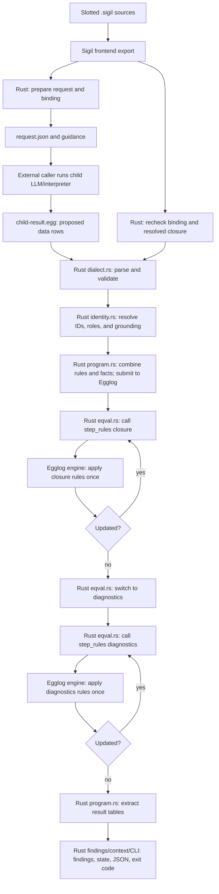
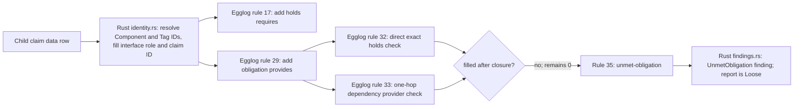
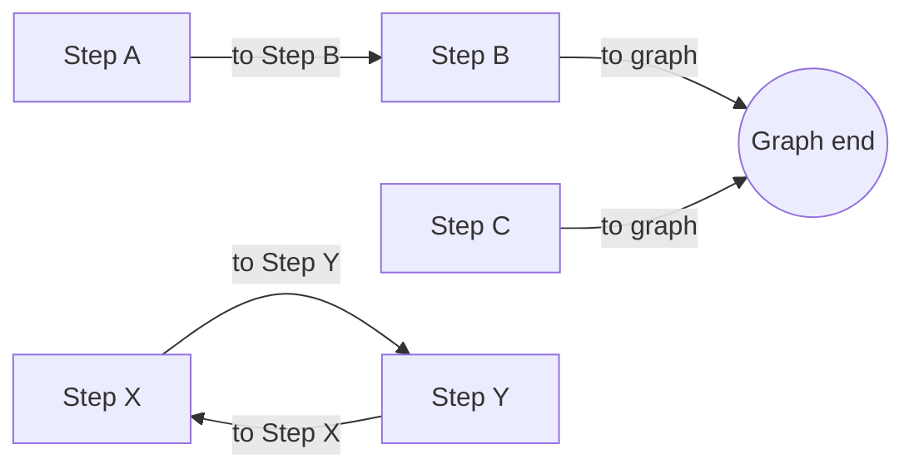
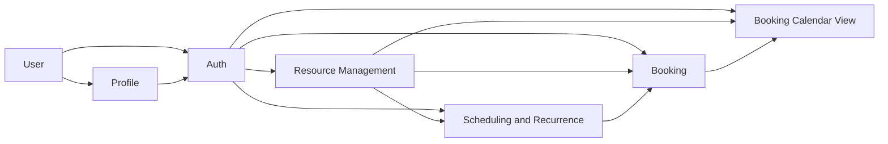
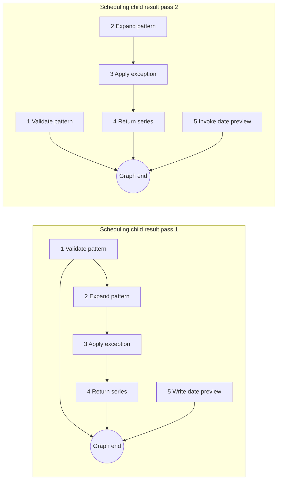

# How SigilC Claims Computes Findings

This report follows the current `sigil-claims` implementation from the Slotted source prose to the final state and findings. The four deliberate Slotted fixture problems remain in the source snapshot used here. The report explains how each problem is represented in the returned rows, which rule can detect it, and what the two recorded fresh runs actually did.

The work splits across five roles. “Rust,” “Egglog,” and “the child” do not mean the same part of the pipeline:

| Who or what | What it does | Where that work lives |
| --- | --- | --- |
| Sigil frontend | Parses the `.sigil` design and exports Components, Tags, Facets, references, and imports. | The compiler/frontend behind `sigil export design`; this is structural input, not a claims verdict. |
| External child model / LLM | Reads the prepared Facet prose and guidance, decides what the prose appears to assert, and proposes `claim`, `property`, `measure`, `reading`, `step`, and `guard` data rows. This is the prose interpretation step and can vary across fresh calls. It does not apply the formal laws or produce report findings. | Outside `sigil-claims`; a caller or workflow runs it and supplies its `child-result.egg`. The CLI does not select or launch a model. The package source therefore does not identify the model/provider used for a captured run. |
| `sigil-claims` Rust host | Prepares requests; parses and rejects malformed returned data; checks identity and grounding; mints IDs and roles; assembles the program; drives Egglog; extracts tables; builds findings, state, context, and the CLI result. | [prepare.rs](../packages/sigilc/src/claims/prepare.rs), [dialect.rs](../packages/sigilc/src/claims/dialect.rs), [identity.rs](../packages/sigilc/src/claims/identity.rs), [program.rs](../packages/sigilc/src/claims/program.rs), [eqval.rs](../packages/sigilc/src/eqval.rs), [findings.rs](../packages/sigilc/src/claims/findings.rs), [context.rs](../packages/sigilc/src/claims/context.rs), and [cli.rs](../packages/sigilc/src/claims/cli.rs). |
| `claims.egg` rule source | Declares the relations and functions and contains the 36 formal rule bodies that define deductions. This is the rule code, written in Egglog's language; it is neither Rust host logic nor child output. | [claims.egg](../packages/sigilc/src/claims/claims.egg). |
| Egglog engine | Parses and evaluates the combined program, applies the rule bodies to admitted facts, and updates its tables. It runs as an embedded library called by Rust, not as a separate LLM or CLI process. | Initial engine call: [program.rs](../packages/sigilc/src/claims/program.rs#L265-L288). Fixed-point calls: [eqval.rs](../packages/sigilc/src/eqval.rs#L181-L233). |

The exact split between the last two rows matters: the Rust loop asks the Egglog engine to run `closure` and then `diagnostics` repeatedly until neither ruleset adds or changes anything. **Individual rule matches and derived tuples are Egglog work; choosing which row shapes to accept, resolving IDs, controlling the loop, and turning final tables into report findings are Rust work.** `claims.egg` is the rules' source code; Egglog is the engine that executes it. A child `claim` row is input data and is not itself a rule.

Here, “Rust” names the host implementation language and the cited `sigilc` modules. The frontend is also part of that Rust project. The distinction is about responsibility: the Claims laws are expressed in `claims.egg` and executed by the Egglog engine; the Rust host prepares their inputs and handles their outputs.

`sigil-claims` does not launch the child model. Its CLI prepares the request, validates and ingests the artifact the caller supplies, runs the fixed rules, and writes a report. The CLI documents this boundary explicitly in [cli.rs](../packages/sigilc/src/claims/cli.rs#L21-L34). Given the same admitted facts and same `claims.egg` program, Egglog saturation is repeatable; fresh external interpretations can differ before that boundary.

## The whole path



The source-to-report boundary is implemented across [prepare.rs](../packages/sigilc/src/claims/prepare.rs), [dialect.rs](../packages/sigilc/src/claims/dialect.rs), [identity.rs](../packages/sigilc/src/claims/identity.rs), [program.rs](../packages/sigilc/src/claims/program.rs), [eqval.rs](../packages/sigilc/src/eqval.rs), and [findings.rs](../packages/sigilc/src/claims/findings.rs).

### What each stage receives and returns

1. **Export.** The frontend export contains the source text, Facets, Components, Tags, resolved references, imports, and source identities. `sigil-claims` consumes this export; it does not reopen the `.sigil` files. [prepare.rs](../packages/sigilc/src/claims/prepare.rs#L1-L6)
2. **Prepare.** `prepare --source booking.sigil` selects a source and projects its resolved import closure into a request. The request includes Facet prose, admissible entities, and each Logic section grouped in source order. A binding records the export digest, selected source, closure, guidance fingerprint, vocabulary generation, and requested Facets. [prepare.rs](../packages/sigilc/src/claims/prepare.rs#L56-L69) [prepare.rs](../packages/sigilc/src/claims/prepare.rs#L158-L240)
3. **Child interpretation.** A fresh child reads that request and the guidance, then writes only data rows. A `claim` row has six values; the child does not supply the contract section or a claim ID. For example, a flow edge looks like `(claim "facet:..." "step:4" "to" "graph" "required" "true")`. [Guidance: vocabulary](../packages/sigilc/src/claims/guidance/vocabulary.md#L1-L25) [Guidance: steps](../packages/sigilc/src/claims/guidance/vocabulary.md#L83-L111)
4. **Parse and validate.** The artifact parser accepts only flat calls from the published vocabulary with quoted string arguments. Rules, schedules, arbitrary Egglog commands, nested expressions, and unknown row names are refused as a whole; valid rows beside a bad command are not partially accepted. [dialect.rs](../packages/sigilc/src/claims/dialect.rs#L97-L117) [dialect.rs](../packages/sigilc/src/claims/dialect.rs#L164-L202)
5. **Check the binding.** Ingest recomputes the request from the current export and refuses a binding that does not match it. A stale export, guidance version, or vocabulary generation cannot silently be paired with the child result. [cli.rs](../packages/sigilc/src/claims/cli.rs#L127-L149)
6. **Admit and ground rows.** The host resolves each Facet to its true Component and contract role, mints fact IDs, resolves entity labels or IDs, and checks whether each named Component or Tag is grounded in that Facet's imports/references. Labels that identify multiple entities are refused; an exact entity ID avoids label ambiguity. Ungrounded or degenerate claims are kept as interpretation findings but excluded from rule saturation. [identity.rs](../packages/sigilc/src/claims/identity.rs#L20-L31) [identity.rs](../packages/sigilc/src/claims/identity.rs#L241-L321) [identity.rs](../packages/sigilc/src/claims/identity.rs#L420-L460)
7. **Build the Egglog program.** Rust `program.rs` starts with the authored `claims.egg` rule source, appends tool-minted metadata and admitted facts, then calls the embedded Egglog engine to parse and run it. The child artifact itself is never evaluated as a program. [program.rs](../packages/sigilc/src/claims/program.rs#L85-L125) [program.rs](../packages/sigilc/src/claims/program.rs#L265-L288)
8. **Saturate and report.** Rust `eqval.rs` controls the loop: it asks Egglog to execute `closure` until stable, then `diagnostics` until stable, and extracts selected tables. Rust `findings.rs` and `context.rs` map those tables plus admission defects into findings, state, and JSON judgment context. [eqval.rs](../packages/sigilc/src/eqval.rs#L181-L233) [findings.rs](../packages/sigilc/src/claims/findings.rs#L139-L357) [context.rs](../packages/sigilc/src/claims/context.rs#L126-L270)

The `sigil-claims` command help confirms that step 3 belongs to the caller, not the CLI. Thus the child can be non-deterministic while re-ingesting the same captured artifact is repeatable. [cli.rs](../packages/sigilc/src/claims/cli.rs#L21-L34)

## Each pipeline step: its output and the rules that use it

This crosswalk follows the actual output from one stage into the next. “No Egglog rule” means that stage validates or prepares data, but does not itself derive a `claims.egg` conclusion.

| Pipeline step | Output produced | Where it goes next / relevant Egglog rule |
| --- | --- | --- |
| 1. `sigil export design` | `frontend.json`: source text, Components, Tags, Facets, imports, resolved references, and source identities. | **No Egglog rule.** `prepare` projects the selected source and import closure. Ingest later uses the export to recheck the binding and grounding. |
| 2. `sigil-claims prepare` | `request.json`, `binding.json`, and the guidance files. The request groups Logic Facets in source order and includes admissible entity identities; the binding fixes the export, source, guidance, vocabulary, and Facet scope. | The rules do not read JSON directly. `program.rs` turns request metadata into `facet`, `section-declared`, `entity`, and `commits` rows. `section-declared` is currently not read by any Egglog rule. |
| 3. Fresh child interpretation | `child-result.egg`: only `claim`, `property`, `measure`, `reading`, `step`, and `guard` data rows. | **No Egglog rule yet.** This is untrusted proposed data until dialect validation and admission succeed. The allowed row shapes are enforced in [dialect.rs](../packages/sigilc/src/claims/dialect.rs#L205-L359). |
| 4. Parse and admit | Typed `Row`s become tool-owned `Fact`s: the host fills claim IDs and contract roles, resolves labels to entity IDs, and records grounding defects. A Step becomes an `entity` of kind `Step`; the host also mints the section's `Graph`. | Valid Claims become `claim` rows; properties and measures become their respective tables. A Step entity is joined by rules 1–8. A Guard becomes `flow-guard`, used by rule 15. A defective Logic fact sets `graph-suppressed=1`; defective facts are omitted from saturation. See [program.rs](../packages/sigilc/src/claims/program.rs#L127-L175) and [program.rs](../packages/sigilc/src/claims/program.rs#L182-L258). |
| 5. `closure` fixed point | Positive and derived tables such as `holds`, `because`, `reachable`, `in-graph`, `flow-touches`, `obligation`, `filled`, `violation`, `step-violation`, `flow-obligation`, and `flow-guarded`. | The rules keep firing until no table or merged function value changes. For example, rules 17–18 turn positive claims into `holds`; rules 19–21 derive dependency/delegation facts; rules 22–34 derive contradictions, reachability, and obligation fill. |
| 6. `diagnostics` fixed point | `unreached-step`, `suppressed-graph`, `unguarded-flow`, `unmet-obligation`, and `duplicate-proposition`. | Rules 7–8, 16, 35, and 36 read settled closure values. They report remaining zero/unfilled states or a duplicate candidate. No diagnostics rule changes the earlier closure inputs. |
| 7. Rust host report construction | `Finding` records, `Coherent`/`Loose`/`Disjoint`, `judgmentContext`, and the CLI exit code. | **No further Egglog rule.** Rust `findings.rs` maps `violation` to Contradiction or OwnershipConflict, and maps diagnostic tables and admission defects to Flow, UnmetObligation, or Interpretation findings. [`state_of`](../packages/sigilc/src/claims/findings.rs#L346-L357) decides the state. |

The rules are grouped into two fixpoint rounds, not executed once top-to-bottom in the order they appear in the file. `closure` iterates until stable; then `diagnostics` iterates until stable. The driver is in [eqval.rs](../packages/sigilc/src/eqval.rs#L181-L201), and the rule-set declarations are in [claims.egg](../packages/sigilc/src/claims/claims.egg#L92-L96).

### Concrete row trace: the missing time-zone provider

The U5 child returned this row in both Scheduling and Recurrence passes:

```lisp
(claim "facet:scheduling-and-recurrence.sigil:813"
       "SchedulingAndRecurrence" "requires" "regional time-zone rules"
       "required" "true")
```

That row is copied in [pass 1](slotted-u5-final.SARS1Y/pass-1/scheduling-and-recurrence.sigil/child-result.egg#L7) and [pass 2](slotted-u5-final.SARS1Y/pass-2/scheduling-and-recurrence.sigil/child-result.egg#L88). The following is the path its admitted form takes:



The child row and source are the evidence for the requirement. The Egglog `requires` rule does not itself search prose for a provider: Egglog rules 32–33 try to fill the generated obligation from `holds`. No matching `provides` fact exists for this Tag, so the value stays at `0` and Egglog rule 35 emits the finding row. Rust `findings.rs` adds the user-facing detail “nothing satisfies provides regional time-zone rules.” This happened in both passes. [claims.egg](../packages/sigilc/src/claims/claims.egg#L189-L200) [claims.egg](../packages/sigilc/src/claims/claims.egg#L231-L255) [findings.rs](../packages/sigilc/src/claims/findings.rs#L237-L250)

### Concrete row trace: one step ending at `graph`

For Scheduling step 5, pass 1 returned a `(step ...)` declaration, a `writes series-date preview` claim, and `step:5 to graph`; pass 2 returned the declaration, `invokes series-date preview`, and the same `to graph` edge. [Pass 1 rows](slotted-u5-final.SARS1Y/pass-1/scheduling-and-recurrence.sigil/child-result.egg#L30-L33) [pass 2 rows](slotted-u5-final.SARS1Y/pass-2/scheduling-and-recurrence.sigil/child-result.egg#L75-L77)

Rust `identity.rs` resolves `step:5` to the minted Step ID, and `program.rs` supplies the minted Graph ID. Egglog rules 17–18 make the required-true `to` claim a `holds(step-id, to, graph-id)` fact. Rule 3 gives the Step an initial reachability value of `0`; rule 4 sees its explicit edge to the Graph and raises it to `1`. Rule 7 therefore has no zero to report for step 5. It does not matter to these rules whether another Step consumes the preview. In pass 1, Logic grounding defects suppress the graph diagnostic entirely; in pass 2, the graph is checked and step 5 still reaches its declared end.

## Terms the rules use

| Term | Meaning here |
| --- | --- |
| Component | A module that owns a public contract and Tags. |
| Tag | A named domain concept, owned by one Component and reused by imports. |
| Facet | One prose unit within a contract role such as `interface`, `state`, `logic`, or `constraints`. |
| Contract role / section | The Facet's authoring role. The host fills it from the export; the child does not choose it. |
| Child row | A model-proposed fact such as a claim, property, measure, reading, step, or guard. |
| Admitted fact | A validated row with host-minted identity, role, resolved entity IDs, and any grounding defects. |
| `holds(s, r, o)` | A positive relation the rules may use. It is derived from committed required-true and permitted-true claims, plus deductions such as delegation. |
| Graph | A host-minted identity for one Component's entire Logic section. It represents a flow's declared ends, not a runtime graph object. |
| Finding | A source-attributed computed observation. It can describe a design contradiction, an unmet promise, a model interpretation problem, or a flow warning. |

One source of confusion is that a child writes labels like `Booking` or `recurring booking series`; the host resolves them to distinct entity IDs. The model cannot invent a new Tag by writing a new noun. The exact Facet must also ground the entity through its references, an introduction, its own Component, or a Component imported by that source. Grounding is based on the export's resolved references, not string-matching prose. [identity.rs](../packages/sigilc/src/claims/identity.rs#L95-L155)

## How a Logic graph is built and checked

The child's `(step facet ordinal)` row creates a Step identity. `step:1` is a symbolic reference that the host resolves only after collecting the full Logic section's steps. `graph` resolves to a host-minted Graph identity for the Step's Component. Duplicate ordinals within one Logic section are refused. [identity.rs](../packages/sigilc/src/claims/identity.rs#L157-L238) [vocabulary.md](../packages/sigilc/src/claims/guidance/vocabulary.md#L53-L66)

The child declares edges with ordinary claims: `step A to step B` or `step A to graph`. A `to graph` edge explicitly declares an end. A write, return phrase, function call, or paragraph order does not create an edge by itself. Multiple branches may end at the graph. [vocabulary.md](../packages/sigilc/src/claims/guidance/vocabulary.md#L83-L111)



In this example, `B` reaches an end directly, so the closure pass sets `reaches-end(B)=1`; the edge from `A` then sets `reaches-end(A)=1`. `C` is another valid terminal branch. `X` and `Y` form a cycle with no path to a declared end, so they stay at zero and become `unreached-step` findings if the graph is not suppressed.

There is no negative “cannot reach” rule. Each step begins at zero; positive paths raise its value to one with `max`. Only after the closure stops changing does the diagnostics pass read the remaining zero values. If any admitted Logic row has a defect, the host marks that Component's whole graph suppressed. Dropping one malformed edge could otherwise create false dead ends upstream. In that case the report says `suppressed-graph` rather than reporting invented `unreached-step` warnings. [claims.egg](../packages/sigilc/src/claims/claims.egg#L98-L136) [program.rs](../packages/sigilc/src/claims/program.rs#L127-L163)

For the previously attached `booking-calendar-view` result, all four declared steps have direct `to graph` claims. That artifact therefore describes four terminal paths; it does not claim that step 1 executes before step 2. [child-result.egg](slotted-u5-final.SARS1Y/pass-1/booking-calendar-view.sigil/child-result.egg#L42-L49)

## Every rule in `claims.egg`

The current file contains **36 Egglog rules** in two rulesets. `closure` derives positive facts and monotone values. `diagnostics` reads the settled closure and emits findings or candidates. The fixed-point driver explicitly runs those rulesets in that order. [claims.egg](../packages/sigilc/src/claims/claims.egg#L92-L96) [eqval.rs](../packages/sigilc/src/eqval.rs#L181-L201)

### Flow membership and end reachability — rules 1–8

| # | Rule | What it derives |
| ---: | --- | --- |
| 1 | Step entity and Graph entity have the same owning Component. | `(in-graph step graph)`. This puts a Step in its Component's Logic Graph. |
| 2 | A positive `holds` row has a Step as its subject. | `(flow-touches step object)`. The rule keeps the object; it does not inspect the relation name. |
| 3 | A Step entity exists. | Sets `(reaches-end step)` to `0`, establishing the value the diagnostics pass can later read. |
| 4 | A positive `step to graph` fact targets an entity of kind Graph. | Sets the Step's `reaches-end` to `1` and records `because ... flow-end-direct ...`. |
| 5 | A positive `step A to step B` fact targets a Step whose `reaches-end` is `1`. | Sets `A` to `1` and records `flow-end-transitive`. Repeated closure rounds carry reachability backward through any chain. |
| 6 | A Graph entity exists. | Initializes `(graph-suppressed component)` to `0`. The host may also insert `1` for a defective Logic row; `max` preserves that `1`. |
| 7 | A Step still has `reaches-end=0` and its Component's graph is not suppressed. | Emits `(unreached-step step component)` in `diagnostics`. |
| 8 | A Graph's Component has `graph-suppressed=1`. | Emits `(suppressed-graph component)` so the skipped check is visible. |

These are the graph rules at [claims.egg](../packages/sigilc/src/claims/claims.egg#L98-L136). The graph's stable identity is minted from its Component and the Logic role; the child never returns a Graph entity row. [program.rs](../packages/sigilc/src/claims/program.rs#L127-L163)

### Which constraints govern which graphs — rules 9–10

| # | Rule | What it derives |
| ---: | --- | --- |
| 9 | A `constraints` claim belongs to Facet `f`, whose Component is `own`; a Graph belongs to `own`. | `(constraint-governs claim-id graph-id)`. A Constraints claim governs its own Component's Graph. |
| 10 | A `constraints` claim belongs to `own`; `reachable(own, dep)` exists; a Graph belongs to `dep`. | The same `constraint-governs` link for a dependency Graph. |

`reachable` here is based on the child's asserted `dependsOn` claims and their closure rules below, **not** on the import graph in the export. Imports determine the prepared closure and what can be named; they do not alone make a constraint govern a dependency's flow. [claims.egg](../packages/sigilc/src/claims/claims.egg#L138-L147)

### Flow constraints, violations, and guards — rules 11–16

| # | Rule | What it derives |
| ---: | --- | --- |
| 11 | A committed Constraints claim excludes object `x`; it governs Graph `g`; a Step in `g` touches `x`. | `step-violation("step-excluded-action", step, x, claim-id)`. This is a Flow warning, not a gating contradiction. |
| 12 | A committed Constraints claim says relation `r` to `x` must be false; a governed Step holds the same `r(x)`. | `step-violation("step-negated-action", step, x, claim-id)`. |
| 13 | A committed property marks `x` as `exclusive=true`; a Step writes `x`; `x` is a Tag owned by a non-empty Component different from the Step's Component. | `step-violation("exclusive-foreign-write", step, x, property-id)`. This is also a Flow warning. |
| 14 | A Constraints claim requires `x`; it governs Graph `g`; a Step in `g` touches `x`. | Creates `(flow-obligation claim-id graph-id x)` and initializes its `flow-guarded` value to `0`. |
| 15 | That flow obligation exists; its requirement claim identifies Constraint Facet `f`; the graph has a `flow-guard` with operand kind `constraint` and value `f`. | Sets that obligation's `flow-guarded` value to `1`. **The rule does not join the guard's ordinal to the Step that touched `x`; a matching constraint guard anywhere in that Graph satisfies it.** |
| 16 | A flow obligation remains `flow-guarded=0` after closure. | Emits `(unguarded-flow claim-id graph-id x)` in `diagnostics`. |

Rules 11–16 are at [claims.egg](../packages/sigilc/src/claims/claims.egg#L149-L184). The Rust report maps `step-violation`, `unguarded-flow`, and reachability warnings to finding class `Flow`. These findings intentionally do not become `violation` rows and therefore cannot alone force `Disjoint`. [findings.rs](../packages/sigilc/src/claims/findings.rs#L158-L235)

### Commitments and derived facts — rules 17–21

| # | Rule | What it derives |
| ---: | --- | --- |
| 17 | A committed claim is `required true`. | Adds `(holds subject relation object)` and a `because ... asserted claim-id` witness. |
| 18 | A committed claim is `permitted true`. | Also adds `holds` and an `asserted` witness. It does not raise a required-capability obligation. |
| 19 | A positive `holds(a, dependsOn, b)` exists. | Adds direct `(reachable a b)` and a `dependency-direct` witness. |
| 20 | `reachable(a,b)` and `holds(b,dependsOn,c)` exist. | Adds `(reachable a c)` and a `dependency-transitive` witness. Closure computes the transitive dependency relation. |
| 21 | `a delegates to b` and `b provides c` both hold. | Derives `a provides c` with a `delegated-capability` witness. |

`commits` is a role-level gate, not a field in the child's row and not a model confidence score. A child `claim` has six columns; Rust uses its Facet ID to recover the actual role, resolves the entity names, mints the claim ID, and emits the expanded claim. Separately, Rust emits `(commits "role")` metadata for `goal`, `interface`, `state`, `logic`, `constraints`, and `cases`, but not `decisions`. A gated law can match only when the claim's role appears in this metadata.

The role gate is separate from the row's modality. For a committing role, rules 17–18 turn `required true` and `permitted true` into `holds`; rule 30 turns `assumed true` into an obligation instead. A `required false` claim can take part in contradiction checks. A `decisions` claim remains in the admitted table but cannot match commitment-gated laws. Rule 36 is an exception because it has no `commits` condition and can still flag a proposition repeated across different Facets. See the [expanded `commits` walkthrough](claims-rules-and-interpretation-pipeline.md#what-the-commits-gate-means). [Role rows in program.rs](../packages/sigilc/src/claims/program.rs#L90-L108) [Commitment rules](../packages/sigilc/src/claims/claims.egg#L186-L200) [Duplicate rule](../packages/sigilc/src/claims/claims.egg#L257-L260)

### Contradictions and exclusive ownership — rules 22–28

| # | Rule | What it derives |
| ---: | --- | --- |
| 22 | Two committed `required` claims have exactly the same subject, relation, and object, with one expecting `true` and one `false`. | Emits two `contradictory-claims` violations, one witnessed by each claim. Labels must already have resolved to the same IDs for these rows to match. |
| 23 | A committed `required false` claim opposes a proposition already in `holds`. | Emits `negated-claim-holds`. |
| 24 | A committed claim excludes capability `c`, but `a provides c` holds. | Emits `excluded-capability`. |
| 25 | A committed claim excludes `c`, but `a uses c` holds. | Emits `excluded-use`. |
| 26 | Two committed property rows describe the same entity and property with unequal values. | Emits `conflicting-property`. |
| 27 | Two committed measure rows describe the same entity and numeric property with unequal values. | Emits `conflicting-measure`. |
| 28 | A committed property marks `c` exclusive and two different subjects both hold `owns c`. | Emits `exclusive-ownership`. This rule needs the explicit `exclusive=true` property and both ownership claims; the word “exclusively” in prose is not examined by Egglog. |

Rules 22–28 are at [claims.egg](../packages/sigilc/src/claims/claims.egg#L202-L229). In [findings.rs](../packages/sigilc/src/claims/findings.rs#L111-L121), `exclusive-ownership` maps to class `OwnershipConflict`; the other `violation` laws map to `Contradiction`.

### Obligations — rules 29–35

| # | Rule | What it derives |
| ---: | --- | --- |
| 29 | A committed claim says `a requires c` with `required true`. | Creates obligation `(claim-id, a, provides, c)` and starts `filled` at `0`. A provider must satisfy the same capability. |
| 30 | A committed claim has modality `assumed` and expected `true`. | Creates an obligation for the exact subject, relation, and object asserted as an assumption; starts `filled` at `0`. |
| 31 | A committed property says a Tag is `required=true`. | Creates obligation `(property-id, tag, owns, tag)` and starts `filled` at `0`. |
| 32 | An obligation's exact subject/relation/object exists in `holds`. | Sets that obligation's `filled` value to `1`. |
| 33 | An obligation asks `a provides c`; `a dependsOn b` holds; and `b provides c` holds. | Sets the obligation filled. This rule checks one `dependsOn` hop to a provider. The separate `reachable` closure is not used here. |
| 34 | An obligation asks a Tag to own itself, and some subject owns that Tag. | Sets the ownership obligation filled. |
| 35 | An obligation still has `filled=0` after closure. | Emits `unmet-obligation` in `diagnostics`. |

Rules 29–35 are at [claims.egg](../packages/sigilc/src/claims/claims.egg#L231-L255). The distinction between an `owns` property and a `provides` obligation matters in the fixture analysis below.

### Duplicate formulations — rule 36

| # | Rule | What it derives |
| ---: | --- | --- |
| 36 | Two claim rows from different Facets have the same subject, relation, and object. | Emits `duplicate-proposition` for a reviewer to consider as a simplification candidate. It does not establish a contradiction and does not change state. |

This final rule runs in `diagnostics`, at [claims.egg](../packages/sigilc/src/claims/claims.egg#L257-L260). It does not require the claims to have the same modality or expected value.

### The declared tables that are not rules

`claims.egg` also declares the relations and functions the rules read or write. A relation is a set of rows; a function maps keys to values and merges values by the declared operator.

| Data | Role |
| --- | --- |
| `facet`, `section-declared`, `entity`, `commits` | Host-authored design metadata. `entity` also includes minted Step and Graph identities. |
| `claim`, `property`, `measure`, `reading`, `flow-step`, `flow-guard` | Validated or re-emitted interpretation data. `claim` carries the actual contract role filled by the host. |
| `holds`, `because`, `reachable`, `obligation`, `filled`, `violation`, `unmet-obligation`, `duplicate-proposition` | Shared facts and findings derived by the general design rules. |
| `in-graph`, `flow-touches`, `reaches-end`, `graph-suppressed`, `unreached-step`, `suppressed-graph`, `constraint-governs`, `step-violation`, `flow-obligation`, `flow-guarded`, `unguarded-flow` | Flow graph facts, monotone state, and flow findings. |

Four keyed functions use `max` to merge values: `reaches-end`, `graph-suppressed`, `flow-guarded`, and `filled`. This gives each a monotone `0 → 1` update; they do not encode “not” by absence. No current Egglog rule reads `section-declared`, `reading`, or `flow-step`. Rust derives Facet coverage from admitted facts, rather than querying the Egglog `reading` table; `section-declared` and `flow-step` are exposed as tables but have no post-saturation consumer in the current claims path. The `flow-guard` relation is read by rule 15, but the rule only matches `constraint` guards.

## How findings become state and an exit code

Rust turns the saturated tables and admission defects into `Finding` records. The class/state policy is deliberately small:

| Finding classes present | Report state | Normal ingest exit |
| --- | --- | ---: |
| Any `Contradiction` or `OwnershipConflict` | `Disjoint` | 1 |
| No findings | `Coherent` | 0 |
| Any other findings but no contradiction/ownership conflict | `Loose` | 0 |

This is implemented by [`state_of`](../packages/sigilc/src/claims/findings.rs#L346-L357) and the command's exit selection in [cli.rs](../packages/sigilc/src/claims/cli.rs#L201-L221). Exit `0` therefore covers both Coherent and Loose. Refused artifacts and saturation-limit breaches also exit nonzero, so always read the structured JSON and report rather than interpreting the exit code by itself. [cli.rs](../packages/sigilc/src/claims/cli.rs#L29-L34)

`Flow` findings (`unreached-step`, `suppressed-graph`, `step-violation`, `unguarded-flow`) and `Interpretation` findings do not cause `Disjoint`. Unresolved/malformed model readings can still make a report `Loose`. Defects are collected from admitted facts in Rust; only well-grounded, non-degenerate facts reach Egglog. A completely uninterpreted selected contract role is another Rust-level `uninterpreted-section` finding. [findings.rs](../packages/sigilc/src/claims/findings.rs#L253-L299)

The judgment context is a record of Facets, asserted and derived claims, coverage, and obligations. It does not make a second semantic decision. The separate `sigil-evaluate` advisory review can assess prose and design choices, but it does not produce this computed state or gate. [context.rs](../packages/sigilc/src/claims/context.rs#L1-L6) [computed-evaluation-demo.md](../docs/computed-evaluation-demo.md#L222-L240)

## Slotted's module/import graph

The next graph shows the resolved module dependencies in the Slotted example. Arrows mean “the target imports a contract or Tag from the source.” They do not indicate runtime call order. The responsibilities are listed in the demo's [module map](../docs/computed-evaluation-demo.md#L10-L35), and the workspace-level imports are in [_module.sigil](../examples/slotted/_module.sigil#L1-L31).



In a Booking evaluation, the child sees the selected source together with its imported closure. The captured `booking.sigil` request has 99 Facets across six source files; the copied prepared request records the exact rows in [pass 1](slotted-u5-final.SARS1Y/pass-1/booking.sigil/prepared/request.json). Findings are then attributed to the selected source, so a dependency's findings are not indiscriminately repeated in every dependent report. [findings.rs](../packages/sigilc/src/claims/findings.rs#L304-L327)

## What the four deliberate problems need the rules to see

The desired interpretation below is the minimum fact shape implied by the source and current laws; it is **not** what the child necessarily returned.

### 1. Booking's interface/constraint contradiction

The prose requires the recurring booking series to confirm repeated bookings in `interface`, then says Booking must not require that series in `constraints`. [booking.sigil](../examples/slotted/booking.sigil#L18-L33) [booking.sigil](../examples/slotted/booking.sigil#L68-L80)

For rule 22 to detect the intended conflict, both claims must resolve to the same Tag ID and same relation, with opposing expected values:

```text
Booking requires recurring-booking-series = true
Booking requires recurring-booking-series = false
```

The two fresh results diverged:

- **Pass 1:** the child instead asserted `Booking requires SchedulingAndRecurrence` as both true and false. That is a real same-tuple contradiction under rule 22, but its object is the **Component**, not the `recurring booking series` Tag named in the source. It also emitted opposite `Booking uses ResourceManagement` claims. The report became Disjoint with seven contradiction findings and two unmet obligations. This means the rule engine succeeded on the rows it was given, while the intended Tag-level interpretation was not faithfully represented.
- **Pass 2:** the child did not return the opposing Booking requirement claims. It returned a smaller set of positive claims, including `SchedulingAndRecurrence provides recurring booking series`. With no contradictory rows, the report was Coherent with zero findings even though the source prose had not changed.

The copied child artifacts are [Booking pass 1](slotted-u5-final.SARS1Y/pass-1/booking.sigil/child-result.egg) and [Booking pass 2](slotted-u5-final.SARS1Y/pass-2/booking.sigil/child-result.egg); their ingest summaries are [pass 1](slotted-u5-final.SARS1Y/pass-1/booking.sigil/ingest.stdout) and [pass 2](slotted-u5-final.SARS1Y/pass-2/booking.sigil/ingest.stdout). The per-run findings table is summarized in [the demo record](../docs/computed-evaluation-demo.md#L158-L178).

### 2. Conflicting exclusive ownership of the recurring series

The source says Booking exclusively owns the recurring booking series, while Scheduling and Recurrence says it owns that same series and Booking's constraint assigns ownership to Scheduling and Recurrence. [booking.sigil](../examples/slotted/booking.sigil#L35-L40) [booking.sigil](../examples/slotted/booking.sigil#L78-L80) [scheduling-and-recurrence.sigil](../examples/slotted/scheduling-and-recurrence.sigil#L25-L32)

Rule 28 needs all three facts to resolve to the same Tag:

1. `property recurring-booking-series exclusive true`;
2. `Booking owns recurring-booking-series`;
3. `SchedulingAndRecurrence owns recurring-booking-series`.

Neither U5 child result supplied this fact set. In pass 1, the output contains Scheduling and Recurrence's `owns recurring booking series`, but no Booking ownership claim for that Tag and no `exclusive=true` property. In pass 2, the child says Scheduling and Recurrence `provides` the series instead; `provides` is not `owns`, and there is still no exclusive property or second owner. The rule therefore has no matching row combination. This is an interpretation coverage failure, not evidence that the ownership prose disappeared. The rule cannot infer an exclusive marker from the English word “exclusively.”

### 3. Required regional time-zone rules with no provider

The Scheduling and Recurrence interface requires `regional time-zone rules`; the captured design has no provider for that Tag. [scheduling-and-recurrence.sigil](../examples/slotted/scheduling-and-recurrence.sigil#L11-L23) The child emitted the required claim in both runs. Rule 29 lowered it to an obligation that Scheduling and Recurrence provide the Tag. No exact `provides` fact or dependency provider filled that obligation, so rule 35 emitted `unmet-obligation` in both runs.

This is the deliberate fixture problem the computed engine detected consistently. Both reports are Loose, not Disjoint: an unmet obligation is not a contradiction. The raw copied results are [pass 1](slotted-u5-final.SARS1Y/pass-1/scheduling-and-recurrence.sigil/child-result.egg) and [pass 2](slotted-u5-final.SARS1Y/pass-2/scheduling-and-recurrence.sigil/child-result.egg).

### 4. Series-date preview has no consumer

The source says the module separately builds a `series-date preview` for the booking form, but no public interface returns it and no later Logic step consumes it. [scheduling-and-recurrence.sigil](../examples/slotted/scheduling-and-recurrence.sigil#L34-L49)

The intended `unreached-step` mapping is not what the current rules actually test. Rules 3–7 ask whether each **Step node** has a path through explicit `to` edges to a declared Graph end. They do not ask whether every `writes` output is consumed by another Step.

Pass 1 emitted step 5 as writing the preview and also emitted `step:5 to graph`. It additionally emitted `step:1 to graph`, `step:1 to step:2`, then steps 2→3→4→graph. Pass 2 emitted step 5 invoking the preview and `step:5 to graph`; it emitted step 1→graph and steps 2→3→4→graph. Thus both child outputs made step 5 a terminal path. No output edge connected step 5 to a consumer.



Pass 1's `unreached-step` check was also suppressed: four of its five `ungrounded-claim` findings were in Logic Facets, so the host marked the whole graph defective rather than dropping those rows and manufacturing dead ends. Pass 2 had one ungrounded claim in `constraints`, not Logic; the graph check was not suppressed, but every step in the returned graph still reached `graph`. It therefore emitted no `unreached-step`. The concrete finding records are summarized in [the two-pass table](../docs/computed-evaluation-demo.md#L158-L178), and the source's missing preview contract is independently described in the [advisory review copy](slotted-u5-final.SARS1Y/review/agent-report.json).

This exposes a gap between the demo's intended label and the actual law: `unreached-step` means “this Step cannot reach any declared end,” not “this Step writes a value nobody consumes.” The advisory review can notice the missing preview contract from prose; `claims.egg` has no unused-output rule.

## What the two runs establish

Both complete U5 passes used the same captured Slotted export and source snapshot, separate empty private roots, fresh children, and zero reused interpretation units. The shared semantic export digest was `0a3a6f4258a2ab7b5a9c292cfd7dc82e6ddf7bfd707ecbebe3527ba43b5096eb`; the prepared summary is copied at [prepare-summary.json](slotted-u5-final.SARS1Y/prepare-summary.json). [computed-evaluation-demo.md](../docs/computed-evaluation-demo.md#L144-L156)

| Selected source | Pass 1 | Pass 2 | What changed |
| --- | --- | --- | --- |
| Auth | Coherent, 0 findings | Coherent, 0 findings | Stable; `Profile` and `UserProfile` now resolve as distinct Component and Tag. |
| User | Coherent, 0 | Coherent, 0 | Stable. |
| Profile | Coherent, 0 | Coherent, 0 | Stable. |
| Booking Calendar View | Coherent, 0 | Coherent, 0 | Stable. |
| Resource Management | Coherent, 0 | Coherent, 0 | Stable. |
| Scheduling and Recurrence | Loose, 7 findings | Loose, 2 findings | The unmet time-zone obligation persists; grounding defects and graph suppression vary. |
| Booking | Disjoint, 9 findings | Coherent, 0 findings | The first child emitted contradictory component-level claims; the second omitted the conflict facts. |

The five clean sources stayed Coherent. Booking changed state; Scheduling kept Loose but changed its findings. Because the captured design, binding identity, guidance fingerprint, and tool rules were held steady, the divergence is in the child-produced facts, not a changed Slotted snapshot. That last sentence is an inference supported by the matching run identities and different copied child artifacts. The rows are inspectable under [pass 1](slotted-u5-final.SARS1Y/pass-1) and [pass 2](slotted-u5-final.SARS1Y/pass-2). The compact ingest summaries are stored next to each artifact; detailed report/context JSON paths in those summaries point to the temporary run root rather than being copied into this workspace.

A separate U7 single-source run interpreted `profile.sigil` from a fresh child and returned Coherent with zero findings. Its result is copied in [ingest.stdout](slotted-profile-final.XWtwtc/ingest.stdout). This verifies that command path against the same final design export; it does not prove all model readings faithful. [Demo record](../docs/computed-evaluation-demo.md#L127-L135)

## Where the computation is intentionally limited

- **It checks the rows, not prose directly.** A coherent report means no modeled contradiction or other finding survived for the selected source. It does not prove that the child represented every important sentence correctly.
- **Exact identity matters.** Two labels must resolve to the same entity ID for a rule to join them. Ambiguous labels are refused; ungrounded references are reported and excluded from closure.
- **Import and claim dependency differ.** The request includes the resolved import closure, but `reachable` and cross-component constraint governance depend on returned `dependsOn` claims.
- **Exclusive ownership is explicit.** Rule 28 needs `exclusive=true` and two `owns` rows on the same identity. `provides` is not interchangeable with `owns`.
- **A Graph edge is an end, not a consumer check.** Current reachability does not detect a produced Tag with no reader. That needs a distinct law if the desired contract is unused-output detection.
- **Guard matching is coarse.** Rule 15 recognizes a `constraint` guard for the governing Facet anywhere in the same Graph; it does not associate the guard ordinal with the Step that touches the required Tag. The accepted `state` and `input` guard kinds do not satisfy this Egglog flow-obligation rule.
- **Only one dependency hop fills a `provides` obligation.** Rule 33 checks `a dependsOn b` and `b provides c`; it does not use the transitive `reachable` relation to search providers further down the dependency chain.
- **Flow warnings are non-gating.** The Step laws report uncertainty about modelled prose as class `Flow`; they do not force a Disjoint state.
- **The advisory review is separate evidence.** The saved `sigil-evaluate` review records design-choice concerns about all four deliberate fixtures; it is not a claims report and does not alter the computed state. The copied review evidence is under [review](slotted-u5-final.SARS1Y/review).

The old Auth label collision and current computed results are also separate failure modes. Earlier attempts using `UserProfile` as both a Component label and Tag label were refused at admission, before Egglog ran. The current `Profile` Component with its distinct `UserProfile` Tag completed Auth as Coherent in both U5 passes. [Auth source](../examples/slotted/auth.sigil#L1-L8) [Profile source](../examples/slotted/profile.sigil#L1-L9) [run record](../docs/computed-evaluation-demo.md#L168-L200)

## Check yourself

1. If a Step writes a Tag and also has `to graph`, but no later Step reads the Tag, will the current `unreached-step` rule report it?
2. What exact facts does the exclusive-ownership rule need before it can fire?
3. Why can two fresh runs on the same `.sigil` files have different computed states?
4. What does a `Coherent` result establish, and what does it leave unproven?

### Answers

1. No. It reaches a declared end. The missing consumer is not checked by the current flow-reachability rules; answering “yes” confuses graph reachability with output-use analysis.
2. One committed `exclusive=true` property and two positive `owns` claims on the same entity from different subjects. A prose phrase alone or a `provides` claim does not satisfy those joins.
3. The child interpreter creates the rows and can read prose differently on a fresh run. The Egglog computation is deterministic for each admitted fact set; the divergent Booking and Scheduling artifacts show the input facts changed.
4. It establishes that this run derived no findings for the selected source from its admitted rows. It does not prove the child represented every sentence, detect laws absent from `claims.egg`, or establish runtime correctness.
