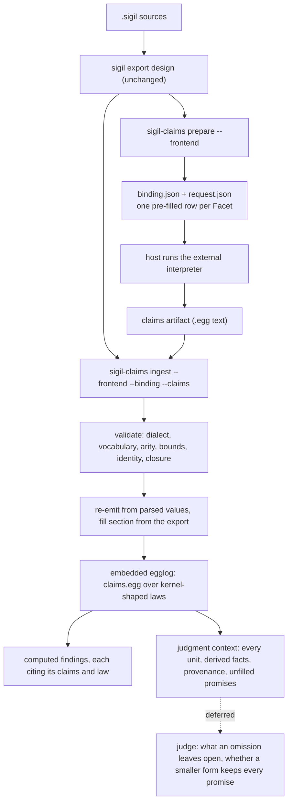
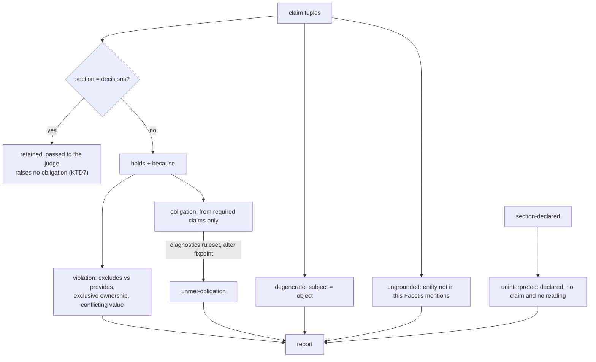

# Computed Design Validation - Plan

## Goal Capsule

- **Objective:** Design review stops resting entirely on a model's reading. What can be decided is decided, with the claims and laws that produced each finding; what still needs judgment is handed over as a closed question over computed facts rather than left as an open reading of prose; and an interpretation that left part of a design untouched says so, naming the section and component.
- **Means:** A second binary in the `sigilc` crate that projects designs out of the existing export, has an external model interpret them into Datalog claims, and saturates the result with the embedded egglog already compiled into that crate (KTD1).
- **Product authority:** Additive. No existing command, ingest path, or stored projection changes behavior, and the existing advisory reviewer keeps operating unchanged. `packages/eqval` is outside this plan.
- **Execution profile:** Contracts before code — `CONTRIBUTING.md` requires every `.sigil` change to be proposed and approved before it is written, so U1 gates the rest.
- **Open blockers:** None. One product-level question about how a rationale-only Facet interacts with the uninterpreted-section rule is recorded under the Planning Contract's Open Questions; it does not block the units below.
- **Who finishes:** `ce-work` or a human implementer; release-archive and installer wiring is deferred to follow-up (KTD9).

**Product Contract preservation:** changed: R1 — the work now lands as a second binary inside the `sigilc` crate rather than as a standalone package, chosen this session against the cost a separate crate carries (KTD1). Every other requirement is unchanged in meaning, and all R-IDs are stable.

---

## Product Contract

### Summary

A second binary in the `sigilc` crate reads a design through the existing export, has an external model interpret its Facets into Datalog claims that carry the section they came from, and saturates those claims with embedded egglog. Contradictions, ownership conflicts, and unmet obligations come back as computed findings a reader can check. The findings that still need judgment — what an omission leaves open, whether a smaller formulation keeps every promise — are packaged as closed questions over derived facts, ready for a judge that this work does not build.

### Problem Frame

Design review in this project is a model reading a design and reporting what it thinks. The `sigil-evaluate` skill is explicit about it — read-only, advisory, "neither a compiler nor network access is a prerequisite" ([integrations/skills/sigil-evaluate/SKILL.md](integrations/skills/sigil-evaluate/SKILL.md)). Its judgments cannot be replayed, cannot be diffed between runs, and offer a reader no way to check the reasoning short of forming their own opinion. That is a weak foundation for a language whose premise is that a design *computes*.

The compiler already demonstrates the alternative on a narrower question. It saturates asserted facts against fixed laws and derives violations, unmet obligations, and reachability with the fact identity that produced each one ([packages/sigilc/src/kernel.egg](packages/sigilc/src/kernel.egg)). What it does not have is a route from a Facet's prose to the claims those laws consume — which is exactly the step a model is good at and a parser is not.

Two things stand in the way of putting them together, and both are visible in the current pipeline. The compiler's fact vocabulary is RDF-shaped, so one contract claim scatters across five triples and `relation` becomes a string naming a predicate — a binary format apologizing for the absence of n-ary relations. And the section keyword, which is the natural denominator for whether an interpretation covered a design, reaches the fact stream and is then discarded: `section` is declared in `TEXT_PREDICATES` at [packages/sigilc/src/turtle.rs:55](packages/sigilc/src/turtle.rs#L55) but appears in none of the three `.egg` files, so a Goal Facet and a Cases Facet are indistinguishable to every law.

### Key Decisions

- **A second binary in the `sigilc` crate, with the compiler's behavior untouched.** The compiler's ingest, its Turtle boundary, its stored projections, and the `sigil export design` command all stay as they are. *(session-settled: user-directed — chosen over a standalone crate: without a Cargo workspace a separate crate rebuilds the git-pinned egglog dependency from scratch on all five native release runners and would have to duplicate the export deserializer.)* Governs R1, R2, R3.
- **A model interprets; egglog judges.** Meaning still enters through a model, because prose is what a model reads well. What changes is that the verdict is computed from the model's claims rather than asserted by the model. *(session-settled: user-directed — chosen over a purely mechanical structural extraction, and over a mechanical-first phased build: structural facts alone cannot reach what design review is for.)* Governs R4, R8, R17.
- **Rust with egglog embedded, reading through the existing export.** Saturation runs in-process the way the compiler's does, and the export already carries every source file's full text, so the work needs no `.sigil` reader of its own. *(session-settled: user-directed — chosen over TypeScript on the shared core and over a WASM egglog build.)* Governs R2.
- **Section is a column the tool fills, not a property the interpreter asserts.** Only the export knows which section a Facet came from, so asking the model to restate it invites the drift the column exists to catch. Governs R9, R15.
- **The computed pass feeds the judgment pass rather than competing with it.** Missing-detail and simplification findings need judgment about what is not written, which no law produces; what the computation removes is the work of deriving context the judge would otherwise reconstruct from prose. *(session-settled: user-directed — chosen over treating the two tools as permanently separate, and over aiming to supersede the judge: the point is to spend fewer tokens and less time on judgment, not to eliminate it.)* Governs R17, R20, R21, R22, R23.
- **`sigil-understand` is the interpreter's authority, and judgment is not built here.** The bundle already carries the interpretation boundary, the normative reference, and the grammar, and it is maintained in this repository, so restating them would create a second language authority to drift. The work stops at the context; deciding findings from it comes later. *(session-settled: user-directed — chosen over authoring interpreter guidance fresh, and over building the judgment pass in the same change.)* Governs R5, R5a, R5b, R20, R24.
- **The judge still sees every unit.** Computed context is attached to the whole design rather than used to shrink what is reviewed, so a defect in a unit whose obligations all happen to be filled is still reachable. *(session-settled: user-directed — chosen over showing the judge only what the computation flagged, and over a summarized middle tier: recall matters more than the extra saving.)* Governs R21, R23. Rejection stays compiled, and guidance loads only from the operator's installation, so a repository cannot steer the verdict its own design receives. *(session-settled: user-directed — chosen over project-local author-tunable guidance: compile outcomes stay pinned to an artifact version.)* Governs R6, R7.

### Actors

- A1. **Design author** — writes `.sigil` sources and reads the findings, including the ones saying part of their design went uninterpreted.
- A2. **External interpreter** — the model that reads Facet prose and returns Datalog claims. It never mints identity and never supplies laws.
- A3. **The tool** — prepares the interpreter's input, validates what comes back, saturates it, and reports.
- A4. **The existing advisory reviewer** — `sigil-evaluate`, unchanged by this work and the intended consumer of the judgment context. Wiring it up is later work.

### Requirements

**Tool boundary**

- R1. The work lands as a second binary and its own modules inside `packages/sigilc`; no existing command, ingest path, or stored projection changes behavior, and the export command and the compiler's Turtle ingest are untouched.
- R2. The tool obtains both structure and full source text from the existing design export, adding no reader for `.sigil` of its own.
- R3. The tool owns its own fact store and reports, and never writes into the compiler's world cache or any state the compiler owns.

**Interpretation input**

- R4. The interpreter receives each Facet's prose together with the section its unit belongs to, drawn from the export rather than inferred.
- R5. The interpreter's language authority is the in-repo `sigil-understand` bundle — its interpretation boundary, normative reference, grammar, and configuration schema — rather than language rules restated by this tool. The two are maintained and released together, so the tool interprets against a known bundle version rather than discovering one.
- R5a. The prepared input names each of the seven section roles and what a claim derived from that section is expected to be about, drawn from the contract roles the bundle defines.
- R5b. The interpreter asserts only authored commitments. Supported deductions are left for the laws to derive, and unresolved intent is reported as unresolved rather than asserted as fact.
- R5c. The guidance publishes the fact vocabulary: every relation name, how many columns it takes, and what each column means.
- R5d. The guidance carries a worked example for each of the seven sections: a real Facet and the exact claims it should yield.
- R5e. The guidance carries rejected examples with the reason each fails — a claim pointing at itself, a claim the interpreter deduced rather than read, and a claim naming an entity that does not exist.
- R5f. Preparation emits one pre-filled row per Facet, already carrying that Facet's identity. The interpreter completes the remaining columns and adds rows only where a Facet yields more than one claim.
- R6. Guidance — vocabulary description, section roles, worked examples, correction hints — is compiled into the binary and released alongside it, and can be written out to an operator-named path for editing. Guidance discovered in the workspace under validation is refused. The test is provenance, not location: guidance released with the binary is trusted wherever it is installed.
- R7. No file outside the compiled binary can widen what the tool accepts; extracted guidance affects only what the interpreter is told.

**Returned facts**

- R8. Claims come back as Datalog atoms in a data-only dialect. An artifact containing a rule, command, schedule, or non-literal argument is rejected whole, not partially accepted.
- R9. Every interpreted claim carries its section as a first-class column, filled by the tool from the Facet identity rather than by anything the interpreter asserts.
- R10. A fact whose relation name, arity, or column value falls outside the published vocabulary is rejected with a message naming the offending atom.
- R11. The vocabulary carries the full fact set the laws consume — entity declarations and labels, the entity predicates, and the boolean and numeric properties — with the section column on interpreted claims only.
- R12. The tool bounds the returned artifact's byte size before parsing it, and its atom count before any fact is validated.
- R13. Entity identities are minted deterministically by the tool; interpreter-declared Component or Tag identities are rejected, as are facts naming an entity outside the design's resolved import closure.
- R14. The tool re-emits every accepted fact into the program it evaluates from its own parsed values; the interpreter's returned text is never evaluated directly.

**Judgment**

- R15. When a section that declares at least one Facet yields no claim, the finding names that section and its component, and attributes the gap to the interpretation rather than to the design.
- R16. A claim whose subject and object are the same entity is reported as degenerate and does not satisfy its unit.
- R16a. Every entity a claim names occurs in the Facet the claim derives from, or is reachable from that Facet through its Tags or imports. A claim naming entities absent from its source is reported as ungrounded and does not satisfy its unit.
- R16b. The tool can interpret the same design more than once and report the claims the runs disagree on, so a Facet whose reading is unstable is visible. This is available rather than always on, because it costs a full extra interpretation.
- R17. The tool decides the three finding classes that follow from facts — contradictions, ownership conflicts, and unmet obligations — and reports them without consulting a model.
- R18. Every finding cites the claims and the law that produced it, so a reader can check the judgment instead of trusting it.
- R19. Re-running the tool on an unchanged design and an unchanged interpretation produces an identical computed report. This binds the computed findings; judgment output is not claimed to be reproducible.

**Judgment handoff**

- R20. The tool emits a judgment context carrying, for every unit, its derived facts, its obligation state, and the provenance of each derived conclusion, so a judge reads conclusions instead of re-deriving them from prose. The tool does not judge.
- R21. The judgment context covers every unit in the design. No unit is omitted because the computation found nothing about it.
- R22. For each unfilled obligation, the context names the promise that raised it and where that promise is stated, so a missing-detail question is posed over a named promise and a named gap.
- R23. The tool proposes simplification candidates — claims whose facts subsume another's, and duplicate propositions across units — and does not rule on them.
- R24. The judgment context is shaped for `sigil-evaluate` to consume: every fact its admission rules require for a missing-detail or simplification finding is present, so a consumer needs no access to the design sources beyond the prose the context carries.

### Key Flows

- F1. Validate a design
  - **Trigger:** A1 asks the tool to validate a workspace.
  - **Actors:** A1, A2, A3
  - **Steps:** A3 reads the export and mints identities; A3 prepares each source's Facet prose with its section roles; A2 returns Datalog claims; A3 validates them, re-emits them, and saturates; A3 reports findings and any section left uninterpreted.
  - **Outcome:** A report a reader can check, or a named gap in the interpretation.
  - **Covered by:** R2, R4, R8, R9, R10, R12, R13, R14, R15, R18

### Acceptance Examples

- AE1. Degenerate claim does not satisfy its unit
  - **Covers R16.**
  - **Given** a component with one Facet in its `goal` section.
  - **When** the interpreter returns a claim whose subject and object are that same component.
  - **Then** the claim is reported as degenerate and the unit counts as unsatisfied.
- AE2. Skipped section is named
  - **Covers R15.**
  - **Given** a component declaring Facets in `goal`, `interface`, and `logic`.
  - **When** the interpreter returns claims for `goal` and `interface` only.
  - **Then** the report names `logic` on that component and attributes the gap to the interpretation.
- AE3. Empty section is not a gap
  - **Covers R15.**
  - **Given** a component whose `cases` section is declared but contains no Facet.
  - **When** the interpreter returns no claim for `cases`.
  - **Then** nothing is reported against that section.
- AE4. Returned laws are refused
  - **Covers R8.**
  - **Given** a prepared design.
  - **When** the interpreter returns a file containing a rule or ruleset declaration alongside valid claims.
  - **Then** the whole artifact is rejected rather than the data portion accepted.
- AE5. Imported entities are claimable
  - **Covers R13.**
  - **Given** a design importing a Tag from another source in its closure.
  - **When** the interpreter returns a claim relating a local Facet to that imported Tag.
  - **Then** the claim is accepted.

### Success Criteria

- A finding the advisory reviewer states as an opinion is instead produced with the claims and law behind it, and a reader can follow that chain without forming their own judgment of the design.
- An interpretation that leaves a declared section untouched is visible as such, naming the section and component, rather than passing silently.
- The same design and the same interpretation produce the same report on every run.
- Running the tool leaves the compiler's behavior, its stored projections, and the export command unchanged.
- The judgment context is self-sufficient against the advisory reviewer's own admission rules: for a missing-detail finding it already carries the promise that makes the omission relevant and where that promise is stated, and for a simplification finding the candidate and the promises each formulation holds.

### Scope Boundaries

- `packages/eqval` is excluded and no requirement here touches it.
- Running the judgment pass is out of scope. This work produces the context; deciding missing-detail and simplification findings from it is not part of it.
- Rewiring `sigil-evaluate` to consume the context is out of scope. It keeps operating unchanged, and the context is shaped so that wiring is possible later without revisiting the format.
- Restating Sigil's language rules inside this tool is out of scope; the `sigil-understand` bundle is the authority (R5).
- Changing the compiler's Turtle boundary, its ingest, its stored projections, or the export command is out of scope — that was the previous shape of this work and is deliberately set aside.
- Building a Rust reader for `.sigil` is out of scope; the tool consumes the existing export.
- Redesigning the seven contracts, the class list, or the entity-predicate vocabulary is out of scope.
- Verifying that a claim is *true* of its Facet is out of reach. The checks reach coverage, self-reference, and grounding — whether the entities a claim names are even present in the text it came from — but a claim relating two entities that do both appear, in a relationship the Facet does not state, is not mechanically detectable. This raises the floor; it does not verify meaning.

### Deferred to Follow-Up Work

- Release-archive and installer wiring for the new binary (KTD9).
- Wiring `sigil-evaluate` to consume the judgment context.
- The judgment pass itself.

### Dependencies / Assumptions

- The design export carries every source file's full text, so the tool can hand the interpreter real prose without a reader. Verified against the preparation code at [packages/sigilc/src/inputs.rs:96-110](packages/sigilc/src/inputs.rs#L96-L110), where `target` and `dependencies` are whole source records. Facet prose is not itself a field — `Unit` carries `prose_range`, so the tool slices `sources[].text` by that range.
- The interpreter is assumed to return a constrained S-expression dialect at least as reliably as it returns RDF today. No measurement of that exists in the repo.
- The tool depends on the export command continuing to exist. That is a stronger dependency than it looks, since the previous shape of this work proposed deleting it.
- Findings are only as good as the interpretation beneath them. Computing the verdict removes the model from judgment, not from meaning.
- A Rust 1.91.1 toolchain is required and is not currently on PATH in the authoring environment; CI installs it explicitly.

### Outstanding Questions

None block implementation. The five questions the Product Contract deferred to planning are resolved in the Planning Contract: claim arity by KTD4, law reuse by KTD5, vocabulary coupling and guidance versioning by KTD3, and required-versus-optional sections by the resolution recorded under Assumptions.

---

## Planning Contract

### Key Technical Decisions

- KTD1. **Second binary in the `sigilc` crate, not a standalone crate.** New modules under `packages/sigilc/src/claims/` and a new bin target at `packages/sigilc/src/bin/sigil-claims.rs`, which Cargo discovers without touching `Cargo.toml` or the existing `src/main.rs`. *(session-settled: user-directed — chosen over a standalone crate with its own manifest and lockfile: the repo has no Cargo workspace, so a separate crate rebuilds the git-pinned egglog dependency and its sub-crates from scratch on each of the five native release runners, and would have to duplicate the export deserializer in `frontend.rs`.)* Instantiates R1; the crate's existing commands keep their behavior, and `cargo fmt`, `cargo clippy --all-targets`, and `deno task test:sigilc` cover the new bin with no CI changes. Leaving `Cargo.toml` untouched is a hard requirement rather than a convenience — see KTD8.
- KTD2. **Two commands mirroring the compiler's `prepare`/`ingest` boundary; the host performs the model call.** `prepare` writes a directory with an immutable binding; the host runs the interpreter; `ingest` takes the export, that binding, and the returned artifact. Not an open choice — [packages/sigilc/src/cli.rs](packages/sigilc/src/cli.rs) opens "The deterministic command boundary. No process launchers or model options," and the boundary table in [CONTRIBUTING.md](CONTRIBUTING.md) says of `packages/sigilc/`: "Rust; no model runtime." Making the interpretation a re-passable input is also what buys R19 its reproducibility. Governs R19.
- KTD3. **Guidance is compiled in with `include_str!`, folded into a run fingerprint, and extractable on request.** An `extract-guidance --out DIR` command writes an editable copy to an operator-named path. *(session-settled: user-directed — chosen over real files resolved from `current_exe()` against a digest manifest: the installers require a reinstall of the same version to be byte-identical, so editable files inside the install root break reinstalls, and the closed-directory manifest validator exists only in TypeScript.)* This makes R7 true by construction — nothing on disk is read — and it resolves vocabulary coupling and guidance versioning together, because one fingerprint covers the guidance text, the vocabulary constants, and `claims.egg`. Governs R6, R7.
- KTD4. **Section is a tool-filled column in the evaluated tuple; the returned artifact never carries one.** A returned row identifies its Facet and nothing else about provenance; the tool looks the section up from the export's `Unit` record and writes it into the tuple it evaluates. This resolves the Product Contract's deferred claim-arity question: section arrives as a lookup on the unit, not as a returned column the tool overwrites, so there is no drift to reconcile. Governs R5f, R9, R15.
- KTD5. **Fresh n-ary section-aware relations; the law *shapes* are ported from the existing `.egg` files, which are not reused verbatim.** `kernel.egg` and `design.egg` stay untouched and keep serving the compiler. The obligation, filled, and unresolved pattern, the two-ruleset fixpoint, and the `because` provenance column are reproduced against n-ary claim tuples. The Problem Frame names the RDF shape as one of the two obstacles, so reusing those five relations would carry the defect forward. This came close to a Bake-off and did not qualify: both alternatives are fully readable in the existing `.egg` files, so choosing needed judgment rather than development. Governs R11, R17.
- KTD6. **Grounding reads the export's resolved records, not re-matched Tag names.** A Facet's grounding set is its own resolved `references` and `introductions`, plus its owning component from `Unit.owner`, plus the provider components reachable through the source's `Import.provider_id`. The component sources matter because `Reference` and `Introduction` describe Tags only — both carry `tag: Option<String>` and neither ever names a Component — so a grounding set built from them alone would report almost every claim ungrounded, including AE1's component-to-component claim. Two limits are worth stating in the report: an unresolved or ambiguous Tag reference is not grounding evidence, and the check is per-Facet, so it is narrower than R13's closure admission rather than a restatement of it. This redirects the Product Contract's research pointer at [packages/core/src/tag-matching.ts](packages/core/src/tag-matching.ts), which solves the harder problem the export has already solved. Governs R16a.
- KTD7. **Claims derived from `decisions` do not populate the saturated relation.** They are retained, reported, and passed to the judge, but they raise no obligation and satisfy none. The language authority is explicit that "Rationale does not convert a rejected alternative or unaccepted proposal into a commitment" ([integrations/skills/sigil-understand/references/understanding.md](integrations/skills/sigil-understand/references/understanding.md)). This is the payoff of making section first-class, and it is the first law the compiler could not express. Whether `cases` deserves the same treatment is an open question below. Governs R5b, R17.
- KTD8. **Reuse the crate's existing validation machinery, and do not edit the files its runtime identity hashes.** The data-only dialect check in [packages/sigilc/src/assertions.rs:49-90](packages/sigilc/src/assertions.rs#L49-L90), the pre-parse byte and row bounds in [packages/sigilc/src/turtle.rs:86-97](packages/sigilc/src/turtle.rs#L86-L97), the deterministic identity minting in [packages/sigilc/src/catalog.rs](packages/sigilc/src/catalog.rs), and the re-emit-then-saturate loop in [packages/sigilc/src/eqval.rs:104-142](packages/sigilc/src/eqval.rs#L104-L142) each already implement a requirement here. Being in the same crate makes this direct reuse rather than duplication — but it also means `turtle.rs`, `assertions.rs`, `eqval.rs`, `comparison.rs`, `Cargo.toml`, and `Cargo.lock` must not be edited: `eqval::fingerprint()` hashes their full text, and [packages/sigilc/src/comparison.rs:54-58](packages/sigilc/src/comparison.rs#L54-L58) refuses any comparison whose stored fingerprint differs, so touching one invalidates every stored world in every existing workspace. The predicate tables the vocabulary needs are reachable without editing anything: `turtle::vocabulary()` and `turtle::ENTITY_PREDICATES` are already public, while `TEXT_PREDICATES`, `BOOLEAN_PREDICATES`, and `NUMBER_PREDICATES` are private and must be read through `vocabulary()`. Governs R8, R10, R12, R13, R14.
- KTD9. **Release-archive and installer wiring is deferred.** [PRE_RELEASE.md](PRE_RELEASE.md) requires matching-runner evidence on all five targets and names "both binaries," and shipping a third one touches the build script, the relocation test, the hostile-environment consumer, both installers, and the release smoke step. CI's format, lint, and test gates already cover the new bin at no cost, so the active plan stops at a locally built, fully tested binary. The cost is that the first release attempt after this work is the first moment any archive or installer breakage becomes visible.

### High-Level Technical Design

The command boundary, which mirrors the compiler's existing `prepare`/`ingest` split:



The fact vocabulary, as a directional grammar sketch. The tool mints every identity and fills the Section column; the interpreter supplies the rest.

```text
; minted by the tool from the export — the interpreter never returns these
(facet          FacetId Component Section Source)
(section-declared        Component Section)        ; declares >= 1 Facet
(entity         EntityId Kind Label Owner Source)  ; Kind = Component | Tag
(mentions       FacetId EntityId)                  ; references + introductions
                                                   ; + Unit.owner + Import.provider_id
(visible        Source EntityId)                   ; resolved import closure

; returned by the interpreter — facet id only, no section, no claim id
(claim          FacetId  Subject Relation Object Modality Expected)
(property       FacetId  Subject Property Value)
(measure        FacetId  Subject Property Number)
(reading        FacetId  Outcome)                  ; Outcome = no-commitment | unresolved

; what the tool actually evaluates — ClaimId minted, Section looked up
(claim          ClaimId FacetId Section Subject Relation Object Modality Expected)

; derived
(holds          Subject Relation Object)
(because        ClaimId Subject Relation Object Law)
```

`Relation` is closed over the twenty names in `ENTITY_PREDICATES`, read through the public `turtle::vocabulary()`. `Property` is closed over the four boolean and four numeric names in that same map. `Modality` is `required`, `permitted`, or `assumed`: `design.egg` raises its obligations from a boolean attached to the *proposition* rather than to an entity, so without this column the `property` relation — whose subject is an entity — cannot reach it, and the obligation trio KTD5 promises cannot be reproduced. `reading` is how the interpreter records that it read a Facet and found no authored commitment, or that the intent is unresolved, which is what R5b asks for.

How a finding reaches a reader, and where the section column changes the answer:



### Output Structure

```text
packages/sigilc/
  claims.sigil                        # new contract, approved before written (U1)
  src/
    lib.rs                            # + pub mod claims (U2)
    bin/sigil-claims.rs               # new bin target (U9), no Cargo.toml change
    claims/
      mod.rs                          # created in U2, extended per unit
      guidance.rs                     # include_str! bundle, fingerprint, extract
      guidance/                       # the compiled-in guidance text
        vocabulary.md
        sections.md
        examples.md
        rejected.md
      prepare.rs                      # export projection, prose slicing, request rows
      vocabulary.rs                   # relation names, arity, column meanings
      dialect.rs                      # data-only reader for the returned artifact
      identity.rs                     # claim ids, entity admission, grounding sets
      program.rs                      # fact emission + saturation
      claims.egg                      # section-aware laws
      findings.rs                     # computed findings with provenance
      context.rs                      # judgment context
  tests/
    claims_guidance.rs
    claims_prepare.rs
    claims_dialect.rs
    claims_laws.rs
    claims_findings.rs
    claims_context.rs
    claims_cli.rs
```

### Assumptions

- **Required and optional sections get the same standard.** `goal` and `interface` are required and the other five are optional ([spec/sigil-reference.md:282-288](spec/sigil-reference.md#L282-L288)), but R15 already keys on whether a section declares a Facet, which is the property that matters. No law distinguishes them, and nothing in the Product Contract depends on the distinction. This resolves the Product Contract's deferred question rather than leaving it open.
- The returned artifact is a file on disk or stdin, following the compiler's `--turtle FILE|-` convention.
- The tool's store and reports live under `.sigil/claims/`, a sibling of the compiler's `.sigil/worlds/` that the tool owns outright (R3).
- R13 and AE5 admit entities at source granularity, because `scope::design_membership` returns a set of source paths while imports select individual names. A claim naming a Tag that lives in a closure source but was never imported by name is therefore accepted. This is the looser reading and it is deliberate; the per-Facet grounding check in R16a is what narrows it.

### Open Questions

- **Does a rationale-only Facet count as interpreted?** R15 reports a gap when a section declaring a Facet "yields no claim," while R5b forbids the interpreter from asserting anything it did not read as a commitment — and the language authority defines `decisions` as rationale that does not become one. The `reading` row above lets the interpreter say "I read this and found no commitment," and the units below treat a Facet with a `reading` row as interpreted. That is an implementation reading of R15, not a change to it. If you would rather R15 fire on a rationale-only Facet, say so and U6's rule flips; deciding this does not block any unit.

### Sequencing

U1 gates everything: `CONTRIBUTING.md`'s PR checklist requires that "any `.sigil` change was proposed and approved before it was written," and every Rust module added here needs an `@sigil implements` annotation pointing at a contract that exists. U2 through U4 then form a chain — U3 consumes U2's guidance fingerprint, and U4 consumes U3's binding — and U2 also carries the module wiring every later unit needs to compile. U5 depends on U4's validated facts. U6 and U7 both depend on U5. U8 and U9 come last.

---

## Implementation Units

### U1. Sigil contracts for the claims component

- **Goal:** Author and get approval for the `.sigil` contracts that govern the new modules, so every later unit can carry a valid ownership annotation.
- **Requirements:** R1; enables the annotation gate in `CONTRIBUTING.md`.
- **Dependencies:** none.
- **Files:** `packages/sigilc/claims.sigil`
- **Approach:**
  1. Declare one component covering the claims pipeline, following the one-component-per-module convention the crate's eight existing `.sigil` files use.
  2. Give it `goal` and `interface` sections at minimum, plus `constraints` for the rules the later units must not violate: no writes to the compiler's world cache, no model invocation, no guidance read from disk, and no edit to the files `eqval::fingerprint()` hashes (KTD8).
  3. Propose the file and get approval before writing it; this is a repo gate, not a style preference.
- **Execution note:** This unit is approval-gated. Do not begin U2 until the contract is approved, since every Rust file added after it must cite a contract that exists.
- **Patterns to follow:** [packages/sigilc/turtle.sigil](packages/sigilc/turtle.sigil) and [packages/sigilc/eqval.sigil](packages/sigilc/eqval.sigil) for component shape; the annotation form is `// @sigil implements packages/sigilc/<file>.sigil::<Component>::<Tag> interface`.
- **Test scenarios:** Test expectation: none — this unit adds a design contract, not behavior. Its proof is that `build/sigil check .` reports no diagnostics for the new file. No configuration change is needed: `.sigil/config.json` already lists `packages/sigilc` as a workspace member and includes `**/*.sigil`, so the contract is picked up as soon as it exists.
- **Verification:** The contract is approved, `build/sigil check .` is clean, and it names the Tags the later units' annotations will reference.

### U2. Guidance bundle, fingerprint, extraction, and module wiring

- **Goal:** Ship the interpreter's guidance inside the binary, make a run's identity depend on it, let an operator write an editable copy out, and establish the module the later units extend.
- **Requirements:** R5, R5a, R5b, R5c, R5d, R5e, R6, R7; KTD3.
- **Dependencies:** U1.
- **Files:** `packages/sigilc/src/lib.rs`, `packages/sigilc/src/claims/mod.rs`, `packages/sigilc/src/claims/guidance.rs`, `packages/sigilc/src/claims/guidance/vocabulary.md`, `packages/sigilc/src/claims/guidance/sections.md`, `packages/sigilc/src/claims/guidance/examples.md`, `packages/sigilc/src/claims/guidance/rejected.md`, `packages/sigilc/tests/claims_guidance.rs`
- **Approach:**
  1. Create `src/claims/mod.rs` and add `pub mod claims;` to `lib.rs`. This has to happen first: Cargo ignores a `.rs` file no module declaration reaches, and every `tests/claims_*.rs` file links against the library, so without it no later unit compiles or tests. Each later unit declares its own module here as it lands.
  2. Write the four guidance files. `sections.md` names the seven roles and what a claim from each is about, drawn from the contract-role table in the `sigil-understand` bundle rather than restated independently (R5, R5a), and states the authored-commitments rule: assert only what the Facet says, leave supported deductions to the laws, and record unresolved intent or an absent commitment as a `reading` row rather than as a claim (R5b). `vocabulary.md` publishes every relation, its arity, and each column's meaning, including `Modality` and `reading` (R5c). `examples.md` carries one worked Facet per section (R5d). `rejected.md` carries the three refusal cases R5e names.
  3. Load all four with `include_str!` and expose them as one bundle.
  4. Build a fingerprint over the guidance text, the vocabulary constants, and `claims.egg`, following the `concat!(include_str!(...))` pattern already used for the compiler's runtime identity.
  5. Add an extraction path that writes the bundle to an operator-named directory, refusing to write inside the workspace under validation.
  6. Carry an `@sigil implements` annotation on every module this unit creates, naming a Tag from `packages/sigilc/claims.sigil`.
- **Patterns to follow:** [packages/sigilc/src/eqval.rs:249-259](packages/sigilc/src/eqval.rs#L249-L259) for the fingerprint shape; `include_str!("kernel.egg")` at [packages/sigilc/src/eqval.rs:91](packages/sigilc/src/eqval.rs#L91) for asset loading; [packages/sigilc/src/lib.rs](packages/sigilc/src/lib.rs) for the explicit module declaration convention.
- **Test scenarios:**
  - The bundle exposes all seven section roles, and each role name matches a `Section` enum variant exactly.
  - Each of the seven role descriptions in `sections.md` matches the contract-role table in [integrations/skills/sigil-understand/references/understanding.md](integrations/skills/sigil-understand/references/understanding.md), failing on drift in either direction — the same shape as the vocabulary drift test below, and what keeps the Scope Boundary against restating language rules enforceable.
  - Every relation named in `vocabulary.md` exists in the vocabulary constants, and every constant appears in `vocabulary.md` — drift in either direction fails.
  - `vocabulary.md` documents the `Modality` column's three values and the `reading` row's two outcomes.
  - `sections.md` states the authored-commitments rule and directs unresolved intent to a `reading` row rather than a claim.
  - Each of the three rejected examples in `rejected.md` is actually rejected by the U4 validator once it exists, so the guidance cannot promise a rule the tool does not enforce.
  - Changing one byte of any guidance file changes the fingerprint; so does changing a vocabulary constant or `claims.egg`.
  - Extraction into a fresh temp directory writes every file, and the written bytes equal the compiled bytes.
  - Extraction targeting a path inside the workspace under validation is refused with a message naming the path.
  - A guidance file placed in the workspace under validation is never read: the bundle a run uses is byte-identical with and without it present.
- **Verification:** A run's reported fingerprint changes when the guidance, the vocabulary constants, or the laws change and not otherwise; no filesystem read of guidance occurs on any path; and `cargo clippy --all-targets` compiles the new module.

### U3. Export projection and interpretation request

- **Goal:** Turn an export into a prepared directory carrying each Facet's prose, its section, an immutable binding, and one pre-filled row per Facet.
- **Requirements:** R2, R4, R5f; A1, A2, A3; F1.
- **Dependencies:** U1, U2.
- **Files:** `packages/sigilc/src/claims/prepare.rs`, `packages/sigilc/tests/claims_prepare.rs`
- **Approach:**
  1. Deserialize the export with the crate's existing `frontend::DesignInput` — same crate, so this is a direct call, not a copy.
  2. Slice each `Unit`'s prose out of the matching `Source.text` using `prose_range`; prose is not a field on the export.
  3. Resolve the design's import closure for the selected source, reusing `scope::design_membership`.
  4. Emit `binding.json` covering the export digest, the selected source, the guidance fingerprint, and the vocabulary version, so `ingest` can refuse a mismatched pair.
  5. Emit one pre-filled row per Facet carrying that Facet's identity and nothing else about provenance (KTD4), plus the guidance bundle text for the interpreter to read.
  6. Carry an `@sigil implements` annotation on the new module.
- **Patterns to follow:** [packages/sigilc/src/inputs.rs:86-112](packages/sigilc/src/inputs.rs#L86-L112) — `DesignSnapshot::preparation` is the same operation for the compiler's interpreter; `Workspace` in [packages/sigilc/tests/support/mod.rs](packages/sigilc/tests/support/mod.rs) for building test designs in temp dirs rather than fixture files.
- **Test scenarios:**
  - A component with Facets in `goal`, `interface`, and `logic` produces exactly three pre-filled rows, each naming its own Facet.
  - The prose attached to a Facet equals the exact source slice for its `prose_range`, including a Facet whose prose contains a fenced block.
  - A declared but empty section produces no row, which is what makes AE3 reachable.
  - A design importing a Tag from another source includes that source in the closure the binding records.
  - No pre-filled row carries a section value, so the interpreter has nothing to restate.
  - Preparing the same unchanged export twice produces byte-identical `binding.json`.
  - Preparing into an existing non-empty directory is refused rather than merged.
- **Verification:** A prepared directory is sufficient for an interpreter that has no access to the workspace, and its binding round-trips into `ingest`.

### U4. Returned-claims dialect, vocabulary, bounds, and identity

- **Goal:** Accept a returned artifact only when it is data-only, within bounds, inside the published vocabulary, and naming entities the design actually has.
- **Requirements:** R5b, R8, R10, R11, R12, R13, R16a; AE4, AE5.
- **Dependencies:** U1, U2, U3.
- **Files:** `packages/sigilc/src/claims/vocabulary.rs`, `packages/sigilc/src/claims/dialect.rs`, `packages/sigilc/src/claims/identity.rs`, `packages/sigilc/tests/claims_dialect.rs`
- **Approach:**
  1. Check the artifact's byte length before parsing and its atom count before validating any fact (R12) — both gates precede the work they protect.
  2. Parse with `EGraph::default().parse_program`, then reject anything that is not a call expression with literal string arguments, rejecting the whole artifact rather than the offending row (R8).
  3. Validate relation name, arity, and column values against the published vocabulary, naming the offending atom in the message (R10). The vocabulary reads `turtle::vocabulary()` and `turtle::ENTITY_PREDICATES`, both already public; do not edit `turtle.rs` to reach the private predicate tables (KTD8). `Modality` accepts `required`, `permitted`, or `assumed`; a `reading` row's outcome accepts `no-commitment` or `unresolved` (R5b, R11).
  4. Mint every claim identity as a tagged-tuple hash; reject any returned Component or Tag declaration, and any entity outside the binding's recorded import closure (R13).
  5. Build each Facet's grounding set from its resolved `references` and `introductions`, plus its owning component from `Unit.owner`, plus the provider components reachable through the source's `Import.provider_id`. Mark a claim ungrounded when it names an entity outside that set (R16a, KTD6). The component sources are what make AE1's component-to-component claim reach the degenerate check instead of being rejected as ungrounded first.
  6. Carry an `@sigil implements` annotation on every module this unit creates.
- **Patterns to follow:** [packages/sigilc/src/assertions.rs:49-90](packages/sigilc/src/assertions.rs#L49-L90) for the data-only reader, down to the message "world files contain assertion data only, never commands or rules"; [packages/sigilc/src/turtle.rs:86-97](packages/sigilc/src/turtle.rs#L86-L97) for pre-parse limits; `domain_id()` in [packages/sigilc/src/catalog.rs](packages/sigilc/src/catalog.rs) for identity minting.
- **Test scenarios:**
  - Covers AE4. An artifact containing a valid claim and a `(rule ...)` declaration is rejected whole, and no claim from it reaches the program.
  - An artifact containing a command, a schedule, or a non-literal argument is likewise rejected whole.
  - Covers AE5. A claim relating a local Facet to a Tag imported from a source in the closure is accepted.
  - Covers AE1. A claim whose subject and object are the Facet's own owning component is accepted as grounded, so it reaches the degenerate check rather than being rejected as ungrounded.
  - A claim naming an entity outside the import closure is rejected with a message naming the entity.
  - A returned Component or Tag declaration is rejected, since the frontend reserves those identities.
  - A claim with a known relation but the wrong column count is rejected with the offending atom in the message.
  - A claim with an unknown relation name, or an unknown `Modality` value, is rejected with the offending atom in the message.
  - A `reading` row with outcome `unresolved` is accepted and retained, and contributes no claim.
  - An artifact one byte over the limit is rejected before parsing; an artifact one atom over the limit is rejected before any fact is validated.
  - A claim naming an entity that is neither in its Facet's resolved references and introductions, nor its owning component, nor a provider component of its source, is marked ungrounded.
  - A claim whose named Tag reference is `Ambiguous` in the export is treated as absent from the grounding set, per KTD6's stated limit.
  - `turtle.rs`, `assertions.rs`, `eqval.rs`, `comparison.rs`, `Cargo.toml`, and `Cargo.lock` are unchanged, so `eqval::fingerprint()` returns the value it returned before this unit.
- **Verification:** Every rejected example in the U2 guidance is rejected by this validator, with a message that names the offending atom, and the compiler's runtime fingerprint is unchanged.

### U5. Fact emission and section-aware laws

- **Goal:** Re-emit validated facts into a program the tool authors, fill the section column from the export, and saturate against laws that can tell the seven contracts apart.
- **Requirements:** R9, R14, R17; KTD4, KTD5, KTD7.
- **Dependencies:** U4.
- **Files:** `packages/sigilc/src/claims/program.rs`, `packages/sigilc/src/claims/claims.egg`, `packages/sigilc/tests/claims_laws.rs`
- **Approach:**
  1. Emit the tool-minted structural facts first — `facet`, `section-declared`, `entity`, `mentions`, `visible` — from the export.
  2. Re-emit every accepted claim from parsed values, looking the section up from the Facet's `Unit` record and writing it into the evaluated tuple (R9, R14). The returned text is never evaluated.
  3. Author `claims.egg` with two rulesets. `closure` derives `holds`, `because`, reachability, delegation, the three violation classes, and obligations — raising an obligation only from a claim whose `Modality` is `required`, and an assumption obligation from `assumed`, which is how `design.egg` distinguishes them. `diagnostics` runs only after fixpoint and reads absence.
  4. Gate `holds` on section: a claim whose section is `decisions` is retained and reported but contributes nothing to the saturated relation (KTD7).
  5. Carry the claim identity and the law name on every derived conclusion, so U6 can cite both.
  6. Carry an `@sigil implements` annotation on the new module.
- **Technical design:** directional only — the obligation trio follows `design.egg`'s shape, with the claim tuple replacing the five RDF relations.

  ```text
  (rule ((claim id f sec s p o mod "true") (!= sec "decisions"))
        ((holds s p o) (because id s p o "asserted")) :ruleset closure)
  (rule ((claim id f sec s p o "required" "true") (!= sec "decisions"))
        ((obligation id s p o) (set (filled id s p o) 0)) :ruleset closure)
  (rule ((obligation id s p o) (holds s p o))
        ((set (filled id s p o) 1)) :ruleset closure)
  (rule ((obligation id s p o) (= (filled id s p o) 0))
        ((unmet-obligation id s p o)) :ruleset diagnostics)
  ```
- **Patterns to follow:** [packages/sigilc/src/eqval.rs:104-142](packages/sigilc/src/eqval.rs#L104-L142) for row-by-row program construction and `quote()`; [packages/sigilc/src/design.egg](packages/sigilc/src/design.egg) for the obligation, filled, and unresolved trio and the comment "Absence is inspected only after the complete closure, never while it grows"; [packages/sigilc/src/eqval.rs:180-202](packages/sigilc/src/eqval.rs#L180-L202) for the two-ruleset fixpoint loop.
- **Test scenarios:**
  - A claim returned for a `goal` Facet carries `goal` in the evaluated tuple, taken from the export, with no section in the returned artifact.
  - Two claims asserting a relation and its negation between the same entities produce a contradiction naming both claim identities.
  - Two components claiming to own the same Tag, where that Tag is marked exclusive, produce an ownership conflict naming both.
  - A `required` claim relating a component to a capability nothing provides produces an unmet obligation; the same claim marked `permitted` produces none.
  - A `required` claim satisfied through a dependency's `provides` produces no unmet obligation, proving delegation still reaches.
  - A claim in a `decisions` section naming a rejected alternative produces no obligation and no violation, and is still present in the fact store.
  - The same claim text in a `constraints` section does produce its obligation, proving the section gate is what differs.
  - Unmet obligations are empty during closure and populated only after fixpoint, so a partially grown closure never reports absence.
  - `kernel.egg` and `design.egg` are unchanged, and the compiler's own design tests still pass.
- **Verification:** Saturation reaches fixpoint within the configured iteration and time limits on a multi-source design, and every derived row carries a claim identity and a law name.

### U6. Computed findings and deterministic report

- **Goal:** Turn derived rows into findings a reader can check, including the sections an interpretation skipped, and make the report reproducible.
- **Requirements:** R15, R16, R17, R18, R19, R3; AE1, AE2, AE3.
- **Dependencies:** U5.
- **Files:** `packages/sigilc/src/claims/findings.rs`, `packages/sigilc/tests/claims_findings.rs`
- **Approach:**
  1. Emit one finding per derived violation, unmet obligation, degenerate claim, ungrounded claim, and uninterpreted section.
  2. Attach the claims and the law name to each finding (R18), reusing the `because` column convention.
  3. Report a section as uninterpreted when it declares at least one Facet and that Facet yielded neither a claim nor a `reading` row, naming the section and its component and attributing the gap to the interpretation (R15). A Facet the interpreter read and recorded a `reading` row for is interpreted; see the Open Question above.
  4. Sort rows deterministically and pin the report to the export digest, every supplied interpretation artifact's digest, and the guidance fingerprint (R19).
  5. Write the report under `.sigil/claims/`, never into `.sigil/worlds/` (R3).
  6. Carry an `@sigil implements` annotation on the new module.
- **Test scenarios:**
  - Covers AE1. A claim whose subject and object are the same component is reported as degenerate, and its unit counts as unsatisfied.
  - Covers AE2. A component declaring `goal`, `interface`, and `logic`, interpreted with claims for only the first two, produces a finding naming `logic` and that component, attributed to the interpretation.
  - Covers AE3. A component whose `cases` section is declared but empty produces no finding.
  - A Facet that yielded only a `reading` row produces no uninterpreted-section finding; a Facet that yielded nothing at all does.
  - Every finding names at least one claim identity and exactly one law.
  - Running twice on an unchanged export and an unchanged artifact produces byte-identical reports.
  - Changing only the guidance fingerprint changes the report's recorded identity, so a stale report is detectable.
  - A run leaves `.sigil/worlds/` untouched, verified by comparing the directory before and after.
  - A design that produces no findings still emits a report recording what was checked.
- **Verification:** A reader can follow a finding to its claims and its law without reading the design, and two runs of the same inputs diff clean.

### U7. Judgment context for the advisory reviewer

- **Goal:** Emit a per-unit context carrying derived facts, obligation state, provenance, and simplification candidates, shaped so `sigil-evaluate` needs nothing else.
- **Requirements:** R20, R21, R22, R23, R24.
- **Dependencies:** U5.
- **Files:** `packages/sigilc/src/claims/context.rs`, `packages/sigilc/tests/claims_context.rs`
- **Approach:**
  1. Emit one entry per unit in the design, including units the computation found nothing about (R21).
  2. Carry each unit's derived facts, its obligation state, and the provenance of each derived conclusion (R20).
  3. For each unfilled obligation, name the promise that raised it and where that promise is stated (R22). That is the first of the advisory reviewer's three missing-detail admission elements and the only one that is a fact rather than a judgment; the other two — which consequential human-owned behaviors the omission leaves open, and why implementation cannot safely choose among them — are the deferred judge's work, not this tool's.
  4. Propose simplification candidates — claims whose facts subsume another's, and duplicate propositions across units — without ruling on them (R23).
  5. Carry the Facet prose each entry refers to, so a consumer needs no access to the sources (R24).
  6. Carry an `@sigil implements` annotation on the new module.
- **Patterns to follow:** the missing-detail admission elements at [integrations/skills/sigil-evaluate/references/design-review.md:33-39](integrations/skills/sigil-evaluate/references/design-review.md#L33-L39); the request and report field meanings in [integrations/skills/sigil-evaluate/references/review-contract.md](integrations/skills/sigil-evaluate/references/review-contract.md), where field meaning is mandatory and serialization is not.
- **Test scenarios:**
  - A design with five units produces five context entries, including a unit with no claims at all.
  - An unfilled obligation entry names the promise that raised it and the source location where that promise is stated, checked against the first admission element in `design-review.md`.
  - A unit whose obligations are all filled still appears, with its filled state recorded.
  - Two units asserting the same proposition are proposed as a simplification candidate, with no verdict attached.
  - A claim whose facts are a superset of another's is proposed as subsuming it, with no verdict attached.
  - The context carries enough Facet prose that a consumer with no workspace access can quote evidence.
- **Verification:** A consumer can pose a missing-detail question from the context alone, without opening a `.sigil` file.

### U8. Repeat-interpretation disagreement

- **Goal:** Let an operator interpret the same design twice and see the claims the runs disagree on.
- **Requirements:** R16b.
- **Dependencies:** U4, U6.
- **Files:** `packages/sigilc/src/claims/findings.rs`, `packages/sigilc/tests/claims_findings.rs`
- **Approach:**
  1. Accept a second claims artifact against the same binding, opt-in rather than default, because it costs a full extra interpretation.
  2. Treat the first artifact as the sole basis for the computed report. The comparison is additive and never suppresses a finding the first artifact produced.
  3. Compare validated claims per Facet and report the ones present in one run and not the other.
  4. Report disagreement as an observation about interpretation stability, not as a design defect.
- **Test scenarios:**
  - Two identical artifacts report no disagreement.
  - Two artifacts differing in one claim on one Facet report exactly that claim, naming the Facet.
  - A Facet interpreted in the second run but not the first is reported as a disagreement, in addition to the uninterpreted-section finding the first artifact produces.
  - The comparison is absent from the report unless the second artifact was supplied.
  - A run with a second artifact and a run without it record different report identities.
  - Both artifacts must bind to the same binding; a mismatched pair is refused.
- **Verification:** A design whose readings are unstable is visible as such, and the feature costs nothing when unused.

### U9. Command surface and documentation

- **Goal:** Expose the pipeline as a binary with the crate's existing exit-code and report conventions, and record the change where the repo requires.
- **Requirements:** R1, R6, R16b, R19; F1.
- **Dependencies:** U2, U3, U4, U6, U7, U8.
- **Files:** `packages/sigilc/src/bin/sigil-claims.rs`, `packages/sigilc/README.md`, `packages/README.md`, `CHANGELOG.md`, `COMPATIBILITY.md`, `.gitignore`, `packages/sigilc/tests/claims_cli.rs`
- **Approach:**
  1. Create the bin at `src/bin/sigil-claims.rs`, which Cargo discovers alongside the existing `src/main.rs` with no `Cargo.toml` change (KTD1, KTD8). The library wiring already landed in U2.
  2. Offer `prepare`, `ingest`, and `extract-guidance`, following the compiler's flag conventions: `ingest --frontend FILE --binding FILE --claims FILE|- [--claims-repeat FILE|-]`, where the repeat flag is what makes R16b reachable from the binary.
  3. Reuse the crate's exit-code convention: 0 pass or warn, 1 gate failure, 2 usage, 3 operational failure. Version the JSON report the way the compiler's reports are versioned.
  4. Document the pipeline in the crate README next to the existing `prepare`/`ingest` walkthrough, add a `CHANGELOG.md` entry under Unreleased, add a `COMPATIBILITY.md` row for the claims vocabulary and report version, and add `**/.sigil/claims/` to `.gitignore`.
- **Patterns to follow:** [packages/sigilc/src/main.rs](packages/sigilc/src/main.rs) for the `ExitCode` and help-text shape; the `<module>.rs` / `<module>_cli.rs` test split and `Command::new(env!("CARGO_BIN_EXE_sigilc"))` in [packages/sigilc/tests/cli.rs](packages/sigilc/tests/cli.rs), which becomes `CARGO_BIN_EXE_sigil-claims` here.
- **Test scenarios:**
  - Covers F1. A full pass over a temp workspace — prepare, hand-written claims artifact, ingest — produces a report naming the expected findings.
  - `--version` and `--help` succeed and name the tool, not the compiler.
  - A gate failure exits 1, a usage error exits 2, and an unreadable input exits 3.
  - `ingest` with a binding that does not match the supplied export is refused.
  - `ingest` with a binding whose guidance fingerprint differs from the running binary's is refused.
  - `ingest --claims-repeat` reports the disagreement section; without it the report omits that section.
  - `extract-guidance --out DIR` writes the bundle and exits 0.
  - Running `sigilc --help` still prints the compiler's own commands, unchanged.
  - Every module under `src/claims/` carries an ownership annotation naming a Tag that exists in `packages/sigilc/claims.sigil`.
- **Verification:** The binary runs end to end from a local build, the compiler's own commands behave identically, and the repo validation tasks pass.

---

## Verification Contract

| Gate | Command | Applies to |
|---|---|---|
| Rust format | `cargo fmt --manifest-path packages/sigilc/Cargo.toml -- --check` | All units; covers the new bin with no CI change |
| Rust lint | `cargo clippy --locked --manifest-path packages/sigilc/Cargo.toml --all-targets -- -D warnings` | All units; warnings are errors |
| Rust tests | `deno task test:sigilc` | U2–U9 |
| Sigil workspace | `deno task build:cli && build/sigil check . && build/sigil context .` | U1, U9 |
| Repo lint | `deno task lint` | U9 |
| Type check | `deno task check` | U9 |
| Full suite | `deno task test` | Before declaring done; `test:sigilc` runs first in the chain |

The four-task gate from `CONTRIBUTING.md` runs in order: `deno task fmt`, `deno task lint`, `deno task check`, `deno task test`. Two notes on what those do and do not cover. `deno task fmt` is a check, it does not cover Rust, and its explicit path list contains no Markdown — so it does not gate this plan's README, changelog, or compatibility edits either; the two `cargo` commands above are separate and both required. And neither `check` nor `test` validates `.sigil` contracts or ownership annotations: `check` reports workspace diagnostics while `context` additionally scans `@sigil implements` across the source tree and can exit 1 where `check` exits 0, which is why both appear in the Sigil workspace row.

A Rust 1.91.1 toolchain must be installed first; `cargo` is not on PATH in the current environment.

---

## Definition of Done

**Global**

- The nine units are implemented, and every feature-bearing unit's test scenarios exist as tests.
- All gates in the Verification Contract pass.
- `packages/sigilc/claims.sigil` was proposed and approved before it was written, and every module under `src/claims/` carries an `@sigil implements` annotation pointing at it.
- `kernel.egg`, `design.egg`, `comparison.egg`, and every existing command behave identically; the compiler's own test files are unchanged.
- `eqval::fingerprint()` returns the same value it returned before this work, proving none of the files it hashes was edited (KTD8).
- No version literal moved except the deliberate `COMPATIBILITY.md` row this work adds.
- `CHANGELOG.md` carries an Unreleased entry.
- Dead ends and experimental code from approaches that did not pan out are removed, not left in the diff.

**Per unit**

- U1: contract approved and `build/sigil check .` clean.
- U2: the run fingerprint changes when the guidance text, the vocabulary constants, or `claims.egg` change, and not on unrelated edits; no guidance is read from disk on any path; `pub mod claims;` is in place so later units compile.
- U3: a prepared directory is sufficient for an interpreter with no workspace access, and preparing twice is byte-identical.
- U4: every rejected example in the guidance is actually rejected, with the offending atom named, and AE1's component-to-component claim is grounded rather than rejected.
- U5: the section gate is demonstrated — the same claim text produces an obligation from `constraints` and none from `decisions` — and a `permitted` claim raises no obligation where a `required` one does.
- U6: two runs on unchanged inputs diff clean, and `.sigil/worlds/` is untouched.
- U7: every unit in the design appears in the context, including units with no claims.
- U8: the comparison is absent unless a second artifact is supplied.
- U9: the binary runs end to end from a local build and `sigilc`'s own help is unchanged.
