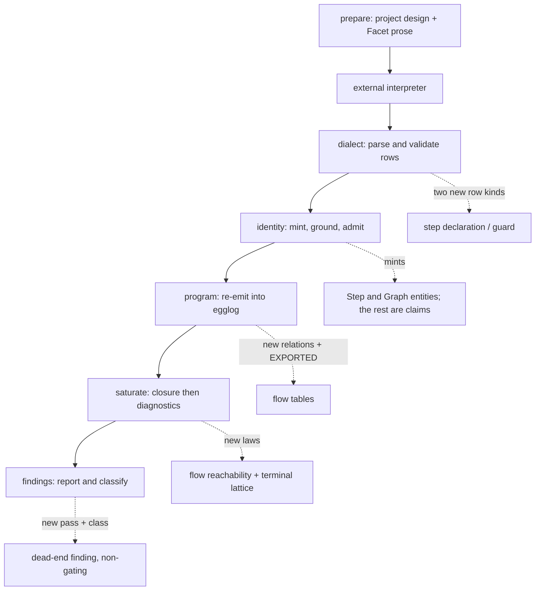
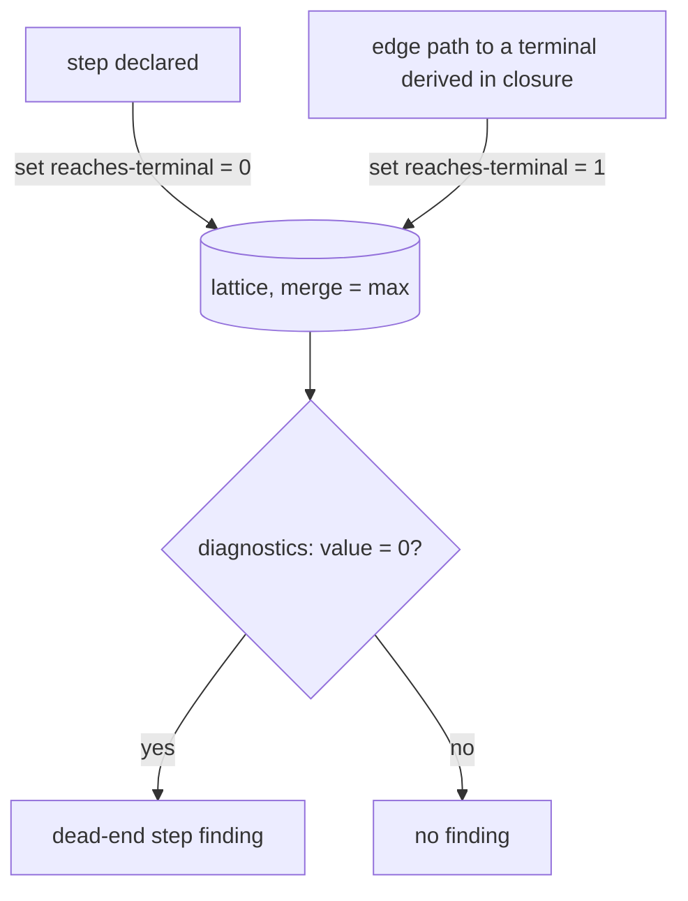

# sigilc Claim Flow Decomposition - Plan

## Goal Capsule

- **Objective:** A reviewer running sigilc's design-validation binary gets a computed answer to whether a component's flow-shaped Logic prose actually holds together — starting with whether every described step leads somewhere — instead of having to read it and judge for themselves.
- **Means:** A flow graph leaves the interpretation step as claims over tool-minted Step and Graph entities, with two returned row kinds of its own, and new laws in the existing claims egglog program check it (KTD1, KTD3, KTD36).
- **Product authority:** Extends the claims subsystem introduced by [docs/plans/2026-09-17-1838-feat-sigil-datalog-interpretation-plan.md](2026-09-17-1838-feat-sigil-datalog-interpretation-plan.md), which has shipped. The existing `claim` tuple, ingest path and stored projections keep their shape, so that plan's additive commitment holds (KTD2). `packages/eqval` and the existing `sigil-evaluate` advisory skill are outside this plan.
- **Execution profile:** Contracts before code, already satisfied — `CONTRIBUTING.md` requires every `.sigil` change to be proposed and approved before it is written, and [packages/sigilc/claims.sigil](../../packages/sigilc/claims.sigil) already carries these commitments. A further `.sigil` edit discovered mid-implementation is a separate approval, not a drive-by.
- **Stop conditions:** Stop and raise rather than proceeding if implementation requires editing any of the nine files [packages/sigilc/src/eqval.rs:247-262](../../packages/sigilc/src/eqval.rs#L247-L262) hashes, or requires a third egglog ruleset (KTD3).
- **Open blockers:** None for U9, U10, U1-U4 and U6-U8, U11. U5 is held pending a separate design pass for what a reached step is checked against. The authored contract [packages/sigilc/claims.sigil](../../packages/sigilc/claims.sigil) matches the Product Contract and passes `sigil check`, but its current revision carries corrections and decisions that no independent review has seen — the last review round read an earlier revision.
- **Who finishes:** `ce-work` or a human implementer, once the remaining questions are settled.

**Product Contract preservation:** changed: R1, R3 — the U9 spike established that a Facet is a paragraph and a real flow spans several, so a graph attaches to a component's Logic section rather than to one Facet, and a step's position is ordered within that section. Added: R8, R9 — the projection must present a component's Logic Facets together, and a spanning graph must satisfy every contributing Facet's unit; both are consequences of the same finding. Changed: R5 — it cited `kernel.egg`'s `reachable`, but that is a separate egglog program over RDF-shaped facts that never meets the claims program; the relation to reuse is `claims.egg`'s own. Every other requirement, Key Decision and acceptance example is unchanged, and all existing R-IDs keep their meaning.

---

## Product Contract

### Summary

sigilc's claims system gains the ability to decompose a coarse, binding decision into a checked graph of the flow steps, state, and interface operations it governs. A component's flow-shaped Logic prose becomes one graph spanning that section's Facets instead of a flat claim per paragraph, and a Constraints claim can check the graphs of flows its own component owns or transitively depends on — starting with catching steps that lead nowhere.

### Problem Frame

Today a binding decision — an architecture or technology choice — lives as one flat Constraints claim, with its rationale in a paired Decisions claim that the claims pipeline marks non-committing and never checks ([packages/sigilc/src/claims/program.rs:17-23](../../packages/sigilc/src/claims/program.rs#L17-L23)). Nothing connects that claim to whether the design it governs actually holds together structurally.

The same flatness affects flow-shaped behavior, and it is worse than one flat claim per flow. A Facet is a paragraph, so [packages/core/src/pipeline.sigil](../../packages/core/src/pipeline.sigil)'s chain from `RelationshipResolution` through `GlossaryInspection` and `GraphConstruction` to a merged result is authored across three separate Logic Facets of five, each becoming its own row in the claim relation ([packages/sigilc/src/claims/claims.egg:27](../../packages/sigilc/src/claims/claims.egg#L27)), tagged only with its section. Nothing relates them. If a later edit drops a step's output from the final result, nothing computed catches it; a reviewer has to notice by re-reading prose.

The claims program already has the pieces to do better. It computes transitive dependency reachability over `holds` with a two-rule base-plus-step pattern, each rule emitting a `because` witness naming the law that produced it ([packages/sigilc/src/claims/claims.egg:64-67](../../packages/sigilc/src/claims/claims.egg#L64-L67)). What it lacks is any route from a Facet's prose to a graph, and any law that reads one.

### Requirements

**Flow graph construction**

- R1. When a component's Logic prose describes a sequence of steps, the interpretation step must represent that section's flow as one graph connecting the flow's steps, the state they read, the state they write, and the interface operations they call — not as a flat claim per Facet. A flow belongs to a component's Logic section and spans its Facets; an edge runs from a step to whatever the prose describes as consuming what that step produced: a later step, or the flow's result. What a step reads, writes and calls are claims about that step, not edge targets — under KTD1 they are not nodes, so an edge cannot point at one. A step and a graph are entities the tool mints, so the facts about them are ordinary claims rather than a representation of their own (KTD1); only the step declaration and the guard need returned rows of their own.
- R2. A flow step's guard condition must be expressible from a state read, an input value, or a claim whose role is Constraints. A constraint operand names the **Facet** that authored the constraint, not the claim: claim identities are minted by the tool after the interpretation returns, so a returned row cannot carry one, while Facet identities are in the request the interpreter was given.
- R3. Every flow step's identity must be minted deterministically by the tool from the Facet the step was authored in and the step's position within its component's Logic section — never coined by the interpreter, preserving the existing rule that identity is the tool's alone. A step that calls an already-declared Component or Tag operation names that operation as the object of a claim rather than taking its identity, so two steps calling the same operation stay distinct nodes.
- R8. The interpretation request must present a component's Logic Facets together, each step's authoring Facet recoverable, so the interpreter can express a flow that spans them. Today it carries one pre-filled row per Facet identifying that Facet alone, which makes a spanning flow inexpressible.
- R9. A flow graph must satisfy the unit of every Facet that contributed a step to it, so a Facet whose only interpretation is its part of a spanning flow is not reported as an uninterpreted section. Contributing a step is an additional way a Facet counts as interpreted, never the only one: a Logic Facet that contributes no step but yields an ordinary claim must not become a gap.

**Structural guards**

- R4. Every flow graph, whether or not a decision governs it, must be checked by egglog rules for a step with no path to any of the graph's declared ends, and any such step must surface as a computed finding. An end is declared as an edge to the graph entity, never inferred, and a graph declaring none is refused at admission. A branching flow has as many ends as branches, so a returned result, an outward call and a terminating state write are all eligible, but an undeclared one ends nothing.

**Decision governance**

- R5. A component's claim whose role is Constraints must be able to check the flow graphs owned by its own component or by any component reachable from it through interpreted dependency claims, using the claims program's existing `reachable` relation — not only flows in its own component or its direct dependencies. Reach follows the dependency claims an interpretation emitted, not the export's import graph, so a real dependency that no claim names is not reached.
- R6. Grounding must apply to every step row at admission, independently of governance reach.
- R10. A reached step must be checked against the governing claim by three laws, each defined over what the step's own rows say it does — its state reads, its state writes and the interface operations it calls — rather than over a step as a claim operand:
  - **Contradiction.** A governing Constraints claim that forbids something, against a step the prose says does it. A claim forbids when it is `excludes`, or required and expected not to hold — the expectation column, not modality, is what carries that (KTD30). The claim's relation must match the row kind, so a constraint forbidding a write is not answered by a read.
  - **Ownership conflict.** A step writing state a claim marks `exclusive` that its component does not own. Calling across a component boundary is delegation and must not be flagged. Nor must an unmarked write: a component declaring state does not say another may not write it, so without the marking claim nothing in the design is contradicted (KTD18). Not gated by governance reach, but it cites the marking claim.
  - **Obligation.** A governing constraint that **requires** something of the flow, and that the flow actually touches, raises the obligation that some step in that graph guards on it, filled by a guard row naming that constraint's Facet and read through the same `max`-merged lattice the existing obligation check uses. A prohibition raises no obligation: it is satisfied by the absence of the forbidden row, which the contradiction law above already covers, so raising one would report the same problem twice.
- R11. A finding any of R10's laws derives must not change the exit status, for the same reason a dead-end step does not: it rests on a model's reading of prose. It must carry its own finding class and must not reach the violation table.
- R12. The interpretation request must present the Facets of every source in the selected source's resolved closure, not only the selected source's own, so a Constraints claim in one component can reach a flow graph in a component it depends on. Coverage stays scoped to the selected source: a Facet from a dependency source that yields nothing is context the interpreter was given, never a gap the report names.
- R15. The claims subsystem must own the relation and property names it accepts, rather than reading the compiler's ontology at runtime. Today `vocabulary::relations()` reads `turtle::vocabulary()`, and `guidance::fingerprint()` folds in `turtle::ontology_fingerprint()` defensively so a compiler change cannot silently widen what an interpretation may return — at the cost that any edit to the compiler's predicate list invalidates every prepared interpretation directory. The contract for this is authored: `packages/sigilc/vocabulary.sigil`, component `SigilClaimsVocabulary`.
- R14. Interpretation results must be stored and reused, so that a prepared request asks the interpreter only for what is stale. A stored interpretation is keyed on the unit's prose, the guidance fingerprint and the vocabulary generation — never on the binding, which moves on any edit in the closure. A supplied interpretation of a unit that is not stale is treated as a second interpretation of that unit, not as a replacement. Without this, R12's closure-wide request re-interprets every shared dependency once per dependent, which is the whole of its cost. The tool still launches no model: it reuses an interpretation the caller already supplied rather than producing one.
- R13. A finding must be reported by each run whose selected source authored a step or a Facet the finding names — so one spanning two sources reaches both authors, and a reader gets it in a file they would edit to fix it. The ownership conflict is why this cannot route to a single owner: it names a step and the state's owning component by construction. Without this, every dependent's report repeats its dependencies' findings.

**Extraction reliability**

- R7. Graph-edge extraction must join the same repeat-interpretation comparison flat claims use: when a caller supplies a second interpretation of the same binding, graph rows are compared per Facet and disagreement is reported as an interpretation-stability observation — never suppressing a finding, never gating acceptance.

### Key Decisions

- **Extend sigilc's claims system directly; eqval's flow graph is inspiration only.** (session-settled: user-directed — chosen over generalizing eqval's sketch or keeping the two efforts separate: eqval solves a different problem, design-vs-code equivalence, and is an unaccepted proposal, not something to build on.)
- **A flow graph attaches to a component's Logic section, not to a single Facet.** (session-settled: user-directed — chosen over keeping the graph per-Facet and narrowing the promise, or reopening the brainstorm: a Facet is a paragraph, so real flows span several, and a per-Facet graph would almost never fire. Established by running the projection against two real designs.) Governs R1, R3, R8, R9.
- **Decompose flow-shaped Logic prose at interpretation time.** The existing model-to-claims step emits the graph. (session-settled: user-directed — chosen over new hand-written graph syntax for authors or deriving the graph purely by saturating today's flat claims: the interpretation step already converts prose into claims.) Governs R1.
- **Flow-step identity is minted deterministically by the tool, extending identity grounding rather than restricting which steps decompose.** The interpreter still never coins an identity; the tool mints one for every step, and a step that calls a declared operation names it rather than borrowing its identity. (session-settled: user-directed — chosen over restricting decomposable steps to only those that call an already-declared operation: extending identity minting is what lets decomposition work for internal steps.) Governs R3.
- **A flow graph and decision governance are two connected mechanisms.** Every flow-shaped Logic Facet gets a graph regardless of whether a decision governs it; a Constraints claim's check reaches into that graph additionally. (session-settled: user-directed — chosen over graphing only decision-governed flows or only ungoverned prose.) Governs R1, R4, R5.
- **The first required structural check is an unreachable step.** Guard contradictions and unfulfilled interface promises are deferred (see Scope Boundaries). (session-settled: user-directed — chosen over making those the first target.) Governs R4.
- **Governance follows ownership and dependency edges, not just same-component.** (session-settled: user-directed — chosen over scoping governance to the decision's own component only.) Governs R5, R6.
- **Graph-edge extraction joins the repeat-interpretation comparison flat claims already use, rather than a stability mechanism of its own.** That comparison is the opt-in second-artifact check the sibling plan specifies (its R16b / U8), so it stays observational rather than gating. (session-settled: user-directed — chosen over leaving graph-edge reliability unaddressed or punting the mechanism to planning: one shared check covers both extraction paths.) Governs R7.
- **The claim/facet tuple shape may be reshaped if that serves the graph design better.** This plan does not require staying additive-only. (session-settled: user-directed — chosen over an additive-only constraint.) Governs R1.

<!-- ce-section: work-relationships -->
### How This Work Fits Together

This plan covers decomposing sigilc's claims into flow/state/interface graphs, checked structurally and by governing decisions.

- Depends on: [docs/plans/2026-09-17-1838-feat-sigil-datalog-interpretation-plan.md](2026-09-17-1838-feat-sigil-datalog-interpretation-plan.md) — this plan extends that plan's interpretation step and claim relations. That work has shipped: the modules and `claims_*.rs` tests it defines are present in the crate.
- Shares a similar graph shape with: `packages/eqval`'s flow/state graph proposal for design-vs-code equivalence — not depended upon, not committed to converge.
  - Still to decide: whether the two should ever share vocabulary, or stay independent by design.

### Key Flows

- F1. Flow-shaped Logic Facet becomes a checked graph
  - **Trigger:** A Logic Facet's prose describes a sequence of steps.
  - **Steps:** The interpretation step emits a graph connecting the flow's steps, the state they read, and the interface operations they call. Structural rules check the graph for a dead-end step. If a Constraints claim governs this component, or a component it depends on, its check also runs against the graph.
  - **Outcome:** A reviewer sees computed findings — including any step with no path to a terminal — instead of having to judge the prose themselves.
  - **Covers:** R1, R3, R4, R5, R6, R7.

### Acceptance Examples

- AE1. Dead-end step caught
  - **Given:** A Logic section whose flow is interpreted as a graph, in which one step's output has exactly one consumer.
  - **When:** A later edit removes that step's result from its only consumer, but the step itself remains in the Logic prose.
  - **Then:** The structural check flags that step as a dead end — no path from it to any declared end — as a computed finding, without a human re-reading the prose.
  - **Covers:** R1, R4.
  - **Not `pipeline.sigil`, and U9 is why.** The second spike traced that file's real flow and computed reachability over it. Its glossary step feeds **two** consumers — Facet 3 returns "glossary data" and Facet 5 merges "glossary diagnostics" — so removing it from the return leaves the merge path intact and no dead end appears. Dropping it from both does produce one. A step is orphaned only when every consumer drops it, which makes a single-consumer step the shape this example needs.
- AE2. Decision governance across a dependency edge
  - **Given:** A workspace-level component's Constraints claim states a binding architecture decision, and a component it depends on has a flow graph.
  - **When:** The design is checked.
  - **Then:** The governing Constraints claim's check reaches the dependent component's flow graph through the interpreted dependency claim relating them, not only flows in the governing component's own scope. Where no such claim was emitted, nothing is reached and nothing is reported.
  - **Covers:** R5.
- AE3. Guard built from an input, not just state
  - **Given:** A Logic Facet whose guard compares an incoming argument to a state read — for example, checking whether a request's identifier matches the one currently active — the same shape the plan's own eqval-inspired example uses.
  - **When:** The interpretation step builds that guard's graph node.
  - **Then:** The guard is expressible, because R2 recognizes an input value as a valid comparison operand alongside a state read or a Constraints claim.
  - **Covers:** R2.

### Scope Boundaries

- `packages/eqval` and its behavior-equivalence proposal are untouched; this plan doesn't depend on or modify it.
- No new author-facing Sigil syntax for writing flow/state/interface graphs by hand — the graph is derived from existing prose, not authored directly.
- Guard contradictions and unfulfilled interface promises are not required checks in this plan; the graph shape enables them as future extensions.
- The existing `sigil-evaluate` advisory skill, and the design-validation binary's other behavior, are not otherwise changed by this plan.

#### Deferred to Follow-Up Work

- Promoting a dead-end step or a step-law finding to a gating failure once the interpretation proves reliable in practice (KTD5 and KTD17 ship both non-gating).
- Deciding whether a claim whose role is Cases should commit. Today only `decisions` is non-committing ([program.rs:23](../../packages/sigilc/src/claims/program.rs#L23)), so a Cases claim both raises obligations and **fills** them — an example can silently close an obligation a Constraints claim raised, which the language reference's rule that an example does not quantify over all inputs argues against. Surfaced by review here, but `program.rs:20-22` already records it as the sibling plan's open question with a one-element fix, so it is that plan's to settle rather than this one's.
- Extending the staleness check beyond interpretation — reusing a saturated world when nothing in a closure changed. U16 makes interpretation incremental; saturation still runs whole each time, which is cheap by comparison and not worth complicating now.
- Teaching `packages/core/src/pipeline.sigil` or any other authored design to exercise the flow shape end-to-end; this plan verifies AE1's shape against a constructed flow, not against a live authored Facet (see Risks).

### Dependencies / Assumptions

- This plan builds on the claims/interpretation pipeline introduced by [docs/plans/2026-09-17-1838-feat-sigil-datalog-interpretation-plan.md](2026-09-17-1838-feat-sigil-datalog-interpretation-plan.md), which has shipped and is present in the crate.

### Sources / Research

- [packages/sigilc/src/claims/claims.egg:64-67](../../packages/sigilc/src/claims/claims.egg#L64-L67) — the base-plus-step transitive closure over `holds`, each rule emitting a `because` witness. The pattern R4 and R5 mirror.
- [packages/sigilc/src/claims/claims.egg:44](../../packages/sigilc/src/claims/claims.egg#L44), [:103-124](../../packages/sigilc/src/claims/claims.egg#L103-L124) — the `filled` lattice: a `:merge (max old new)` function set to 0 on declaration and 1 on satisfaction, read as `= 0` in `diagnostics`. The only working way to express absence here.
- [packages/sigilc/src/claims/claims.egg:49-53](../../packages/sigilc/src/claims/claims.egg#L49-L53) — only two rulesets exist and the driver steps them by name; a third would compile and silently derive nothing.
- [packages/sigilc/src/eqval.rs:247-262](../../packages/sigilc/src/eqval.rs#L247-L262) — the nine files whose text the compiler runtime identity hashes. Nothing under `src/claims/` is among them.
- [packages/sigilc/src/claims/vocabulary.rs:79-82](../../packages/sigilc/src/claims/vocabulary.rs#L79-L82) — why the relation set cannot be widened: it is closed over `turtle::vocabulary()`, and `turtle.rs` is one of the nine.
- [packages/sigilc/src/claims/guidance.rs:55-71](../../packages/sigilc/src/claims/guidance.rs#L55-L71) — the second fingerprint, over the four guidance documents plus `vocabulary.rs` and `claims.egg`.
- [packages/sigilc/src/claims/identity.rs:68-73](../../packages/sigilc/src/claims/identity.rs#L68-L73) — `mint()` over a version tag, Facet, component, section and serialized body; [:82-141](../../packages/sigilc/src/claims/identity.rs#L82-L141) — the grounding sets a row is checked against.
- [packages/sigilc/src/claims/program.rs:26-41](../../packages/sigilc/src/claims/program.rs#L26-L41) — `EXPORTED`, the table/arity list; a relation absent from it is computed and discarded silently.
- [packages/sigilc/src/claims/findings.rs:297-315](../../packages/sigilc/src/claims/findings.rs#L297-L315) — `disagreements()`, keyed on Facet, section and serialized body.
- [packages/sigilc/tests/support/mod.rs](../../packages/sigilc/tests/support/mod.rs) — the shared fixture helpers and the baked Facet-offset constants.
- [CONTRIBUTING.md:255-269](../../CONTRIBUTING.md#L255-L269) — the `@sigil implements` ownership annotation and its section-listing rule.

---

## Planning Contract

### Key Technical Decisions

- KTD1. **A step and a graph are minted entity kinds, and most flow facts are ordinary claims about them.** The earlier version of this decision made every flow fact its own row kind, reasoning that a claim's operands must be a declared Component or Tag and a minted step is neither. That reasoning was wrong: identity in this system is already not only Components and Tags — Facets carry their own namespace (`facet:<source>:<offset>`), and `claims.egg`'s `entity` relation has carried a `kind` column from the start. The single law that joins on `entity` filters on the literal kind `"Tag"` ([claims.egg:111](../../packages/sigilc/src/claims/claims.egg#L111)), so adding kinds breaks nothing. A step is therefore an entity of kind `Step`, minted by the tool from its Facet and ordinal; a graph is an entity of kind `Graph`, minted from its component and Logic section. The tool mints both, so the rule that the interpreter never coins an identity is untouched. Governs R1, R2, R3.
- KTD36. **Only two new returned row kinds survive: a step declaration and a guard.** Everything else a flow needs is a claim over the minted entities — a state read is `step reads Tag`, a write is `step writes Tag`, a call is `step invokes Tag`, an edge is `stepA to stepB`. All four relation names already exist in the ontology. A step declaration stays a row of its own because it carries the ordinal the identity is minted from, and a guard stays one because an input-value operand is a literal and a claim row has no text column (KTD12). This is what removes the bake-off objection the earlier design accepted — there is no longer a split across two representations, so no law joins across one. Governs R1, R2.
- KTD37. **The degenerate and grounding checks become kind-aware, and both of their current forms fail silently into suppression.** `admit()` flags a claim whose subject equals its object as degenerate ([identity.rs:180-182](../../packages/sigilc/src/claims/identity.rs#L180-L182)) — which is correct for a Tag claim and wrong for a self-edge, an ordinary shape in a looping flow. `grounds()` checks a per-Facet set built from the export, which no minted step is in, so every flow claim would read as ungrounded. Either defect suppresses the whole graph's dead-end check under KTD8, so neither would raise an error; the check would simply stop running. A minted Step and Graph belong to their own Facet's grounding set by construction, and same-entity is degenerate only when the operands are a declared kind. Governs R6, R10.
- KTD2. **The existing `claim` tuple, its arity and the ingest path are left alone.** Flow rows sit beside them, which is what keeps the sibling plan's additive commitment intact even though the Product Contract permits reshaping. Reshaping was permitted, not required, and nothing in the graph design needs it.
- KTD3. **Flow laws go in the existing `closure` and `diagnostics` rulesets inside `claims.egg`.** The saturation driver steps exactly those two by name, so a third ruleset would compile, run clean, and derive nothing. Governs R4, R5, R6.
- KTD4. **The dead-end check is a lattice, not a negation.** A `reaches-terminal` function merged on `max` is set to 0 when a step is declared and 1 when a path to a terminal exists; a `diagnostics` rule reads the zeros. Written as a negation it cannot fire at all. Governs R4.
- KTD5. **The dead-end finding gets its own table, its own reporting pass and its own finding class, and does not flow through the violation table.** Routing it through violations would class it a contradiction, flip the design state to disjoint, and exit non-zero — weighting a model's misreading of prose the same as a real contradiction. (session-settled: user-directed — chosen over reusing the violation path or shipping it behind a gating flag: a finding that rests on an interpretation should not fail a build.) Governs R4.
- KTD6. **The report version moves, because the finding class is part of the on-disk report.** This is the visible cost of KTD5 and is accepted rather than worked around. Governs R4.
- KTD7. **Step identity reuses the existing minting function unchanged, with the step's section-relative position inside its new body variant.** The function already takes the authoring Facet, component and section, so a position that orders across the section needs no change to minting itself. The version tag stays as it is; changing it would move every existing claim identity. Governs R3.
- KTD8. **Flow rows are grounded like claim rows, but a defect suppresses the whole graph rather than dropping one row.** Per-row exclusion is safe for a claim, which only ever adds a derivation — dropping it can lose a finding but never invent one. The dead-end check inverts that: dropping one edge severs the path and manufactures dead ends on well-formed steps upstream. So when any row in a flow graph carries a defect, report the grounding defect and suppress the dead-end check for that entire graph. Governs R6.
- KTD9. **The accepted-profile generation is bumped.** New row kinds are an incompatible profile change, and the generation is what tells an already-prepared interpretation directory it no longer matches. Governs R1.
- KTD10. **A flow's end is declared as an edge to the graph entity, not inferred, and declaration is what makes an outward call an end.** The contract's edge rule already lists "the flow's result" as something an edge may run to, and under KTD1 the graph is a minted entity, so `stepA to <graph>` says exactly that — this step's output is the flow's result. A step that ends the flow by writing state or calling outward declares that edge like any other; the write and the call are claims about the step and are not themselves edge targets. That removes the separate terminal row the earlier design needed. A graph declares one end per branch, not one overall. (session-settled: user-directed — chosen over ending a flow only at a returned result, deriving the terminal as whatever nothing consumes, or allowing exactly one: a flow that ends by delegating outward is real and the codebase's own flows are written that way, and the reference flow example has two ends while its code-side counterpart has three, so a single-terminal rule would refuse the shape this design was modelled on.) Without a declared edge to the graph the lattice has no base case, and without the declaration rule every outward call would terminate trivially and the check would never fire. Governs R4.
- KTD11. **A returned row names a step by its ordinal position within the component's Logic section, and name resolution gains that form rather than a separate pass.** The interpreter cannot supply a minted identity (R3), so position is the one reference both sides can compute, and it is already what the identity is minted from. Under KTD1 a step is an entity, so this belongs in `EntityNames::resolve` beside the existing label and id forms — but as an added branch, never a widening of the existing lookup: that lookup refuses an unknown name by **refusing the whole artifact** ([identity.rs:287](../../packages/sigilc/src/claims/identity.rs#L287)), so routing a step reference through it unchanged would reject every flow. A row naming the graph resolves to the graph of its Facet's section. Ordinals run across the section's Facets in source order, which is what lets an edge cross from one Facet to another. Governs R1, R3.
- KTD38. **A flow claim carries required modality and a true expectation, and any other combination is refused.** A claim row's modality and expectation columns are not optional, and a step reading a state is not "permitted" or "assumed" — it is what the prose says happens. Fixing the pair keeps flow facts out of the existing contradiction laws, which fire on disagreeing expectations, while still populating `holds` so the step laws can read them. Governs R1.
- KTD14. **The projection presents Logic Facets grouped by component, and leaves every other section's per-Facet rows exactly as they are.** R8 needs the interpreter to see a whole section at once, but the existing one-row-per-Facet shape is what every other role depends on, so the grouping is added for Logic rather than replacing the general contract. Each grouped Facet keeps its own identity in the request so a returned step can name where it was authored. Governs R8.
- KTD15. **A step row carries its authoring Facet, and unit satisfaction is computed per contributing Facet.** A graph belongs to a section but every step still comes from exactly one Facet, so the existing per-Facet gap check keeps working: contributing a step is one way a Facet counts as interpreted, **added to** the existing tests and not replacing them. Contributing no step is not itself a gap — a Logic section mixes flow prose with non-flow prose, and `packages/core/src/pipeline.sigil`'s fourth Logic Facet states which models own which result shapes, yielding claims and no steps. The gap test stays the one `findings.rs` already applies: no interpretation satisfying the unit and no reading row. Governs R9.
- KTD12. **A guard's input-value operand is a non-entity text column and never goes through name resolution.** An unresolvable name there is a hard error that refuses the whole interpretation, so routing an operation argument through it would fail a correct design — and would do it as a non-zero exit, against KTD5. Governs R2.
- KTD16. **What a step does is read as triples whose subject is the step.** A state read is `step reads T`, a write is `step writes T`, a call is `step invokes T`. All three relation names already exist in the ontology ([turtle.rs:33-54](../../packages/sigilc/src/turtle.rs#L33-L54)), so the laws join a claim's `(subject, relation, object)` against what a step does without a new idiom. This is what the withdrawn drafts were missing: they treated a step as something no claim could be about. Under KTD1 these are literally claims, so the laws read `holds` directly and need no projection step. Governs R10.
- KTD17. **The three step laws get their own tables and the non-gating class KTD5 introduces; none writes to `violation`.** A row in `violation` is classed a contradiction or an ownership conflict by [findings.rs:105-110](../../packages/sigilc/src/claims/findings.rs#L105-L110), which sets state `Disjoint`, which exits 1 at [cli.rs:164](../../packages/sigilc/src/claims/cli.rs#L164). That is exactly the KTD5 breach the withdrawn drafts carried. The obligation law needs no special handling: it lands as an unmet obligation, which is already `Loose` and already exits zero. Governs R11.
- KTD18. **The ownership law requires a claim marking the state exclusive, reads writes rather than calls, and fires on a single foreign write.** Two things were wrong with the wide draft. It read calls, so it fired on every cross-component call, because these designs are written as delegation. And even restricted to writes it cited no authored text: a component declaring state does not thereby say another may not write it, which is why the shipped `exclusive-ownership` law at [claims.egg:96-98](../../packages/sigilc/src/claims/claims.egg#L96-L98) requires the `exclusive` marker before two owners conflict. One writer is enough once that marker exists — exclusivity is what the marker asserts, so a second writer is not needed to contradict it, and requiring two would have let the classic case (one component writing another's exclusive state) go unreported. (session-settled: user-directed — the user challenged whether ownership belonged in design validation at all; the marker is what makes it a contradiction rather than an opinion.) Governs R10.
- KTD19. **The obligation law is scoped by what the flow touches.** A governing constraint raises a guard obligation only when a step in that graph reads, writes or calls the constraint's object. Without that scope every constraint reaching every graph would raise one, and almost none would be filled. Governs R10.
- KTD20. **The guard row's constraint operand is a Facet reference and resolves to that Facet's Constraints claims at admission.** A returned row cannot carry a claim identity because the tool mints those after the interpretation returns; a Facet identity is in the request. Admission resolves the named Facet to the claims it produced. A guard naming a Facet outside the request is refused. Governs R2, R10.
- KTD21. **The projection presents the whole resolved closure's Facets, and the coverage denominator stays the selected source's.** `declared` drives the uninterpreted-section finding ([findings.rs:196-209](../../packages/sigilc/src/claims/findings.rs#L196-L209)); widening it with the closure would turn `pipeline.sigil`'s run from 16 Facets of coverage into 441, and report roughly 400 gaps that are not this source's business. So `rows` and `binding.facets` widen to the closure; `declared` does not. Governs R12.
- KTD23. **The cache granularity is the presentation unit, not the Facet.** The five non-Logic roles are presented one Facet at a time and cache per Facet. Logic is presented as a whole component section per R8, and a step's ordinal depends on its siblings, so Logic caches per component section: editing one Logic Facet re-interprets that component's Logic and nothing else. Governs R14.
- KTD24. **The store key is the unit's prose, its owning component, its contract role, the guidance fingerprint and the vocabulary generation — and for a Logic unit the prose is the whole section's.** Keying Logic on one Facet's prose contradicts KTD23: edit one Logic paragraph and its siblings' own prose is unchanged, so they would read fresh while the section they belong to is stale. The component and role are in the key because prose alone does not identify a unit — two Facets can carry byte-identical prose, and grounding is checked against each one's own owning component and resolved references, so reusing the wrong one can judge a row grounded against a Facet that never named the entity. The closure is deliberately not in the key: grounding runs at admission rather than at interpretation, so adding an import re-grounds stored rows without re-interpreting them. The Facet identity is unusable as the key: it encodes a source offset, so it moves when text above it shifts and stays put when the prose at that offset changes. Governs R14.
- KTD25. **A repeat-interpretation run bypasses the cache.** R7's comparison exists to detect an unstable reading; served from the cache it would return identical rows and agree trivially, which would silently disable the check. Governs R7, R14.
- KTD22. **Attribution is computed from the authoring source, not from a new column.** Every claim and every step row already carries its Facet, and a Facet already carries its source, so R13's rule is a filter at the reporting pass rather than a data change. A step-derived finding routes on the step, never on the claim, which is what makes the rule total: a gap finding and a suppression report have no claim and no step, and fall to the Facet they name. Governs R13.
- KTD26. **The store is keyed per unit and never on the binding, and a reused interpretation is re-admitted.** Because the key carries nothing about the closure, a unit whose prose has not changed is never re-asked, so its stored claims can still name an entity that has since left the resolved closure. Re-admitting on reuse catches that for free — grounding runs at admission anyway — and is why the closure stays out of the key. A binding is taken over the whole export digest, so any edit anywhere in a 15-source closure moves it; keying the store on the binding would discard every stored interpretation on every edit, which is the cost U16 exists to remove. The binding keeps its job — refusing a request paired with the wrong export — and the store keeps its own, so a stale binding and a stale unit are separate questions. Governs R14.
- KTD27. **A supplied interpretation of a unit that is not stale is a second interpretation of that unit.** Otherwise the store and R7's repeat comparison contradict each other whenever a caller supplies more than the request asked for: one says reuse the stored rows, the other says compare them. Routing it to the comparison also preserves KTD25, since the comparison is the one path that must bypass the store. Governs R7, R14.
- KTD29. **The ownership law is not gated by governance reach, but it does cite a claim.** It joins the `exclusive` marking claim rather than a Constraints claim reaching the graph, so reach plays no part — but the finding names that marking claim like any other finding names its claims. An earlier draft had it citing no claim at all, which made it unreportable under `ComputedFindings`' rule that every finding carries the claims it rests on. Findings that genuinely rest on no claim — a gap, a suppression report — are what that rule's hedge exists for. Governs R10, R13.
- KTD30. **A prohibition is recognised by the expectation column, not by modality.** Both the contradiction and obligation laws turn on forbid-versus-require, and modality carries only required, permitted and assumed. The distinction already exists in shipped data — `vocabulary.rs`'s `EXPECTATIONS` is `true`/`false`, and `claims.egg:79` already reads `"required" "false"` as a negated claim — but the contract never stated it. A prohibition is a required claim expected not to hold, or one whose relation is `excludes`. Governs R10.
- KTD31. **The obligation law selects claims by relation, not by prose judgment.** "A claim requiring something of the flow" is not a test an implementation can apply; `requires` is. The law reads `requires` claims only, which is also what keeps it disjoint from the contradiction law under KTD30. Governs R10.
- KTD32. **A finding naming claims or steps in two sources is reported by every run that owns one of them.** The ownership conflict is what forces this rather than the contradiction law: it names steps in two components by construction, so a rule routing a step-derived finding to "the run that authored that step" has two referents and would always blind one of the two authors. The alternative — routing on whichever claim the law names first — makes the finding land in an arbitrary one of two files and leaves the other author blind to it. Neither author can fix a cross-source contradiction alone, so both reports carry it, and R13's promise is "once per run that owns a named claim" rather than once overall. (session-settled: user-directed.) Governs R13.
- KTD33. **Ingest refuses a binding mismatched on any of its four parts, not two.** The shipped refusal checks the export digest and the guidance fingerprint, leaving the selected source and the vocabulary generation unchecked. The generation is the designated staleness signal for an incompatible profile change (KTD9), so leaving it unchecked defeats the mechanism U1 and U13 both rely on; an unchecked selected source silently changes which Facets a run calls gaps. Pre-existing, and this plan is what makes it load-bearing. (session-settled: user-directed.) Governs R12, R14.
- KTD35. **The accepted vocabulary is copied into the claims subsystem and checked against the compiler's by a test, never read from it at runtime.** A copy risks drift, which is why the test asserts equality: when the compiler widens its ontology the test fails, and widening the claims profile becomes a decision with its own generation bump rather than something inherited silently. `turtle.rs` is read by that test and never edited, so nothing in the frozen set moves. Dropping `turtle::ontology_fingerprint()` from `guidance::fingerprint()` moves that fingerprint once, invalidating prepared directories at this change — the same class of cost as KTD9's bump, and far cheaper before U13 widens a prepared directory from 16 Facets to 441. Governs R15.
- KTD34. **The exit contract lives in one Facet, and partitions every finding kind, not just two.** `state_of` already decides this: only `Contradiction` and `OwnershipConflict` reach `Disjoint`, so an unmet obligation, a degenerate claim, an ungrounded claim and a gap are all warnings today. Naming only the gating pair left four kinds unclassified between exit zero and one. Which findings are warnings is a property of the command, so `ClaimsCommands` states it once for every finding that rests on a reading of a flow, rather than each law's own Facet restating it. Stating it per law is what let the dead-end check — settled as non-gating in KTD5 — go unstated while its neighbours were explicit, which read as the opposite of the decision. Governs R4, R11.
- KTD13. **Every exported flow table is String-valued.** The saturation reader decodes only string and float cells, so the terminal lattice cannot itself be exported; it stays inside the egglog program and the diagnostics rule writes a String-valued relation for findings to read. Governs R4.

Reversed on evidence: whether state reads and interface calls should reuse the existing `reads` / `invokes` relations on ordinary claim rows was first rejected, on the grounds that a claim's operands must be declared entities and that splitting the graph across two representations would cost a join in every law. The first ground was false — identity in this system was never restricted to Components and Tags — and once a step is a minted entity the second ground disappears with it, because nothing is split. KTD1 and KTD36 are the reversal. What survives from the original note is its instinct: a design that needs a join in every law is worth rejecting, which is precisely why the unified representation wins.

### High-Level Technical Design

Where flow rows enter the shipped pipeline. Only the shaded stages change; the surrounding stages carry graph rows without modification.



The terminal-reachability lattice, in the shape the existing obligation check already uses. Directional guidance, not implementation specification.



Directional sketch of the law shape, mirroring the existing closure rules rather than inventing a new idiom:

```text
; every fact below is an ordinary `holds`, derived from a claim by the existing
; asserted rule -- no flow table, no second representation (KTD1, KTD36)

; base: an edge to the graph entity IS the declaration of an end (KTD10)
rule (holds step "to" g) (entity g "Graph" _ _ _)
  -> set reaches-end(step) = 1, because(step, "flow-end-direct", g)                    [closure]

; step: reachability composes along edges between steps
rule (holds a "to" b) (entity b "Step" _ _ _) (reaches-end(b) = 1)
  -> set reaches-end(a) = 1, because(a, "flow-end-transitive", b)                      [closure]

; declare the base case for every step, so the lattice has a zero to read
rule (entity s "Step" _ _ _) -> set reaches-end(s) = 0                                 [closure]

; read the zeros, once the closure has stabilized
rule (entity s "Step" _ own _) (reaches-end(s) = 0)
  -> unreached-step(s, own)                                                             [diagnostics]
```

The three step laws, in the same directional form. Each joins a claim's operands against what a step's own rows say it does (KTD16), and none writes to `violation` (KTD17):

```text
; what a step does is already in `holds`: the claims are `step reads Tag`,
; `step writes Tag`, `step invokes Tag`. No projection step is needed (KTD36).
rule (holds st rel obj) (entity st "Step" _ _ _) -> flow-touches(st, obj)              [closure]

; a step belongs to the graph its owning component's Logic section mints
rule (entity st "Step" _ own _) (entity g "Graph" _ own _) -> in-graph(st, g)          [closure]

; law 1 -- contradiction: a governed step does what a reaching constraint forbids
rule (claim id f sec a "excludes" obj "required" "true") (commits sec)
     (constraint-governs id g) (in-graph st g) (flow-touches st obj)
  -> step-violation("step-excluded-action", st, obj, id)                               [closure]
rule (claim id f sec a rel obj "required" "false") (commits sec)
     (constraint-governs id g) (in-graph st g) (holds st rel obj)
  -> step-violation("step-negated-action", st, obj, id)                                [closure]

; law 2 -- ownership: two components' steps write state a claim marks exclusive
; (KTD18). This is the shipped exclusive-ownership law with steps in place of
; owners. No constraint-governs join -- reach plays no part -- but the witness
; column carries the marking claim, so the finding cites authored text (KTD29).
rule (property id f sec obj "exclusive" "true") (commits sec)
     (holds st "writes" obj) (entity st "Step" _ cmp _)
     (entity obj "Tag" _ owner _) (!= owner cmp) (!= owner "")
  -> step-violation("exclusive-foreign-write", st, obj, id)                            [closure]

; law 3 -- obligation: a touched REQUIREMENT must be guarded on, read as a
; lattice. "requires" only: a prohibition is answered by the contradiction law
; above, and raising an obligation for one reports the same problem twice.
rule (claim id f "constraints" _ "requires" obj "required" "true")
     (constraint-governs id g) (in-graph st g) (flow-touches st obj)
  -> flow-obligation(id, g, obj), set flow-guarded(id, g, obj) = 0                     [closure]
; a guard names the constraint's FACET, not the claim: the tool mints claim
; identities after the interpretation returns, so a returned row cannot carry one
rule (flow-obligation id g obj) (claim id fct _ _ _ _ _ _)
     (in-graph st g) (flow-guard st "constraint" fct)
  -> set flow-guarded(id, g, obj) = 1                                                  [closure]
rule (flow-obligation id g obj) (flow-guarded(id, g, obj) = 0)
  -> unguarded-flow(id, g, obj)                                                        [diagnostics]
```

### Sequencing

U9 runs first, before any production change. It is a throwaway round-trip that answers whether a model can return the shapes this plan is about to freeze — and freezing them is expensive, because the profile generation (KTD9) and the report version (KTD6) each invalidate every prepared interpretation directory when they move. Discovering the answer after U1 through U3 costs a second bump of both.

The vocabulary and its published documentation move together: a guidance test asserts in both directions that every accepted row name and column appears in the interpreter's vocabulary document and that every documented token is something the tool accepts. U1 therefore lands both, or lands red.

Several exhaustive matches span module boundaries, so a unit that adds a variant breaks compilation in a file a later unit owns. U1 and U2 each carry stub arms in those files to keep the crate green under the Verification Contract's per-unit gates; U3 and U6 fill them in.

U17 → U9 → U10 → U13 → U16 → U1 → U2 → U3 → U4 → U5 → U12 → U14. U6 follows U4. U7 follows U1. U8 follows U3 and U6. U11 follows U3.

U17 goes first, though it depends on nothing. It moves the guidance fingerprint, which invalidates every prepared interpretation directory — a cost that grows once U13 widens a directory from 16 Facets to 441 and U16 makes the store long-lived. Landing it before U9's spike also means the spike runs against the vocabulary the rest of the work will use.

U16 lands immediately after U13 rather than as later work. U13 is what makes every shared dependency Facet get re-interpreted once per dependent, and U16 is what stops it; shipping the first without the second makes every run pay a cost the design does not require.

U10 comes before U1 for the reason U9 established: what the interpreter is shown decides what it can return, so the request shape settles before the row kinds that encode it. U13 joins them there for the same reason — it widens what the interpreter is shown again, and both request-shape changes should land before the vocabulary freezes rather than costing a second format bump.


---

## Implementation Units

U9 has run; its finding is in Open Questions, and U1 through U8 have been re-aligned to R1's per-section scope. U10 and U11 carry the two consequences the finding added.

### U1. Register the two flow row kinds and the minted entity kinds

- **Goal:** The tool accepts step and guard rows, mints Step and Graph entities from them, accepts flow claims over those entities, and the interpreter's published vocabulary documents all of it.
- **Requirements:** R1, R2 (KTD1, KTD9, KTD10, KTD11, KTD12, KTD15, KTD36, KTD38).
- **Dependencies:** U9, U10.
- **Files:** `packages/sigilc/src/claims/vocabulary.rs`, `packages/sigilc/src/claims/dialect.rs`, `packages/sigilc/src/claims/identity.rs`, `packages/sigilc/src/claims/guidance/vocabulary.md`, `packages/sigilc/tests/claims_dialect.rs`, `packages/sigilc/tests/claims_prepare.rs`, `packages/sigilc/tests/claims_guidance.rs`, `packages/sigilc/tests/claims_context.rs`
- **Approach:**
  1. Add exactly two entries to the returned-row registry, per KTD36: a `step` row carrying its Facet and its ordinal, and a `guard` row carrying a step ordinal, an operand kind and an operand. Bump the accepted-profile generation per KTD9. Nothing else becomes a row kind — a read, a write, a call, an edge and an end are all claims.
  2. Add the matching row variants and per-name column checks in the dialect. The dialect's row dispatch ends in an unreachable arm, so a registry entry without a dispatch arm panics at runtime rather than failing to compile — add both together.
  3. Give the guard row a non-entity text column for an input operand per KTD12, and a Facet column for a constraint operand per KTD20.
  4. Accept a step reference in a claim's subject and object columns, per KTD11. This is a new branch in the reference syntax, not a widening of entity-name lookup — see U2 for why that distinction is load-bearing. Enforce that an ordinal is unique across the presented section and that a row naming an ordinal no step declaration carries is refused: without both, a bare ordinal does not resolve to one identity, and a dangling edge either mints nothing or silently drops, which would read as a dead end.
  5. Refuse a flow claim whose modality and expectation are anything but required and true, per KTD38.
  6. Add stub admission arms for the two new row variants in `identity.rs`: its `Row` match is exhaustive and lives in U2's file, so without the stubs the crate stops compiling the moment this unit lands.
  7. A Logic Facet that contributes no step is not a gap, per KTD15 — leave the existing gap test alone and only add "contributed a step" as a further way a Facet counts as interpreted. `packages/core/src/pipeline.sigil`'s fourth Logic Facet is the live case: claims, no steps.
  8. Document the two row shapes, the step reference form, and the four flow relations in the interpreter's vocabulary document. The guidance test's reverse direction checks documented tokens against a hardcoded row-name list rather than the registry — repoint it at the registry so it stays honest.
  9. Move the pinned profile-generation literal in the context test with the bump rather than deleting the assertion.
- **Patterns to follow:** the existing registry entries and the per-name column-check arms beside them; the vocabulary document's existing per-row column tables.
- **Test scenarios:**
  - Covers AE3. A guard whose operand is an input value compared against a state read is accepted.
  - A guard naming an operand outside R2's three kinds is refused, and the refusal names the offending row.
  - A claim whose subject is a step reference and whose relation is `reads` is accepted; one whose modality is `permitted` is refused, per KTD38.
  - A claim referencing a step ordinal that matches no step row in its section is refused, and the refusal names the ordinal.
  - Two step declarations carrying the same ordinal in one section are refused, even when authored in different Facets.
  - An edge between steps authored in two different Facets of one component's Logic section is accepted — the case the whole re-scope exists for.
  - An edge naming a step in another component's section is refused.
  - A graph declaring no end is refused; one declaring an end per branch is accepted, matching the branching shape the reference flow example uses.
  - Either new row kind at the wrong arity is refused with the offending atom echoed.
  - A row kind the registry does not list is refused, and the refusal lists the accepted row names.
  - A document mixing one valid flow row with one rule declaration is refused whole, not partially accepted.
  - The prepared binding carries the bumped profile generation.
- **Verification:** The dialect suite passes, the guidance vocabulary test passes in both directions without the worked-example work from U7, and the crate compiles with the stub admission arms in place.
- **Result: shipped.** Two row kinds registered, `VOCABULARY_GENERATION` at 2, reference forms `step:<ordinal>` and `graph` published, KTD38's fixed modality/expectation enforced at parse. The exhaustive-match break the unit predicted happened in four places, not one: `identity.rs`, `program.rs`, `findings.rs` and a test, each stubbed with a note naming the unit that fills it. **Section-wide ordinal uniqueness moved to U2** — the dialect sees one artifact and no section map, so it can only check that an ordinal is well formed; which section an ordinal belongs to is a fact only admission holds. The bidirectional guidance test's hardcoded row-name list is now read from the registry, per step 8.

### U2. Mint Step and Graph entities, and make the checks kind-aware

- **Goal:** Every step and graph is a tool-minted entity, flow claims over them resolve and ground correctly, and neither the degenerate check nor grounding misfires on a legitimate flow.
- **Requirements:** R3, R6 (KTD1, KTD7, KTD8, KTD11, KTD12, KTD37).
- **Dependencies:** U1.
- **Files:** `packages/sigilc/src/claims/identity.rs`, `packages/sigilc/src/claims/program.rs`, `packages/sigilc/src/claims/findings.rs`, `packages/sigilc/tests/claims_dialect.rs`
- **Approach:**
  1. Mint a `Step` entity per step row, from its Facet and ordinal, and a `Graph` entity per component Logic section that declared any step. Minting itself needs no change, per KTD7 — the authoring Facet is already one of its inputs.
  2. Resolve step references per component Logic section, not per Facet: mint every step identity in the section first and map ordinals to them, so an edge whose endpoints sit in different Facets resolves before admission, per KTD11. **Enforce ordinal uniqueness here**, which U1 could not: the dialect sees one artifact and no section map, so only admission knows which section an ordinal belongs to. Two step declarations sharing an ordinal in one section are refused, and so is a row naming an ordinal no declaration carries — without both, a bare ordinal does not resolve to one identity and a dangling edge reads as a dead end.
  3. Add the step-reference branch to `EntityNames::resolve` **beside** the existing lookup, never through it. The existing path refuses an unknown name by refusing the whole artifact, so routing a step reference through it unchanged would reject every flow.
  4. Make the degenerate check kind-aware, per KTD37: same-subject-and-object is degenerate for a claim over declared kinds and legitimate for a self-edge between Step entities. A looping flow is an ordinary shape, and under KTD8 a false degenerate flag would silently suppress the whole graph's dead-end check rather than erroring.
  5. Add minted Step and Graph identities to their own Facet's grounding set, per KTD37. Without this every flow claim reads as ungrounded and suppresses the same check, again silently.
  6. Add stub emission and subject-lookup arms for the new body variants in `program.rs` and `findings.rs`: both match `Body` exhaustively and belong to U3 and U6.
- **Execution note:** Write the self-edge and the grounding tests before the happy-path minting test. Both failure modes end in silent suppression rather than an error, so only a test that expects a dead-end finding to still fire will catch them.
- **Patterns to follow:** the existing admission arms and the resolution helper they call.
- **Test scenarios:**
  - Two steps at different ordinals mint different entities, each of kind `Step`.
  - A component's Logic section mints exactly one `Graph` entity; a component with no step rows mints none.
  - A self-edge between one step and itself is **not** flagged degenerate, and its graph's dead-end check still runs.
  - A flow claim over a minted step is grounded, and its graph's dead-end check still runs.
  - A claim naming a Tag its Facet never referenced is still flagged ungrounded — the kind-awareness narrows the check, it does not disable it.
  - A flow row carrying an interpreter-supplied step identity is refused.
  - A claim naming an ambiguous Tag label is still refused rather than resolved arbitrarily.
  - A guard naming an input value the design does not declare as an entity is accepted, not refused — the artifact survives.
  - An edge admitted before its endpoint steps appear in row order still resolves to their minted identities.
- **Verification:** The `entity` table carries `Step` and `Graph` rows after admission, and a flagged flow row reaches the fact list with its defect.
- **Result: shipped**, except the `entity` table half, which is U3's emission and is stubbed here. Minting, resolution, ordinal uniqueness and both kind-aware checks are in. The two silent-suppression tests were written first as the execution note required, and both assert on the **absence** of a defect — which is the thing that would otherwise go unnoticed, since a wrongly flagged row suppresses its graph's check without erroring. One addition the unit did not list: a guard's operands needed resolving too — a `state` operand grounds like any entity, an `input` never resolves, and a `constraint` is checked against the Facets the request presented rather than against the entity set.

### U3. Emit minted entities and flow claims into the program

- **Goal:** Minted entities and the claims over them become facts in the saturated program, and the tables they produce are readable.
- **Requirements:** R1 (KTD1, KTD3, KTD36).
- **Dependencies:** U2.
- **Files:** `packages/sigilc/src/claims/claims.egg`, `packages/sigilc/src/claims/program.rs`, `packages/sigilc/tests/claims_laws.rs`
- **Approach:**
  1. Emit minted `Step` and `Graph` entities as `entity` rows alongside the exported ones. This is the one place where an `entity` row stops meaning "the design declares this" and starts meaning "the design declares this, or the tool derived it" — the single law that joins on `entity` filters on the literal kind `"Tag"`, so nothing existing changes behaviour.
  2. Emit flow claims through the existing claim arm. No new returned-row relation is declared, per KTD36.
  3. Declare only the genuinely new derived relations — `in-graph`, `flow-touches`, `reaches-end`, `unreached-step` — in the derived block.
  4. Add each new table and its exact arity to the exported-table list; a relation missing from it is computed and then discarded with no error.
- **Patterns to follow:** the existing `entity` emission loop and the exported-table entries beside it.
- **Test scenarios:**
  - After saturation the `entity` table carries the design's Components and Tags plus the minted Steps and Graphs, each with its kind.
  - The existing required-state obligation rule, which joins `entity … "Tag"`, derives exactly what it did before minted entities existed.
  - A flow graph's claims appear in `holds` with the expected subjects.
  - A defect-carrying flow row is absent from the emitted program.
  - A flow claim's section is filled from the unit it derives from, not from anything the interpreter supplied.
  - A relation declared but not exported returns no rows — pin this as the reason the export list must be updated.
- **Verification:** Law tests can read every new table by name, and the pre-existing law suite is unchanged.
- **Result: shipped.** A step emits as an `entity` of kind `Step`; a component whose section declared one mints a `Graph`. The load-bearing test is that the pre-existing required-state obligation law derives **identically** with and without minted entities in the table — it filters on the literal kind `"Tag"`, which is what made adding kinds safe, and that is now pinned rather than assumed.

### U4. Flow reachability and the end lattice

- **Goal:** A step with no path to a declared end is derivable, and the derivation cites the law that produced it.
- **Requirements:** R4 (KTD3, KTD4, KTD8, KTD10, KTD13).
- **Dependencies:** U3.
- **Files:** `packages/sigilc/src/claims/claims.egg`, `packages/sigilc/src/claims/program.rs`, `packages/sigilc/tests/claims_laws.rs`
- **Approach:**
  1. Add the base and transitive rules over `holds … "to" …`, each emitting a witness naming its law, mirroring the existing dependency-closure pair. The base case is an edge whose object is a `Graph` entity, per KTD10 — that edge *is* the declaration of an end.
  2. Declare the end-reachability lattice merged on `max`, set to 0 for every minted `Step` and 1 where a path to a graph exists.
  3. Read the zeros in a `diagnostics` rule writing a String-valued unreached-step relation. Both halves stay inside the two existing rulesets, per KTD3, and only the String relation is exported, per KTD13.
  4. Register the unreached-step relation and its exact arity in the exported-table list.
  5. Suppress the check for a graph any of whose rows carries a defect, per KTD8.
- **Execution note:** Write the failing law test for the dead-end case first. The lattice is easy to write in a shape that never fires, and only a test expecting a derived row catches that.
- **Patterns to follow:** the dependency closure pair and the obligation lattice, both in the same file.
- **Test scenarios:**
  - Covers AE1. A three-step chain whose middle step no longer reaches the end derives an unreached row naming that step; the other two derive none.
  - A straight chain where every step reaches the end derives no unreached rows.
  - A branching flow where one branch ends and the other dead-ends derives exactly one unreached row.
  - A step whose only edge points at another dead-end step is itself unreached.
  - A self-edge does not make a step reach an end, and does not crash the closure.
  - The derived rows carry a witness naming the law.
  - A graph declaring no end never reaches the laws — it is refused at admission (R4), so U1 owns that case.
  - A graph containing one ungrounded claim produces no unreached-step findings on its well-formed siblings — the grounding defect is reported instead.
  - The unreached-step relation is readable from the saturated world, proving it reached the exported-table list.
- **Verification:** The unreached rows are present in the saturated world and cite their law.
- **Result: shipped.** The lattice fires: a three-step chain whose middle step leads nowhere derives exactly one unreached row. The tests constrain each other — a lattice that never set 1 would fail "derives nothing" on a healthy chain, and one with no base case would fail every dead-end test — so the shape that silently never fires cannot pass. KTD8's whole-graph suppression needed a correction to a U3 test: a section whose only step is defective **must still mint its Graph**, because the suppression hangs off that entity. Excluding both would leave a reader with a flagged row and no word that the check stopped running.

### U5. Governance reach over transitive dependencies

- **Goal:** A claim whose role is Constraints reaches the flow graphs of components it transitively depends on.
- **Requirements:** R5, R6 (KTD3, KTD8).
- **Dependencies:** U4, U13. U13 is what makes this reach able to fire at all: a run presents one source's Facets today, and all 42 `.sigil` files in this repo declare exactly one component, so without the closure-wide projection there is no dependency component whose graph could be reached.
- **Files:** `packages/sigilc/src/claims/claims.egg`, `packages/sigilc/tests/claims_laws.rs`
- **Approach:**
  1. Join governance onto the program's existing `reachable` relation rather than declaring a second closure.
  2. Emit `constraint-governs(claim, graph)` for a Constraints claim's own component and for every component `reachable` from it.
- **Patterns to follow:** the existing rules that consume `reachable`.
- **Test scenarios:**
  - Covers AE2. A Constraints claim in one component reaches a flow graph in a component it depends on directly.
  - The same claim reaches a graph two dependency hops away.
  - A component with no dependency path to the graph does not reach it.
  - A claim whose role is Decisions reaches nothing and raises no obligation against a graph.
  - A design whose components depend on each other structurally, but whose interpretation emits no dependency claim, produces no governance finding — pinning that reach follows interpreted claims, not the export's import graph.
- **Verification:** Governance findings name the step and cite the governing claim.
- **Result: shipped.** Reach fires for a claim's own component and for every component reachable through an interpreted `dependsOn` claim — and a test pins that a real dependency no claim names is **not** reached, which is what keeps the reach following the interpretation rather than the import graph.

### U12. The three step laws

- **Goal:** A reached step is checked for a forbidden action, a foreign state write, and an unguarded constraint, and none of the three changes the exit status.
- **Requirements:** R10, R11 (KTD16, KTD17, KTD18, KTD19, KTD20, KTD36).
- **Dependencies:** U5, U6.
- **Files:** `packages/sigilc/src/claims/claims.egg`, `packages/sigilc/src/claims/dialect.rs`, `packages/sigilc/src/claims/identity.rs`, `packages/sigilc/src/claims/program.rs`, `packages/sigilc/src/claims/findings.rs`, `packages/sigilc/tests/claims_laws.rs`, `packages/sigilc/tests/claims_findings.rs`
- **Approach:**
  1. Derive `in-graph` and `flow-touches` over the minted entities, per KTD16. What a step does is already in `holds`, so no projection from bespoke rows is needed — these two joins are all the laws below share.
  2. Add the two contradiction rules. Both write `step-violation`, never `violation`, per KTD17.
  3. Add the ownership rule per KTD18: a `property … "exclusive" "true"` claim joined against a `Step` entity writing that state whose owning component is not the state's owner. Nothing here reads `invokes`, and nothing joins `constraint-governs` — reach plays no part — but the witness column carries the marking claim, so the finding cites authored text like every other.
  4. Add the obligation trio — raise, fill, read the zeros — reusing the `:merge (max old new)` shape the existing `filled` lattice uses, per KTD4. The raise is scoped by `flow-touches` and restricted to `requires` claims, per KTD19; a prohibition raises nothing.
  5. Resolve a guard row's constraint operand from the named Facet to that Facet's Constraints claims at admission, per KTD20, and refuse a guard naming a Facet outside the request. Guarding on a Facet fills every obligation that Facet's claims raised against the graph — one Facet routinely authors several claims, and the contract says the Facet is the operand.
  6. Add `step-violation`, `flow-obligation` and `unguarded-flow` to `EXPORTED`; a relation absent from that list is computed and silently discarded.
  7. Report all three through U6's non-gating class, and leave `state_of` untouched so they cannot reach `Disjoint`.
- **Patterns to follow:** the existing contradiction rules at [claims.egg:73-92](../../packages/sigilc/src/claims/claims.egg#L73-L92) and the obligation trio at [claims.egg:103-124](../../packages/sigilc/src/claims/claims.egg#L103-L124).
- **Test scenarios:**
  - A Constraints claim excluding a capability, against a governed step that calls it, produces a finding citing both.
  - A constraint forbidding a write is not answered by a step that only reads the same state — the relation must match.
  - A step calling an operation another component declares produces **no** ownership finding. This is the regression test for the first withdrawn draft.
  - A step writing a Tag another component declares, with nothing marking it exclusive, produces **no** ownership finding either. This is the regression test for the second — the law must cite authored text.
  - A step writing state a claim marks exclusive, whose component does not own it, produces one, **with no Constraints claim reaching the graph** — reach plays no part.
  - The owning component's own step writing its own exclusive state produces none.
  - That finding cites the marking claim, and the reporting pass resolves its witness to that claim's Fact.
  - A claim marked `excludes`, and one required and expected not to hold, both count as prohibitions; a `permitted` claim expected not to hold does not.
  - A governed constraint the flow never touches raises no guard obligation.
  - A touched `requires` constraint with no guard row naming its Facet reports an unguarded flow; adding the guard row clears it.
  - A touched **prohibition** raises no obligation, and a flow that violates one produces exactly one finding, not two.
  - A guard naming a Facet that authored two constraints clears both.
  - A design whose only findings come from these three laws exits zero.
  - A design with a step-law finding and a real claim contradiction still exits one, and the step finding does not mask it.
- **Verification:** `cargo test -p sigilc` passes and the CLI exits zero on a design whose only defects are step-law findings.
- **Result: shipped.** All three laws fire, and the two regression tests for the withdrawn drafts both hold: a step calling another component's operation is no conflict, and neither is an **unmarked** foreign write. A test pins that a fired step law leaves `violation` empty, which is what keeps a model's misreading out of the gating path.

### U13. Project the resolved closure, not one source

- **Goal:** The interpretation request carries every Facet in the selected source's resolved closure, and coverage still measures only the selected source.
- **Requirements:** R12 (KTD21).
- **Dependencies:** U10.
- **Files:** `packages/sigilc/src/claims/prepare.rs`, `packages/sigilc/src/claims/findings.rs`, `packages/sigilc/src/claims/context.rs`, `packages/sigilc/tests/claims_prepare.rs`, `packages/sigilc/tests/claims_findings.rs`
- **Approach:**
  1. Widen the unit filter at [prepare.rs:102](../../packages/sigilc/src/claims/prepare.rs#L102) from the selected source to the closure, and widen `binding.facets` with it so ingest still bounds what may come back.
  2. Leave `declared` on the selected source, per KTD21. This is the whole of the coverage rule and it is one line; getting it wrong reports roughly 400 gaps per run.
  3. Bump `REQUEST_FORMAT`: a prepared directory from before this change has a narrower Facet set and must not be paired with a widened binding.
  5. Extend the binding refusal to the selected source and the vocabulary generation, per KTD33. It currently checks the export digest and the guidance fingerprint only, which leaves the profile-generation signal U1 bumps unenforced and lets a request prepared for one source be ingested against another.
  4. Group Logic Facets by component across sources, extending U10's grouping rather than replacing it — a closure-wide request now carries several components' Logic sections.
- **Patterns to follow:** the existing closure computation at [prepare.rs:98](../../packages/sigilc/src/claims/prepare.rs#L98), which already resolves the source set this widens to.
- **Test scenarios:**
  - A request for `pipeline.sigil` carries Facets from all 15 sources in its closure.
  - The same request's `declared` still lists only `pipeline.sigil`'s roles.
  - A dependency source's Facet that the interpretation returns nothing for produces no uninterpreted-section finding.
  - A returned row naming a Facet outside the closure is still refused.
  - A prepared directory carrying the previous request format is refused at ingest.
  - A binding whose selected source differs from the run's is refused; so is one whose vocabulary generation differs.
- **Verification:** `sigil-claims prepare` on `packages/core/src/pipeline.sigil` emits 441 Facet rows, and a report over it names no gap outside `pipeline.sigil`.
- **Result: shipped.** 441 rows exactly, 15 closure sources, coverage held at 5 declared pairs all from `pipeline.sigil`. The payoff is visible in the same run: **6 Logic sections** now exist where one did before, so R5's reach finally has dependency graphs to reach. Step 5 needed no code — ingest recomputes the request from `supplied.source`, so all four binding parts were already enforced by struct equality; it was the contract that understated the check, and that wording is fixed.

### U17. Own the accepted vocabulary

- **Goal:** The claims subsystem reads no compiler ontology at runtime, and a compiler release cannot widen what an interpretation may return.
- **Requirements:** R15 (KTD35).
- **Dependencies:** none. It is independent of the flow work and can land first.
- **Files:** `packages/sigilc/src/claims/vocabulary.rs`, `packages/sigilc/src/claims/guidance.rs`, `packages/sigilc/tests/claims_guidance.rs`, `CHANGELOG.md`
- **Approach:**
  1. Copy the four predicate arrays out of `turtle.rs` into `claims/vocabulary.rs` and point `named()` at the local copy. Drop `use crate::frontend::Section, turtle` down to what remains needed.
  2. Drop `crate::turtle::ontology_fingerprint()` from `guidance::fingerprint()`. The function already hashes `vocabulary.rs`, which now carries the lists, so the identity stays complete.
  3. Add a coverage test rather than a drift test: the set carries every name the laws in `claims.egg` read — `exclusive`, `to`, `reads`, `writes`, `invokes`, `owns`, `provides`, `requires`, `dependsOn`, `delegates`, `excludes`, `uses`. A missing name makes a law that never fires and reports nothing, which is the silent-suppression class this design keeps running into. Do **not** assert equality with `turtle::vocabulary()`; divergence is the point of owning the set.
  4. Move the ownership annotation on the vocabulary tables to `packages/sigilc/vocabulary.sigil::SigilClaimsVocabulary::AcceptedVocabulary`, and annotate the dialect's bounds against `AtomDiscipline`. Both Tags are already authored.
  5. Note the fingerprint move in `CHANGELOG.md`: prepared directories must be re-prepared once.
- **Patterns to follow:** the existing `named()` helper, which already collapses the four ranges into one lookup.
- **Test scenarios:**
  - Every relation name a law in `claims.egg` reads is present in the set; removing one fails the test.
  - A relation the compiler defines but the claims set omits is refused at admission, and no test asserts the two sets are equal.
  - The guidance fingerprint no longer changes when a compiler predicate list would.
  - `sigil context` reports no annotation naming a section its contract does not define.
- **Verification:** `grep -r 'turtle::' packages/sigilc/src/claims/` returns nothing.
- **Result: shipped.** All four gates green. The drift test became a coverage test as specified. Two corrections the unit did not anticipate: an existing assertion that the compiler's ontology *must* move the guidance fingerprint was **inverted** rather than deleted, so it now proves the decoupling; and the ownership-annotation test assumed every annotation under `src/claims/` names `SigilComputedClaims`, which stopped being true, so it now checks both owning contracts.

### U16. Store interpretations and ask only for what is stale

- **Goal:** A prepared request carries only the Facets whose stored interpretation is stale; ingest reuses the rest.
- **Requirements:** R14 (KTD23, KTD24, KTD25).
- **Dependencies:** U13. Lands with it, not after it — U13's closure-wide request is what creates the repeated work this removes.
- **Files:** `packages/sigilc/src/claims/prepare.rs`, `packages/sigilc/src/claims/cli.rs`, `packages/sigilc/src/claims/findings.rs`, `packages/sigilc/tests/claims_prepare.rs`
- **Approach:**
  1. Store accepted rows under the store this component already owns (`.sigil/claims`), keyed by presentation unit per KTD23 and by the key KTD24 specifies — prose, owning component, contract role, guidance fingerprint, vocabulary generation, with a Logic unit keyed on its whole section's prose. Never key on the binding, per KTD26 — it moves on any edit in the closure, which would empty the store on every run. Never the compiler's world cache either; the contract forbids writing it.
  2. Emit a request carrying only stale units. A request with no stale unit is valid and asks for nothing.
  3. At ingest, union the returned rows with the stored ones before admission, so grounding and saturation see the whole design either way.
  4. Route a supplied interpretation of a non-stale unit to the repeat comparison rather than treating it as a replacement, per KTD27, and give that comparison path an explicit store bypass, per KTD25.
  5. Add the store to the report's determinism statement: it is now an input to the report, so "an unchanged export and an unchanged set of supplied interpretations" no longer names everything the report depends on.
- **Patterns to follow:** the existing `store()` helper at [findings.rs:268-281](../../packages/sigilc/src/claims/findings.rs#L268-L281), which already owns the directory and the naming convention.
- **Test scenarios:**
  - Editing one Constraints paragraph yields a request carrying that one Facet.
  - Editing one Logic paragraph yields a request carrying that component's whole Logic section, and no other component's.
  - Adding an import to a source invalidates nothing: the request is empty and the report still grounds against the widened closure.
  - Moving the guidance fingerprint invalidates everything.
  - Editing a source anywhere in the closure moves the binding and invalidates **no** stored unit other than the edited one.
  - Two Facets carrying byte-identical prose in different components do not share a stored interpretation, and a row grounded for one is not reused as grounded for the other.
  - A report built from a fully cached run is identical to one built from a fresh interpretation of the same design.
  - A repeat interpretation is not served from the store, and a disagreement is still detected.
  - Supplying an interpretation for a unit that is not stale produces a stability observation, not a replacement of the stored rows.
- **Verification:** After one full run of `packages/core/src/pipeline.sigil`, editing a single paragraph produces a request of one unit rather than 441.
- **Result: shipped.** End to end on the real design: **441 Facets asked on a cold store, 0 asked on a warm one**, 400 units reused (441 Facets, with 47 Logic Facets collapsing into 6 section units). A run carrying a real `degenerate-claim` finding produces byte-identical findings and state whether served fresh or fully from the store. `--root` had to reach `prepare` as well as `ingest`, since prepare is what decides staleness.

### U14. Report each finding once

- **Goal:** A finding is reported by the run that owns it, so a dependent's report does not repeat its dependencies' findings.
- **Requirements:** R13 (KTD22).
- **Dependencies:** U12, U13.
- **Files:** `packages/sigilc/src/claims/findings.rs`, `packages/sigilc/src/claims/context.rs`, `packages/sigilc/tests/claims_findings.rs`
- **Approach:**
  1. At each reporting pass, resolve the finding's owning Facet to its source through the request's rows.
  2. Route a step-derived finding on the **step's** source, never on the governing claim's, per KTD22 — the claim is named in the finding, not used to route it. Route every other finding on the source of the Facet it names, which is what makes the rule cover the gap finding and the suppression report too. Drop findings the selected source does not own.
  3. Apply the same filter to the judgment context, so an entry is not emitted twice across two runs either.
- **Patterns to follow:** the `where_of` lookup at [findings.rs:120-126](../../packages/sigilc/src/claims/findings.rs#L120-L126), which already resolves an identity to its origin Fact.
- **Test scenarios:**
  - A dead-end step in a dependency component appears in that component's own report and not in its dependent's.
  - A constraint in the selected source governing a dependency's graph reports the step-law finding in the **dependency's** run, naming this source's claim — not here.
  - A gap finding and a suppression report, which have neither a claim nor a step, are routed by the Facet they name.
  - A contradiction between claims in two different sources appears in both sources' reports, per KTD32, and in neither of a third source's.
  - Running every source in a closure reports each finding exactly once across all runs.
- **Verification:** The union of findings across per-source runs contains no duplicate.
- **Result: shipped.** A defect authored in a dependency's Facet is absent from the dependent's report and present in the dependency's own — asserted both ways in one test, since either half alone would pass on a rule that simply dropped everything.


### U6. The non-gating dead-end finding

- **Goal:** An unreached step is reported with its own class and does not change the exit status.
- **Requirements:** R4 (KTD5, KTD6).
- **Dependencies:** U4.
- **Files:** `packages/sigilc/src/claims/findings.rs`, `packages/sigilc/tests/claims_findings.rs`, `packages/sigilc/tests/claims_context.rs`, `CHANGELOG.md`
- **Approach:**
  1. Add a reporting pass over the unreached-step table with its own finding class, per KTD5, filling in the subject-lookup arms U2 stubbed.
  2. Leave the state calculation alone so the new class lands at the non-gating state. The contract states this once in `ClaimsCommands`, per KTD34, covering the dead-end finding and the three step laws together — do not restate it per law.
  3. Bump the report version, per KTD6, and move the pinned report-version literal in the context test with it.
  4. Note the user-visible change in `CHANGELOG.md`: the new row kinds, the bumped profile generation, and the report-version move.
- **Patterns to follow:** the existing unmet-obligation pass, which has the same table-to-finding shape.
- **Test scenarios:**
  - A dead-end step produces a finding naming the step and its graph.
  - A design whose only finding is a dead-end step reports the non-gating state and exits zero.
  - A design with both a dead-end step and a real contradiction still reports the gating state — the new class does not mask an existing one.
  - The dead-end finding carries the component and section of the Facet the graph came from.
  - The emitted report carries the bumped version.
  - Two runs over an unchanged export and an unchanged interpretation produce an identical report.
- **Verification:** The CLI exits zero on a design whose only defect is a dead-end step.
- **Result: shipped.** Both flow findings report under one `Flow` class, `REPORT_VERSION` at 2, `state_of` untouched so neither can reach `Disjoint`. Two test corrections worth noting, both because my first attempts asserted on defects that never fired: a claim naming its own component is **not** ungrounded, since a Facet's grounding set contains its owning component, so the suppression test needed a degenerate claim instead; and the masking test needed a non-Logic Facet to put its contradiction in, because a defect authored in Logic suppresses the very graph the test is checking.

### U7. Teach the interpreter the flow shape

- **Execution note from U9's second run:** the published guidance must carry a worked example built on `packages/core/src/pipeline.sigil`'s Facet 2 — "Derive the workspace glossary projection through GlossaryInspection, then construct the relationship graph through GraphConstruction" — showing that a bare temporal "then" is **not** an edge. This is the one sentence the spike identified as able to defeat the dead-end check on a real design, and it defeats it no matter how the rows are shaped.

- **Goal:** The published guidance tells the external interpreter when a Logic Facet is a flow and how to return one.
- **Requirements:** R1, R2, R3.
- **Dependencies:** U1.
- **Files:** `packages/sigilc/src/claims/guidance/sections.md`, `packages/sigilc/src/claims/guidance/examples.md`, `packages/sigilc/src/claims/guidance/rejected.md`, `packages/sigilc/tests/claims_guidance.rs`
- **Approach:**
  1. Add prose to the sections document saying when a Logic Facet's prose is flow-shaped. Leave the seven-role table untouched — a test asserts it matches the language pack byte for byte.
  2. State the edge rule explicitly, because it is the distinction the whole check rests on: a temporal connective such as "then" is not an edge; an edge exists only where the prose names something that consumes what the step produced. Without this an interpreter reads a sequence and every step reaches the end transitively, so nothing is ever a dead end.
  3. Replace the flat worked example for the logic role with a flow example, and keep every entity it names either declared or marked in the same example.
  4. Add refusal cases for a guard operand outside R2's three kinds, for an interpreter-supplied step identity, and for sequence-shaped prose misread as edges — build the last one on the wording U9 round-tripped.
- **Patterns to follow:** the existing worked examples and refusal cases in the same documents.
- **Test scenarios:**
  - The worked flow example parses under the dialect and names only entities the example declares.
  - The role table still matches the language pack exactly.
  - The guidance fingerprint changes when these documents change, and the test that pins the hashed file list still passes because no file was added to it.
  - An interpretation directory prepared before this change fails ingest by name, and re-preparing succeeds.
- **Verification:** The guidance suite passes and a fresh prepare/ingest round-trip succeeds.
- **Result: shipped, and it is the first end-to-end proof the feature works.** The worked example is built on `pipeline.sigil`'s real Facets, and a refusal case names the exact sentence U9 identified — "Derive … through GlossaryInspection, **then** construct … through GraphConstruction" — showing the temporal "then" is not an edge, with the reason stated: read that way, every step reaches the end transitively and no step is ever a dead end. Round-tripped through the shipped binary against the live design: answered as the guidance teaches, the flow reports **coherent with zero findings**; drop the glossary step's only outgoing edge and it reports exactly one `unreached-step` naming that step, in `SigilWorkspaceResolutionPipeline`'s `logic` section, with the CLI exiting **zero**. Also fixed: the worked-example grounding test treated `step:1` and `graph` as entity references needing an asterisk mark in the prose, which they are not.

### U8. Repeat-comparison and judgment-context coverage

- **Goal:** Graph rows are compared across a second interpretation and counted as an interpreted Facet, both through mechanisms that already exist.
- **Requirements:** R7 (KTD1).
- **Dependencies:** U3, U6.
- **Files:** `packages/sigilc/tests/claims_findings.rs`, `packages/sigilc/tests/claims_context.rs`, `packages/sigilc/tests/claims_cli.rs`
- **Approach:** The per-Facet comparison keys on the serialized row body, so new body variants join it with no code change; the judgment context counts any satisfying non-reading row as interpreted, so a step row counts already. This unit proves both rather than building either, and adds code only if a test shows the generic path missing graph rows.
- **Execution note:** This unit is verification-first by design. If every test passes with no production change, that is the expected outcome, not a reason to add code.
- **Test scenarios:**
  - Two interpretations differing in one flow edge on one Facet report exactly that disagreement, naming the Facet.
  - Two identical interpretations carrying graph rows report no disagreement.
  - A run supplying a second interpretation still reports the first run's dead-end finding — the comparison suppresses nothing.
  - A run with and without a second interpretation record different report identities.
  - A Logic Facet yielding only graph rows counts as interpreted and raises no uninterpreted-section gap.
  - An end-to-end ingest with a second interpretation carrying graph rows exits zero.
  - Two interpretations where the repeat splits one step into two report a bounded disagreement rather than every row in the Facet. Because step position lives inside the compared body (KTD7), a granularity difference shifts every later position — the ordinary variance between two model runs over the same prose. Pin the expected output here; if it is the whole graph in both directions, the comparison key needs position dropped, and that decision belongs in this unit rather than inherited.
- **Verification:** The comparison and context suites pass, and any production change this unit makes is justified by a named failing test.
- **Result: shipped with no production change at all**, which the execution note names as the expected outcome. The comparison keys on the serialized body, so the new variants joined it untouched. The open question this unit was told to settle is settled: a repeat that splits one step into two produces **three** disagreements across two Facets — bounded, not the whole graph in both directions — so the comparison key does **not** need position dropped. That decision was left here deliberately rather than inherited, and the measurement is pinned in the test.

### U10. Present a component's Logic Facets together

- **Goal:** The interpretation request shows a whole Logic section at once, so a flow that spans Facets can be expressed at all.
- **Requirements:** R8 (KTD14).
- **Dependencies:** U9.
- **Files:** `packages/sigilc/src/claims/prepare.rs`, `packages/sigilc/src/claims/guidance/vocabulary.md`, `packages/sigilc/tests/claims_prepare.rs`
- **Approach:**
  1. Group Logic Facets by component in the request, in source order, each keeping its own Facet identity and prose slice.
  2. Leave every other section's per-Facet rows untouched, per KTD14 — this adds a grouping for one role rather than changing the general shape.
  3. Assign each grouped Facet's steps a section-relative ordinal base so U1's endpoint ordinals are computable by both sides from the request alone.
  4. Document the grouped shape in the interpreter's vocabulary document.
- **Execution note:** This unit changes what the interpreter is shown, so land it before the row kinds freeze in U1 — that ordering is the whole lesson of U9.
- **Patterns to follow:** the existing per-Facet row construction in the same file.
- **Test scenarios:**
  - A component with five Logic Facets produces one grouped Logic presentation carrying all five, each with its own Facet identity and prose.
  - The same component's Interface, Constraints, Goal and Cases rows are byte-identical to what the current projection emits.
  - Two components' Logic sections group separately and never merge.
  - A component with exactly one Logic Facet still groups, so the interpreter sees one shape rather than two.
  - A component with no Logic section produces no group and no empty placeholder.
- **Verification:** A prepared directory for `packages/core/src/pipeline.sigil` shows its five Logic Facets in one group, in source order.
- **Result: shipped.** Verified on the real file: five Facets, source order, `REQUEST_FORMAT` 2. **Step 3 was not built and should not have been specified** — it asked for a per-Facet "ordinal base", but the tool cannot know how many steps a Facet yields, because the interpreter decides that from the prose. What is computable is membership and order, so `flows` carries the section's Facet identities in source order and the interpreter numbers steps across the list. The ordering test uses a fixture that straddles offset 1000 on purpose, and asserts a text sort and source order genuinely disagree on it — without that, the test would pass whether or not the code was right.

### U11. A spanning graph satisfies every contributing Facet

- **Goal:** A Facet whose only interpretation is its share of a spanning flow is not reported as an uninterpreted section.
- **Requirements:** R9 (KTD15).
- **Dependencies:** U3.
- **Files:** `packages/sigilc/src/claims/identity.rs`, `packages/sigilc/src/claims/context.rs`, `packages/sigilc/tests/claims_context.rs`, `packages/sigilc/tests/claims_findings.rs`
- **Approach:**
  1. Count a Facet as interpreted when a step row names it as its authoring Facet, per KTD15. This is an **addition** to the existing tests, never a replacement: a Facet can equally be interpreted by a claim, a property, a measure or a reading row.
  2. Leave the gap check itself intact: a Facet in a declared role that yielded nothing at all — no interpretation satisfying its unit and no reading row — is still a named gap.
- **Test scenarios:**
  - Covers R9. A section whose five Facets each contribute one step reports no uninterpreted-section finding for any of them.
  - A Logic Facet that contributes no step but yields an ordinary claim is **not** a gap. `packages/core/src/pipeline.sigil`'s fourth Logic Facet is the live shape: it states which models own which result shapes, with no steps in it.
  - A section where one Facet yields nothing at all reports that one Facet as a gap, and only that one.
  - A Facet contributing only a reading row keeps its existing interpreted-but-uncommitted treatment.
  - The judgment context lists a contributing Facet's step under that Facet, not under the section.
- **Verification:** The five-Facet pipeline case produces zero uninterpreted-section findings.
- **Result: shipped, and it caught a live bug U13 had introduced.** The step half needed no code — a step row's Fact carries the Facet it was authored in and satisfies its unit like any other, so contributing a step already counted. What was broken was the other half: `uninterpreted()` iterated `request.rows`, which U13 widened to the whole closure while `declared` stayed scoped. A run answering only its own source therefore reported **56 gap findings**, every one for a role in a dependency the caller never needed to answer. This is precisely the failure KTD21 names, and it had been stated in the plan and in the contract without being enforced anywhere. Now 0, with a regression test that answers nothing at all and asserts every gap belongs to the selected source.

### U9. Round-trip spike before the vocabulary freezes

- **Goal:** Establish what a model actually returns for a real flow-shaped Logic Facet, before the row kinds and version numbers are committed.
- **Requirements:** R1, R4 — de-risks both rather than implementing either.
- **Dependencies:** none. Runs first.
- **Files:** none in the crate. Scratch only — draft guidance text and a captured interpretation, kept outside the workspace under validation.
- **Approach:**
  1. Draft the flow vocabulary and the edge rule as throwaway guidance text, including the sequence-versus-consumption distinction U7 will publish.
  2. Run one manual prepare-and-interpret cycle against `packages/core/src/pipeline.sigil`'s Logic Facet — the Facet AE1 is built on.
  3. Compare what came back against AE1's expectation: does the interpretation mark a terminal, does it produce consumption edges or a bare sequence, and would dropping the glossary result from the merged return actually break a path?
  4. Feed the answer into U1's row kinds and U7's guidance. If the shapes cannot be produced from real prose, raise it before U1 rather than re-cutting the vocabulary afterward.
- **Execution note:** No production change and no version bump lands in this unit. Its output is knowledge and a decision, and a negative result is a successful outcome.
- **Test expectation:** none — this is a spike with no shipped behavior. Its result is recorded in the plan or as a raised blocker.
- **Verification:** AE1's premise is either confirmed against the real Facet or reported as unreachable, with the returned shapes in hand.
- **Result, first run.** AE1's premise was refuted in a way the plan had not anticipated — the flow spans five Logic Facets and the projection hands them over one at a time, so no per-Facet interpretation could ever see the flow. See Open Questions; R1, R3, R8 and R9 are the correction.
- **Result, second run** (after the representation changed to minted entities and ordinary claims). Three answers:
  1. **The new shape expresses the flow.** `pipeline.sigil`'s five Logic Facets yield five steps and seven edges, and every relation it needs — `reads`, `writes`, `invokes`, `to` — is in the accepted set, checked against `vocabulary.rs` rather than assumed.
  2. **AE1's scenario does not produce a dead end, and that is the check behaving correctly.** Reachability was computed over the real flow: the glossary step has two consumers, so removing it from the return leaves the merge path and every step still reaches the end. Removing it from both does produce exactly one dead end, on that step. AE1 is corrected above to a single-consumer step, which is the shape the finding actually requires.
  3. **The sequence-versus-consumption risk stands and is a guidance problem, not a representation one.** Facet 2 reads "Derive the workspace glossary projection through GlossaryInspection, then construct the relationship graph through GraphConstruction" — a bare temporal "then" with no consumption stated. A model emitting `step2 to step3` from it makes step 2 reach the end through step 3 regardless of what consumes the glossary. Nothing in the row shape prevents this; only U7's published rule distinguishes the two readings, so U7 must carry a worked example built on this exact sentence.

---

## Verification Contract

| Gate | Command | Applies to |
|---|---|---|
| Crate tests | `deno task test:sigilc` | every unit |
| Focused law iteration | `cargo test --manifest-path packages/sigilc/Cargo.toml --test claims_laws` | U3, U4, U5, U12 |
| Rust formatting | `cargo fmt --manifest-path packages/sigilc/Cargo.toml -- --check` | every unit |
| Lint, warnings are errors | `cargo clippy --locked --manifest-path packages/sigilc/Cargo.toml --all-targets -- -D warnings` | every unit |
| Design validation | `sigil check .` | U1, U7 |
| Contract ownership | `sigil context . --component SigilComputedClaims --format markdown` | U1, U2, U6 |
| Full gate | `deno task fmt && deno task lint && deno task check && deno task test` | before opening the PR |

Clippy runs with warnings as errors, so an unused variant or a dead match arm fails CI rather than merely warning. `sigil context` exits non-zero on an ownership annotation naming a section its contract does not define, while `sigil check` exits zero — run both.

## Definition of Done

- Editing one paragraph of an already-interpreted design produces a request of one unit, not 441, and the resulting report is identical to a fresh run's.
- The stored interpretations live under the store this component owns and no compiler cache file is written.
- Every requirement R1 through R14 is exercised by at least one named test, and AE1, AE2 and AE3 each have a test carrying their `Covers` marker.
- A dead-end step reports and exits zero; a real contradiction still exits one.
- A step calling an operation another component owns produces no ownership finding — the regression test for the withdrawn draft.
- No step law writes to the `violation` table, and a design whose only findings come from the three step laws exits zero.
- A closure-wide request reports no coverage gap outside the selected source.
- Running every source in a closure reports each finding exactly once across all runs.
- A Logic Facet yielding a claim and no step is not reported as a gap, verified against `packages/core/src/pipeline.sigil`'s fourth Logic Facet.
- Ingest refuses a binding mismatched on any of its four parts.
- A step calling another component's operation produces no ownership finding, and neither does an unmarked write; only state a claim marks exclusive, written by two components' steps, produces one.
- No file among the nine the compiler runtime identity hashes has been modified — including by U17, which reads `turtle.rs` from a test and never writes it.
- Nothing under `packages/sigilc/src/claims/` reads the compiler's ontology at runtime.
- No third egglog ruleset exists; all new laws live in the two the driver steps.
- Every new relation that findings or the judgment context read appears in the exported-table list with its exact arity, and every exported flow table is String-valued.
- U9's round-trip result is recorded, and the row kinds U1 froze match what it showed a model can return.
- A graph carrying a grounding defect reports that defect and no dead-end findings.
- Ownership annotations on touched entrypoints name only sections their contract defines, verified by `sigil context`.
- The interpreter's published vocabulary documents every accepted row kind, and the guidance suite passes in both directions.
- `CHANGELOG.md` notes the user-visible change: new row kinds, the bumped profile generation, and the report-version move.
- Dead-end and experimental code from approaches that did not pan out is removed, not left in the diff.

## Open Questions

**U9 ran and invalidated R1's original premise; R1, R3, R8 and R9 are the correction, and the authored contract has been revised to match.** A Facet is a paragraph, not a contract block: `packages/core/src/pipeline.sigil` projects five separate Logic Facets, and `packages/core/src/resolver.sigil` projects six. The flow AE1 is built on spans three of them — the first step is one Facet, the glossary and graph steps are a second, and "Return one ResolvedSigilWorkspace" is a third. The interpretation request carries each Facet's prose in isolation and asks for rows identifying that Facet alone, so a model reading the glossary Facet cannot see that a terminal exists at all.

Every within-Facet assumption in this plan therefore fails on real designs: R1's "a Logic Facet whose prose describes a sequence of steps", R3's identity minted from a position within its Facet, KTD11's ordinal endpoints, AE1's dead-end expectation, and the authored contract's claim that the graph is *the Facet's* interpretation. A flow graph is a per-component-section object, not a per-Facet one, and nothing in the current projection contract assembles one. The second prediction held too: the middle Facet reads "Derive the workspace glossary projection through GlossaryInspection, then construct the relationship graph through GraphConstruction" — a bare temporal "then", with no consumption relation stated anywhere.

That correction is in place. The questions below are what remains.

**The step-law pass ran and found the same class of problem R5 had.** A prepare run presents the Facets of exactly one source ([prepare.rs:102](../../packages/sigilc/src/claims/prepare.rs#L102)), and all 42 `.sigil` files in this repo declare exactly one component each, so a flow graph only ever exists for the selected source's own component and R5's transitive reach had no graph to reach. R12 and U13 are the correction: the request now carries the whole resolved closure. R10 defines the three laws, R11 keeps them non-gating, and R13 keeps a finding from being reported once per dependent.

---

No question now blocks a unit. What remains are two conditions to revisit if they appear.

- **Revisit if it appears.** A flow graph spans a component's whole Logic section, so a component naming two Logic flows in separate grouping blocks yields one graph covering both, with edges permitted between them and step ordinals interleaved. Chosen deliberately — the observed evidence cannot separate section from grouping block, because the flow that was measured sits in a single block — and recorded in the authored contract's rationale rather than left implicit.
- **Revisit if it appears.** R12 has every source re-interpret its whole closure, which is correct but repeats work: across 42 sources the same dependency Facets are interpreted many times over, and `pipeline.sigil` alone grows from 16 Facets to 441. Per-Facet interpretation caching is the fix and is recorded as follow-up work; the narrower projection that would avoid the growth is costed in Risks and was not taken, because it would also starve the reach of the dependency claims R5 requires.

---

## Risks & Dependencies

- **The sequence-versus-consumption reading can defeat the dead-end check on a real design.** U9's second run measured this rather than leaving it a worry. `pipeline.sigil`'s Facet 2 sequences two steps with a bare "then" and states no consumption relation, so a model reading it will plausibly emit a sequence edge; under that reading the glossary step reaches the end through the graph step regardless of what consumes its output, and the check goes quiet. No row shape prevents it — this is entirely a guidance problem, and U7's worked example on that exact sentence is the only mitigation. AE1 itself has now been checked against the real Facet and corrected (see Acceptance Examples).
- **The whole feature rests on an external model producing well-formed graphs.** The dialect refuses malformed rows and grounding flags misattributed ones, but neither establishes that the graph matches the prose. R7's comparison makes instability visible; it does not make extraction correct. KTD5 is what keeps this from failing builds.
- **R12 makes a first run roughly 26× larger, and R14 is what keeps that from being the steady state.** Measured, not estimated: projecting `packages/core/src/pipeline.sigil` today yields 16 Facets and 2,298 bytes of prose; projecting its whole 15-source closure yields 441 Facets and 59,817 bytes. For `resolver.sigil` it is 18 → 275 Facets, 3,844 → 41,625 bytes. The per-run size is not the real cost — 60KB of prose is a modest interpretation. The real cost is repetition: `prepare` runs once per source, 42 times here, and `spec/language.sigil`'s 180 Facets would be re-interpreted in nearly every run that imports it. U16 removes that by asking only for stale units, which brings the repo-wide total back to roughly what it is today: every paragraph interpreted once. **If U16 slips, R12 must not ship without it** — that pairing is the whole cost argument. The fallback if caching proves harder than expected is to present only the Logic and Constraints Facets of dependency sources, the only roles the reach consumes: 154 Facets / 20,430 bytes for `pipeline.sigil`, 8.9× rather than 26×. It is a fallback rather than the plan because it would also stop dependency sources emitting the `dependsOn` claims R5 requires the reach to follow, most of which are authored in interface prose.
- **The ownership law may never fire on a real design, and that is accepted.** Gating it on the `exclusive` marker (KTD18) makes it cite authored text, but nothing in this repository marks any state exclusive today, so the law ships inert. That is the same position the shipped claim-level `exclusive-ownership` law is already in, and it is the right trade: a law that never fires costs nothing, while one that fires on designs contradicting nothing costs a reader's trust in every other finding. The wide alternative was considered and dropped rather than spiked, because the spike would have measured how often it misfires without addressing why it should not exist.
- **Changing the published guidance invalidates every already-prepared interpretation directory.** Callers must re-run prepare. This is the intended staleness signal and is surfaced by name at ingest, but it lands on anyone holding a prepared directory.
