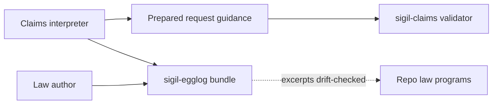

# sigil-egglog Language Instruction Skill - Plan

## Goal Capsule

- **Objective:** A model asked to interpret a design into claims rows, or to extend the repository's egglog laws, can load one skill that teaches the egglog/datalog language as this repository pins and uses it — verified against the repo's own law files rather than inherited from tribal knowledge or an unwired root document.
- **Means:** A new `sigil-egglog` skill under `integrations/skills/`, absorbing `egg.md` trimmed to its two consumers, joining the install catalog with empty design-skill dependencies, embedding law excerpts in-bundle, and binding dialect material with drift tests (KTD1, KTD3, KTD5).
- **Product authority:** No existing command, ingest path, stored projection, guidance fingerprint, or sibling skill changes behavior. The only deletion is the unreferenced root `egg.md`.
- **Execution profile:** Follows the 0.8 sibling skills (`sigil-understand`, `sigil-write`, `sigil-evaluate`), which carry no `.sigil` contracts; the repo's contract-first approval gate does not apply. The Rust drift tests extend the existing `packages/sigilc/tests/` pattern without touching any fingerprinted file.
- **Open blockers:** None.
- **Who finishes:** `ce-work` or a human implementer.

---

## Product Contract

### Summary

A new `sigil-egglog` skill becomes this repository's egglog/datalog language authority: one versioned, self-contained bundle teaching both the claims interpreter and the repo's law authors, absorbing today's orphaned `egg.md` as its language reference. The skill joins the install catalog with no design-skill dependencies; language lives in in-bundle references. The `sigil-claims` binary and its compiled-in guidance stay byte-identical; drift between skill and guidance fails the test suite.

### Problem Frame

The claims pipeline asks an external model to emit egglog S-expression rows. Its prepared request carries the row shapes — `vocabulary.md` publishes the columns, relations, and refusals — and `sigil-understand` is the named authority for the design language being read. Nothing teaches the language those rows are written in. A model without egglog/datalog background gets vocabulary without grammar: it can copy shapes, but it has no instruction for what a fact or a relation is, why rules are refused, or how its claims will be judged.

Law authors are worse off. Four egglog programs — `packages/sigilc/src/kernel.egg`, `design.egg`, `comparison.egg`, and `claims/claims.egg` — implement the repo's judgments against a git-pinned egglog 3.0.0 whose own documentation lives upstream. The one document explaining that engine to language-model authors, `egg.md`, sits at the repo root referenced by nothing, its source links pointing at the upstream checkout rather than at anything a contributor here can open.

The repo already solved this shape for the Sigil language: `sigil-understand` is a self-contained, versioned, released bundle, and the claims guidance is drift-tested against it in both directions. Egglog/datalog is the second language this repository depends on, with no equivalent.

### Key Decisions

- One authority serves both consumers. The skill teaches the interpreter's dialect background and the law authors' full language from a single bundle. *(session-settled: user-directed — chosen over separate interpreter and law-author instructions: one place to keep accurate against the pinned engine.)* Governs R1, R2, R3.
- `egg.md` is absorbed, not referenced in place. The skill owns the language content; the root copy is removed. *(session-settled: user-directed — chosen over referencing the root file: installed skills are self-contained bundles, and a root-level orphan serves neither consumer.)* Governs R4, R5.
- No binary change. The guidance bundle and its fingerprint stay byte-identical, the tool keeps deciding alone what it accepts, and drift is caught by tests. *(session-settled: user-directed — chosen over guidance edits and single-source generation: the fingerprint stays stable and nothing outside the binary widens acceptance.)* Governs R6, R7, R8.
- Named `sigil-egglog`, family-prefixed like its siblings. *(session-settled: user-directed — chosen over `sigil-claims-language` and `egglog`: family routing reads as sigil-owned for both audiences.)* Governs R1.

<!-- ce-section: work-relationships -->
### How This Work Fits Together

This plan covers the egglog/datalog language instruction only. It rides alongside the claims subsystem's two plans — the shipped interpretation plan and the in-flight flow-decomposition plan — and changes neither's commitments.

- Serves: both plans' interpreter path, as language background; and the law programs the shipped plan introduced, as the authoring reference.
- Can proceed independently of: the flow-decomposition plan's remaining units; neither plan waits on this skill.
- Still to decide: nothing shared — the frozen-file constraint R7 protects is the shipped plan's KTD8, already fixed.

### Actors

- A1. **Claims interpreter** — the external model that reads a prepared request and returns Datalog claims; loads the skill for language background while the request's guidance bundle stays the binding row specification.
- A2. **Law authors** — developers and agents extending or reviewing the repo's egglog law programs; load the skill as the language reference for the pinned engine.
- A3. **Skill hosts** — agent harnesses that install the repo's skill bundles globally and route on name and description.

### Requirements

**Skill bundle**

- R1. A `sigil-egglog` skill exists under `integrations/skills/`, following the sibling bundle shape (`SKILL.md`, `references/`, `VERSION`, `compatibility.json`, `agents/openai.yaml`, evals), and its description routes both A1 and A2 to it.
- R2. The skill is self-contained and offline: no reference inside it resolves to a file outside its directory, so an installed copy works without the repository checkout.
- R3. The skill carries the egglog/datalog language instruction for the engine the crate pins: S-expression syntax, sorts, datatypes, constructors and relations, functions and merge policies, facts and actions, rules, rulesets and schedules, equality saturation and extraction, and the common mistakes that matter at that version.

**Absorption of egg.md**

- R4. The skill's language reference absorbs `egg.md`'s content, trimmed to what the two consumers and the repo's four law programs use.
- R5. The root `egg.md` is removed once its content is absorbed. Every absorbed claim that used an upstream source link names this repo's law files (`packages/sigilc/src/kernel.egg`, `design.egg`, `comparison.egg`, `claims/claims.egg`) and embeds the demonstrating snippet in-bundle, or names the pinned upstream revision. Installed copies verify from the skill; checkout drift tests prove each snippet still occurs in the named law file.

**Boundary with the tool**

- R6. The skill teaches the claims dialect boundary exactly as the tool enforces it — a returned artifact is data-only rows with quoted string literals; a rule, command, schedule, or non-literal argument is refused whole — and states which side is binding: the prepared request's guidance for rows, this skill for the language, `sigil-understand` for the design being read.
- R7. Nothing the `sigil-claims` binary compiles in, hashes, or reads changes: the guidance bundle, the vocabulary constants, `claims.egg`, and every file `eqval::fingerprint()` covers stay byte-identical.
- R8. Drift tests bind the skill's dialect material to the compiled-in guidance in both directions, the way `sections.md` is bound to `sigil-understand`'s role table: a change to either side without the other fails the test suite. The bind is returned-row kinds and refusal tokens (rule, command, schedule, non-literal argument, whole-artifact refuse), not a restatement of `vocabulary.md` column tables.

**Maintenance**

- R9. The skill is maintained and released with the repository, like its siblings; `compatibility.json` carries the Sigil version, and the language reference names the pinned egglog revision it describes.

### Key Flows

- F1. Interpret with the skill as background
  - **Trigger:** A host prepares a claims request and runs an interpreter that has `sigil-egglog` loaded.
  - **Actors:** A1, A3
  - **Steps:** The host runs `sigil-claims prepare`; the interpreter reads the request's guidance bundle (binding) and the skill (language background); it returns data-only rows; the tool validates exactly as it does today.
  - **Outcome:** Rows the tool accepts, from an interpreter that can explain refusals from language knowledge rather than shape-copying alone.
  - **Covered by:** R1, R3, R6, R7
- F2. Author or extend a law
  - **Trigger:** A law author extends one of the repo's `.egg` programs.
  - **Actors:** A2
  - **Steps:** The author loads the skill, reads the language instruction with in-bundle excerpts named to the repo's law files, and edits the law program.
  - **Outcome:** Law changes grounded in a reference whose examples resolve inside the skill, with the engine's semantics documented for the pinned version.
  - **Covered by:** R1, R3, R5, R9

### Acceptance Examples

- AE1. Absorbed claim is verifiable
  - **Covers R5.**
  - **Given** the absorbed language reference names a repo law file and embeds a snippet.
  - **When** a checkout reader or the drift test opens that law file.
  - **Then** the referenced pattern is demonstrated there — no link resolves to the upstream checkout or to a path outside the skill directory.
- AE2. Skill alone answers a dialect question
  - **Covers R2, R3, R6.**
  - **Given** the skill installed on a host, with no repository checkout present.
  - **When** an interpreter asks why a returned artifact containing a rule was refused.
  - **Then** the skill's dialect section answers from its own content: rules are not data, and the artifact is refused whole.
- AE3. Drift fails closed
  - **Covers R8.**
  - **Given** the skill's dialect section and the compiled-in `vocabulary.md` agree on every returned-row kind and refusal token.
  - **When** either side changes a kind or refusal token without the other.
  - **Then** the drift test fails, naming the divergent side.

### Success Criteria

- A model holding only a prepared request and the skill can explain why an artifact was refused and what would make it valid, without any other egglog documentation.
- A law author extends `claims.egg` with the skill as the only egglog reference and cites patterns from this repo's law files, not upstream paths.
- The `sigil-claims` run fingerprint is byte-identical before and after the change.

### Scope Boundaries

- A claims workflow skill (host-side prepare → interpret → ingest orchestration) is out of scope; this is the language instruction only.
- Widening the claims dialect is out of scope; the boundary stays exactly as the tool enforces it (R6).
- Editing the guidance bundle, the vocabulary constants, or any file whose text the `sigil-claims` or eqval fingerprints hash is out of scope (R7).
- Wiring the skill into the binary's request or report output is out of scope; the tool never reads the skill.
- Teaching the Sigil design language is out of scope; `sigil-understand` keeps that authority.
- Pointing 0.8 sibling or legacy `sigil` descriptions at this skill is out of scope.
- Declaring `requiredSkills: ["sigil-understand"]` is out of scope; A2 does not need the design pack.
- Evals that invoke `sigil-claims` as the skill's judge are out of scope.

### Dependencies / Assumptions

- The prepared request's guidance bundle remains the binding row specification, so an interpreter without the skill installed still functions; the skill improves interpretation quality, it is not a prerequisite.
- The sibling bundle shape is the pattern to follow: `sigil-understand`, `sigil-write`, and `sigil-evaluate` carry no `.sigil` contracts of their own, so the new skill ships none either.
- `egg.md` describes the pinned engine accurately — egglog 3.0.0 at the revision recorded in `packages/sigilc/Cargo.toml` — but its repository map links to the upstream checkout, which is what R5 re-anchors in-bundle.
- The drift tests are ordinary Rust tests in `packages/sigilc/tests/`, outside every fingerprinted file; adding one changes no stored world and no guidance fingerprint.
- Any directory under `integrations/skills/` that contains `SKILL.md` appears in `sigil skill list` and ships with CLI releases.

### Sources / Research

- `egg.md` — absorption source; a 1394-line egglog guide for language-model authors, referenced by nothing in the repository.
- `packages/sigilc/src/claims/guidance/` — the four compiled-in guidance files; `vocabulary.md` publishes the row shapes the skill must not contradict.
- `packages/sigilc/src/claims/dialect.rs` — refusal semantics for non-data artifacts.
- `packages/sigilc/src/claims/guidance.rs` — the `include_str!` bundle and its fingerprint; nothing on disk is read at runtime.
- `packages/sigilc/tests/claims_guidance.rs` — the existing drift-test pattern binding `sections.md` to `sigil-understand`'s role table in both directions.
- `docs/plans/2026-09-17-1838-feat-sigil-datalog-interpretation-plan.md` — R5 (sigil-understand as the design-language authority), R6/R7 and KTD3 (guidance compiled in; nothing outside the binary widens acceptance), KTD8 (the fingerprinted files that must not change).
- `packages/sigilc/Cargo.toml` and `Cargo.lock` — egglog 3.0.0 pinned at revision `90635860397ce710f8c0a4eeb04154a8ebc3ac05`.
- `integrations/skills/` — the sibling bundle shape: `SKILL.md`, `references/`, `VERSION`, `compatibility.json`, `agents/openai.yaml`, evals.
- `scripts/validate-skill.ts` — `FOUNDATION_SKILLS` and `validateFoundation` (frontmatter, version, compatibility, adapter, no outbound documentary links).
- `packages/cli/tests/cli_test.ts` and `scripts/test-cli-release.ts` — exact `sigil skill list` name lists that fail when a new `SKILL.md` appears.

---

## Planning Contract

Product Contract preservation: restructured, no scope change: R5/AE1 checkout links → in-bundle named excerpts plus drift; R8 bind surface scoped to kinds and refusal tokens.

### Key Technical Decisions

- KTD1. **Catalog sibling with empty design-skill deps.** Add `sigil-egglog` to `FOUNDATION_SKILLS` with `requiredSkills: []`, and update every exact catalog name list in the same change. Chosen over shipping an unvalidated extra bundle: any `SKILL.md` already appears in `sigil skill list`, and `validateFoundation` is how R2 is enforced without pulling A2 through the 0.8 design pack. Instantiates R1, R2, R9.
- KTD2. **SKILL.md is a router; language lives in `references/`.** Thin entry (~sibling length) that sends A1 to the dialect/boundary note and A2 to the language reference. Chosen over dumping absorbed `egg.md` into the host's first skill message. Instantiates R1, R3.
- KTD3. **In-bundle excerpts, not checkout hyperlinks.** Cite law files by name and embed the demonstrating snippets; drift tests prove each snippet occurs in the named source. Chosen over markdown links to `packages/sigilc/src/*.egg`, which break global/project installs and fail `validateFoundation`. Instantiates R2, R5. (session-settled product decision on absorb-and-delete: user-directed — chosen over referencing the root file: installed skills are self-contained bundles.)
- KTD4. **Drop the Turtle/RDF modeling chapter except a short boundary.** Keep: egglog does not parse Turtle; the compiler lowers RDF-shaped tables in Rust; the interpreter must not emit Turtle or rules. Drop: lossless row contract, raw-triple ingestion, full RDF domain, `owl:sameAs`, Turtle-scale notes, tested Turtle example. The four law files use `(relation …)`, `(function … :merge …)`, `(ruleset …)`, `(rule … :ruleset …)`, `set`, `!=`, and string-literal predicates; they do not parse Turtle. Instantiates R4.
- KTD5. **Bind kinds and refusal tokens, not column tables.** Drift tests require every returned-row kind the skill names to appear in compiled `vocabulary::RETURNED` / `vocabulary.md`, and every refusal token the skill teaches to appear in `dialect.rs` / the vocabulary opening — both directions. Chosen over republishing column tables, which would create a second row spec and fight R6. Instantiates R6, R8. (session-settled product decision on no binary change: user-directed — chosen over guidance edits and single-source generation: the fingerprint stays stable.)
- KTD6. **Two observer eval fixtures; no `sigil-claims` judge.** One A1 fixture (skill-only, no checkout, explain whole-artifact refusal of a rule) and one A2 fixture (skill-only, extend a tiny in-fixture `.egg` from in-bundle patterns). Fixtures are specs, not passes; the runner copies the bundle off-tree. Chosen over no evals (R1 sibling shape) and over evals that call the claims tool (out of scope). Instantiates R1, R2, AE2.

### High-Level Technical Design

Three authorities stay separate. The skill never enters the binary; the binary never reads the skill.



A1 reads guidance as the binding row spec and the skill as language background. A2 reads only the skill. Checkout tests read both the skill markdown and the law files / compiled guidance without hashing the skill into either fingerprint.

### Output Structure

```
integrations/skills/sigil-egglog/
  SKILL.md
  VERSION
  compatibility.json
  agents/openai.yaml
  references/
    (dialect / language markdown; implementer names files)
  evals/
    (A1 interpreter fixture)
    (A2 law-author fixture)
```

The tree is a scope declaration. Per-unit `Files` lists stay authoritative.

### Implementation constraints

Do not edit files `eqval::fingerprint()` concatenates: `packages/sigilc/src/kernel.egg`, `design.egg`, `comparison.egg`, `comparison.rs`, `eqval.rs`, `turtle.rs`, `assertions.rs`, `packages/sigilc/Cargo.toml`, `Cargo.lock`.

Do not edit files `guidance::fingerprint()` concatenates: `packages/sigilc/src/claims/guidance/sections.md`, `vocabulary.md`, `examples.md`, `rejected.md`, `packages/sigilc/src/claims/vocabulary.rs`, `packages/sigilc/src/claims/claims.egg`.

Do not edit `dialect.rs`, `guidance.rs`, or claims CLI behavior. New tests may read these files.

Egglog pin stays `rev = "90635860397ce710f8c0a4eeb04154a8ebc3ac05"` as already recorded; do not retarget Cargo files to mention the skill.

### Sequencing

U1 catalog and bundle shell, then U2 language content and `egg.md` deletion, then U3 and U4 in parallel.

### Deferred to implementation

- Exact `references/` filenames and how many markdown files the absorbed guide splits into.
- Which law-file lines become excerpts, as long as each excerpt occurs verbatim in the named source (KTD3).
- Artifact `VERSION` patch number, matching sibling `0.1.0` unless release practice has moved.

---

## Implementation Units

### U1. Catalog the skill bundle

- **Goal:** `sigil-egglog` is a discoverable, installable catalog sibling with empty design-skill dependencies and a thin router `SKILL.md`.
- **Requirements:** R1, R2, R9; KTD1, KTD2
- **Dependencies:** None
- **Files:**
  - create `integrations/skills/sigil-egglog/SKILL.md`
  - create `integrations/skills/sigil-egglog/VERSION`
  - create `integrations/skills/sigil-egglog/compatibility.json`
  - create `integrations/skills/sigil-egglog/agents/openai.yaml`
  - create `integrations/skills/sigil-egglog/references/` stub markdown files that `SKILL.md` links (content filled in U2)
  - modify `scripts/validate-skill.ts`
  - modify `scripts/test-cli-release.ts`
  - modify `packages/cli/tests/cli_test.ts`
  - modify `README.md`
  - modify `CONTRIBUTING.md`
  - modify `COMPATIBILITY.md`
  - modify `integrations/README.md`
- **Approach:**
  1. Add the bundle files matching `sigil-understand`'s standalone shape: `name: sigil-egglog`, description naming both audiences (claims data-only rows / egglog-datalog, and authoring `.egg` laws), `sigilVersion: "0.8.0"`, `requiredSkills: []`, adapter `default_prompt` containing `$sigil-egglog`.
  2. Point `SKILL.md` at stub files under `references/` that U2 fills; the stubs must exist so foundation validation can resolve those links. No outbound links.
  3. Insert `"sigil-egglog": []` into `FOUNDATION_SKILLS`.
  4. Extend every exact skill-name list and count so `sigil skill list` and `validateFoundation` pass (legacy `sigil` remains listed; `sigil-anchor-indexer` stays unlistable).
  5. Update catalog prose that says three 0.8 design skills or four valid skills so it still distinguishes design siblings from this language skill without dropping the new name.
- **Patterns to follow:** `integrations/skills/sigil-understand/SKILL.md`, `compatibility.json`, `agents/openai.yaml`; `scripts/validate-skill.ts` `FOUNDATION_SKILLS`.
- **Test scenarios:**
  - Happy path: `sigil skill list` includes `sigil-egglog` alongside `sigil`, `sigil-evaluate`, `sigil-understand`, and `sigil-write`.
  - Happy path: `validateFoundation` on an installed catalog accepts `sigil-egglog` with empty `requiredSkills` and `$sigil-egglog` in the adapter prompt.
  - Edge: a relocated/copied catalog still validates; no documentary link whose owner is outside `{sigil-egglog}`.
  - Error: omitting `VERSION`, `compatibility.json`, or `agents/openai.yaml` fails foundation validation the same way a missing understand file does.
- **Verification:** CLI skill-list tests and `deno task test:skill` pass. Description names both audiences. No markdown link leaves the skill directory.

### U2. Absorb the trimmed language reference

- **Goal:** The skill teaches the pinned engine from in-bundle references; root `egg.md` is gone.
- **Requirements:** R2, R3, R4, R5, R6, R9; KTD2, KTD3, KTD4
- **Dependencies:** U1
- **Files:**
  - modify `integrations/skills/sigil-egglog/references/` (fill the U1 stub language and dialect markdown)
  - modify `integrations/skills/sigil-egglog/SKILL.md`
  - delete `egg.md`
- **Approach:**
  1. Absorb `egg.md` into `references/`, trimmed per KTD4: keep S-expr syntax, sorts, datatypes, constructors vs relations vs functions/merge, facts and actions, rules/rulesets/schedules, equality saturation/extraction, and the common mistakes the four law files actually hit.
  2. Split A1 dialect/boundary (data-only rows, whole-artifact refuse, which side is binding per R6) from A2 full language; `SKILL.md` routes each audience.
  3. Name the four law files in prose and embed demonstrating snippets; name egglog 3.0.0 at `90635860397ce710f8c0a4eeb04154a8ebc3ac05`.
  4. Drop upstream `src/lib.md` map links, CLI/compiler embedding API except “Rust host runs egglog”, containers/proofs/`input` the laws do not use, and the Turtle modeling chapter except the KTD4 boundary note.
  5. Delete root `egg.md` and grep the repo so nothing still expects the orphan.
- **Patterns to follow:** `egg.md` as absorption source; `integrations/skills/sigil-understand/references/` for self-contained language authority; the four `.egg` programs for what to keep.
- **Test scenarios:**
  - Happy path: Covers AE1. A rule-semantics claim in the language reference names a law file and embeds a snippet that occurs in that file.
  - Happy path: Covers AE2. The dialect section, with no checkout, states that a rule in a returned artifact is refused whole.
  - Edge: no markdown link in the skill directory resolves outside it, including no `packages/sigilc/...` hyperlink.
  - Error: remaining repo references to root `egg.md` are absent after deletion.
- **Verification:** Installed-copy reading answers the dialect refusal question from skill content alone. Law-file names in the reference match snippets that exist in those files. Root `egg.md` is gone.

### U3. Bind dialect and excerpts with drift tests

- **Goal:** A change to skill dialect material or compiled guidance kinds/refusals, or to an embedded law snippet without the source, fails the suite.
- **Requirements:** R7, R8; KTD3, KTD5; AE1, AE3
- **Dependencies:** U2
- **Files:**
  - create `packages/sigilc/tests/` new test module beside `claims_guidance.rs`
  - test `packages/sigilc/tests/claims_guidance.rs` (pattern only; do not weaken existing binds)
- **Approach:**
  1. Read skill markdown from the repo root the way `bundled_role_descriptions_do_not_drift_from_the_language_authority` reads `sigil-understand`.
  2. Compare compiled guidance via `guidance::document`, not disk copies of guidance files.
  3. Both directions for kinds and refusal tokens per KTD5. For excerpts, each embedded snippet must occur verbatim in the named law file on disk (read-only); do not require the law file's content to live in the skill.
  4. Do not add skill files to `guidance::fingerprint()` or `eqval::fingerprint()`.
- **Execution note:** Add the failing drift tests before filling remaining skill wording that those tests pin.
- **Patterns to follow:** `packages/sigilc/tests/claims_guidance.rs` (`bundle_text`, `repo_root`, bidirectional `assert_eq!` / token membership).
- **Test scenarios:**
  - Happy path: Covers AE3. Every returned-row kind the skill names is in compiled vocabulary, and every compiled returned-row kind the skill documents is named in the skill.
  - Happy path: Covers AE3. Refusal tokens the skill teaches (rule, command, schedule, non-literal argument, whole-artifact refuse) appear in compiled dialect/vocabulary opening, and those compiled tokens the skill covers appear in the skill.
  - Happy path: Covers AE1. Each in-bundle excerpt occurs verbatim in the named law file.
  - Error: dropping a kind from the skill or a refusal sentence from guidance fails with a message that names the divergent side.
  - Edge: fingerprint helpers still hash only the previously covered sources; the new tests do not rewrite those files.
- **Verification:** `deno task test:sigilc` passes. Guidance and eqval fingerprints are unchanged from the pre-change values recorded in existing fingerprint tests.

### U4. Ship observer eval fixtures

- **Goal:** An observer can run A1 and A2 against a copy of the skill outside the checkout.
- **Requirements:** R1, R2, AE2; KTD6
- **Dependencies:** U2
- **Files:**
  - create `integrations/skills/sigil-egglog/evals/` interpreter fixture
  - create `integrations/skills/sigil-egglog/evals/` law-author fixture
- **Approach:**
  1. Mirror `integrations/skills/sigil-understand/evals/understanding-fixture.md`: copy the complete bundle off-checkout, fresh agent, do not give acceptance notes to the agent, fixture is not itself an observed pass.
  2. A1 request: with only the installed skill, explain why an artifact containing a `(rule …)` is refused whole.
  3. A2 request: with only the installed skill, extend a tiny in-fixture `.egg` using in-bundle patterns (relation/function/ruleset/rule as the laws use them).
  4. Do not invoke `sigil-claims`. Do not archive a run under `docs/skill-evaluation/` in this work.
- **Patterns to follow:** `integrations/skills/sigil-understand/evals/understanding-fixture.md`; `integrations/skills/sigil-evaluate/evals/design-review-fixture.md`.
- **Test scenarios:**
  - Happy path: Covers AE2. A1 fixture runner setup copies the bundle outside the checkout and withholds observer notes from the agent.
  - Happy path: A2 fixture supplies a small `.egg` in the request and expects an edit grounded only in skill references.
  - Error: neither fixture tells the agent to run `sigil-claims` or to open `packages/sigilc`.
- **Verification:** Both fixtures exist, name `$sigil-egglog`, and are readable as observer specs. `validateFoundation` still passes (evals are not hashed).

---

## Verification Contract

| Gate | Command | Proves |
| --- | --- | --- |
| Claims crate + drift | `deno task test:sigilc` | U3 binds; existing claims tests still pass; fingerprints unchanged |
| Foundation catalog | `deno task test:skill` | U1 `validateFoundation` on `sigil-egglog` |
| CLI skill list / install | `deno task test:cli` | U1 catalog names and relocated copies |
| Full suite | `deno task test` | No leftover catalog-count failures (`scripts/skill-foundation_test.ts` included) |

`release:validate` is not required for this change. Behavioral skill evaluation is the U4 observer fixtures; they are not an automated pass.

Do not run or claim 0.8 compiler validation as proof of this skill.

---

## Definition of Done

- R1–R9 hold on the diff: catalog sibling exists, installed copy has no outbound references, `egg.md` is absorbed and deleted, binary/guidance/eqval fingerprints are unchanged, drift tests fail closed on kinds/refusals and excerpts.
- U1–U4 verification fields are met.
- Abandoned-attempt files (partial reference drafts, extra catalog experiments) are not left in the diff.
- No unit edits a file listed under Implementation constraints.

### Per-unit done

| Unit | Done when |
| --- | --- |
| U1 | Skill lists and foundation validation include `sigil-egglog` with empty deps |
| U2 | Language/dialect references exist; root `egg.md` is gone; no outbound links |
| U3 | Bidirectional drift tests pass; fingerprints unchanged |
| U4 | Two observer fixtures exist and do not call `sigil-claims` |

---

## System-Wide Impact

`sigil skill list` and CLI releases gain a fifth listed name (`sigil` plus four source skills). Hosts that install the complete catalog receive `sigil-egglog` without a separate install step. 0.8 design-skill routing is unchanged. Claims prepare/ingest/report output is unchanged.

---

## Risks

- **Checkout-only examples.** Markdown links to law files would make global install look successful while A1 cannot open examples. Mitigated by KTD3 and U3 excerpt tests.
- **Second row spec.** Restating `vocabulary.md` columns in the skill can teach a shape the binary refuses. Mitigated by KTD5.
- **Fingerprint landmines.** Editing `Cargo.toml` comments, `.egg` laws, or `turtle.rs` moves `eqval::fingerprint()`. Mitigated by the frozen-file list; tests must only read those files.
- **Catalog-count misses.** A new `SKILL.md` fails `cli_test` / `test-cli-release` until every exact list updates. Mitigated by U1 owning those files in the same unit.
