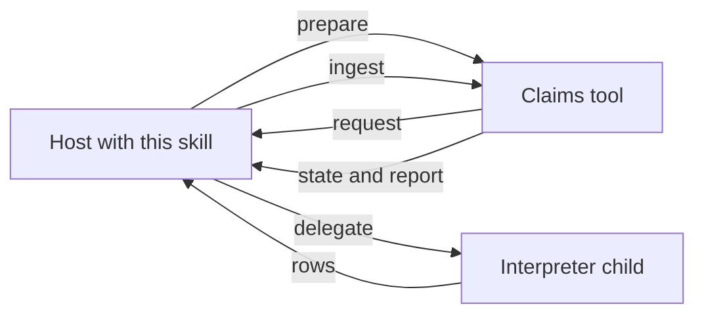
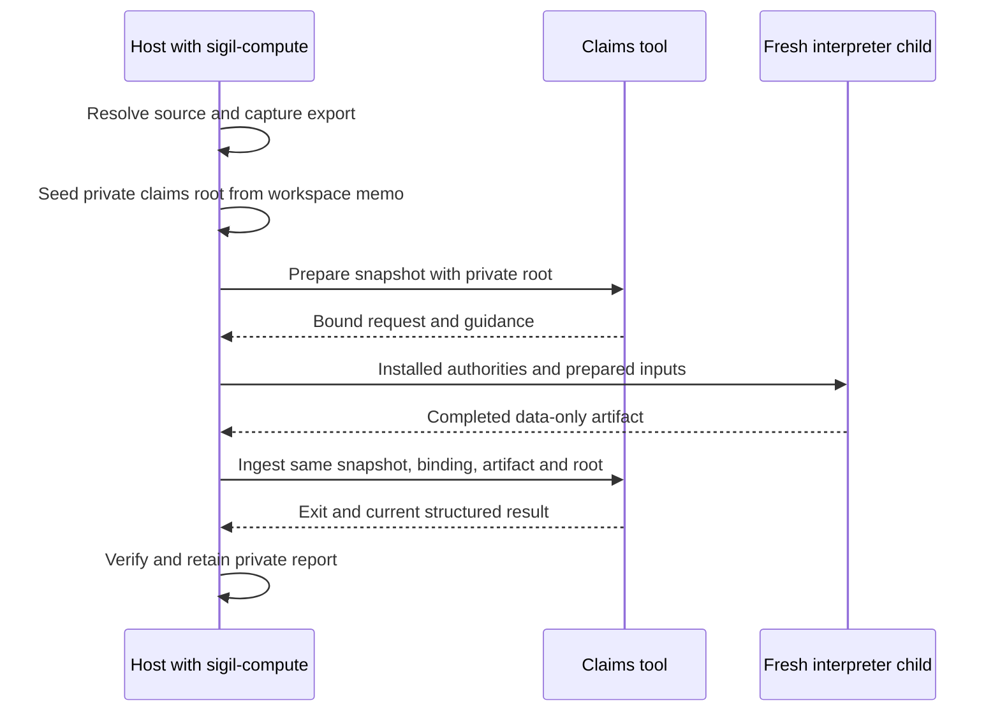
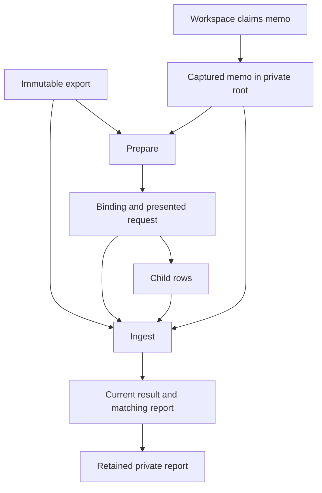
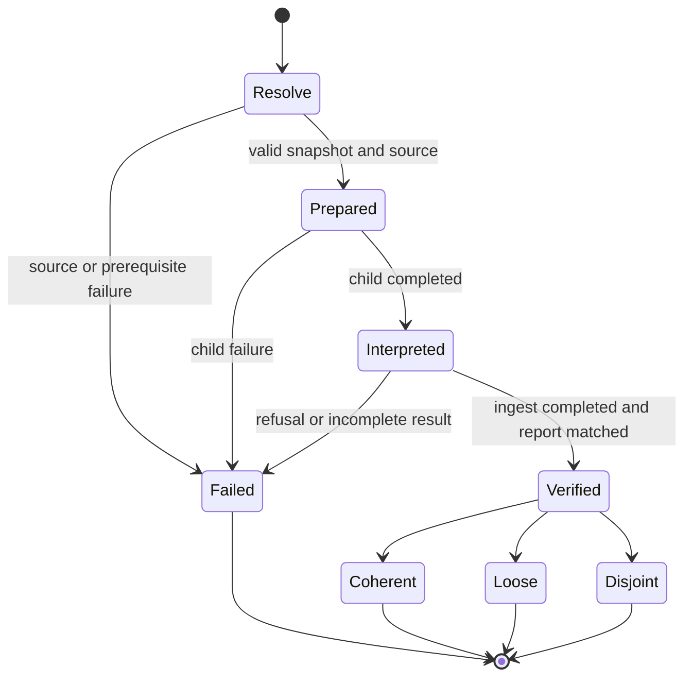

# Computed Design Evaluation Skill - Plan

## Goal Capsule

- **Objective:** A coding agent asked for a claims or computed check on an existing Sigil 0.8 design returns that design's ingest state — Coherent, Loose, or Disjoint — plus the findings report, and never invents a state when ingest did not succeed.
- **Means:** A new catalog skill, sibling of advisory review, that runs `sigil-claims` prepare and ingest and delegates interpretation to a fresh child loaded with `sigil-understand` and `sigil-egglog`.
- **Product authority:** `sigil-write` still delegates to `sigil-evaluate`. The claims binary still does not read skills. Generic review requests stay on advisory evaluation.
- **Open blockers:** None.
- **Execution:** Add the skill and catalog coverage, then verify observed host/child behavior. The implementing agent owns all units through the Definition of Done; no compiler changes are planned.

---

## Product Contract

### Summary

A new 0.8 skill evaluates an existing design by running the claims loop. The skill prepares, a child interprets, the skill ingests, and the host receives ingest's Coherent, Loose, or Disjoint plus the findings report. It is the computed sibling of `sigil-evaluate`, loaded only when a claims or computed check is asked for.

The implementation adds `sigil-compute` using the existing catalog and claims commands. It covers the full product scope, including packaging, source selection, result provenance, and observed failure handling.

### Problem Frame

`sigil-claims` never launches a model. Prepare writes a request; ingest validates rows, saturates laws, and reports. Nothing in the skill catalog owns that loop. `sigil-evaluate` reviews in prose. `sigil-understand` and `sigil-egglog` teach languages. `sigil-write` still sends review to evaluate. A host asked for computed findings has to glue the binary to a model by hand, or skip claims entirely.

### Key Decisions

- **This skill owns the loop; the child only interprets.** *(session-settled: user-directed — chosen over one subagent that also starts the tool, and over the binary naming or shipping `sigil-egglog`: keep tool ownership here and keep skills host-loaded.)* Governs R3, R4, R11.
- **Computed sibling of advisory review, not a replacement.** *(session-settled: user-directed — chosen over replacing evaluate when the binary exists, making this write's reviewer, or folding claims into evaluate: two evaluation jobs stay distinct.)* Governs R1, R10.
- **Load only when a claims or computed check is asked for.** *(session-settled: user-directed — chosen over defaulting whenever the binary exists, auto-running after write, or running whenever a design is in scope: generic review stays advisory.)* Governs R2.
- **Hand back ingest state plus the findings report.** *(session-settled: user-directed — chosen over eqval's Design sentences and over the full Compare Drift/Converged/Closed lattice: this loop cannot prove comparison completeness.)* Governs R6.
- **Stop on the real failure; do not retry.** *(session-settled: user-directed — chosen over one refuse-retry and over a write-style portable handoff: no invented state.)* Governs R7, R8.
- **Evaluate an existing 0.8 design; do not author or rewrite one.** The "design world" is the claims the tool accepted, a byproduct of ingest, not a new contract file. Governs R9, R12.

<!-- ce-section: work-relationships -->
### How This Work Fits Together

This plan covers the computed evaluation skill only. The claims binary, advisory review, authoring, and dialect instruction stay as they are.

- Depends on: the shipped claims interpretation in [docs/plans/2026-09-17-1838-feat-sigil-datalog-interpretation-plan.md](2026-09-17-1838-feat-sigil-datalog-interpretation-plan.md), which already emits Coherent, Loose, and Disjoint; and [docs/plans/2026-09-22-1421-feat-sigil-egglog-skill-plan.md](2026-09-22-1421-feat-sigil-egglog-skill-plan.md) as the child's dialect authority.
- Shares a job name with: `sigil-evaluate` — advisory vs computed, not a successor.
- Can proceed independently of: remaining units in [docs/plans/2026-09-18-1719-feat-claims-flow-decomposition-plan.md](2026-09-18-1719-feat-claims-flow-decomposition-plan.md). Flow findings already stay Loose (R6).
- Catalog name: `sigil-compute`, distinct from the `sigil-claims` binary (KTD1).

### Actors

- A1. **Coding agent host** — the agent that loaded this skill because a claims or computed check was asked for.
- A2. **Requester** — the human (or calling skill) who asked for that check and reads the state and report.
- A3. **Interpreter child** — a fresh subagent that reads the prepared request with `sigil-understand` and `sigil-egglog` and returns data-only rows. It does not run `sigil-claims`.
- A4. **Claims tool** — `sigil-claims` prepare and ingest. It never launches a model.

### Key Flows

- F1. Computed check on an existing design
  - **Trigger:** A1 is asked for a claims or computed check on an existing 0.8 design.
  - **Steps:** This skill runs prepare. It sends A3 the prepared request. A3 returns data-only rows. This skill runs ingest. A1 hands A2 the ingest state and findings report.
  - **Outcome:** A2 sees Coherent, Loose, or Disjoint plus findings. Accepted rows exist only as ingest's byproduct.
  - **Covers:** R2, R3, R4, R5, R6, R9, R12.

- F2. Loop cannot finish
  - **Trigger:** Prepare, A3, or ingest cannot run, or ingest refuses the artifact.
  - **Steps:** This skill stops. It names what broke. It does not emit Coherent, Loose, or Disjoint.
  - **Outcome:** A2 sees the real failure, not a design state.
  - **Covers:** R7, R8.

### Requirements

**Routing**

- R1. A new catalog skill exists beside `sigil-understand`, `sigil-write`, `sigil-evaluate`, and `sigil-egglog`, as the computed counterpart of advisory evaluation.
- R2. Its description routes A1 to it only when the request names claims, `sigil-claims`, computed findings, or this skill. A generic request to review or evaluate a design stays on `sigil-evaluate`.

**Loop**

- R3. This skill runs `sigil-claims` prepare and ingest. A3 does not start the tool.
- R4. Interpretation is a fresh child loaded with `sigil-understand` and `sigil-egglog`. The child returns data-only rows and stops.
- R5. Row shapes and accepted names stay bound by the prepared request's guidance. `sigil-understand` is design-language authority. `sigil-egglog` is dialect language background.

**Result**

- R6. After a successful ingest, A1 hands back that report's state — Coherent, Loose, or Disjoint — and the findings. Flow-class findings stay warnings and do not by themselves make Disjoint. Compare Drift, Converged, and Closed are not this skill's states.
- R7. Coherent, Loose, and Disjoint are emitted only after ingest wrote a report. A refused artifact, a missing binary, a missing child, or a missing export is not a design state.
- R8. On those failures this skill stops and names the break. It does not retry the child.

**Boundaries**

- R9. This skill does not author, revise, or delete design files.
- R10. `sigil-write` still delegates review to `sigil-evaluate`. This skill is not write's reviewer.
- R11. The claims binary still does not read skills. `sigil-egglog` stays host-loaded and drift-bound, like `sigil-understand`.
- R12. The input is an existing Sigil 0.8 design that prepare can run on, not a 0.7 contract and not a greenfield to be written first.

### Acceptance Examples

- AE1. A1 is asked to "review this design" with no claims wording. It does not load this skill. **Covers R2.**
- AE2. A1 is asked for a computed claims check on an existing 0.8 design. This skill prepares, A3 returns data-only rows, ingest writes Loose with only flow findings, and A1 hands back Loose plus that report. **Covers R2, R3, R4, R6, R12.**
- AE3. Ingest derives a contradiction. A1 hands back Disjoint plus the findings report. **Covers R6.**
- AE4. Ingest refuses the child's artifact. A1 reports the refusal and does not name Coherent, Loose, or Disjoint. **Covers R7, R8.**
- AE5. `sigil-claims` is not available. A1 names that failure and stops. **Covers R7, R8.**
- AE6. After `sigil-write` finishes, review is still `sigil-evaluate` unless A2 separately asked for a claims check. **Covers R10.**

### Scope Boundaries

- Wiring `sigil-egglog` into the claims binary, request, or report.
- Changing `sigil-write`'s evaluator.
- Auto-running this loop after authoring or on every design in scope.
- Eqval comparison states (Drift, Converged, Closed) and design-vs-code comparison.
- Retrying a refused interpretation.
- Authoring a new design, or running the legacy 0.7 `sigil` skill.
- Saturating laws inside the model. The tool judges; the child asserts authored commitments only.

### Dependencies / Assumptions

- `sigil-claims`, `sigil-understand`, and `sigil-egglog` are already shipped at the behavior this contract cites.
- A1 can run the claims binary and can delegate a fresh child. If either is missing, R8 applies; that is not a reason to fake a state.
- The claims loop is not in routine use today. Advisory evaluate is the current review path.
- Exit 1 from the claims tool means a gate failure, which includes Disjoint and also refused artifacts. This skill must not treat every exit 1 as Disjoint (R7).

### Planning Resolutions

- Catalog naming is resolved by KTD1.
- Source selection in a workspace with multiple designs is resolved by KTD2.

### Sources / Research

- `packages/sigilc/src/claims/cli.rs` — prepare / ingest / extract-guidance; never launches a model; gate exits.
- `packages/sigilc/src/claims/findings.rs` — report `state` Coherent / Loose / Disjoint; flow class does not gate Disjoint.
- `integrations/skills/sigil-write/SKILL.md` — write delegates `sigil-evaluate`.
- `integrations/skills/sigil-egglog/SKILL.md` — dialect language background; request guidance is binding for rows.
- [docs/plans/2026-09-17-1838-feat-sigil-datalog-interpretation-plan.md](2026-09-17-1838-feat-sigil-datalog-interpretation-plan.md)
- [docs/plans/2026-09-22-1421-feat-sigil-egglog-skill-plan.md](2026-09-22-1421-feat-sigil-egglog-skill-plan.md)

---

## Planning Contract

Product Contract unchanged in scope: all R/A/F/AE IDs and settled decisions are preserved; its deferred planning questions are resolved below.

### Key Technical Decisions

- KTD1. **Package `sigil-compute` as an ordinary catalog skill.** Its initial artifact version is `0.1.0`, language compatibility is `0.8.0`, and required skills are exactly `sigil-understand` and `sigil-egglog`. Follow the sibling entrypoint/reference pattern, with no executable orchestrator or duplicated language authority. The name makes R1–R2 discoverable without colliding with the binary. Existing installer and release discovery already enumerate directories containing `SKILL.md`; update catalog expectations rather than introducing another discovery mechanism.

- KTD2. **Resolve one exact exported source.** Honor an explicit source or an unambiguous design already selected in the conversation. Otherwise use the sole eligible source in the export; if several remain, ask which one before prepare. Resolve user paths to the exact `sources[].path` value, never an arbitrary basename match. An explicitly selected source absent from the export is a failure, not permission to choose another. This implements R12 against `prepare::project` in `packages/sigilc/src/claims/prepare.rs`; prepare owns dependency-closure expansion.

- KTD3. **Capture one immutable input snapshot and private claims store per run.** Accept a supplied valid structural export, or obtain one with the existing `sigil export design` command against the selected workspace. Require successful export before prepare and use that same file for ingest. Retain inputs in a unique run directory with a fresh, initially empty preparation subdirectory. Before prepare, copy any existing workspace `.sigil/claims/interpretations/` into the corresponding location under a private storage root in that run directory; an absent memo starts empty. Use this same private `--root` for both claims commands, retain the seed as evidence, and keep resulting memo writes private without merging them back. Results describe the export and captured memo, including when the workspace changes later. This implements R3, R7, R9 and R12 with existing root selection and binding semantics.

- KTD4. **Make the child's task an explicit interpretation handoff.** Create one fresh child without inherited conversation, and provide resolved installed paths to both required skills, the preparation directory, `request.json`, `binding.json`, and all emitted guidance files. Load `sigil-understand` for design meaning and `sigil-egglog` for the claims dialect, with prepared guidance binding under R5. Its task requires literal data-only rows and overrides ordinary explanatory output. Capture its completed output verbatim; do not repair rows, strip prose, or substitute host interpretation. Missing delegation, missing authority, or interrupted output takes R8's failure path. Under R4, even a memo-reused request with zero presented rows goes through a fresh child, which returns an explicitly completed empty artifact. Preserve whole Logic groupings and do not reconstruct facets omitted by prepare.

- KTD5. **Recognize completed ingest from its current structured result and matching private report.** Require exit 0 with `coherent`/`loose`, or exit 1 with `disjoint`, plus the current invocation's completion payload. Read its reported file and check source, state, report version, export digest, guidance fingerprint, vocabulary generation, and supplied artifact digest against the captured inputs. Compare the report's export digest to the captured binding; the artifact digest uses the tool's BLAKE3 algorithm from `packages/sigilc/src/sources.rs`. Do not hash raw frontend bytes in place of the tool's semantic export digest. A bare exit code, old report, malformed payload, mismatched report, or operational failure supplies no design state under R7–R8. Retain the matched report under KTD3's private root and return its findings plus selected-source and snapshot identity under R6. Identity checks do not identify memo contents; storage isolation provides invocation separation. The binary serializes states in lowercase; presentation may use Coherent, Loose, and Disjoint.

### High-Level Technical Design

The Product Contract's flow diagram establishes ownership. The sequence below specifies the protocol under KTD2–KTD5.

Input provenance follows this data flow. Memoization belongs to the tool; the host preserves its inputs and checks the resulting report.

The lifecycle has an outcome only after KTD5 succeeds. Failure remains distinct from all three design states.

### Risks and Dependencies

- `sigil-claims`, a usable export, both installed skill authorities, and fresh delegation are execution prerequisites. Their absence is an expected reported failure, not a reason to change R4 or R8.
- Ingest is not transactional: it can save memo rows before saturation and write a report before a later judgment-context write fails. KTD5 rejects partial completion and keeps diagnostic artifacts under KTD3's private root.
- Canonical report names are source-derived, while report identity excludes reused memo rows. KTD3 isolates storage because identity checks alone cannot detect every concurrent overwrite. Existing workspace memo can be reused, but new interpretations remain local to this evaluation run.
- Structural bundle checks cannot establish agent behavior. U3 must observe fresh delegation and actual tool output, and distinguish controlled failure injection from live evidence.

### Sequencing and Scope

U1 establishes the skill contract. U2 integrates it into catalog validation and distribution. U3 verifies the installed behavior after both are complete. Use the existing binary and language skills as authorities; no change to advisory review, authoring, claims laws, binary memo semantics, or compiler schemas is required. No competing mechanism needs a bake-off: ownership is settled and the catalog already supplies the integration pattern.

### Output Structure

New files under `integrations/skills/sigil-compute/`:

- `SKILL.md`, `VERSION`, and `compatibility.json`
- `agents/openai.yaml`
- `references/computed-evaluation.md`
- `evals/computed-evaluation-fixture.md` and `evals/README.md`

Observed results belong in `docs/skill-evaluation/sigil-compute.md`, with retained evidence under `docs/skill-evaluation/evidence/sigil-compute/`.

---

## Implementation Units

### U1. Define the computed evaluation skill and handoff

- **Goal:** Make an explicit computed request executable through the existing claims protocol.
- **Requirements:** R1–R9, R11–R12; A1–A4 and F1–F2.
- **Dependencies:** Existing claims commands, `sigil-understand`, and `sigil-egglog`.
- **Files:** Create the seven files listed in Output Structure under `integrations/skills/sigil-compute/`.
- **Approach:** Keep entrypoint routing short and put KTD2–KTD5 in the orchestration reference. Declare metadata under KTD1. Link only within the bundle and its declared sibling dependencies; refer to advisory evaluation by name without adding an undeclared documentary link. Make the fixture distinguish agent-visible inputs from withheld observer expectations.
- **Patterns:** `integrations/skills/sigil-evaluate/SKILL.md`, `integrations/skills/sigil-egglog/SKILL.md`, and `integrations/skills/sigil-write/evals/README.md`.
- **Execution note:** Design behavioral fixtures with the skill instructions; prose-presence assertions are not proof of orchestration.
- **Test scenarios:** Encode these in `evals/computed-evaluation-fixture.md` for U3 to execute.
  1. Covers AE1. Generic review selects advisory evaluation; ordinary writing retains its existing reviewer.
  2. Covers F1 / AE2 / AE3. Explicit computed requests deliver the actual Coherent, flow-only Loose, or contradiction Disjoint result with findings.
  3. An explicit or sole source resolves deterministically; ambiguous candidates cause a source question before prepare, and an absent explicit source fails.
  4. A prepared dependency closure remains tool-owned; selected-source coverage is not presented as a workspace-wide verdict.
  5. A memo-reused zero-row request completes through one fresh child and an empty artifact; interruption with no output is not mistaken for that completion.
  6. A live source edit after export leaves the result explicitly bound to the captured snapshot, without re-export or retry.
- **Verification:** The complete bundle explains each handoff and failure without relying on checkout-local instructions; each scenario has an observable expected outcome.

### U2. Integrate catalog packaging and discovery

- **Goal:** Install, list, validate, and distribute the new bundle with its required siblings.
- **Requirements:** R1–R2, R10–R11; KTD1.
- **Dependencies:** U1.
- **Files:** Modify `scripts/validate-skill.ts`, `scripts/skill-foundation_test.ts`, `packages/cli/tests/cli_test.ts`, `scripts/test-cli-release.ts`, `README.md`, and `integrations/README.md`.
- **Approach:** Add the dependency entry to `FOUNDATION_SKILLS` and update its count message. Update exact catalog and installed-count expectations from five total skills to six. Extend relocated-catalog checks using disposable copies. Document computed routing and its binary/delegation prerequisites beside advisory routing. Reuse `packages/cli/src/installer.ts` and `scripts/build-cli-release.ts` discovery unchanged.
- **Patterns:** Existing catalog install tests and the missing-dependency/link checks in `scripts/skill-foundation_test.ts`.
- **Test scenarios:**
  1. The real catalog lists `sigil-compute` in sorted order and installs all six skills with intact metadata and references.
  2. A relocated installed catalog validates without source checkout access, including paths with spaces and Unicode.
  3. Missing required siblings, incorrect dependency metadata, or a broken bundled reference causes validation failure in a disposable copy.
  4. The packaged release includes the computed skill and both dependencies; existing project/global and copy/symlink installation coverage remains passing.
- **Verification:** Catalog and release checks accept the new bundle, reject broken dependencies, and preserve legacy compatibility behavior. Neither `sigil-write`'s reviewer nor the claims binary acquires a new skill dependency.

### U3. Verify observed behavior and preserve evidence

- **Goal:** Establish that installed agents follow the protocol and report failures truthfully.
- **Requirements:** R2–R12; F1–F2; AE1–AE6; KTD2–KTD5.
- **Dependencies:** U1 and U2.
- **Files:** Complete `integrations/skills/sigil-compute/evals/computed-evaluation-fixture.md` and `integrations/skills/sigil-compute/evals/README.md`; create `docs/skill-evaluation/sigil-compute.md` and captured artifacts under `docs/skill-evaluation/evidence/sigil-compute/`.
- **Approach:** Run independent fixture cases from a copied installed catalog outside checkout discovery. Withhold observer notes from tested agents. Capture skill hashes, input hashes, host/model identity when exposed, agent handles, delegation inputs, tool exits/output, raw child rows, report identity, and design hashes before and after. Label instruction-only restrictions, replayed reports, and injected failures accurately. Reuse existing claims fixtures and laws rather than inventing a parallel engine.
- **Patterns:** `integrations/skills/sigil-write/evals/README.md`; `packages/sigilc/tests/claims_cli.rs`, `claims_findings.rs`, and `claims_prepare.rs` under the same tests directory.
- **Test scenarios:** Execute U1's cases and the following failure cases.
  1. Covers AE4. Refused rows return no design state even if an older report exists; valid Disjoint with the same exit code remains a valid result.
  2. Covers AE5. Missing binary or unsuccessful export stops before interpretation; missing sibling or unavailable delegation stops without same-host substitution.
  3. A child that returns prose, malformed rows, or a truncated response receives no repair or second attempt. A completed invalid artifact is refused by ingest; an interrupted child stops before ingest.
  4. A binding/export mismatch, malformed completion payload, or mismatched report identity produces a failure, without re-prepare or inferred verdict.
  5. An operational failure after report creation produces no state. Use clearly labeled fault injection when the harness cannot reproduce that failure directly.
  6. Two runs with identical supplied rows and different memo seeds write to separate roots, so neither can substitute the other's findings even when report identities and states match. Workspace memo changes after seeding do not affect the private run; retain the seed and report as evidence.
  7. Across successful cases, only the host invokes prepare/ingest, only the child interprets, exactly one child is used, and all design source hashes remain unchanged.
- **Verification:** Live runs establish actual tool and delegation behavior; controlled cases establish failure handling only. Record every unmet scenario as incomplete evidence rather than a pass. No feature-complete claim until required live and controlled cases have their stated evidence.

---

## Verification Contract

Run checks during implementation; this plan does not claim they have run.

| Gate | Applies to | Evidence required |
|---|---|---|
| `deno task test:skill` | U1–U2 | Complete metadata, dependency graph, documentary links, and unchanged language authority validate. |
| `deno test --allow-read --allow-write scripts/skill-foundation_test.ts` | U2 | Relocated bundles validate and corrupted copies fail for the intended reason. |
| `deno test --allow-env --allow-read --allow-write --allow-run --filter 'skill ' packages/cli/tests/cli_test.ts` | U2 | Catalog and installation behavior include the sixth skill. |
| `deno task fmt` and `deno task lint` | Changed TypeScript and metadata | Existing repository formatting/lint gates pass for the implementation. |
| `deno task package:cli` | U2 | Packaging invokes `scripts/test-cli-release.ts` on its staged distribution before archiving and cleanup; that relocated distribution lists and installs the new bundle. |
| Observed cases in `integrations/skills/sigil-compute/evals/computed-evaluation-fixture.md` | U3 | Fresh-child and tool evidence supports success, failure, routing, source selection, and no-edit claims. |

Existing native claims tests establish the protocol examples used by the fixtures. Run relevant native regression tests if implementation exposes a discrepancy requiring a separately justified native change; this plan does not duplicate law-engine tests or authorize such a change silently. There is no repository `release:validate` task; use its existing package and release-smoke gates above.

---

## Definition of Done

- U1: `sigil-compute` has a complete portable bundle, explicit routing, and the KTD2–KTD5 orchestration contract.
- U2: Catalog, installation, relocation, and release verification pass with six skills; both dependencies ship alongside the new bundle.
- U3: Recorded observed runs and labeled controlled cases cover the specified scenarios, including genuine fresh-child success and truthful failure outcomes.
- Every R1–R12 has implementation or verification coverage, all source designs remain unchanged during evaluation, and generic review/authoring retain their prior routing.
- No launch-blocking question, unexplained failed gate, fabricated evidence, abandoned implementation, or experimental runner remains in the change. Temporary failed attempts may be retained only as explicitly labeled evaluation evidence.
