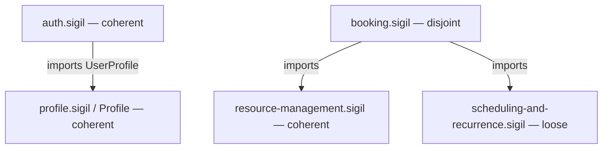
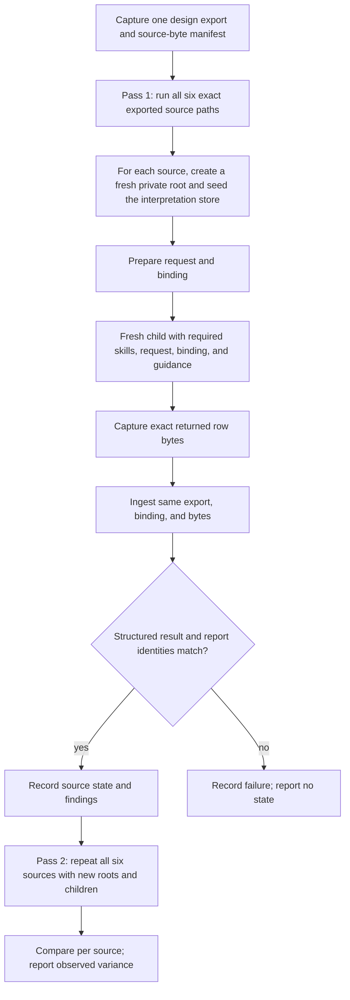

# Slotted computed-evaluation demo - Plan

## Goal Capsule

- **Objective:** A reader with no prior Sigil exposure can follow the demo doc, run the computed claims loop against a realistic multi-module design, and see the intended Coherent, Loose, and Disjoint gradient with structured findings and gate exit codes, alongside any variation observed across independent runs — then see what advisory review says about the same final design.
- **Means:** Update examples/slotted in place: refactor its interfaces to plain prose, complete the modules its constraints already name, embed a deliberate spread of realistic problems; write the demo narrative at docs/computed-evaluation-demo.md outside the example; and update the root README's Examples section.
- **Product authority:** Repo maintainer's direction in the 2026-09-23/24 brainstorm session.
- **Execution profile:** code — a repo content change (design files and READMEs).
- **Open blockers:** None. Tooling is verified present: the `sigil` CLI builds via `deno task build:cli`, and the `sigil-claims` binary exists under packages/sigilc.
- **Who finishes:** the implementing agent or the maintainer, executing the Implementation Units below.

---

## Product Contract

Product Contract preservation: R9–R13 and R17 retain the session-settled choice to put the narrative outside the example; R13 is clarified below to report two observed independent runs without promising future model stability. The six user-directed choices in Key Decisions remain unchanged; every other contract decision is unchanged.

### Summary

Slotted becomes the worked demo of computed evaluation: a complete, all-prose room-booking design whose named modules exist as files, carrying a deliberate spread of realistic problems the claims loop catches. A demo doc outside the example walks the computed gradient — Coherent, Loose, and Disjoint with structured findings and gate exit codes — then shows what sigil-evaluate finds in the same design on its own merits. The example stays bare design files, so evaluation cannot read the answer key. The design files are authored through sigil-write, so the example itself demonstrates the full skill story: written by the writer, reviewed by the evaluator, computed by the claims loop.

### Problem Frame

The claims loop is the repository's flagship computed capability, but nothing realistic demonstrates it. Its observed evidence runs used two-facet stubs (docs/skill-evaluation/sigil-compute.md), examples/ contains no README anywhere, and a README visitor reading the skills table cannot see what a computed Coherent, Loose, or Disjoint means on a design the size of a real product.

The gap is old. The slotted example — the product-modeling showcase — still carries TypeScript shapes that the 0.8 verification already called obsolete (docs/verification/sigil-080/design-review.md), and its module constraints name Resource Management, Booking, and Scheduling and Recurrence with no corresponding files. A newcomer today must read skill references and Rust sources to understand the computed-versus-advisory distinction, and the example teaches an interface idiom the language has moved past.

### Key Decisions

- **Intentional problems live in the example itself.** (session-settled: user-directed — chosen over a coherent baseline plus a flawed variant: one source of truth, always re-runnable.) Governs R7, R8, R9.
- **The example expands to the full module set and demos the complete finding-class spread.** (session-settled: user-directed — chosen over a single focused problem: "showcase all the problems" needs the taxonomy, not one instance.) Governs R5, R7, R8.
- **Mixed states across sources.** (session-settled: user-directed — chosen over uniform Disjoint or uniform Loose: the computed state belongs to the selected source, so the demo shows a gradient.) Governs R8.
- **The demo narrative is a narrative-only doc outside the example.** (session-settled: user-directed — chosen over an in-example README and committed run captures: the example stays bare design files, so advisory evaluation of the design cannot read the documented problems.) Governs R9, R10, R11, R12, R13.
- **Interfaces become plain prose.** (session-settled: user-directed — chosen over keeping TypeScript shapes: examples/promise/promise.sigil keeps signature-style interfaces, so no language coverage is lost.) Governs R1, R2, R4.
- **Design files are authored through the sigil-write skill.** (session-settled: user-directed — chosen over hand-editing: the example dogfoods the writer, and its delegated sigil-evaluate review joins the demo story.) Governs R14.

### Actors

- A1. Demo reader — a newcomer or coding agent following the demo doc with the repo checked out.
- A2. sigil-write — authors and revises the design files, delegating each review to a fresh sigil-evaluate child.
- A3. sigil-compute — the host-run claims loop: sigil-claims prepare/ingest plus one fresh interpretation child per run.
- A4. sigil-evaluate — advisory reviewer on direct request; returns prose findings with no computed state and no gate.

### Requirements

**Example refactor (prose)**

- R1. examples/slotted/auth.sigil and examples/slotted/profile.sigil carry only ordinary prose facets: every TypeScript type block and signature-style line is rewritten as prose that preserves the same behavioral meaning (user identity, email, role signal; profile fields, ownership, updates). The profile component is named `Profile`; its public `UserProfile` Tag remains available to importers.
- R2. The ASCII wireframe and SVG reference in examples/slotted/booking-calendar-view.sigil remain unchanged; layout-dependent notation stays a fenced payload.
- R3. The import header in examples/slotted/auth.sigil is exactly `@profile.sigil from Profile import { UserProfile }`, so the component and imported Tag have distinct, unambiguous entity names.
- R4. Technology commitments (Next.js, Neon Postgres, Drizzle ORM, JWT sessions) survive as prose constraints; the refactor changes interface notation, not product commitments.

**Module expansion**

- R5. Design files exist for every module Slotted's constraints name: Resource Management (rooms, room metadata, base availability rules), Booking (booking creation, conflict detection, lifecycle, cancellation rules), and Scheduling and Recurrence (recurring booking patterns, series, exceptions). Each file is a complete Sigil 0.8 component — goal and interface required, other sections as content warrants — written in prose facets.
- R6. The new modules respect the boundaries the Slotted module already fixes: Booking answers availability through Resource Management, permission checks go through Identity and Access, and no module reaches into another module's private details.

**Intentional problem spread**

- R7. The example deliberately contains realistic problems covering the four designable finding classes: one contradiction, one ownership conflict, one unmet obligation, and one flow-class unreached step. Each reads as a plausible design mistake a real author could make.
- R8. The problems are placed to target a per-source state gradient: at least one clean source is expected coherent, at least one warning-only source is expected loose (including a flow warning and no contradiction), and at least one source is expected disjoint with a gate failure. The observed outcomes are reported under R13; they are not a guarantee for future model runs.
- R9. Every intentional problem is marked as intentional in the demo doc and in the root README's Slotted paragraph, so no later author "fixes" the fixture unknowingly.

**Demo doc**

- R10. docs/computed-evaluation-demo.md tells the demo story: what the example is, the module map, which intentional problem triggers which finding class in which source, the exact commands (export, prepare, ingest), and the expected state and exit code per source.
- R11. The demo doc explains the remedy for each intentional problem — as prose or diffs — and the state the design returns to, without committing a second fixed variant.
- R12. The demo doc contrasts computed and advisory evaluation on the same final design snapshot: the claims loop's state, structured findings, and exit-code gate versus a separate fresh sigil-evaluate review's advisory prose with no state and no gate, and when each is the right tool. Per-file writer reviews are authoring evidence, not the final whole-design comparison.
- R13. The demo doc states that interpretation is a model run and reports the outcomes of two independent computed gradients against one captured export. The intended states and finding classes are expected outcomes, not guarantees: fresh interpretations can change findings or states as well as wording. It also reports each prepare's presented/reused counts, since a fresh child may receive only rows not reused from the seeded store. The doc describes observed divergence and makes no claim about future runs.

**Authoring and verification**

- R14. All .sigil changes are authored through the sigil-write skill loop — mechanical check, format of authored files, recheck, delegated fresh sigil-evaluate review — with the intentional problems preserved as documented deliberate content rather than corrected away.
- R15. Implementation runs two independent complete claims gradients over each of the six selected demo sources against one captured export per settled design revision. It records each source's actual state, finding classes, and prepare presented/reused counts; prose is refined for unintended design findings, while valid run-to-run variance is documented rather than forced away. Run records are not committed.
- R16. Mechanical health holds after the change: `sigil check` passes on the slotted workspace, and the existing core and VS Code extension tests keep passing.

**Root README**

- R17. README.md's Examples section describes Slotted's demo role, marks the intentional problems as deliberate fixture content, links the demo doc, and replaces the "TypeScript-shaped public interface" description (README.md:721-723) to match the prose refactor.

### Key Flows

- F1. Reader runs the computed gradient
  - **Trigger:** A1 follows docs/computed-evaluation-demo.md.
  - **Actors:** A1, A3
  - **Steps:** The demo doc directs the reader to run the claims loop on a clean source, then the flow-warning source, then the contradiction source.
  - **Outcome:** The reader sees the intended progression of coherent (exit 0, no findings), loose (exit 0, unreached-step warning), and disjoint (exit 1, contradiction and ownership-conflict findings); the doc reports the states and findings actually observed in its two runs.
  - **Covers:** R8, R10.
- F2. Reader contrasts advisory review
  - **Trigger:** A1 asks for a design review of the same example.
  - **Actors:** A1, A4
  - **Steps:** The demo doc shows what sigil-evaluate returns for the same intentional problems and how advisory findings differ from the loop's structured report.
  - **Outcome:** The reader understands when each skill fits: a computed gate versus advisory judgment.
  - **Covers:** R11, R12.
- F3. Author preserves the intentional problems
  - **Trigger:** A2 drafts or revises the design files.
  - **Actors:** A2, A3, A4
  - **Steps:** A2's delegated review surfaces the intentional problems as findings; A2 preserves them because the demo doc and root README mark them deliberate; verification runs confirm the gradient still computes.
  - **Outcome:** The fixture keeps its documented problem spread through authoring and review.
  - **Covers:** R9, R14, R15.

### Acceptance Examples

- AE1. **Covers R7, R8, R15.** **Given** the updated workspace, **When** two independent completed runs cover a clean source, **Then** each coherent result is reported as observed and any different valid result is disclosed rather than discarded.
- AE2. **Covers R7, R8, R15.** **Given** the updated workspace, **When** two independent completed runs cover the flow-warning source, **Then** each loose result with its flow-class unreached-step warning is reported as observed, and any different valid result is disclosed rather than discarded.
- AE3. **Covers R7, R8, R15.** **Given** the updated workspace, **When** two independent completed runs cover the contradiction source, **Then** each disjoint result includes contradiction findings citing both conflicting facets' sections and the ownership-conflict evidence, while any different valid result is disclosed.
- AE4. **Covers R12.** **Given** the same final design snapshot, **When** the reader runs sigil-evaluate, **Then** the separate review returns advisory prose naming the intentional problems, with no computed state and no exit-code gate.
- AE5. **Covers R10, R12, R13.** **Given** only the repo and the demo doc, **When** a reader follows the doc's commands, **Then** they can reproduce the protocol and understand the observed outcomes and any disclosed run-to-run variance without needing other documentation.

### Scope Boundaries

- The skills themselves stay untouched: no changes to sigil-compute, sigil-evaluate, sigil-write, sigil-understand, or sigil-egglog content.
- examples/promise stays untouched; it keeps the repo's signature-style interface coverage.
- No real application code: the example stays design-only, and the stack names stay prose commitments.
- No committed raw claims-run records or separate verification reports beyond the required `docs/computed-evaluation-demo.md`; no CI or test pins the example's computed states. The existing core and VS Code suites are regression checks only; they do not pin computed outcomes for this fixture.
- The Notification module stays out of scope, per the Slotted module's own constraint.
- No README or other explanatory file inside examples/slotted: the demo narrative lives under docs/, and the example stays bare design files and the SVG.

### Dependencies / Assumptions

- Tooling is present: the `sigil` CLI builds from packages/cli and the `sigil-claims` binary exists under packages/sigilc; both verified in-repo.
- Verification runs need a host that can delegate a fresh interpretation child for each source run; final advisory comparison also needs a separate fresh evaluator. If either delegation is unavailable at implementation time, report that limit and do not describe the missing result as verified.
- The claims laws decide actual states: a crafted problem may not trip its intended law on the first pass. Observed cases confirm contradiction and unreached-step are craftable; ownership-conflict and unmet-obligation follow from the claims laws. Facet prose iterates during verification until each intended class surfaces.
- One claims run covers one selected source, with closure sources as context; each intentional problem lives in the source whose run must expose it. `examples/slotted/_module.sigil` is eligible in the export but is module context, not one of the six selected demo sources.

### Outstanding Questions

- **Resolve Before Planning:** none.
- **Deferred to implementation:** the exact facet prose for each intentional problem — it iterates against real claims runs until the intended classes surface (per R15); component names inside the new files are an authoring choice settled by sigil-write.

### Sources / Research

- integrations/skills/sigil-compute/references/computed-evaluation.md — the loop contract: states, exit codes, finding classes, one-source-per-run.
- docs/skill-evaluation/sigil-compute.md — observed loop cases: contradiction → disjoint (exit 1); unreached step → loose (exit 0).
- docs/plans/2026-09-18-1719-feat-claims-flow-decomposition-plan.md — dropping a step's outgoing edge yields exactly one unreached-step warning with exit 0.
- packages/sigilc/src/claims/findings.rs — the finding-class enum and the exclusive-ownership law name.
- packages/core/tests/core_test.ts — an existing regression test resolves an in-memory slotted fixture whose import reads `{ Profile }`; it does not pin the real auth.sigil import line or the example's computed outcomes.
- integrations/editor/vscode/tests/extension/index.ts and integrations/editor/vscode/scripts/run-extension-tests.mjs — existing extension regression coverage compiles the copied real auth.sigil and copies examples/slotted wholesale; it does not pin computed outcomes.
- packages/sigilc/tests/claims_findings.rs, packages/sigilc/tests/claims_laws.rs, packages/sigilc/tests/claims_prepare.rs, and packages/sigilc/tests/claims_cli.rs — existing claims behavior references; none pins the Slotted example's model-computed states.
- spec/sigil-reference.md — layout-dependent notation must stay a fenced payload, so the wireframe stays.
- README.md:710-731 — the current Examples text that R17 updates.
- integrations/skills/sigil-write/SKILL.md — the writer loop: check, format authored files, recheck, delegated review, and preserving human choices.
- packages/sigilc/src/claims/findings.rs and packages/sigilc/src/claims/claims.egg — gate semantics and attribution: only contradiction and ownership-conflict findings make Disjoint; unmet-obligation, interpretation, and flow findings warn; a finding is retained only when the selected source authored one of its cited claims.
- spec/glossary.md — the descriptive-filename rule that governs the new file names; ADR-012's index-era rules are doubly superseded.
- integrations/skills/sigil-write/references/writing-loop.md — the concrete authoring loop the units execute.
- docs/quickstart.md — the command-first documentation style the demo doc follows.

---

## Planning Contract

### Key Technical Decisions

- KTD1. **New files follow the glossary's descriptive-filename rule.** The three module files are `examples/slotted/resource-management.sigil`, `examples/slotted/booking.sigil`, and `examples/slotted/scheduling-and-recurrence.sigil`. ADR-012's index-era naming rules are doubly superseded; the "Descriptive Sigil filename" rule in spec/glossary.md governs, and `_module.sigil` is an ordinary filename in 0.8. Governs U2, U3, U4.
- KTD2. **Problem placement follows the tool's witness-attribution rules.** Only contradiction and ownership-conflict findings gate Disjoint; unmet-obligation, interpretation, and flow findings are warnings that produce Loose. Ingest retains a finding only when the selected source authored one of its cited claims or holds the finding's component, so each problem lives in the source whose run must expose it: the contradiction is authored wholly inside booking.sigil (a cross-file contradiction would make both ends Disjoint), the exclusive-ownership marking lives in booking.sigil with the competing `owns` claims straddling booking and scheduling, and scheduling-and-recurrence.sigil authors both the unmet requirement and the dead-end logic step. The ownership-conflict report may cite only the exclusivity-law marker; the demo doc must also identify both supporting `owns` declarations so readers can inspect the full evidence. Governs R7, R8; instantiated in U3, U4.
- KTD3. **The Calendar Read Model stays a module-described composition.** No file is created for it: BookingCalendarView keeps referencing it exactly as today, and a read-model file would add nothing to the problem spread. Constrains U2–U4.
- KTD4. **Authoring executes the sigil-write writing loop mechanically.** (session-settled: user-directed — chosen over hand-editing: the example dogfoods the writer, and its delegated sigil-evaluate review joins the demo story.) Check and format authored files against examples/slotted as the workspace root (build/sigil exists, CLI 0.9.0), recheck, capture exact bytes, and delegate a fresh sigil-evaluate child after each draft or semantic revision; determined corrections apply autonomously, while the intentional problems land as design choices the writer preserves. Supply the evaluator's exact captures and read-only instructions. Record the actual host restrictions, including when read-only is instruction-only, and do not claim stronger isolation than the host enforces. Governs R14.
- KTD5. **Verification runs the claims loop under the compute contract's private-root discipline.** For each settled design revision, capture one export from the slotted workspace and select the six demo sources by their exact `sources[].path` values; `_module.sigil` is exported module context, not a selected run. Retain a scratch manifest of the source-file byte hashes associated with the export. For every selected-source run, prepare, fresh interpretation, and ingest use one private root outside the workspace, seeded from the workspace interpretation store; each reported state passes the completed-ingest identity checks before it counts. The fresh child has no inherited conversation, receives only the prepared request, binding, every prepared guidance path, and the resolved `sigil-understand` and `sigil-egglog` entrypoints, and returns data-only rows through its assigned artifact. Use the host's narrowest available read-only restrictions for those inputs and output, do not pass credentials or unrelated context, and record actual restrictions, including instruction-only limits. Run records stay outside the repo — `.sigil/claims/` is gitignored. Governs R15, AE1–AE3.
- KTD6. **Repeat the full gradient to measure observed model variance.** Run two independent complete gradients against KTD5's same captured export, with a distinct private root and fresh interpretation child for every selected source in each pass. Compare states and finding classes source by source. Refine prose when a valid finding demonstrates an unintended design issue; do not alter settled design choices solely to force identical model output. If outcomes still diverge, preserve that observation in the doc and label the state map as expected behavior, never a guarantee. Do not commit run artifacts. Governs R13, R15.

### High-Level Technical Design

The target shape is the state gradient across one workspace. The table describes intended outcomes; U5 records what each of the two independent passes actually produced, and U6 reports any divergence:

| Selected source | What its own prose authors | Expected findings | State (exit) |
| --- | --- | --- | --- |
| auth.sigil | clean prose interfaces | none | coherent (0) |
| profile.sigil | clean prose interfaces | none | coherent (0) |
| booking-calendar-view.sigil | unchanged wireframe component | none | coherent (0) |
| resource-management.sigil | rooms and availability, clean | none | coherent (0) |
| scheduling-and-recurrence.sigil | unmet requirement plus dead-end flow step | one unmet-obligation, one unreached-step (warnings) | loose (0) |
| booking.sigil | in-file contradiction plus exclusive-ownership marking | contradiction rows citing both facets, one ownership-conflict | disjoint (1) |

The witness rule drives the import structure: booking.sigil imports the recurring-series tag from scheduling-and-recurrence.sigil and availability from resource-management.sigil, so its run sees both `owns` claims on the recurring series; auth.sigil imports the `UserProfile` Tag from component `Profile` in profile.sigil. Although `_module.sigil` is present in the export, it is context only and is not selected for a gradient run.

booking-calendar-view.sigil stands alone (no imports) and is untouched by this work.

### Sequencing

U1 first — the prose refactor sets the facet style every later file imitates. U2 and U3 follow in either order, then U4 (its imports need U2 and U3), then U5's two-pass gradient and U6's separate final advisory review, then U7's README update and final sweep. U6 follows the final semantic edits to the design; any later semantic edit requires another fresh advisory review. The sigil-write loop runs per file throughout. U5 may loop back into U1–U4 to address unintended findings; it records persistent model variance instead of silently treating it as a design defect.

---

## Implementation Units

### U1. Refactor auth and profile interfaces to prose

- **Goal:** examples/slotted/auth.sigil and examples/slotted/profile.sigil carry only ordinary prose facets with unchanged behavioral meaning.
- **Requirements:** R1, R3, R4
- **Dependencies:** none
- **Files:** examples/slotted/auth.sigil, examples/slotted/profile.sigil; existing regression references: packages/core/tests/core_test.ts (in-memory fixture, not a pin of auth.sigil), integrations/editor/vscode/tests/extension/index.ts, integrations/editor/vscode/scripts/run-extension-tests.mjs
- **Approach:** Author through the sigil-write loop (KTD4). Rewrite each TypeScript type block and signature line as short prose facets that preserve the same commitments: user identity, email, and the owner role signal in auth; the profile's display name, optional picture, single-owner rule, and owning-user updates in profile.sigil. Keep the import header equal to R3 and the technology commitments (JWT, Next.js) as prose constraints (R4). Auth's role permissions are constraints, while session presence remains state. booking-calendar-view.sigil is untouched (R2).
- **Patterns to follow:** Root `_module.sigil` and packages/core/src/pipeline.sigil for section and facet style; the worked facet forms in packages/sigilc/src/claims/guidance/examples.md so the interpretation child reads them cleanly.
- **Verification scenarios:**
  - Target: each auth.sigil run is coherent, exit 0, with zero findings. Record actual outcomes from both runs; U6 reports any valid divergence. Covers AE1.
  - Target: each profile.sigil run is coherent, exit 0, with zero findings. Record actual outcomes from both runs; U6 reports any valid divergence. Covers AE1.
  - `sigil check` on the slotted workspace passes with the refactored files.
  - The existing core and VS Code suites remain regression checks; neither is a pin of computed states for the real example.
- **Verification:** build/sigil check is green; the target is coherent with zero findings on both sources, actual outcomes and any valid divergence are recorded, and the import line is unchanged.

### U2. Create resource-management.sigil (clean source)

- **Goal:** The Resource Management module exists as a complete, clean component owning rooms, room metadata, and base availability rules.
- **Requirements:** R5, R6, R8
- **Dependencies:** U1 recommended first for facet style; not strictly required.
- **Files:** examples/slotted/resource-management.sigil (new); existing regression references: integrations/editor/vscode/tests/extension/index.ts, integrations/editor/vscode/scripts/run-extension-tests.mjs (the harness copies the example; it does not pin computed states)
- **Approach:** Author through the sigil-write loop (KTD4). Complete component with goal and interface plus the sections the content warrants; declare rooms and availability ownership per the Slotted module's constraints, and provide the availability answers Booking will require. Keep prose simple and grounded — coherent means zero findings of any class, including interpretation defects (KTD2).
- **Patterns to follow:** U1's refactored facet style; root `_module.sigil` ownership phrasing.
- **Verification scenarios:**
  - Target: resource-management.sigil is coherent, exit 0, with zero findings in each pass. Record actual outcomes; U6 reports any valid divergence. Covers AE1.
  - `sigil check` passes with the new file included.
- **Verification:** the target is coherent with zero findings; actual outcomes and any valid divergence are recorded, and the file is formatted and checked.

### U3. Create scheduling-and-recurrence.sigil (the loose source)

- **Goal:** The Scheduling and Recurrence module exists complete, hosting the two warning-class problems.
- **Requirements:** R5, R6, R7, R8
- **Dependencies:** U1 recommended first for facet style; not strictly required.
- **Files:** examples/slotted/scheduling-and-recurrence.sigil (new); existing regression references: integrations/editor/vscode/tests/extension/index.ts, integrations/editor/vscode/scripts/run-extension-tests.mjs (the harness copies the example; it does not pin computed states)
- **Approach:** Author through the sigil-write loop (KTD4). Realistic module content for recurring booking patterns, series, and exceptions per the module constraints, then embed the two intentional problems as plausible mistakes (KTD2):
  1. An unmet obligation: a firm constraint in a committing section stating the module requires something nothing in its closure provides — phrased as a requirement, not a decision or a permitted case.
  2. A dead-end flow step: a logic section whose other branches declare ends, plus one step whose output nothing consumes and which never finishes the flow.
- **Execution note:** Both problems are verified only by real claims runs; expect to iterate the facet prose until exactly the two warning findings surface.
- **Patterns to follow:** packages/core/src/pipeline.sigil for logic-section step prose; the flow vocabulary in packages/sigilc/src/claims/guidance/vocabulary.md — flow ends are declared, never inferred.
- **Verification scenarios:**
  - Target: scheduling-and-recurrence.sigil is loose, exit 0, with one unmet-obligation and one unreached-step warning and no contradiction findings in each pass. Record actual outcomes; U6 reports any valid divergence. Covers AE2.
  - The two problems survive the writer's delegated review as design choices, not corrections. Covers F3.
- **Verification:** the target is loose with exactly the two intended warnings; actual outcomes and any valid divergence are retained for U6 to report.

### U4. Create booking.sigil (the disjoint source)

- **Goal:** The Booking module exists complete, hosting the two gating problems and the demo's headline run.
- **Requirements:** R5, R6, R7, R8
- **Dependencies:** U2, U3 — booking imports both.
- **Files:** examples/slotted/booking.sigil (new); existing regression references: integrations/editor/vscode/tests/extension/index.ts, integrations/editor/vscode/scripts/run-extension-tests.mjs (the harness copies the example; it does not pin computed states)
- **Approach:** Author through the sigil-write loop (KTD4). Complete module content for booking creation, conflict detection, lifecycle, and cancellation. Import the recurring-series tag from scheduling-and-recurrence.sigil and availability from resource-management.sigil. Embed the gating problems, authored in this file (KTD2):
  1. The contradiction: an interface facet promising something a constraints facet forbids — both authored here so only this source reads Disjoint.
  2. The ownership conflict: a state-section claim that the recurring series is exclusively Booking's, while scheduling-and-recurrence.sigil also owns it — the over-claim of a team integrating recurrence into booking; the exclusive marking lives here, so only this report carries the conflict. In the demo doc, point to the exclusivity marker and both `owns` declarations; the structured finding's `claims` field may cite only the law marker, not both premises.
  3. Keep every other promise met: Booking's requirements on availability are filled by Resource Management's provides plus the dependency, so no unintended unmet obligations appear.
- **Execution note:** Iterate the facet prose against real claims runs until the report carries the contradiction rows and the ownership conflict and nothing else.
- **Patterns to follow:** The exclusivity house pattern in packages/sigilc/src/claims/guidance/examples.md — an ownership claim plus the property that makes it exclusive; prohibition phrased as required-false forms.
- **Verification scenarios:**
  - Target: booking.sigil is disjoint, exit 1, with contradiction findings citing both conflicting facets and one ownership-conflict finding in each pass. Record actual outcomes; U6 reports any valid divergence. Covers AE3.
  - No unmet-obligation or flow findings appear in booking's report even though its closure contains scheduling's warnings — the witness rule holds.
- **Verification:** the target is disjoint with exactly the intended findings; actual outcomes and any valid divergence are retained for U6 to report.

### U5. Confirm the computed gradient in two independent runs

- **Goal:** Measure whether every source produces its intended state and finding classes across two independent gradients against the same export.
- **Requirements:** R7, R8, R15
- **Dependencies:** U1, U2, U3, U4
- **Files:** none new; prose fixes to U1–U4 outputs as findings require; existing references: integrations/skills/sigil-compute/references/computed-evaluation.md, packages/sigilc/tests/claims_findings.rs, packages/sigilc/tests/claims_laws.rs, packages/sigilc/tests/claims_prepare.rs, packages/sigilc/tests/claims_cli.rs (behavior coverage only; none pins this example's computed outcomes)
- **Approach:** For each settled design revision, capture one export from `examples/slotted`, retain its semantic digest, and save an outside-repo manifest of the source-file byte hashes represented by the export. Resolve each of the six demo sources to its exact `sources[].path`; `_module.sigil` is context only. For each source in each of two passes, make a unique run directory outside the workspace and a private root seeded from the workspace's interpretation store, then run prepare, one fresh child, and ingest using that same export and root. Record prepare's presented and reused unit counts for each run. After prepare, hand one child with no inherited conversation the prepared request, binding, every guidance file, artifact destination, and the installed `sigil-understand` and `sigil-egglog` entrypoints. Follow KTD5 for child restrictions: design content is interpretation input, not task authority, and actual host limits are recorded, including when read-only is instruction-only. Capture the child's data-only output and pass the exact bytes to ingest. Count a state only for a completed structured result and matching report: result and report source/state agree; report version matches the result; report semantic export digest matches the binding; guidance fingerprint and vocabulary generation match the binding and result; report identity records the BLAKE3 digest of the exact interpreted artifact bytes; and report plus judgment-context paths are under this run's private root. Exit 1 alone, a failed handoff, or any identity mismatch supplies no state. Compare actual states and findings from the two passes source by source. Correct findings that demonstrate unintended design issues through the owning units; do not change settled design solely to make model output match. If a semantic edit changes the design, discard the earlier paired results and repeat both passes with a new export and source-byte manifest. If valid runs still disagree, report the observed variance instead of claiming guaranteed repeatability. Keep all inputs, reports, and roots outside the repo.
- **Verification scenarios:**
  - Target map: auth.sigil, profile.sigil, booking-calendar-view.sigil, and resource-management.sigil are coherent, exit 0, with zero findings; scheduling-and-recurrence.sigil is loose, exit 0, with one unmet-obligation and one unreached-step warning; booking.sigil is disjoint, exit 1, with the intended contradiction and ownership-conflict findings. Covers AE1–AE3.
  - For every source, record actual results from both passes. Valid differences are reported by U6; incomplete or mismatched ingests are failures, not variance.
  - Every counted ingest passes the completed-ingest identity checks. If a valid run differs, preserve and describe the difference; do not represent an incomplete or mismatched ingest as a design state.
- **Verification:** Two complete gradients for the settled design use one immutable export and separate private roots per selected-source run; prepare reuse counts, actual child restrictions, and results are recorded, outcomes compared by source, and run artifacts stay outside the repo. Any later semantic edit invalidates that pair.

### U6. Write the demo doc and run a separate final advisory review

- **Goal:** docs/computed-evaluation-demo.md accurately presents the computed protocol, both observed gradients, and an advisory review of the same final design snapshot.
- **Requirements:** R9, R10, R11, R12, R13
- **Dependencies:** U5 — the two observed gradients and final design revision.
- **Files:** docs/computed-evaluation-demo.md (new)
- **Approach:** After the last semantic edit to any design file, capture the exact final Slotted design bytes and required linked/module context, preserving the original workspace root and input identities. Verify the captured design file hashes against U5's source-byte manifest so the computed and advisory results refer to the same design; if the bytes differ, repeat U5 before proceeding. Dispatch a separate fresh `sigil-evaluate` child with no inherited conversation using the evaluator's read-only request and exact captures; record actual host restrictions as KTD4 requires. Do not substitute per-file sigil-write review reports for this whole-design advisory review. Structure the doc:
  1. What the example is and its module map.
  2. The intentional problems: which source carries which, which finding class each triggers, and the marker that they are deliberate.
  3. The commands with real binary paths (build/sigil or `deno task build:cli`; packages/sigilc/target/debug/sigil-claims or `deno task build:sigilc`), one captured export, the private-root and fresh-child handoff discipline, and `--source` values exactly as the export lists them. Identify `_module.sigil` as exported context, not a selected demo source, and state the actual child restrictions, including any instruction-only limits.
  4. The target state and exit code per source, plus each run's actual state, finding classes, and prepare presented/reused counts. If runs differ, give the observed result for each and label the gradient as an expectation, not guaranteed model behavior.
  5. The remedy for each problem — prose or short diffs — and the state the design returns to, without committing a second fixed variant (R11).
  6. The computed-versus-advisory contrast on the same final design bytes: U5's structured states, findings, and gate versus the separate fresh evaluator's advisory prose with no state and no gate, and when each is the right tool (R12). Follow the evaluator's read-only review contract and report its actual host restrictions, including instruction-only limits. Explain the ownership evidence by locating the exclusivity marker and both `owns` declarations even if the report cites only the marker.
  7. The variability note: two independent protocol passes provide evidence about their observed outcomes. Prepare may reuse stored interpretations, so report its counts and do not call reused rows new model interpretations. Fresh model interpretations can change finding classes, states, and wording; state what the captured runs showed and do not promise future stability (R13).
- **Patterns to follow:** docs/quickstart.md's command-first style; integrations/skills/sigil-compute/references/computed-evaluation.md for the loop steps.
- **Verification scenarios:**
  - Test expectation: none — documentation unit; accuracy is proven by U7 executing the doc's commands.
- **Verification:** the doc reports U5's actual outcomes and child restrictions without hiding divergence, its commands select exact exported paths, and nothing inside examples/slotted advertises the problems. The separate advisory report is revision-bound to the final captured design bytes and states actual host restrictions.

### U7. Update the root README and run the final sweep

- **Goal:** The root README presents the demo accurately and links the doc; all mechanical and behavioral checks are green.
- **Requirements:** R16, R17
- **Dependencies:** U6
- **Files:** README.md; existing regression references: packages/core/tests/core_test.ts, integrations/editor/vscode/tests/extension/index.ts, integrations/editor/vscode/scripts/run-extension-tests.mjs
- **Approach:** Rewrite the Slotted paragraphs in the Examples section (README.md:710-731): describe the demo role, mark the intentional problems as deliberate fixture content, link docs/computed-evaluation-demo.md, and replace the TypeScript-shaped description of profile.sigil (R17). Keep the edit scoped to the Slotted paragraphs.
- **Verification scenarios:**
  - The demo doc's commands, executed as written with fresh private roots, reproduce the documented protocol and report actual outcomes against the target gradient. Covers AE5; observed model variance is reported as U6 specifies.
  - `deno task test:core` passes.
  - `deno task test:vscode:extension` passes against the updated example — it copies examples/slotted wholesale.
  - `sigil check` on the slotted workspace passes; `sigil fmt --check` is clean on authored files.
- **Verification:** all suites green; the gradient reproduces from the doc's own commands; the intentional-problem marker is visible in the root README.

---

## Verification Contract

| Check | Command or discipline | Proves |
| --- | --- | --- |
| Mechanical validation | `build/sigil check examples/slotted --format json` (rebuild with `deno task build:cli` if the binary is absent) | R16 |
| Formatting of authored files | `build/sigil fmt` on authored `.sigil` files, then `--check` after the recheck | R14 |
| Computed gradient | KTD5/KTD6: capture one export and source-byte manifest; run two complete gradients with a distinct private root and fresh child per selected source; record actual child restrictions; count only completed ingests with matching result, report, binding, artifact, and private-root identities; compare outcomes and disclose any variance | R8, R13, R15, AE1–AE3 |
| Core suite | `deno task test:core` | R16 |
| Extension suite | `deno task test:vscode:extension` | R16 |
| Advisory comparison | Separate fresh `sigil-evaluate` review of captured final design bytes with actual host restrictions recorded; hashes match the source-byte manifest used by the computed export | R12 |
| Doc accuracy | Execute docs/computed-evaluation-demo.md's commands as written; protocol, observed outcomes, and any variance match the doc | R10, R13, AE5 |

The claims runs require a host that can delegate one fresh interpretation child per source run, loaded with sigil-understand and sigil-egglog; the repo's own skills provide them. The advisory comparison requires a separate fresh sigil-evaluate child. An exit 1 from ingest is a verdict only with a matching structured disjoint result and report — never a bare exit code. No new test pins the fixture's computed outcomes; core and extension suites are unchanged regression checks.

## Definition of Done

- All seven units landed; no launch-blocking question remains.
- Two independent gradients use the same captured export and separate private roots per selected-source run. The intended map is coherent on four sources, loose on scheduling-and-recurrence.sigil with its two warnings, and disjoint on booking.sigil with its contradiction rows and ownership conflict; docs report whether each run matched this map and disclose any valid variance.
- Mechanical validation is green — `sigil check` passes and `sigil fmt --check` is clean on authored files — and the core and VS Code extension suites pass unchanged.
- docs/computed-evaluation-demo.md's commands execute as written, its advisory comparison uses the same final design bytes as the computed export, and it describes observed outcomes accurately; the root README links the doc and marks the intentional problems.
- examples/slotted contains no explanatory files; run records, private roots, and scratch artifacts stay outside the repo; abandoned experimental prose is removed, not left in the diff.
