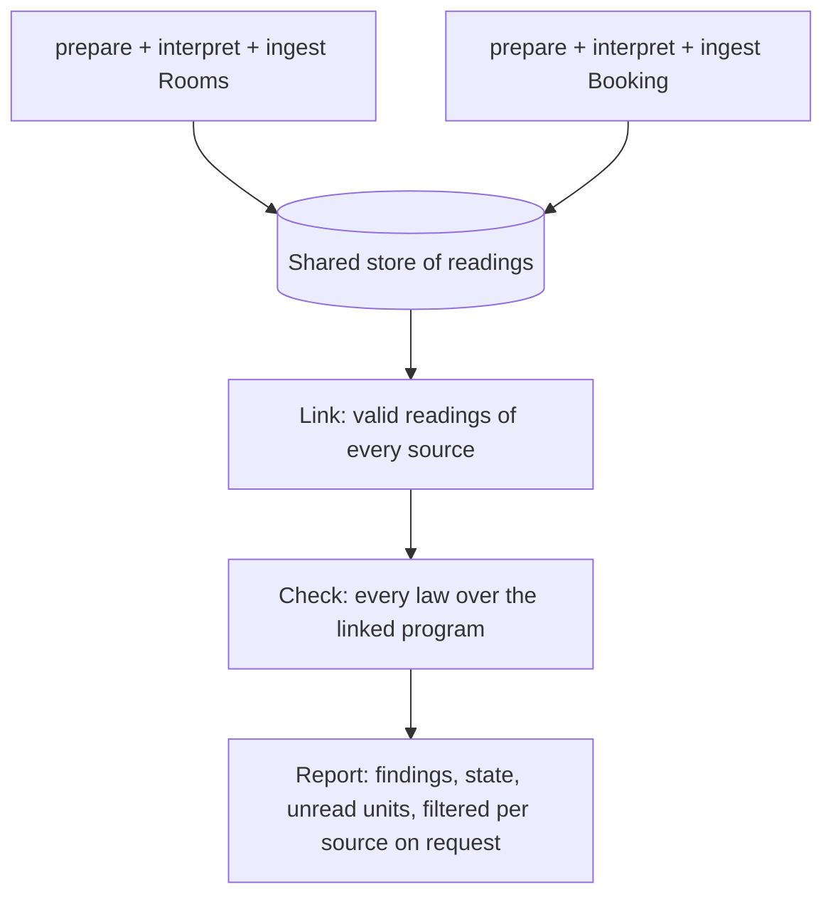
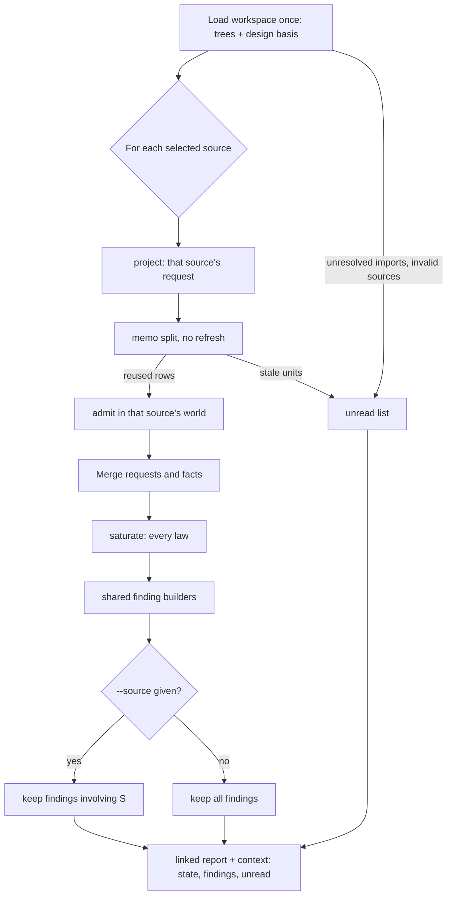
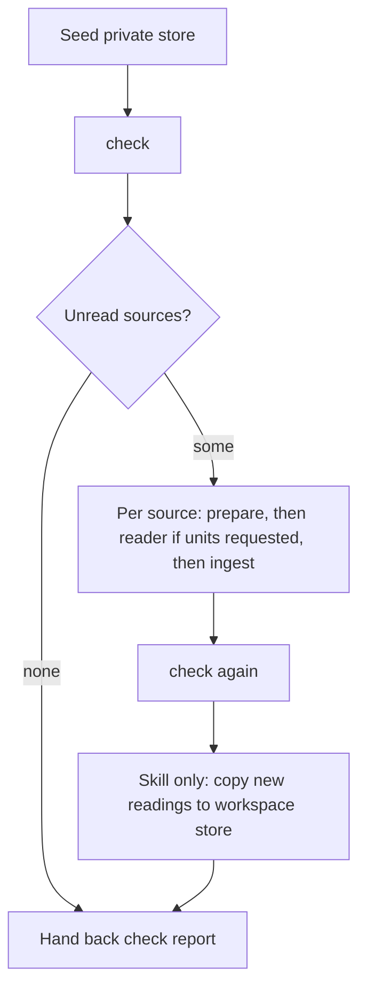

# sigil-claims linked check - Plan

## Goal Capsule

- **Objective:** A Sigil author learns when one component's flow or ownership claims break a rule that another component states in its private sections, such as Booking claiming a mark that Rooms owns. The model never reads those private sections. The Slotted benchmark can score that kind of problem again.
- **Means:** A no-model `sigil-claims check` that links the valid stored readings of the whole workspace and runs every claims law over them (KTD1, KTD2).
- **Product authority:** The maintainer's 2026-10-07 brainstorm and planning decisions, recorded under Product Contract Key Decisions. Root discovery for `--root`, the residual risks of the source trees work, and CI gating are not active scope. This work builds on `docs/plans/2026-10-07-1123-feat-sigilc-incremental-source-trees-plan.md`.
- **Stop conditions:** Stop and ask if linking the Slotted workspace breaches the saturation limits in `packages/sigilc/src/eqval.rs`, or if a settled decision proves infeasible.
- **Execution:** Implement in this repository. The Rust units (U1–U3) land first, then contracts (U4), then the skill and the benchmark (U5, U6). Each unit is verified against the Verification Contract.
- **Open blockers:** None.

---

## Product Contract

Product Contract preservation, with changes listed by ID.
- R1 and R5 now link the whole workspace and filter the view, per a user decision in the planning session.
- R3 now names every law and adds `exclusive-ownership`, and R4 adds unresolved imports. Both were corrected against the claims law classes.
- AE1 and AE2 were rewritten to match those classes: flow laws are warnings, and `exclusive-ownership` gates.
- R12, R13, AE8 and AE9 are new, from user decisions in the planning session.
- The source-scoped Key Decision was replaced, and the Outstanding Questions were resolved into KTD1, KTD2 and KTD5.

### Summary

`sigil-claims` gains a `check` step that runs without a model. It links every valid stored reading in the workspace into one program and runs every claims law over it. This brings back the cross-component laws that stopped firing under the interface-only black box. Interpretation stays per source and sees only imported interfaces. The sigil-compute skill and the Slotted benchmark run the full loop as one action: interpret each source, then check.

### Problem Frame

After the incremental source trees work, a dependent's claims request shows only the interfaces it imports. That keeps token cost flat and stops a dependency's private edits from re-reading its dependents. It also blinds the laws.
- `step-excluded-action`, `step-negated-action` and `unguarded-flow` no longer reach a dependency's flow.
- `exclusive-foreign-write` fires only when the owner states exclusivity in its interface.
- `exclusive-ownership` cannot see an owner whose ownership is stated privately.

The Slotted benchmark's planted `booking-rooms-archived-mark-ownership` problem is now marked as drift and goes unscored.

The facts those laws need already exist. A dependency's flow graph and its private claims are stored as that dependency's own readings in the shared Facet-id memo. Nothing joins them into one program. Ingest only adds a dependency's interface readings, and it drops any reading that the dependent's admission refuses.

### Key Decisions

- **The model reads a black box, and the laws check the whole program.** (session-settled: user-directed — chosen over also showing dependency internals to the model, and over keeping the strict black box everywhere: the facts already exist in stored readings, so linking costs no tokens.) This narrows the earlier "strict black box" decision to interpretation and to the freshness of readings. Governs R1, R2, R8.
- **The workflow is shaped like a compiler: interpret each source alone, then link, then check.** Each step runs on its own, and the whole loop is also available as one action. (session-settled: user-directed — chosen over checking only at ingest time, and over pulling unread dependency units into the dependent's own request.) Governs R1, R9, R10.
- **Callers orchestrate, and `sigil-claims` still launches no model.** (session-settled: user-directed — chosen over a `sigil-claims` command that runs an interpreter, and over a wrapper in the TypeScript `sigil` CLI: the no-model `ClaimsCommands` constraint stays intact.) Governs R9, R10, R11.
- **An incomplete check is not a pass.** (session-settled: user-directed — chosen over warning and passing, which lets CI go green on half a design, and over refusing to run, which gives no partial feedback.) Governs R4.
- **Ingest stays local.** (session-settled: user-directed — chosen over ingest also linking and warning early, and over ingest linking and failing as incomplete: today's one-source loop keeps working.) Governs R7.
- **Check always links the whole workspace, and `--source` only filters the view.** (session-settled: user-directed — chosen over linking a source's imports only with an amended contract, and over also linking the source's importers: it keeps the `ComputedFindings` rule that a finding naming two sources reaches both authors.) Governs R1, R4, R5.
- **A cross-component obligation that the dependency cannot guard still fires, and it says why.** (session-settled: user-directed — chosen over checking obligations only within one component, and over letting any matching guard clear them.) Governs R12.
- **The full-design action writes its readings back to the workspace store.** (session-settled: user-directed — chosen over keeping every run's readings private, and over preparing straight into the workspace store: the next run reads only what changed, and a failed run never half-writes the workspace store.) Governs R13.

---

### Requirements

**Linked check**

- R1. A new `sigil-claims check` step builds one program from the valid stored readings of every unit in the workspace and runs every claims law over it, without launching a model.
- R2. A stored reading is linked only when it is valid in its own source's world: its unit id is in that source's current tree, it was made under the current guidance and vocabulary, and it passes re-grounding against its own source. Another source's admission never filters it.
- R3. Every claims law follows the same rules over the linked program as within one component, so `step-excluded-action`, `step-negated-action`, `unguarded-flow`, `exclusive-foreign-write` and `exclusive-ownership` fire across components.
- R4. When any unit in the workspace has no valid reading, or any source has an unresolved import, the check still reports what it found and names the unread units and unresolved imports by source. It never reports a pass, and it exits as a gate failure.
- R5. `check --source S` reports only findings that involve S, so a finding that spans two sources appears in each source's view and in the workspace view.
- R6. For an unchanged workspace and store, the check always produces the same report, and it never writes to the store of readings.
- R12. A cross-component `unguarded-flow` finding states that the dependency's flow cannot guard on the dependent's requirement, and that the guarantee belongs in the dependency's interface.

**Interpretation and ingest**

- R7. `ingest` keeps its current local verdict, built from the source's own units plus imported interface context. It neither links dependency private readings nor reports the incomplete state.
- R8. `prepare` keeps presenting only the selected source's units and its imported interfaces. The linked check changes nothing the model is shown.

**Callers and documentation**

- R9. The sigil-compute skill offers a full-design action. It prepares, interprets and ingests every source with unread units, using one fresh reader per source, then runs the linked check and hands back its state and report. Each step stays available on its own.
- R13. After a full-design run, the readings it added are copied into the workspace store, so the next run reads only what changed.
- R10. A Slotted benchmark pass interprets every fixture source into one private store, then runs the linked check and scores known problems from the linked report. `booking-rooms-archived-mark-ownership` is scorable again.
- R11. The claims contract, the CHANGELOG, the `sigilc` README, the benchmark README and the sigil-compute references describe the linked check. This replaces the current "no longer fire across components" text. The `ClaimsCommands` no-model constraint stays as written.

---

### Key Flows

- F1. Full-design check
  - **Trigger:** An author, the sigil-compute skill or the benchmark wants the whole design checked.
  - **Steps:** Each source with unread units is prepared, read by its own reader and ingested, in any order. Then the linked check runs once.
  - **Outcome:** One report with the cross-component findings, the state, and any unread units.
  - **Covered by:** R1, R4, R9, R10
- F2. Dependency edit after a full check
  - **Trigger:** The author edits Rooms' private `state` section.
  - **Steps:** Only Rooms' changed units are read again. Booking needs no new reading. The linked check runs again.
  - **Outcome:** Booking's view reflects Rooms' new rule, and no model call is spent on Booking.
  - **Covered by:** R2, R8, R13

---

### Acceptance Examples

- AE1. **Covers R1, R3, R5.** Given Booking's constraints claim exclusive ownership of the archived room mark and Rooms' private `state` says Rooms owns that mark, with both read: the linked check reports `exclusive-ownership` with state Disjoint and exits 1. The finding appears in `check --source booking.sigil` and in `check --source rooms.sigil`.
- AE2. **Covers R3.** Given Booking states a firm dependency on Rooms and a constraint that a room is never deleted, and Rooms' private Logic has a step that deletes a room, with both read: the linked check reports `step-excluded-action` against Rooms' step as a warning, with state Loose and exit 0.
- AE3. **Covers R4.** Given the AE1 setup with Rooms never read, the check names Rooms' unread units, reports the state as incomplete and exits 1. This holds even when it found no other problem, and also when the unread unit is a Facet that Rooms' reader skipped.
- AE4. **Covers R2.** Given Rooms' private section is edited after its last reading, the edited unit counts as unread until Rooms is prepared and ingested again. Booking needs no new reading.
- AE5. **Covers R5.** A contradiction entirely inside Rooms appears in Rooms' view and in the workspace view, but not in Booking's view.
- AE6. **Covers R7.** Given Rooms is unread, Booking's ingest keeps today's behaviour: Loose with an uninterpreted-context finding where Rooms' interface is unread, and exit 0.
- AE7. **Covers R10.** A Slotted benchmark pass that interprets every fixture source and runs the linked check scores `booking-rooms-archived-mark-ownership` rather than marking it as drift.
- AE8. **Covers R12.** Given Booking requires an audit entry and Rooms' private flow touches it with no guard, the check reports `unguarded-flow` as a warning whose detail says that Rooms cannot guard on Booking's requirement and that Rooms' interface should state the guarantee.
- AE9. **Covers R9, R13.** After a full-design run that read every source, a second run with no edits launches no reader and returns the same check report.

---

### Success Criteria

- On the Slotted fixture, all four planted problems are scorable from the linked report, and none is marked as drift for a black-box reason.
- An edit to a dependency's private section costs model calls only for that dependency's changed units, and none for its dependents.
- The egglog laws suite covers each cross-component law, and an end-to-end test proves each one fires through `check`.

---

<!-- ce-section: work-relationships -->
### How This Work Fits Together

This plan covers the linked check. The breakdown below is the current understanding, not a committed roadmap.

- Incremental source trees (`docs/plans/2026-10-07-1123-feat-sigilc-incremental-source-trees-plan.md`), already implemented.
  - This plan depends on its shared Facet-id memo and on the grounding context stored with each reading.
- Root discovery: with no `--root`, `sigilc` and `sigil-claims` walk up from the current directory to the nearest `.sigil/config.json`, as `packages/core/src/workspace.ts` does, and an explicit `--root` behaves as it does today.
  - Can proceed independently of this plan.
- Residual risks from the source trees work: the interface hash misses changes two imports away (A→B→C), the corpus does not compare Facet text, the tree cache and memo lack symlink guards, and glob regexes are compiled on every call.
  - The A→B→C gap shares this plan's freshness question: a stale resolution can leave a linked reading looking valid when it is not.
  - Still to decide when each is fixed.
- CI gating on the linked check.
  - Depends on a way to supply readings to CI, because `.sigil/claims/` is gitignored.

---

### Scope Boundaries

- Changing what the model is shown. Requests keep the interface-only black box (R8).
- A `sigil-claims` command or CLI wrapper that launches an interpreter.
- Changing which guard clears an obligation. The guard rule keeps its current form (R12 changes only the message).
- Caching linked check results between runs. The check recomputes from the stored readings each time.
- Showing the linked check in the VS Code extension.

#### Deferred to Follow-Up Work

- Root discovery, the source-trees residual risks, and CI gating (see How This Work Fits Together).

---

### Dependencies / Assumptions

- Laws reach a dependency's flow only through a firm `dependsOn` commitment in a reading (`packages/sigilc/src/claims/claims.egg:138-146`, `:195-197`). The check inherits this, so Booking's reading must state that it depends on Rooms.
- Stored readings are reusable only under the guidance fingerprint and vocabulary generation they were made with (`packages/sigilc/src/claims/memo.rs`). After a guidance change, every reading counts as unread under R2.
- Within one benchmark pass, each source's own units are read exactly once, so the "no reused units at prepare" rule still holds for each source.

---

### Sources / Research

- `packages/sigilc/src/claims/claims.egg:138-197`, `:215-229` — reach, the step laws, the ownership laws and `reachable`.
- `packages/sigilc/src/claims/cli.rs:147-317` — the ingest pipeline that `check` reuses in part.
- `packages/sigilc/src/claims/prepare.rs:252-450` — `project`, pure and in memory, used once per source.
- `packages/sigilc/src/claims/memo.rs:60-107`, `:287-340` — memo key scope, `split` and `refresh`.
- `packages/sigilc/src/claims/identity.rs:82-88`, `:173-218`, `:404-411` — source-independent fact ids, flow minting, and the guard operand limit.
- `packages/sigilc/src/claims/findings.rs:23-101`, `:129-376` — report shape, finding builders, the source filter and `state_of`.
- `packages/sigilc/claims.sigil:13-18`, `:210-215`, `:228-237`, `:299-326` — the Facets this plan edits.
- `packages/sigilc/tests/claims_incremental.rs` — the end-to-end harness and the black-box tests.
- `integrations/skills/sigil-compute/references/computed-evaluation.md:80-178` — the private store rule and the one-source loop.
- `scripts/slotted-benchmark/batch.ts:120-286`, `claims.ts:31-376`, `fixture.ts:183-500`, `report.ts:441-556` — schedule, attempt validation, preflight drift and scoring.
- `docs/plans/2026-09-18-1719-feat-claims-flow-decomposition-plan.md` — origin of Step and Graph entities and the flow laws.

---

## Planning Contract

### Key Technical Decisions

- KTD1. **`check` reads the root and store directly, with no prepared directory or binding.** The surface is `sigil-claims check [--source PATH] [--root DIR] [--store DIR]`. Nothing external is supplied, so there is nothing to bind. Exit codes follow the existing contract: 0 for pass or warning, 1 for Disjoint or incomplete, 2 for usage, 3 for operational failure. Governs R1, R4, R5.
- KTD2. **Validity comes from today's per-source machinery, run read-only.** For every selected source: `prepare::project` builds that source's request, `memo::split` sorts its own units into valid (`reused`) and unread (`stale`), and `identity::admit` admits the valid rows together in that source's world. `memo::refresh` is never called, so a reading whose context moved is re-checked on every run without writing anything. `identity::admit` refuses the whole row set when one row fails, and a reused reading may not have been admitted since its context last matched. So if a source's rows are refused together, the check admits them one unit at a time, links the units that admit, and lists each refused unit as unread with the refusal message. A refused stored reading never aborts the check. Context units are skipped, so each interface unit is admitted once, in its owner's world. Governs R2, R6.
- KTD3. **One merged request feeds the existing saturation unchanged.** Fact ids are content hashes with no per-request numbering, so facts admitted in different worlds concatenate without remapping. The merged request takes the union of each source's own rows, declarations and entities, deduplicated by id. `program::saturate` reads only these. Governs R1, R3.
- KTD4. **The linked report reuses the ingest report shape, with an `incomplete` state.**
  - The finding builders in `findings::report` move into a shared function used by both ingest and the check.
  - `State` gains `Incomplete`. The check's state is Disjoint when a gating finding exists. Otherwise it is Incomplete when anything is unread or unresolved. Otherwise it follows `state_of` as today.
  - The report adds `unread` (source, component, section, Facet ids) and `unresolvedImports` lists. Its identity carries the workspace digest, each source's binding digest, the memo keys used, the guidance fingerprint and the vocabulary generation.
  - `REPORT_VERSION` becomes 4. Ingest never emits `incomplete`.
  - Governs R4, R6.
- KTD5. **A finding involves source S when S authored any part of it.** That means a cited claim from a Facet of S, or a component, step or Tag among its component, subject or object that belongs to a component declared in S. The filter applies only to findings. The `unread` and `unresolvedImports` lists are always workspace-wide, because completeness is. Governs R5.
- KTD6. **Linked outputs sit next to ingest's and never overwrite them.**
  - The workspace check writes `<store>/claims/workspace.linked.json`.
  - A source view writes `<store>/claims/<source>.linked.json`, through the existing `findings::store` path mangling.
  - Each has a matching `.linked.context.json`, built by `context::build` over the merged request, because the benchmark maps claims to Facets through the context.
  - The name `workspace` cannot collide with a source, because source paths keep their `.sigil` suffix.
  - Governs R6, R10.
- KTD7. **The cross-component obligation message is chosen in the finding builder.** An `unguarded-flow` whose constraint's component differs from the governed graph's component gets the R12 detail. The egglog rules do not change. Governs R12.
- KTD8. **The full-design action uses the check's unread list as its work queue.** The skill runs `check` first, groups `unread` by source, and for each such source runs prepare, one fresh reader, and ingest in its private store, then runs `check` again. A source whose prepare requests no units gets no reader. One reader's failure does not stop the others. The run ends with the check, which then reports incomplete and names the failed source. Governs R9, AE9.
- KTD9. **Write-back copies the memo entries the run added or rewrote.** After the final check, the skill copies a file under the private store's `claims/interpretations/` into the workspace store in two cases. It copies a file the workspace store lacks. It also copies a file whose bytes differ from the seed taken at the start of the run, but only while the workspace copy still matches that seed. A memo key does not cover grounding, so a re-read unit keeps its old key, and copying only absent files would leave the stale entry in place. Each copy is a temp-file-plus-rename. A workspace entry that changed since seeding is left alone, and reports are not copied. (session-settled: user-directed — chosen over keeping readings private and over preparing straight into the workspace store: the next run reads only what changed, and a failed run never half-writes the workspace store.) Governs R13.
- KTD10. **A benchmark attempt becomes one pass over all seven sources.**
  - The schedule unit changes from selection × pass × source to selection × pass, with one private store per pass.
  - Each source still gets its own fresh reader, its own prepare/ingest validation and its own timeout.
  - After the seventh ingest, the pass runs `check`. Planted problems are scored from the linked report and linked context.
  - The preflight checks that every anchor Facet exists in the workspace trees, not in one source's request.
  - A planted problem whose anchor sources are unread in that pass scores as unavailable, not missed.
  - Governs R10.

### High-Level Technical Design

The check pipeline (KTD2, KTD3):

State and exit code of a linked report (KTD4):

| Gating finding | Unread units or unresolved imports | State | Exit |
|---|---|---|---|
| yes | any | `disjoint` | 1 |
| no | yes | `incomplete` | 1 |
| no | no, warnings exist | `loose` | 0 |
| no | no, no findings | `coherent` | 0 |

The full-design loop shared by the skill and the benchmark (KTD8, KTD9, KTD10):

### Assumptions

- `scope`-level import resolution and `prepare::project` agree on which imports resolve. The check takes unresolved imports from the design basis, the same source `project` uses (`prepare.rs:263-272`).
- The Slotted workspace links within the default saturation limits (`eqval.rs:22-25`: 100,000 input assertions, 60 s). U6 measures this on its first green run.

### Risks & Dependencies

| Risk | Mitigation |
|---|---|
| A workspace-wide program breaches the saturation limits on larger designs, and a time-based breach makes the result machine-dependent | A breach stays a gate failure, as today. The limits are unchanged, and U6 records Slotted's fact count and time. |
| The guard rule does not tie a guard to the governed graph (`claims.egg:180-182`), so linking can let an unrelated guard clear an obligation | Out of scope (Scope Boundaries). U2 adds a test that pins today's behaviour so a later fix is deliberate. |
| Linking revives claim-level laws beyond the five named, such as `conflicting-property` across private sections, so linked reports can gate where ingest did not | Intended by R3. The CHANGELOG and contract text say that linked findings can differ from ingest. |
| A dependency reading that admission accepted with defects contributes no facts, yet counts as read | Defective rows already surface as interpretation findings. The linked report lists them under each source's view like any other finding. |
| Concurrent ingest while `check` runs can show a half-updated source | Memo writes are atomic per unit. R6 is stated for an unchanged store, and the skill and benchmark never run the two concurrently. |

### System-Wide Impact

- **Authors** get a new command and a new report next to the ingest report. Ingest output is unchanged except for `REPORT_VERSION` 4.
- **The sigil-compute skill** gains a full-design action and, for that action only, a write-back exception to its private-store rule.
- **Benchmark evidence** changes shape: attempts become passes, so older retained runs stay readable but are not comparable.
- **The claims contract** changes in three Facets. `@sigil implements` annotations follow the new module.

---

## Implementation Units

### U1. Link stored readings across the workspace

- **Goal:** Produce one merged program input from every source's valid readings, plus the lists of unread units and unresolved imports.
- **Requirements:** R1, R2, R4, R6; KTD2, KTD3.
- **Dependencies:** None.
- **Files:**
  - Create `packages/sigilc/src/claims/link.rs`
  - Modify `packages/sigilc/src/claims/mod.rs`, `packages/sigilc/src/claims/memo.rs` (expose what `split` needs without `refresh`), `packages/sigilc/src/claims/prepare.rs` (a merged-request constructor, if it is cleaner there)
  - Create `packages/sigilc/tests/claims_linked.rs`
- **Approach:**
  1. Load the workspace once, as `claims/cli.rs::workspace` does.
  2. For each selected source, call `project` and `memo::split`. Record `stale` units as unread. Admit `reused` rows with that source's own request, falling back to one unit at a time on a refusal (KTD2).
  3. Collect unresolved imports and invalid sources from the design basis.
  4. Merge requests and facts per KTD3.
  5. Carry an `@sigil implements packages/sigilc/claims.sigil::SigilComputedClaims::<Tag>` annotation, since `claims_cli.rs` requires every claims module to name a contract Tag.
- **Execution note:** Write AE3 and AE4 as failing integration tests first; they pin the validity rule.
- **Patterns to follow:** `packages/sigilc/src/claims/cli.rs` ingest assembly; `packages/sigilc/tests/claims_incremental.rs` `Run` and `pair()` harness.
- **Test scenarios:**
  - Covers AE3. With Rooms never ingested, the unread list names every Rooms unit by source, component, section and Facet ids.
  - Covers AE4. After an edit to Rooms' private section, only the edited unit is unread, and Booking's units stay linked.
  - A unit whose stored grounding context moved but still admits is linked, and the store files are byte-identical before and after.
  - A Facet the reader skipped (no stored rows) is listed as unread.
  - A stored reading that names an entity no longer in its source's request is listed as unread with the refusal message, the source's other units stay linked, and the check still writes its report.
  - Readings stored under a different guidance fingerprint all count as unread.
  - A source with an unresolved import appears in the unresolved-imports list.
  - Two sources that import each other both link, and each interface unit's facts appear once.
  - Facts from two sources merge with no duplicate or colliding ids.
- **Verification:** The new tests pass, and linking the two-source fixture twice yields identical merged inputs.

### U2. Linked report, involvement filter and obligation message

- **Goal:** Turn the saturated linked program into a report with the incomplete state, the per-source view and the R12 message, sharing the finding builders with ingest.
- **Requirements:** R3, R4, R5, R6, R7, R12; KTD4, KTD5, KTD7.
- **Dependencies:** U1.
- **Files:**
  - Modify `packages/sigilc/src/claims/findings.rs`, `packages/sigilc/src/claims/context.rs`
  - Modify `packages/sigilc/tests/claims_findings.rs`, `packages/sigilc/tests/claims_context.rs` (report version), `packages/sigilc/tests/claims_laws.rs`
- **Approach:**
  1. Extract the finding builders from `findings::report` into a function that both ingest and the check call. Ingest keeps its own source filter and `uninterpreted-context` tail unchanged (R7).
  2. Add `State::Incomplete` and the linked state rule in KTD4. Bump `REPORT_VERSION` to 4.
  3. Implement the KTD5 involvement filter for the linked view.
  4. Choose the R12 detail in the `unguarded-flow` builder per KTD7.
- **Patterns to follow:** Existing `findings::report` and `state_of`; `claims_laws.rs` cross-component cases (`:977-1210`) for law-level tests over one merged request.
- **Test scenarios:**
  - Covers AE1. An `exclusive-ownership` finding whose witness is Booking's claim and whose object is Rooms appears in both Booking's and Rooms' views.
  - Covers AE5. A contradiction between two Rooms claims appears in Rooms' view and the workspace view only.
  - Covers AE8. A cross-component `unguarded-flow` carries the dependency-cannot-guard detail. A same-component one keeps today's detail.
  - The state is Disjoint when a gating finding and unread units coexist. It is Incomplete when only unread units exist, and Loose or Coherent otherwise.
  - An ingest report never has state `incomplete`, and its findings match the pre-refactor output for an existing fixture.
  - A guard naming an unrelated constraint in the same graph still clears an obligation (pins today's guard rule).
- **Verification:** Claims findings, context and laws tests pass, and ingest reports for existing fixtures are unchanged apart from the version number.

### U3. The `check` command

- **Goal:** Expose the linked check as `sigil-claims check`, with the KTD1 surface, KTD6 outputs and exit codes.
- **Requirements:** R1, R4, R5, R6; KTD1, KTD6.
- **Dependencies:** U2.
- **Files:**
  - Modify `packages/sigilc/src/claims/cli.rs` (command match, allowed flags, help text), `packages/sigilc/src/bin/sigil-claims.rs` if needed
  - Modify `packages/sigilc/tests/claims_cli.rs`; extend `packages/sigilc/tests/claims_linked.rs`
- **Approach:**
  1. Add `check` beside `prepare`, `ingest` and `extract-guidance`, with `--source`, `--root` and `--store`.
  2. Run U1 then U2, write the linked report and context per KTD6, and print a summary JSON in the style of prepare's output: state, finding count, unread count, report path.
  3. Map state to exit codes per KTD4.
- **Execution note:** Start from end-to-end tests on the `.sigil` two-source fixture; AE1 and AE2 define the behaviour that matters most.
- **Patterns to follow:** `prepare` and `ingest` arms in `claims/cli.rs`; `claims_incremental.rs` `Run` helper, extended with `check`.
- **Test scenarios:**
  - Covers AE1. After both sources are read, `check` exits 1 with state `disjoint` and an `exclusive-ownership` finding.
  - Covers AE2. `check` exits 0 with state `loose` and a `step-excluded-action` finding on Rooms' step.
  - Covers AE3. With Rooms unread, `check` exits 1 with state `incomplete`.
  - `check` reports `step-negated-action` when Booking's constraint says Rooms must not do something that Rooms' private step does.
  - Covers AE8. `check` reports a cross-component `unguarded-flow` with the R12 detail.
  - `check` reports `exclusive-foreign-write` when Booking's step writes state that Rooms' private reading marks exclusive and owns.
  - Covers AE6. Booking's ingest with Rooms unread still exits 0, writes its usual ingest report, and writes no linked report.
  - `check --source` with a path outside the workspace is a usage error (exit 2).
  - `check` with an empty store on a non-empty workspace exits 1, `incomplete`, and lists every unit.
  - `check` on a workspace whose config fails to load exits 3.
  - Two consecutive runs write byte-identical linked reports.
  - `prepare` on the same fixture presents no Facet from a dependency's private sections (R8 regression guard).
- **Verification:** `sigil-claims --help` lists `check`, the claims test suites pass, and clippy is clean.

### U4. Contracts, CHANGELOG and README

- **Goal:** State the linked check in the claims contract and user docs, and remove the "no longer fire" text.
- **Requirements:** R11; KTD4, KTD6.
- **Dependencies:** U3.
- **Files:**
  - Modify `packages/sigilc/claims.sigil`
  - Modify `CHANGELOG.md`, `packages/sigilc/README.md`
- **Approach:**
  1. In `ClaimsCommands` (interface), add `check` and the incomplete gate failure to the command list and the exit sentence.
  2. In `ComputedFindings` (interface), say that the linked check reports each finding to every source that authored part of it.
  3. Replace the `InterpretationRequest` decision text at `claims.sigil:320-325` with one or two sentences: dependents see only interfaces when read, and the linked check applies every law across components.
  4. Keep each commitment to one or two sentences, and name an existing Tag in every new Facet.
  5. Rewrite the CHANGELOG Unreleased entry's cross-component sentences, and add a `check` example to the README's `sigil-claims` section.
- **Patterns to follow:** Existing `decisions` and `interface` Facets in `packages/sigilc/claims.sigil`.
- **Test scenarios:**
  - `build/sigil check .` passes on the edited contracts, with no unresolved `@sigil implements` targets.
  - `every_claims_module_is_owned_by_a_tag_the_contract_declares` passes with `link.rs` present.
- **Verification:** A repository search for "no longer fire across components" finds only CHANGELOG history, and the contract check is clean.

### U5. sigil-compute full-design action

- **Goal:** Give the skill a one-action full-design loop with write-back, while keeping each step available on its own.
- **Requirements:** R9, R13; KTD8, KTD9.
- **Dependencies:** U3.
- **Files:**
  - Modify `integrations/skills/sigil-compute/SKILL.md`, `integrations/skills/sigil-compute/references/computed-evaluation.md`, `integrations/skills/sigil-compute/VERSION`
  - Modify `integrations/skills/sigil-compute/evals/computed-evaluation-fixture.md`, `integrations/skills/sigil-compute/evals/README.md`
  - Modify `docs/skill-evaluation/sigil-compute.md` if its observations name the one-source loop
- **Approach:**
  1. Add the full-design action to SKILL.md as a short alternative to the one-source loop.
  2. In the reference, add a section for the KTD8 loop: seed the private store, check, read unread sources, check again.
  3. Add the KTD9 write-back as the one exception to "never merge them back", scoped to the full-design action.
  4. Update the sections that describe exit 1 as Disjoint only, and dependencies as interface-only, to cover the linked report and `incomplete`.
  5. Add eval cases for AE9 and for a failed reader. Bump `VERSION` to 0.2.0.
- **Patterns to follow:** The existing reference sections "Keep one preparation and a private store" and "Recognize a completed ingest".
- **Test scenarios:**
  - Covers AE9. Eval: a second full-design run with no edits launches no reader and hands back the same linked report.
  - Eval: after an imported interface edit refuses a dependent's stored reading, the first full-design run re-reads that dependent, and a second run launches no reader for it.
  - Eval: one reader fails, and the run still checks and hands back `incomplete`, naming that source.
  - Eval: the one-source loop is unchanged and still never writes to the workspace store.
- **Verification:** `deno task test:skill` and `deno task test:skill:native` pass, and `scripts/skill-foundation_test.ts` passes.

### U6. Slotted benchmark on passes and linked scoring

- **Goal:** Score planted problems from one linked check per pass, so `booking-rooms-archived-mark-ownership` is scorable again.
- **Requirements:** R10; KTD6, KTD10.
- **Dependencies:** U3.
- **Files:**
  - Modify `scripts/slotted-benchmark/batch.ts`, `claims.ts`, `fixture.ts`, `report.ts`, `README.md`
  - Modify `scripts/slotted-benchmark/batch_test.ts`, `claims_test.ts`, `fixture_test.ts`, `report_test.ts`, `integration_test.ts`
- **Approach:**
  1. Change the schedule unit to selection × pass, with one private store per pass (KTD10).
  2. Keep per-source prepare and ingest validation inside the pass, with each source's timeout and reused-units rule unchanged.
  3. Run `check` after the last ingest, and validate the linked report: exit 1 if and only if `disjoint` or `incomplete`.
  4. Move scoring to the linked report and linked context. Rewrite the preflight anchor check against the workspace trees.
  5. Add `incomplete` to `ComputedState`, and treat a planted problem with unread anchor sources as unavailable.
  6. Remove the drift paragraph from the README, and describe passes.
- **Execution note:** Rewrite `fixture_test.ts` first; it currently builds a synthetic whole-closure request that hides the real black-box behaviour.
- **Patterns to follow:** Existing `runClaimsAttempt` and `validateClaimsEvidence` structure; `report.ts` `analyze` and `matchesIssue`.
- **Test scenarios:**
  - Covers AE7. The preflight on the real fixture marks all four planted problems scorable.
  - The schedule for one selection and two passes has two pass records, each covering seven sources.
  - A pass whose fake host fails one source produces a linked report with state `incomplete`. Problems anchored in that source score as unavailable, and the others still score.
  - A linked report with exit 1 and state `loose` fails validation.
  - `analyze` finds `exclusive-ownership` between Booking and Rooms in either direction from the linked report and context.
  - The integration test with seven fake-host interpretations ends with one check per pass.
- **Verification:** `deno task test:slotted-benchmark` passes, and a dry run records Slotted's linked fact count and saturation time.

---

## Verification Contract

| Gate | Command | Applies to |
|---|---|---|
| Rust format and lint | `cargo fmt --check --manifest-path packages/sigilc/Cargo.toml`; `cargo clippy --locked --manifest-path packages/sigilc/Cargo.toml -- -D warnings` | U1–U3 |
| Rust tests | `deno task test:sigilc` | U1–U4 |
| Contract check | `build/sigil check .` after `deno task build:cli` | U4 |
| Skill validation | `deno task test:skill`; `deno task test:skill:native`; `deno test --allow-read --allow-write scripts/skill-foundation_test.ts` | U5 |
| Benchmark | `deno task test:slotted-benchmark` | U6 |
| TS format, lint, typecheck | `deno task fmt`; `deno task lint`; `deno task check` | U5, U6 |
| Full suite | `deno task test` | end of work |

CI (`.github/workflows/ci.yml`) runs these gates on Linux, macOS and Windows.

---

## Definition of Done

- Every R1–R13 is satisfied, and every AE1–AE9 has a passing test or eval named in a unit.
- The Success Criteria hold: the Slotted preflight marks all four planted problems scorable, and a dependency-private edit requests no dependent units.
- `sigil-claims check` is documented in the claims contract, the `sigilc` README and the CHANGELOG, and "no longer fire across components" survives only in CHANGELOG history.
- `deno task test` passes, and clippy and the contract check are clean.
- Abandoned-attempt code and unused fixtures are removed from the diff.
- Per unit: its test scenarios exist and pass, and its Verification line holds.
