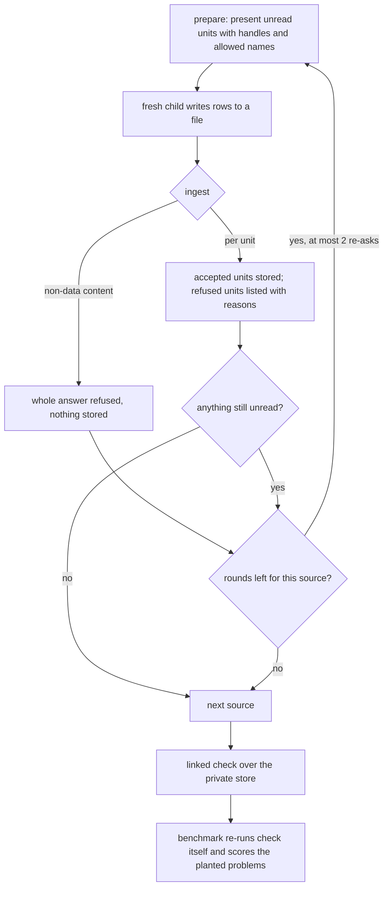
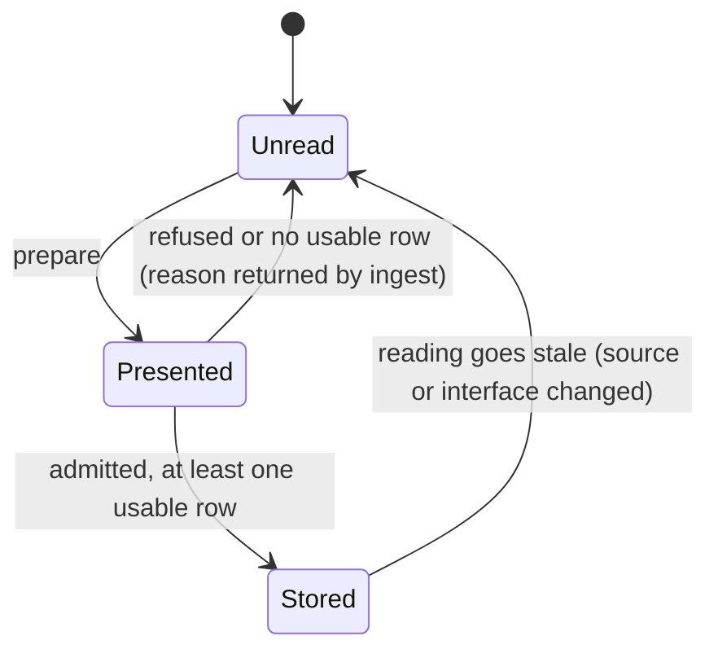

# sigil-claims interpretation robustness - Plan

## Goal Capsule

- **Objective:** A model at medium reasoning effort reads a Sigil design well enough that the linked claims check finds the design's real problems. When the model gets one Facet wrong, only that Facet is asked again, not the whole source.
- **Means:** The request shows each Facet's allowed names and a short handle, and step numbering is local to each Facet (KTD1–KTD3). Ingest refuses per unit (KTD4–KTD6). sigil-compute re-asks those units (KTD10), and the benchmark runs sigil-compute end to end (KTD11).
- **Product authority:** The maintainer's 2026-10-08 brainstorm and planning decisions, recorded under Key Decisions. Smaller requests, new guidance examples for known misreadings, and low effort stopping early are not active scope. This work builds on `docs/plans/2026-10-07-1637-feat-claims-linked-check-plan.md`.
- **Stop conditions:**
  - Stop and ask if U1 shows a host cannot start a fresh child at the requested reasoning effort.
  - Stop and ask if a settled decision proves infeasible.
- **Execution:** Implement in this repository in unit order. U1 first, then the tool units (U2–U7), then the skill (U8), then the benchmark (U9), then the live measurement in the Verification Contract.
- **Open blockers:** None.

---

## Product Contract

Product Contract preservation, with changes listed by ID:
- R6 now also refuses a name outside the Facet's list. R8 no longer stores a unit with no usable row. Both come from a user decision in planning.
- R11 now has the child write its answer to a file, which planning research found necessary for the orchestrator never to touch rows.
- R12's context-Facet prompt fix moves into sigil-compute's child instructions, because under R13 the child does the reading.
- R15 is new, from a user decision in planning (Pi stays supported).

### Summary

The claims request gives the model what it needs to answer correctly: each Facet's allowed names, a short handle instead of its 64-character id, and step numbering it can't get wrong across paragraphs. The model can also report a name the design doesn't declare, which the tool turns into a warning about the design. A data mistake now costs only the Facet or Logic section it's in. sigil-compute re-asks those units, and the Slotted benchmark measures the result by running sigil-compute end to end.

### Problem Frame

No Slotted benchmark pass has been valid at any reasoning effort with `gpt-6-luna`. The cause is how ingest treats the model's mistakes, not the claims laws. Replaying the saved answers with the bad rows dropped found all four planted problems in 4 of 11 passes, including both `xhigh` passes, and at least one in 10 of the 11.

The mistakes come from what the model is shown. Measured across the 2026-10-08 runs:

| Effort | Bad rows | Main kinds |
|---|---|---|
| low | 18% | names the design doesn't declare (98), duplicate step numbers, mistyped ids, answers that stop early |
| medium | 10% | names the design doesn't declare (68), mistyped ids |
| high | 2.7% | mistyped ids (16), invented flow rows such as `(end …)` and `(go-ahead …)`, duplicate step numbers |
| xhigh | 0.8% | mistyped ids only (9) |

Three causes stand out:
- **Names:** the request offers one design-wide list of names. The tool knows which names each Facet may use but never shows it. So the model uses prose words or plurals, or names a declared Tag the Facet never references. That last case is ungrounded and leaves the Facet uninterpreted.
- **Ids:** copying 64-character Facet ids fails at every effort level.
- **Steps:** numbering steps across a whole Logic section, and marking a flow's end, trips even high effort.

Each mistake is then expensive. Ingest stops at the first error, names only that one, and refuses the whole source. The claims contract states that last rule on purpose: an answer that smuggles in a rule or command must not be partly kept. sigil-compute is told not to retry. So one wrong name in one Facet discards a source's whole reading, and nothing asks again.

### Key Decisions

- **Fix what the model is shown, and make the leftover mistakes cheap to repair.** R1–R4 attack the causes; R5–R8 only bound the cost of what remains. (session-settled: user-approved — chosen over dropping bad rows and keeping the rest, keeping whole-source refusal but listing every defect, or changing only the request: dropping rows hides the cause, and whole refusal makes every leftover mistake cost a source.) Governs R5, R6, R7, R8.
- **Refusal is split by kind.** Anything that isn't data still refuses the whole answer, so the contract's safety reason stands. A data mistake refuses only its unit. (session-settled: user-approved — chosen over refusing per Facet for everything: that would loosen the stated safety rule.) Governs R5, R6, R9.
- **A name outside the Facet's list refuses the unit.** "Ungrounded" stops being a separate accepted state, so every gap is re-askable. (session-settled: user-approved — chosen over keeping flag-and-store with a separate re-ask list and a prepare option to force units: two mechanisms for one problem, now that the model sees its list.) Governs R6, R8.
- **Re-asking belongs to sigil-compute, not the benchmark.** The benchmark sees only the final result. (session-settled: user-directed — chosen over a benchmark that does its own repair round: repair is the caller's workflow, and callers orchestrate.) Governs R10, R11, R13.
- **The benchmark runs sigil-compute end to end.** It measures the real workflow and gives up per-answer defect counts. (session-settled: user-directed — chosen over keeping a direct, first-answer-only model call: the skill is what users run.) Governs R13, R14.
- **Pi stays in the benchmark, using its `pi-subagents` extension for children.** (session-settled: user-directed — chosen over supporting only Codex and Claude Code, or a nested unsandboxed `pi` process: the extension starts fresh child sessions.) Governs R15.
- **At most two re-ask rounds.** (session-settled: user-approved — chosen over one round or up to five: most fixable mistakes clear in one round, and cost stays bounded.) Governs R10.
- **An undeclared name becomes a warning about the design.** (session-settled: user-approved — chosen over the existing `unresolved` reading or omitting it: the author learns where a Tag is missing, and the model has an honest alternative to inventing a name.) Governs R4.
- **That warning never fails the design.** (session-settled: user-approved — chosen over a gating finding: many mentions are harmless context, such as "database access" in a constraint that forbids it.) Governs R4.
- **All three parts land in one plan.** The tool changes, the skill loop, and the benchmark rework are built in that order and judged by one benchmark run. (session-settled: user-approved — chosen over landing the benchmark rework later: the benchmark is how success is judged.)

### Requirements

**What the model is shown**

- R1. Each presented Facet lists the names it may use: its own component, the components its source imports from, and the Tags it references or introduces.
- R2. Each presented Facet has a short handle, and the model uses handles wherever an answer names a Facet. The tool maps handles back to full ids, so stored readings, reports and reuse across runs still use full ids.
- R3. The model can number a flow's steps without keeping a count across the whole Logic section, and the tool derives section-wide step identity. An edge between steps in different Facets, and the end of a flow, each have one stated way to be written.
- R4. The model can state that a Facet relies on something the design does not declare, giving the name as the prose writes it. The tool reports it as a warning that cites the Facet. It can make the state Loose but never Disjoint, and the name need not be a declared entity.

**How ingest treats mistakes**

- R5. An answer containing anything that isn't data is refused whole and nothing from it is stored, as today. That covers a rule, command, schedule, nested expression or unparseable text.
- R6. A data mistake refuses only the unit it occurs in, either one Facet or the whole Logic section the Facet belongs to. Data mistakes include a name outside the Facet's list, an unknown relation, property or row kind, a wrong column count, a non-string literal, and an invalid step number or step reference. A row whose handle names no presented Facet belongs to no unit, so it is refused alone.
- R7. Ingest reports every refusal from one answer at once. Each entry names its unit, the offending row and the reason.
- R8. Accepted units are stored. Refused units, and units left with no usable row, are not stored. They stay unread and are requested again by the next `prepare`. Until they are read, the linked check reports them as unread and its state is Incomplete.
- R9. The claims contract, the README and the interpreter guidance state the split between whole refusal (R5) and unit refusal (R6). They replace the current "refusing any row refuses the whole supplied interpretation" rule.

**What sigil-compute does**

- R10. After ingest, sigil-compute re-asks only the units still unread, and shows the child the reasons. It does this for up to two rounds per source. Anything still unread is handed back as Incomplete, naming each unit and its last reason. This replaces the skill's current "do not retry" rule.
- R11. Every reading, including each re-ask, comes from a fresh child that writes its answer to a file ingest reads. The orchestrating model never writes or edits rows itself.

**What the benchmark measures**

- R12. The benchmark keeps the `--reasoning` option, which sets the model's reasoning effort. The context-Facet prompt fix (return nothing for dependency interface rows) moves into sigil-compute's child instructions.
- R13. Each benchmark pass runs sigil-compute's whole-design action with the selected agent, model and reasoning effort. The planted problems are scored from that action's final linked check. The re-asks are not visible to the benchmark.
- R14. Each pass starts from a private, empty store and reuses no earlier reading. The agent under test may run `sigil-claims` and write inside its pass directory, and has no other access beyond what reading the design requires.
- R15. The benchmark supports Codex, Claude Code and Pi. Each host starts a fresh child for every reading through its own mechanism.

### Acceptance Examples

- AE1. **Covers R1, R6, R8.**
  - **Given:** an answer for `booking.sigil` in which one constraint Facet names "requireUser", which is not on that Facet's list.
  - **When:** it is ingested.
  - **Then:** only that Facet is refused, and every other Facet's rows are stored. The linked check is Incomplete and names that Facet. The next `prepare` asks only for it.
- AE2. **Covers R5.**
  - **Given:** an answer that contains one rule declaration among valid rows.
  - **When:** it is ingested.
  - **Then:** the whole answer is refused and nothing is stored.
- AE3. **Covers R6.**
  - **Given:** an answer whose Logic section has a step reference to a step no Facet declares.
  - **When:** it is ingested.
  - **Then:** the whole Logic section is refused, and the source's other Facets are stored.
- AE4. **Covers R4.**
  - **Given:** a Rooms constraint "must not import framework code", where the model states that the Facet relies on the undeclared "framework code".
  - **When:** it is ingested and checked.
  - **Then:** a warning cites that Facet and the name. The state is at most Loose, and the exit code stays 0.
- AE5. **Covers R10, R11.**
  - **Given:** two Facets refused after the first answer.
  - **When:** sigil-compute's first re-ask fixes one Facet, and its second re-ask fails on the other.
  - **Then:** the result is Incomplete, naming the remaining Facet and its last reason. No third re-ask happens, and every reading came from a fresh child.
- AE6. **Covers R2.**
  - **Given:** a model that answers with handles.
  - **When:** the same source is prepared again in a later run where handles are numbered differently.
  - **Then:** the stored readings are still reused, because they are keyed by full ids.

### Success Criteria

- At medium reasoning effort with `gpt-6-luna` through Codex, both passes of the Slotted benchmark end with a linked check that is not Incomplete. Both find all four planted problems.
- Low effort improves measurably: more planted problems scored and fewer unread units at the end of a pass. There is no fixed target.

### Scope Boundaries

- Splitting large sources into smaller requests, and trimming the guidance sent per call, are deferred. This is why low effort stops early on big sources.
- New guidance examples for the misreadings seen in the runs are deferred. In those runs, "X owns Y and is the only one that may set it" was read as no commitment, and edges were added after a compare-only step.
- Defect counts for the model's first answer are no longer reported by the benchmark (per R13).

#### Deferred to Follow-Up Work

- Committing the replay of saved answers (drop bad rows, re-check, score) as a regression check. The saved runs under `analyze-demo/slotted-runs/` are not committed.

### Dependencies / Assumptions

- Success is measured on the Codex CLI with `gpt-6-luna`. On 2026-10-08 that service had stalls of 15 to 60 minutes per call, unrelated to answer size, and running several benchmark runs at once made them worse.
- Pi's children come from the `pi-subagents` extension (version 0.70.1 installed locally), loaded explicitly by path.

### Sources / Research

- Benchmark runs: `analyze-demo/slotted-runs/benchmarks/codex-gpt6luna-{low,medium,high,xhigh}-2pass-fixedprompt` and `codex-gpt6luna-3pass-long-2009`.
- Refusal rule: `packages/sigilc/claims.sigil` (lines 51–52 and 150–151) and the comment above `dialect::parse` in `packages/sigilc/src/claims/dialect.rs`.
- Per-Facet name sets: `Grounding::build` in `packages/sigilc/src/claims/identity.rs`. Request row fields: `FacetRow` in `packages/sigilc/src/claims/prepare.rs`.
- Per-unit admission precedent: the unit-by-unit retry in `packages/sigilc/src/claims/link.rs`.
- Memo units and re-requesting: `packages/sigilc/src/claims/memo.rs` (`units`, `split`).
- The skill's current no-retry rule: `integrations/skills/sigil-compute/references/computed-evaluation.md`.
- Benchmark agent call and prompt: `scripts/slotted-benchmark/agents.ts`.
- Pi child sessions: the `pi-subagents` README and `docs/agents.md` (`context: "fresh"`, per-agent `tools` and `thinking`).

---

## Planning Contract

### Key Technical Decisions

- KTD1. **Handles are `#N`, numbered over every own Facet of the full request in Facet-id order.** Numbering never depends on which units are presented. Ingest recomputes the full request from the binding, so the same handle means the same Facet in every re-ask round while the binding holds. Context rows from dependencies get no handle. Right after parsing, before admission and before anything is stored, ingest rewrites every handle to its full id wherever a Facet is named: the row's Facet column, a guard's `constraint` value, and the Facet part of a `step:#N.K` reference in claims and guard step columns. A full id written out is kept as is. Stored rows, the admitter used by `memo::split` and `link.rs`, and reports therefore never see a handle, so AE6 holds for Logic units too. The `#` form cannot collide with entity labels, `step:` references or `graph`. The guidance examples switch from `"f8"` to the same form. Covers R2.
- KTD2. **A row's names resolve against its own Facet's list first.** That list (R1) is the grounding set `Grounding::build` already computes: own component, import provider components, and resolved reference and introduction Tags. It is published as labels in each request row. Resolving per Facet removes the design-wide ambiguity refusals in `EntityNames`. Anything off the list is a unit refusal (R6). `Defect::Ungrounded` and the `ungrounded-claim` finding are removed; `Degenerate` stays. Two further changes:
  - Make `Grounding::build` include only import providers whose import resolved, matching `prepare.rs`.
  - `step:` references and `graph` are allowed only in Logic Facets.

  Covers R1, R6.
- KTD3. **Step ordinals are local to their Facet, and the tool computes section-wide order.** `(step "#12" "1")` declares the first step of Facet `#12`. `step:2` in a row means step 2 of the row's own Facet. `step:#14.1` means step 1 of Facet `#14`, which must be in the same Logic section. Section-wide order is the Facet's position in the section's source order, then the local ordinal. That is what `Flow` mints, so a duplicate local ordinal within one Facet is the only collision left.

  A flow's end is written one way, as `(end "#12" "2")`. The tool turns it into the existing edge to the section's graph, so `claims.egg` is unchanged. `to "graph"` is no longer accepted. A guard's step column uses the same reference form. A step reference from a non-Logic Facet, or into another component's section, is a data mistake in the referring unit. Covers R3, R6.
- KTD4. **Parsing splits hard errors from row errors.** Hard errors, which give a whole refusal per R5:
  - the byte, atom and nesting limits
  - an egglog parse failure
  - a non-call command (rule, ruleset, schedule)
  - a nested expression

  Every other check in `dialect::row` becomes a row error tied to the row's first argument. That covers an unknown row kind, column count, modality, relation, property, number, reading outcome, step ordinal and guard operand. A bare number or other non-string literal is also a row error, not a hard one. Covers R5, R6.
- KTD5. **Ingest admits per unit, using the unit-by-unit pattern from `link.rs`.** It runs in this order:
  1. Group the stale rows by memo unit, with a Logic section as one unit.
  2. Attach each row error to its unit.
  3. Admit each unit on its own.

  A unit with any error is refused, listing every error. A row whose Facet is not an own presented Facet is refused alone. That covers a context Facet, an unknown handle, or a Facet outside the request. A unit whose admitted rows are all degenerate is refused with "no usable claim". Only accepted units are stored. Rows supplied for an already-stored unit keep today's second-reading comparison. A data mistake there drops only that comparison and is reported apart from refusals, so it never triggers a re-ask. Covers R6, R7, R8.
- KTD6. **Ingest always returns a structured result unless the whole answer is refused.**
  - The result gains `refusals`: unit, Facet ids and handles, row text, reason. At most 200 entries are listed, plus a total count.
  - When any unit is refused or left unread, ingest's state is `incomplete` and it exits 1, matching the linked check.
  - A whole refusal (R5) keeps today's exit 1 with no structured result. Callers tell the two apart by the presence of the result.
  - `REPORT_VERSION` becomes 5 for the refusals, the new warning and the removed ungrounded finding.

  Covers R7, R8.
- KTD7. **The undeclared-name row is `(undeclared "#12" "<name as written>")`.** Three checks apply:
  - The name must appear in the Facet's prose, compared case-insensitively. Otherwise it is a row error, so the finding traces to authored text.
  - A name matching a label on the Facet's own list is a row error ("declared; write a claim").
  - A name matching a declared entity that is not on the list is accepted, and reported as "relies on X, which this Facet does not reference".

  The row satisfies its unit, like a `reading`. It produces a finding in a new warning class (`gap`). `state_of` already makes any non-gating class Loose, so the state can reach Loose but never Disjoint. The finding cites the row's minted claim identity, so `check --source` keeps it. The row emits nothing into egglog, so the laws are unchanged. `VOCABULARY_GENERATION` is bumped. Covers R4.
- KTD8. **Version bumps:** `REQUEST_FORMAT` 6 (handles, names), `VOCABULARY_GENERATION` 3 (new rows, removed `to graph`), `REPORT_VERSION` 5 (KTD6), `MEMO_VERSION` 6 (the stored `Row` shape changes with `End` and canonical step ordinals). Every stored memo and prepared directory becomes stale, as expected. `link.rs` builds a `Request` by hand and gains the new fields too. Covers R2, R3.
- KTD9. **A re-asked Logic section is shown its component's Constraints Facets as context rows that carry their handle.** The model can then write a guard naming a constraint whose own unit is already stored. Context rows are never answered, per the guidance. Covers R10.
- KTD10. **The re-ask loop lives in both sigil-compute actions, per source.**
  1. After ingest, start a round only when own units are still unread (ingest state `incomplete`) or the whole answer was refused. Refusals of rows that belong to no unit, such as a row for a context Facet, are reported in the hand-back and never start a round on their own. Run `prepare` again into a fresh directory. Per R8 it presents only what is still unread, with the KTD9 context.
  2. Start a fresh child with the previous reasons, keyed by handle.
  3. Ingest again.

  A whole refusal (R5) counts as a round and re-asks the whole source. A binding mismatch between rounds means the workspace changed, so the loop stops and reports failure. The child is told to write its rows to a named file in its run directory and nothing else. The orchestrator passes that path to ingest and never opens it for writing. The context-Facet rule (R12) moves into the child handoff. Skill `VERSION` becomes 0.3.0. Covers R10, R11, R12.
- KTD11. **Each benchmark pass runs one orchestrator process in its own pass directory.** The directory holds:
  - a copy of `examples/slotted` that keeps `.sigil/config.json` and has no `.sigil/claims/` store, used as `--root`, so the full-design write-back lands in the copy
  - `sigil-compute`, `sigil-understand` and `sigil-egglog` staged as siblings under `skills/`
  - the private store
  - the pinned `sigil-claims` on `PATH`

  The prompt names `skills/sigil-compute/SKILL.md` by path. The children read one at a time.

  Host settings, confirmed by U1:

  | Host | Orchestrator | Children |
  |---|---|---|
  | Codex | `exec --sandbox workspace-write -C <passDir>` plus `--ephemeral --ignore-user-config --ignore-rules`, `model_reasoning_effort` | `spawn_agent` with `fork_turns: "none"`; the multi-agent effort is set to the same value |
  | Claude Code | `--tools Bash,Read,Write,Glob,Grep,Agent`, `--effort` | a custom interpreter agent with Read, Glob, Grep and Write |
  | Pi | `--no-extensions` plus `-e <pi-subagents path>` | a custom interpreter agent with `context: "fresh"`, a restricted tool list and `thinking` set to the requested level |

  Covers R13, R14, R15.
- KTD12. **The benchmark scores its own check, not the agent's report.** After the agent exits, the benchmark runs the pinned `sigil-claims check --root <copy> --store <private store>` and scores the planted problems from that report. If the agent's handed-back state disagrees, the pass is invalid. `--timeout-ms` now bounds a whole pass, not one source. Partial results after a timeout are scored as interrupted. The fixture's own `.sigil` must be unchanged after a pass. The report no longer gives per-source validity or Facet coverage. Covers R13, R14.

### High-Level Technical Design

The read, ingest and re-ask loop for one source, and where the benchmark observes it:



What happens to one unit:



The rows the model may return after this change. This is directional grammar, not the final guidance wording:

```text
facet     := "#N" | "facet:<64 hex>"                ; handle preferred
step-ref  := "step:K"            ; step K of this Facet
          |  "step:#N.K"         ; step K of another Facet in the same Logic section
(claim     facet subject relation object modality expected)   ; subject/object from the Facet's list, or a step-ref
(property  facet subject property "true"|"false")
(measure   facet subject property "<number>")
(reading   facet "no-commitment"|"unresolved")
(step      facet "K")                                 ; K local to the Facet, from 1
(end       facet "K")                                 ; step K ends the flow
(guard     facet step-ref operand value)              ; constraint value is a facet
(undeclared facet "<name as the prose writes it>")
```

### Assumptions

- Codex's `--ignore-user-config` does not stop it from finding installed skills in `~/.agents/skills`, which already hold a `sigil-compute`. The benchmark names the staged SKILL.md by path and records its hash, and U1 confirms the staged copy is the one read.
- A Claude Code custom agent keeps working under the flags the benchmark needs. U1 confirms this, or replaces `--safe-mode` with an explicit settings file.

### Sequencing

U1 runs first because its result fixes the host settings U9 uses. U2–U7 change the tool and land in order. U8 depends on the tool's new ingest result. U9 depends on U8. The live measurement in the Verification Contract runs last.

---

## Implementation Units

### U1. Prove each host can orchestrate fresh children

- **Goal:** Confirm, before any rework, that Codex, Claude Code and Pi can each run `sigil-claims`, start a fresh child at a chosen reasoning effort, and have that child write one file.
- **Requirements:** R11, R13, R15; KTD11.
- **Dependencies:** None.
- **Files:**
  - create `scripts/slotted-benchmark/probe-hosts.ts`
  - modify `deno.json` (a `slotted-benchmark:probe` task)
- **Approach:**
  1. For each host, launch the KTD11 orchestrator settings in a temp pass directory with a tiny prompt. The orchestrator runs `sigil-claims --version`, starts one child that writes `child.txt`, and reports back.
  2. Record whether the child was fresh (no parent transcript), which model and effort the child ran with, whether the host exposes that model and effort to the benchmark, and which SKILL.md was read.
  3. Print one line per host.
- **Execution note:** This is a feasibility probe. If a host cannot meet a check, stop and ask the user before U9 (Goal Capsule stop condition).
- **Test expectation:** none -- a manual probe against real hosts; its findings feed U9's adapter settings and are recorded in the U9 commit.
- **Verification:** each host reports a fresh child that wrote the file at the requested effort, or the gap is reported to the user.

### U2. Request: handles and allowed names

- **Goal:** Publish a stable handle and the allowed-name list on every own request row, and handles in each Logic section's Facet list.
- **Requirements:** R1, R2; KTD1, KTD2, KTD8.
- **Dependencies:** None.
- **Files:**
  - modify `packages/sigilc/src/claims/prepare.rs`, `packages/sigilc/src/claims/identity.rs` and `packages/sigilc/src/claims/link.rs`
  - test `packages/sigilc/tests/claims_prepare.rs`
- **Approach:**
  1. Number handles over all own rows of the full request in id order, before `presenting()` narrows anything.
  2. Expose the grounding set from `identity.rs` as a crate-visible builder. Filter providers to resolved imports.
  3. Map entity ids to labels through `request.entities`.
  4. Bump `REQUEST_FORMAT`.
- **Patterns to follow:** `facet_row()` and `project()` in `prepare.rs`; the hand-built `Request` in `link.rs`.
- **Test scenarios:**
  - A source's request gives each own row a `#N` handle, numbered in Facet-id order.
  - The same handles come back when `prepare` presents only a subset of units.
  - A constraint Facet that writes a Tag lists that Tag's label, its component and every provider component.
  - A goal Facet that writes no Tag lists only its component and providers.
  - Context rows carry no handle and no name list.
  - A source with an unresolved import doesn't list that provider.
  - The request format number moved, and a binding prepared before the change is refused with the field named.
- **Verification:** `request.json` for each Slotted source shows handles and per-Facet names, and the prepare tests pass.

### U3. Parse: hard errors vs row errors, new rows

- **Goal:** Parse an answer into rows plus per-row errors, refusing whole only for non-data, and accept handles, `end`, `undeclared` and local step references.
- **Requirements:** R2, R3, R4, R5, R6; KTD1, KTD3, KTD4, KTD7, KTD8.
- **Dependencies:** U2.
- **Files:**
  - modify `packages/sigilc/src/claims/dialect.rs` and `packages/sigilc/src/claims/vocabulary.rs`
  - test `packages/sigilc/tests/claims_dialect.rs`
- **Approach:**
  1. Keep the hard checks in `atoms()`.
  2. Make `row()` return a per-row error carrying the row's first argument.
  3. Add `End` and `Undeclared` row kinds, and the `step:#N.K` reference form.
  4. Remove `to "graph"` from accepted relation targets.
  5. Bump `VOCABULARY_GENERATION`.
- **Patterns to follow:** the existing `Row` variants and error messages in `dialect.rs`.
- **Test scenarios:**
  - Covers AE2. An answer with a rule among valid rows is refused whole.
  - An answer with a nested expression is refused whole.
  - An unparseable answer is refused whole.
  - A claim with five columns yields one row error for its Facet, and the other rows parse.
  - An unknown row kind such as `(go-ahead "#3" …)` yields a row error for `#3`.
  - `(step "#3" 2)`, with a bare number, yields a row error, not a whole refusal.
  - `(end "#3" "2")` and `(undeclared "#3" "framework code")` parse.
  - `to "graph"` yields a row error that names `end` as the way to write it.
  - Full 64-hex ids still parse wherever a handle is accepted.
- **Verification:** the dialect tests pass, and the whole-refusal cases match the R5 list exactly.

### U4. Admission per unit and flow resolution

- **Goal:** Admit one unit's rows at a time against its Facets' name lists, with local step ordinals resolved to section-wide steps.
- **Requirements:** R1, R3, R6; KTD2, KTD3.
- **Dependencies:** U3.
- **Files:**
  - modify `packages/sigilc/src/claims/identity.rs`
  - test `packages/sigilc/tests/claims_dialect.rs` and `packages/sigilc/tests/claims_laws.rs`
- **Approach:**
  1. Resolve names per Facet list. Handles are already full ids here (KTD1).
  2. Drop `Defect::Ungrounded`.
  3. Rebuild `Flow` so ordinals are minted from the Facet's source position plus its local ordinal.
  4. Resolve `step:#N.K` within the section and turn `end` into the graph edge.
  5. Refuse step references from non-Logic Facets.
  6. Make admission return every error of a unit, not the first.
- **Patterns to follow:** `Flow::build` and `Flow::resolve`; `EntityNames::resolve` for label matching.
- **Test scenarios:**
  - Covers AE1. A claim naming "requireUser", which is not on its Facet's list, refuses that Facet's unit with the name in the reason.
  - A claim naming a declared Tag that its Facet doesn't reference refuses the unit; there is no ungrounded flag.
  - A label shared by two design entities but unique on the Facet's list resolves.
  - Two Facets in one section each declare a local step 1. They mint distinct steps in source order.
  - An edge `step:#14.1` from Facet `#12` to a Facet in the same section resolves.
  - Covers AE3. An edge to a step no Facet declares refuses the whole Logic unit.
  - `(end "#12" "2")` yields the same graph edge fact as before, and the existing flow laws still fire, including dead-end detection.
  - A constraints-Facet claim naming `step:1` is a data mistake in the constraint's unit.
  - A guard naming a constraint Facet by handle resolves to that Facet's full id.
- **Verification:** the law tests from the linked-check work still pass with rewritten flow fixtures.

### U5. Ingest: per-unit refusal, structured refusals, store only accepted units

- **Goal:** Ingest stores accepted units, lists every refusal, and reports `incomplete` while anything is unread.
- **Requirements:** R5, R6, R7, R8; KTD5, KTD6, KTD9.
- **Dependencies:** U4.
- **Files:**
  - modify `packages/sigilc/src/claims/cli.rs`, `packages/sigilc/src/claims/memo.rs` and `packages/sigilc/src/claims/prepare.rs` (`presenting` adds KTD9 context rows)
  - test `packages/sigilc/tests/claims_cli.rs`, `packages/sigilc/tests/claims_incremental.rs` and `packages/sigilc/tests/claims_linked.rs`
- **Approach:**
  1. Right after parsing, rewrite every handle to its full id (KTD1), so admission and the memo never see a handle.
  2. Route row errors to units.
  3. Refuse rows naming non-presented Facets alone.
  4. Admit each stale unit separately, following the `link.rs` per-unit pattern.
  5. Save only accepted units with at least one usable row.
  6. Build the result with `refusals` and state.
  7. Keep the second-reading comparison, demoting its errors.
  8. Bump `MEMO_VERSION`.
- **Patterns to follow:** `link.rs` unit-by-unit admission and its `Unread { refusal }`; `memo::save` atomic writes.
- **Test scenarios:**
  - Covers AE1. Booking with one bad constraint Facet stores the other units. The result lists one refusal and has state `incomplete`. The next `prepare` requests exactly that unit.
  - Covers AE3. A bad Logic section is refused as one unit, and the source's other units are stored.
  - Covers AE2. An answer with a rule stores nothing and returns no structured result.
  - An answer with errors in three units lists three refusals at once.
  - An answer with 500 bad rows lists 200 refusals plus the total count.
  - A row naming a context Facet is refused alone, and its unit's other rows are judged on their own.
  - A unit whose only claim is degenerate is refused with "no usable claim" and requested again.
  - Re-ask presentation: when only the Logic unit is unread, `prepare` also shows the component's Constraints Facets as context rows with handles.
  - Covers AE6. A reading stored from a handle answer is reused when a later `prepare` numbers handles differently after an unrelated Facet is added. This includes a stored Logic section with a cross-Facet edge, whose stored rows hold full ids, not handles.
  - Supplying rows for an already-stored unit runs the comparison. A mistake in it is reported apart from refusals and stores nothing.
  - The linked check over a store with a refused unit is Incomplete and names the unit. The reason comes from ingest's `refusals`, since refused units are not stored.
- **Verification:** the claims tests pass with full and handle ids, and old whole-refusal tests are rewritten to the new rule.

### U6. Findings: undeclared-name warning, ungrounded removal, report version 5

- **Goal:** Report undeclared and unreferenced names as warnings, and remove the ungrounded finding.
- **Requirements:** R4, R7; KTD6, KTD7.
- **Dependencies:** U5.
- **Files:**
  - modify `packages/sigilc/src/claims/findings.rs`, `packages/sigilc/src/claims/context.rs` and `packages/sigilc/src/claims/program.rs`
  - test `packages/sigilc/tests/claims_findings.rs` and `packages/sigilc/tests/claims_linked.rs`
- **Approach:**
  1. Add a `gap` class with two laws, `undeclared-name` and `unreferenced-name`, derived from the new `Body` variant in `derive()` like the defect loop.
  2. Make the undeclared row satisfy coverage in `context.rs`.
  3. Emit nothing for it in `program.rs`.
  4. Bump `REPORT_VERSION`.
- **Patterns to follow:** the `Defect` findings loop in `findings.rs`; `Class::Flow` as the warning precedent.
- **Test scenarios:**
  - Covers AE4. `(undeclared "#N" "framework code")` on the Rooms constraint gives a `gap` warning citing the Facet. The state is Loose and the exit code 0.
  - The same row naming a declared Tag that the Facet doesn't reference gives the "does not reference" message.
  - The row naming a label on the Facet's own list is a row error.
  - The row naming text absent from the prose is a row error.
  - `check --source` on the source that authored the row keeps the warning.
  - No report contains `ungrounded-claim`, and reports carry version 5.
- **Verification:** the findings and linked tests pass, and the warning never changes the state to Disjoint.

### U7. Contract, guidance and docs

- **Goal:** State the new rules where the model and readers see them.
- **Requirements:** R1–R6, R9; KTD1, KTD3, KTD7.
- **Dependencies:** U6.
- **Files:**
  - modify `packages/sigilc/claims.sigil`
  - modify the guidance `packages/sigilc/src/claims/guidance/{sections,vocabulary,examples,rejected}.md`
  - modify `integrations/skills/sigil-egglog/references/dialect.md`, `packages/sigilc/README.md` and `CHANGELOG.md`
  - test `packages/sigilc/tests/claims_guidance.rs` and `packages/sigilc/tests/claims_egglog_skill.rs`
- **Approach:**
  1. Replace the whole-refusal sentences with the R5/R6 split.
  2. Document handles, per-Facet names, local steps, `end` and `undeclared`.
  3. Rewrite the flow examples to local ordinals and `end`.
  4. Keep contract prose short (house rule: mechanism detail belongs in docs, not `.sigil` prose).
  5. Update the pinned tokens the egglog-skill test checks.
- **Patterns to follow:** the linked-check change's contract and README edits.
- **Test scenarios:**
  - The guidance examples parse and admit under the new dialect.
  - Every example names only names on its Facet's list.
  - The egglog skill reference states both whole refusal and unit refusal.
  - The guidance fingerprint changed.
- **Verification:** `cargo test --locked` and clippy pass, and the README section reads correctly against the new behaviour.

### U8. sigil-compute: re-ask loop

- **Goal:** Both skill actions re-ask unread units up to twice per source with fresh children, and hand back Incomplete with reasons when units stay unread.
- **Requirements:** R10, R11, R12; KTD10.
- **Dependencies:** U5, U6.
- **Files:**
  - modify `integrations/skills/sigil-compute/SKILL.md`, `integrations/skills/sigil-compute/references/computed-evaluation.md` and `integrations/skills/sigil-compute/VERSION`
  - modify `integrations/skills/sigil-compute/evals/computed-evaluation-fixture.md` and `integrations/skills/sigil-compute/evals/README.md`
- **Approach:**
  1. Replace "Do not repair or retry" and "Do not retry the child" with the bounded loop.
  2. Add `reasons` and `answer file` to the child handoff table, and move the context-row rule into the handoff.
  3. Describe the new ingest result (refusals, `incomplete`, version 5).
  4. Rewrite the evals that encode refuse-whole and no-retry, and add AE5 as a scenario.
- **Patterns to follow:** the full-design action and write-back section added by the linked-check work.
- **Test scenarios:**
  - Covers AE5. Two Facets refused, one fixed in round one, the other still refused after round two. Hand back Incomplete naming it and its last reason. No third child.
  - A whole refusal in round one re-asks the whole source as round two.
  - A binding mismatch between rounds stops with a workspace-changed failure, without a re-ask.
  - The orchestrator never writes the answer file. The eval observer checks that the ingested artifact digest matches the file the child wrote.
- **Verification:** `deno task test:skill` and `deno task test:skill:native` pass, and the eval fixture scenarios read consistently with the reference.

### U9. Benchmark: run sigil-compute end to end

- **Goal:** Each pass runs one orchestrator on a private copy of the workspace, and the benchmark scores its own linked check.
- **Requirements:** R12, R13, R14, R15; KTD11, KTD12.
- **Dependencies:** U1, U8.
- **Files:**
  - modify `scripts/slotted-benchmark/agents.ts`, `batch.ts`, `claims.ts`, `report.ts`, `main.ts` and `README.md` under `scripts/slotted-benchmark/`
  - test `agents_test.ts`, `batch_test.ts`, `claims_test.ts`, `integration_test.ts` and `report_test.ts` under `scripts/slotted-benchmark/`
- **Approach:**
  1. Replace the per-source interpretation call with one orchestrator launch per pass.
  2. Build the pass directory per KTD11, keeping it as evidence instead of deleting it.
  3. Swap `INTERPRETATION_PROMPT` for an orchestrator prompt naming the staged skill, root, store and answer location.
  4. After exit, run the pinned check and score it, cross-checking the handed-back state per KTD12.
  5. Replace per-source validity, coverage and variation tables with per-pass state, planted findings and unread count.
  6. Record observed child models and efforts. Mark a pass invalid only when an observed child effort differs from the requested one. When the host doesn't expose child effort, record it as `unverified`, as `modelVerification` already does.
  7. Commit the existing `--reasoning` change with this unit.
- **Patterns to follow:** the fake-host `executable` override in `integration_test.ts`; `runLinkedCheck` and `validateLinkedEvidence` in `claims.ts`.
- **Test scenarios:**
  - A fake orchestrator that builds a valid store yields a pass scored from the benchmark's own check.
  - A fake orchestrator that reports `coherent` while the store's check is `incomplete` makes the pass invalid.
  - A pass directory whose store isn't empty at start is refused.
  - The fixture's `examples/slotted/.sigil` hash is identical before and after a pass, and a second pass reuses no reading from the first.
  - A timeout leaves partial evidence, and the pass is reported as interrupted, not missed.
  - Codex, Claude and Pi adapters produce the KTD11 flags, including effort, child settings and the explicit `pi-subagents` path.
  - An observed child effort differing from the requested effort marks the pass invalid.
  - A host that exposes no child effort records `unverified` and the pass is still scored.
  - The copied root has `.sigil/config.json` and no stored interpretations at pass start.
  - The report shows per-pass state, the planted problems and the unread count, with no per-source validity.
- **Verification:** `deno task test:slotted-benchmark` passes, and one live pass (Verification Contract) completes end to end.

---

## Verification Contract

| Gate | Command | Applies to |
|---|---|---|
| Rust tests | `cargo test --locked --manifest-path packages/sigilc/Cargo.toml` (with `$HOME/.cargo/bin` on `PATH`) | U2–U7 |
| Rust lint | `cargo clippy --locked --manifest-path packages/sigilc/Cargo.toml --all-targets -- -D warnings` | U2–U7 |
| Skill checks | `deno task test:skill` and `deno task test:skill:native` | U7, U8 |
| Benchmark tests | `deno task test:slotted-benchmark` | U9 |
| Format and lint | `deno task fmt` and `deno task lint` | U1, U8, U9 |
| Host probe | `deno task slotted-benchmark:probe` | U1 |
| Live smoke | `deno task slotted-benchmark run --agent codex:gpt-6-luna --passes 1 --reasoning medium --timeout-ms 75600000` | after U9 |
| Success measurement | `--passes 2` at `--reasoning medium`, then the same at `low`, each with `--timeout-ms 75600000`; one run at a time | after the smoke |

Run live benchmark runs one at a time, never in parallel (see Dependencies / Assumptions).

---

## Definition of Done

- Every unit's verification holds, and every gate in the Verification Contract passes.
- The success measurement meets the Success Criteria at medium effort and is recorded for low. If medium falls short, report the result and the remaining failure kinds to the user rather than adjusting the bar.
- `claims.sigil`, the README, the CHANGELOG, the guidance and the sigil-compute reference describe the shipped behaviour, with no remaining text that says one bad row refuses the whole answer or that the skill never retries.
- Code from abandoned approaches, and the U1 probe's scratch output, are removed from the diff. The probe script itself stays.
